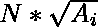

# 数组中最大的完美平方数

> 原文:[https://www . geeksforgeeks . org/最大完美平方阵列数/](https://www.geeksforgeeks.org/largest-perfect-square-number-in-an-array/)

给定一组 **n 个**整数。任务是找到最大的数，也就是一个完美的正方形。如果没有完美平方的数字，打印-1。
**示例** :

```
Input : arr[] = {16, 20, 25, 2, 3, 10} 
Output : 25
Explanation: 25 is the largest number 
that is a perfect square. 

Input : arr[] = {36, 64, 10, 16, 29, 25| 
Output : 64
```

一个**简单的解决方案**是对元素进行排序，对 n 个数字进行排序，然后使用 sqrt()函数从后面开始检查一个完美的平方数。最后的第一个数字是一个完美的平方数，这就是我们的答案。排序的复杂度为 O(n log n)，sqrt()函数的复杂度为 log n，所以最坏的情况下复杂度为 O(n log n)。
一个**高效解**是对 O(n)中的所有元素进行迭代，每次与最大元素进行比较，存储所有完美平方的最大值。
以下是上述方法的实施:

## C++

```
// CPP program to find the largest perfect
// square number among n numbers

#include<iostream>
#include<math.h>
using namespace std;

// Function to check if a number
// is perfect square number or not
bool checkPerfectSquare(double n)
{
    // takes the sqrt of the number
    double d = sqrt(n);

    // checks if it is a perfect
    // square number
    if (d * d == n)
        return true;

    return false;
}

// Function to find the largest perfect
// square number in the array
int largestPerfectSquareNumber(int a[], double n)
{
    // stores the maximum of all
    // perfect square numbers
    int maxi = -1;

    // Traverse all elements in the array
    for (int i = 0; i < n; i++) {

        // store the maximum if current
        // element is a perfect square
        if (checkPerfectSquare(a[i]))
            maxi = max(a[i], maxi);
    }

    return maxi;
}

// Driver Code
int main()
{
    int a[] = { 16, 20, 25, 2, 3, 10 };

    double n = sizeof(a) / sizeof(a[0]);

    cout << largestPerfectSquareNumber(a, n);

    return 0;
}
```

## Java 语言(一种计算机语言，尤用于创建网站)

```
// Java program to find the largest perfect
// square number among n numbers
import java.lang.Math;
import java.io.*;

class GFG {

// Function to check if a number
// is perfect square number or not
static boolean checkPerfectSquare(double n)
{
    // takes the sqrt of the number
    double d = Math.sqrt(n);

    // checks if it is a perfect
    // square number
    if (d * d == n)
        return true;

    return false;
}

// Function to find the largest perfect
// square number in the array
static int largestPerfectSquareNumber(int a[], double n)
{
    // stores the maximum of all
    // perfect square numbers
    int maxi = -1;

    // Traverse all elements in the array
    for (int i = 0; i < n; i++) {

        // store the maximum if current
        // element is a perfect square
        if (checkPerfectSquare(a[i]))
            maxi = Math.max(a[i], maxi);
    }

    return maxi;
}

// Driver Code

    public static void main (String[] args) {
            int []a = { 16, 20, 25, 2, 3, 10 };

    double n = a.length;

    System.out.println( largestPerfectSquareNumber(a, n));

    }
}
// This code is contributed
// by inder_verma..
```

## 蟒蛇 3

```
# Python3 program to find the largest perfect
# square number among n numbers

# from math lib import sqrt()
from math import sqrt

# Function to check if a number 
# is perfect square number or not
def checkPerfectSquare(n) :

    # takes the sqrt of the number
    d = sqrt(n)

    # checks if it is a perfect 
    # square number 
    if d * d == n :
        return True

    return False

# Function to find the largest perfect 
# square number in the array 
def largestPerfectSquareNumber(a, n) :

    # stores the maximum of all 
    # perfect square numbers
    maxi = -1

    # Traverse all elements in the array
    for i in range(n) :

        # store the maximum if current 
        # element is a perfect square 
        if(checkPerfectSquare(a[i])) :
            maxi = max(a[i], maxi)

    return maxi

# Driver code
if __name__ == "__main__" :

    a = [16, 20, 25, 2, 3, 10 ]
    n = len(a)

    print(largestPerfectSquareNumber(a, n))

# This code is contributed by Ryuga
```

## C#

```
// C# program to find the largest perfect
// square number among n numbers
using System;
class GFG {

// Function to check if a number
// is perfect square number or not
static bool checkPerfectSquare(double n)
{
    // takes the sqrt of the number
    double d = Math.Sqrt(n);

    // checks if it is a perfect
    // square number
    if (d * d == n)
        return true;

    return false;
}

// Function to find the largest perfect
// square number in the array
static int largestPerfectSquareNumber(int []a, double n)
{
    // stores the maximum of all
    // perfect square numbers
    int maxi = -1;

    // Traverse all elements in the array
    for (int i = 0; i < n; i++) {

        // store the maximum if current
        // element is a perfect square
        if (checkPerfectSquare(a[i]))
            maxi = Math.Max(a[i], maxi);
    }

    return maxi;
}

// Driver Code

    public static void Main () {
            int []a = { 16, 20, 25, 2, 3, 10 };

    double n = a.Length;

    Console.WriteLine( largestPerfectSquareNumber(a, n));

    }
}
// This code is contributed
// by inder_verma..
```

## 服务器端编程语言（Professional Hypertext Preprocessor 的缩写）

```
<?php
// PHP program to find the largest perfect
// square number among n numbers

// Function to check if a number
// is perfect square number or not
function checkPerfectSquare($n)
{
    // takes the sqrt of the number
    $d = sqrt($n);

    // checks if it is a perfect
    // square number
    if ($d * $d == $n)
        return true;

    return false;
}

// Function to find the largest perfect
// square number in the array
function largestPerfectSquareNumber($a, $n)
{
    // stores the maximum of all
    // perfect square numbers
    $maxi = -1;

    // Traverse all elements in the array
    for ($i = 0; $i <$n; $i++)
    {

        // store the maximum if current
        // element is a perfect square
        if (checkPerfectSquare($a[$i]))
            $maxi = max($a[$i], $maxi);
    }

    return $maxi;
}

// Driver Code
$a = array( 16, 20, 25, 2, 3, 10 );

$n = count($a);

echo largestPerfectSquareNumber($a, $n);

// This code is contributed
// by inder_verma.
?>
```

## java 描述语言

```
<script>

// Javascript program to find the largest perfect
// square number among n numbers

// Function to check if a number
// is perfect square number or not
function checkPerfectSquare(n)
{
    // takes the sqrt of the number
    let d = Math.sqrt(n);

    // checks if it is a perfect
    // square number
    if (d * d == n)
        return true;

    return false;
}

// Function to find the largest perfect
// square number in the array
function largestPerfectSquareNumber(a, n)
{
    // stores the maximum of all
    // perfect square numbers
    let maxi = -1;

    // Traverse all elements in the array
    for (let i = 0; i < n; i++)
    {

        // store the maximum if current
        // element is a perfect square
        if (checkPerfectSquare(a[i]))
            maxi = Math.max(a[i], maxi);
    }

    return maxi;
}

// Driver Code
let a = [ 16, 20, 25, 2, 3, 10 ];
let n = a.length;
document.write(largestPerfectSquareNumber(a, n));

// This code is contributed by souravmahato348.
</script>
```

**Output:** 

```
25
```

**时间复杂度:** O(  )
**辅助空间:** O(1)