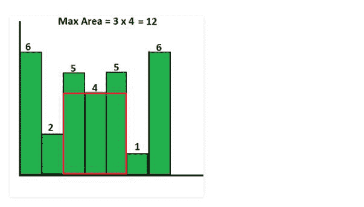

# 直方图下最大矩形面积使用 JavaScript |不使用堆栈

> 原文:[https://www . geesforgeks . org/最大-矩形-面积-直方图下-使用-JavaScript-不使用-堆栈/](https://www.geeksforgeeks.org/largest-rectangle-area-under-histogram-using-javascript-without-using-stacks/)

在给定的直方图中找到可能的最大矩形区域，其中最大矩形可以由多个连续的条组成。为简单起见，假设所有条形都具有相同的宽度，宽度为 1 个单位。

例如，考虑以下具有 7 个高度条的直方图{6，2，5，4，5，1，6}。最大可能的矩形是 12(见下图，最大面积矩形用红色突出显示)



**进场:**

*   对于每个“x”条，我们用“x”作为矩形中最小的条来计算面积。我们将在“x”的左侧找到第一个较小(小于“x”)条的索引，在“x”的右侧找到第一个较小条的索引。让我们分别称这些指数为“左指数”和“右指数”。
*   将“x”乘以“right_index-left_index-1”，并将其存储在区域中
*   返回最大面积

下面是上述方法的实现。

## index.js

```
<script>
    function getMaxArea(arr, n) {
        var area = 0;
        for (var i = 0; i < n; i++) {
            var left_index;
            var right_index;

            for (var j = i; j >= 0; j--) {
                if (arr[j] < arr[i]) {
                    left_index = j;
                    break;
                }

            }
            left_index = j;

            for (var j = i; j < n; j++) {
                if (arr[j] < arr[i]) {
                    right_index = j;
                    break;
                }

            }
            right_index = j;

            area = Math.max(area, arr[i] 
                * (right_index - left_index - 1));
        }
        return area;
    }

    var array = [6, 2, 5, 4, 5, 1, 6];
    document.write(getMaxArea(array, 5));
</script>
```

**输出:**

```
12
```

**复杂度:**我们用线性搜索来寻找最小值，那么这个算法最坏情况下的时间复杂度就变成了 O(n^2).