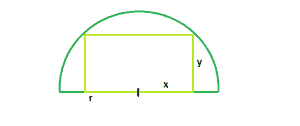

# 可以内接半圆的最大矩形

> 原文:[https://www . geeksforgeeks . org/可内接半圆的最大矩形/](https://www.geeksforgeeks.org/largest-rectangle-that-can-be-inscribed-in-a-semicircle/)

给定一个半径为 **r** 的半圆，我们必须找到半圆中可以内接的最大矩形，底部位于直径上。
**例:**

```
Input : r = 4
Output : 16

Input : r = 5 
Output :25
```



设 **r** 为半圆半径， **x** 为矩形底边的一半， **y** 为矩形高度。我们希望面积最大化，A = 2xy。
所以从图中我们有，
**y = √(r^2–x^2)**
所以，**a = 2*x*(√(r^2–x^2)】**，或者**da/dx = 2*√(r^2–x^2)-2*x^2/√(r^2–x^2)**
设置这个导数等于 0 并求解为 x，
**dA/dx = 0**
或者， **2*√(r^2–x^2)–2*x^2/√(r^2–x^2)= 0**
**2r^2–4x^2 = 0**
**x = r/√2**
这是面积的最大值 as，
t30】da/dx>0 当**x>r/√2**t34】和， **dA/dx < 0** 当**时
所以，区**a=r^2**t53】**

## C++

```
// C++ Program to find the
// the biggest rectangle
// which can be inscribed
// within the semicircle
#include <bits/stdc++.h>
using namespace std;

// Function to find the area
// of the biggest rectangle
float rectanglearea(float r)
{

    // the radius cannot be negative
    if (r < 0)
        return -1;

    // area of the rectangle
    float a = r * r;

    return a;
}

// Driver code
int main()
{
    float r = 5;
    cout << rectanglearea(r) << endl;
    return 0;
}
```

## Java 语言(一种计算机语言，尤用于创建网站)

```
// Java Program to find the
// the biggest rectangle
// which can be inscribed
// within the semicircle
class GFG
{

// Function to find the area
// of the biggest rectangle
static float rectanglearea(float r)
{

// the radius cannot be negative
if (r < 0)
    return -1;

// area of the rectangle
float a = r * r;

return a;
}

// Driver code
public static void main(String[] args)
{
    float r = 5;
    System.out.println((int)rectanglearea(r));
}
}

// This code is contributed
// by ChitraNayal
```

## 蟒蛇 3

```
# Python 3 Program to find the
# the biggest rectangle
# which can be inscribed
# within the semicircle

# Function to find the area
# of the biggest rectangle
def rectanglearea(r) :

    # the radius cannot
    # be negative
    if r < 0 :
        return -1

    # area of the rectangle
    a = r * r

    return a

# Driver Code
if __name__ == "__main__" :

    r = 5

    # function calling
    print(rectanglearea(r))

# This code is contributed
# by ANKITRAI1
```

## C#

```
// C# Program to find the
// the biggest rectangle
// which can be inscribed
// within the semicircle
using System;

class GFG
{

// Function to find the area
// of the biggest rectangle
static float rectanglearea(float r)
{

// the radius cannot be negative
if (r < 0)
    return -1;

// area of the rectangle
float a = r * r;

return a;
}

// Driver code
public static void Main()
{
    float r = 5;
    Console.Write((int)rectanglearea(r));
}
}

// This code is contributed
// by ChitraNayal
```

## 服务器端编程语言（Professional Hypertext Preprocessor 的缩写）

```
<?php
// PHP Program to find the
// the biggest rectangle
// which can be inscribed
// within the semicircle

// Function to find the area
// of the biggest rectangle
function rectanglearea($r)
{

    // the radius cannot
    // be negative
    if ($r < 0)
        return -1;

    // area of the rectangle
    $a = $r * $r;

    return $a;
}

// Driver code
$r = 5;
echo rectanglearea($r)."\n";

// This code is contributed
// by ChitraNayal
?>
```

## java 描述语言

```
<script>

// javascript Program to find the
// the biggest rectangle
// which can be inscribed
// within the semicircle

// Function to find the area
// of the biggest rectangle
function rectanglearea(r)
{

    // the radius cannot be negative
    if (r < 0)
        return -1;

    // area of the rectangle
    var a = r * r;

    return a;
}

// Driver code

var r = 5;
document.write(parseInt(rectanglearea(r)));

// This code is contributed by Amit Katiyar

</script>
```

**输出:**

```
25
```