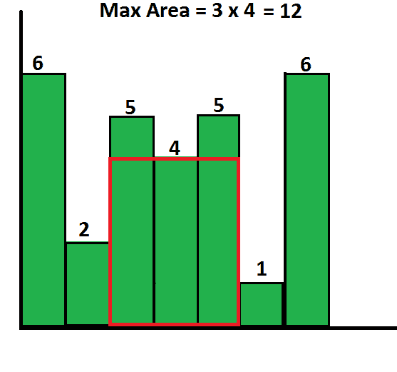

# 直方图中最大的矩形区域|集合 1

> 原文:[https://www . geesforgeks . org/最大-直方图中的矩形区域-集合-1/](https://www.geeksforgeeks.org/largest-rectangular-area-in-a-histogram-set-1/)

在给定的直方图中找到可能的最大矩形区域，其中最大矩形可以由多个连续的条组成。为简单起见，假设所有条形都具有相同的宽度，宽度为 1 个单位。
例如，考虑以下具有 7 个高度条的直方图{6，2，5，4，5，1，6}。最大可能矩形为 12(见下图，最大面积矩形以红色突出显示)



一个**简单的解决方法**就是一个一个的把所有的条都当成起点，从每个条开始计算所有矩形的面积。最后返回所有可能区域的最大值。这个解决方案的时间复杂度是 O(n^2).
我们可以用 [**各个击破**](https://www.geeksforgeeks.org/divide-and-conquer-set-1-find-closest-pair-of-points/) 在 O(nLogn)时间内解决这个。想法是找到给定数组中的最小值。一旦我们有了最小值的索引，最大面积就是以下三个值中的最大值。
**a)** 最小值左侧最大面积(不包括最小值)
**b)** 最小值右侧最大面积(不包括最小值)
**c)** 条数乘以最小值。
最小值条左右区域可以递归计算。如果我们使用线性搜索来寻找最小值，那么该算法的最坏情况时间复杂度变成 O(n^2).在最坏的情况下，我们总是一边有(n-1)个元素，另一边有 0 个元素，如果寻找最小值需要 O(n)个时间，我们得到类似于快速排序最坏情况的递归。
如何高效地找到最小值？[使用段树](https://www.geeksforgeeks.org/segment-tree-set-1-range-minimum-query/)的最小范围查询可用于此。我们建立给定直方图高度的段树。一旦建立了段树，所有[范围最小查询将花费 0(Logn)时间](https://www.geeksforgeeks.org/segment-tree-set-1-range-minimum-query/)。所以算法变得非常复杂。
整体时间=构建段树的时间+递归寻找最大面积的时间
[构建段树的时间为 O(n)](https://www.geeksforgeeks.org/segment-tree-set-1-sum-of-given-range/) 。让递归寻找最大面积的时间为 T(n)。可以写成如下。
T(n) = O(Logn) + T(n-1)
上述递推的解为 O(nLogn)。所以总时间是 O(n) + O(nLogn)，也就是 O(nLogn)。
以下是上述算法的 C++实现。

## C++

```
// A Divide and Conquer Program to find maximum rectangular area in a histogram
#include <bits/stdc++.h>
using namespace std;

// A utility function to find minimum of three integers
int max(int x, int y, int z)
{  return max(max(x, y), z); }

// A utility function to get minimum of two numbers in hist[]
int minVal(int *hist, int i, int j)
{
    if (i == -1) return j;
    if (j == -1) return i;
    return (hist[i] < hist[j])? i : j;
}

// A utility function to get the middle index from corner indexes.
int getMid(int s, int e)
{   return s + (e -s)/2; }

/*  A recursive function to get the index of minimum value in a given range of
    indexes. The following are parameters for this function.

    hist   --> Input array for which segment tree is built
    st    --> Pointer to segment tree
    index --> Index of current node in the segment tree. Initially 0 is
             passed as root is always at index 0
    ss & se  --> Starting and ending indexes of the segment represented by
                 current node, i.e., st[index]
    qs & qe  --> Starting and ending indexes of query range */
int RMQUtil(int *hist, int *st, int ss, int se, int qs, int qe, int index)
{
    // If segment of this node is a part of given range, then return the
    // min of the segment
    if (qs <= ss && qe >= se)
        return st[index];

    // If segment of this node is outside the given range
    if (se < qs || ss > qe)
        return -1;

    // If a part of this segment overlaps with the given range
    int mid = getMid(ss, se);
    return minVal(hist, RMQUtil(hist, st, ss, mid, qs, qe, 2*index+1),
                  RMQUtil(hist, st, mid+1, se, qs, qe, 2*index+2));
}

// Return index of minimum element in range from index qs (query start) to
// qe (query end).  It mainly uses RMQUtil()
int RMQ(int *hist, int *st, int n, int qs, int qe)
{
    // Check for erroneous input values
    if (qs < 0 || qe > n-1 || qs > qe)
    {
        cout << "Invalid Input";
        return -1;
    }

    return RMQUtil(hist, st, 0, n-1, qs, qe, 0);
}

// A recursive function that constructs Segment Tree for hist[ss..se].
// si is index of current node in segment tree st
int constructSTUtil(int hist[], int ss, int se, int *st, int si)
{
    // If there is one element in array, store it in current node of
    // segment tree and return
    if (ss == se)
       return (st[si] = ss);

    // If there are more than one elements, then recur for left and
    // right subtrees and store the minimum of two values in this node
    int mid = getMid(ss, se);
    st[si] =  minVal(hist, constructSTUtil(hist, ss, mid, st, si*2+1),
                     constructSTUtil(hist, mid+1, se, st, si*2+2));
    return st[si];
}

/* Function to construct segment tree from given array. This function
   allocates memory for segment tree and calls constructSTUtil() to
   fill the allocated memory */
int *constructST(int hist[], int n)
{
    // Allocate memory for segment tree
    int x = (int)(ceil(log2(n))); //Height of segment tree
    int max_size = 2*(int)pow(2, x) - 1; //Maximum size of segment tree
    int *st = new int[max_size];

    // Fill the allocated memory st
    constructSTUtil(hist, 0, n-1, st, 0);

    // Return the constructed segment tree
    return st;
}

// A recursive function to find the maximum rectangular area.
// It uses segment tree 'st' to find the minimum value in hist[l..r]
int getMaxAreaRec(int *hist, int *st, int n, int l, int r)
{
    // Base cases
    if (l > r)  return INT_MIN;
    if (l == r)  return hist[l];

    // Find index of the minimum value in given range
    // This takes O(Logn)time
    int m = RMQ(hist, st, n, l, r);

    /* Return maximum of following three possible cases
       a) Maximum area in Left of min value (not including the min)
       a) Maximum area in right of min value (not including the min)
       c) Maximum area including min */
    return max(getMaxAreaRec(hist, st, n, l, m-1),
               getMaxAreaRec(hist, st, n, m+1, r),
               (r-l+1)*(hist[m]) );
}

// The main function to find max area
int getMaxArea(int hist[], int n)
{
    // Build segment tree from given array. This takes
    // O(n) time
    int *st = constructST(hist, n);

    // Use recursive utility function to find the
    // maximum area
    return getMaxAreaRec(hist, st, n, 0, n-1);
}

// Driver program to test above functions
int main()
{
    int hist[] =  {6, 1, 5, 4, 5, 2, 6};
    int n = sizeof(hist)/sizeof(hist[0]);
    cout << "Maximum area is " << getMaxArea(hist, n);
    return 0;
}
```

## 蟒蛇 3

```
# Python3 program for range minimum 
# query using segment tree

# modified to return index of minimum instead of minimum itself
# for further reference link
# https://www.geeksforgeeks.org/segment-tree-set-1-range-minimum-query/

#-------------------------------------------------------------------------
from math import ceil,log2; 

# A utility function to get 
# minimum of two numbers 
def minVal(hist,x, y) :
    if x==-1:
        return y
    if y==-1:
        return x
    return x if (hist[x] < hist[y]) else y; 

# A utility function to get the 
# middle index from corner indexes. 
def getMid(s, e) :
    return s + (e - s) // 2; 

""" A recursive function to get the 
minimum value in a given range 
of array indexes. The following 
are parameters for this function. 

    st --> Pointer to segment tree 
    index --> Index of current node in the 
        segment tree. Initially 0 is 
        passed as root is always at index 0 
    ss & se --> Starting and ending indexes 
                of the segment represented 
                by current node, i.e., st[index] 
    qs & qe --> Starting and ending indexes of query range """
def RMQUtil( hist,st, ss, se, qs, qe, index) :

    # If segment of this node is a part 
    # of given range, then return 
    # the min of the segment 
    if (qs <= ss and qe >= se) :
        return st[index]; 

    # If segment of this node 
    # is outside the given range 
    if (se < qs or ss > qe) :
        return -1; 

    # If a part of this segment 
    # overlaps with the given range 
    mid = getMid(ss, se); 
    return minVal(hist,RMQUtil(hist,st, ss, mid, qs, 
                          qe, 2 * index + 1), 
                  RMQUtil(hist,st, mid + 1, se,
                          qs, qe, 2 * index + 2)); 

# Return minimum of elements in range 
# from index qs (query start) to 
# qe (query end). It mainly uses RMQUtil() 
def RMQ( hist,st, n, qs, qe) : 

    # Check for erroneous input values 
    if (qs < 0 or qe > n - 1 or qs > qe) :

        print("Invalid Input"); 
        return -1; 

    return RMQUtil(hist,st, 0, n - 1, qs, qe, 0); 

# A recursive function that constructs 
# Segment Tree for array[ss..se]. 
# si is index of current node in segment tree st 
def constructSTUtil(hist, ss, se, st, si) :

    # If there is one element in array, 
    # store it in current node of 
    # segment tree and return 
    if (ss == se) :

        st[si] = ss; 
        return st[si]; 

    # If there are more than one elements, 
    # then recur for left and right subtrees 
    # and store the minimum of two values in this node 
    mid = getMid(ss, se); 
    st[si] = minVal(hist,constructSTUtil(hist, ss, mid,
                                    st, si * 2 + 1),
                    constructSTUtil(hist, mid + 1, se,
                                    st, si * 2 + 2)); 

    return st[si]; 

"""Function to construct segment tree 
from given array. This function allocates 
memory for segment tree and calls constructSTUtil()
to fill the allocated memory """
def constructST( hist, n) :

    # Allocate memory for segment tree 

    # Height of segment tree 
    x = (int)(ceil(log2(n))); 

    # Maximum size of segment tree 
    max_size = 2 * (int)(2**x) - 1; 

    st = [0] * (max_size); 

    # Fill the allocated memory st 
    constructSTUtil(hist, 0, n - 1, st, 0); 

    # Return the constructed segment tree 
    return st; 

#----------------------------------------------------------------

# main program
# Python3 program using Divide and Conquer
# to find maximum rectangular area under a histogram

def max_area_histogram(hist):
    area=0
    #initialize area

    st = constructST(hist, len(hist))
    # contruct the segment tree

    try:
        # try except block is generally used in this way
        # to suppress all type of exceptions raised.

        def fun(left,right):

        # this function "fun" calculates area
        # recursively between indices left and right

            nonlocal area

            # global area won't work here as
            # variable area is defined inside function
            # not in main().

            if left==right:
                return
            # the recursion has reached end

            index = RMQ(hist,st, len(hist), left, right-1)
            # RMQ function returns index
            # of minimum value
            # in the range of [left,right-1]
            # can also be found by using min() but
            # results in O(n) instead of O(log n) for traversing

            area=max(area,hist[index]*(right-left))
            # calculate area with minimum above

            fun(index+1,right)
            fun(left,index)
            # initiate further recursion

            return

        fun(0,len(hist))
        # initializes the recursion

        return(area)
        # return the max area to calling function
        # in this case "print"

    except:
        pass

# Driver Code
hist = [6, 2, 5, 4, 5, 1, 6]
print("Maximum area is", 
       max_area_histogram(hist))

# This code is contributed 
# by Vishnudev C.
```

**输出:**

```
Maximum area is 12
```

这个问题可以用线性时间解决。线性时间解见下图[设置 2](https://www.geeksforgeeks.org/largest-rectangle-under-histogram/) 。
[直方图中最大矩形面积的线性时间解](https://www.geeksforgeeks.org/largest-rectangle-under-histogram/)
如发现任何不正确的地方，或者您想分享更多关于上述主题的信息，请写评论。