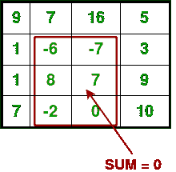

# 和为 0 的最大矩形子矩阵

> 原文:[https://www . geesforgeks . org/maximum-矩形-子矩阵-what-sum-0/](https://www.geeksforgeeks.org/largest-rectangular-sub-matrix-whose-sum-0/)

给定一个 2D 矩阵，求和为 0 的最大矩形子矩阵。例如，考虑以下 N×M 输入矩阵



示例:

```
Input :  1,  2,  3
        -3, -2, -1          
         1,  7,  5

Output : 1,  2,  3          
        -3, -2, -1

Input :  9,  7, 16,  5
         1, -6, -7,  3          
         1,  8,  7,  9          
         7, -2,  0, 10

Output :-6, -7
          8,  7          
         -2,  0    
```

这个问题的简单解决方案是检查给定 2D 阵列中的每个可能的矩形。该解决方案需要 4 个嵌套循环，并且该解决方案的时间复杂度是 O(n^4).
该解基于 2D 矩阵中的[最大和矩形。想法是把问题简化成一维数组。我们可以使用哈希算法在 O(n)时间内找到一维数组中子数组的最大长度。我们一个接一个地固定左列和右列，并为每个左列和右列对找到具有 0 个总和连续行的最大子阵列。我们基本上为每个固定的左右列对找到顶部和底部的行号(其总和为零)。要查找上下行号，请从左到右计算每行中元素的总和，并将这些总和存储在一个数组中，比如 temp[]。所以 temp[i]表示行 I 中从左到右的元素的和。如果我们找到最大的子数组，并且 temp 上的和为 0，并且元素的数量大于先前的元素数量，那么更新 final row_up、final row_down、final col_left、final col_right 的值。](https://www.geeksforgeeks.org/dynamic-programming-set-27-max-sum-rectangle-in-a-2d-matrix/) 

## 卡片打印处理机（Card Print Processor 的缩写）

```
// A C++ program to find Largest rectangular
// sub-matrix whose sum is 0
#include <bits/stdc++.h>
using namespace std;

const int MAX = 100;

// This function basically finds largest 0
// sum subarray in temp[0..n-1]. If 0 sum
// does't exist, then it returns false. Else
// it returns true and sets starting and
// ending indexes as starti and endj.
bool sumZero(int temp[], int* starti,
            int* endj, int n)
{
    // Map to store the previous sums
    map<int, int> presum;
    int sum = 0; // Initialize sum of elements

    // Initialize length of sub-array with sum 0
    int max_length = 0;

    // Traverse through the given array
    for (int i = 0; i < n; i++)
    {
        // Add current element to sum
        sum += temp[i];

        if (temp[i] == 0 && max_length == 0)
        {
            *starti = i;
            *endj = i;
            max_length = 1;
        }
        if (sum == 0)
        {
            if (max_length < i + 1)
            {
                *starti = 0;
                *endj = i;
            }
            max_length = i + 1;
        }

        // Look for this sum in Hash table
        if (presum.find(sum) != presum.end())
        {
            // store previous max_length so
            // that we can check max_length
            // is updated or not
            int old = max_length;

            // If this sum is seen before,
            // then update max_len
            max_length = max(max_length, i - presum[sum]);

            if (old < max_length)
            {
                // If max_length is updated then
                // enter and update start and end
                // point of array
                *endj = i;
                *starti = presum[sum] + 1;
            }
        }
        else

            // Else insert this sum with
            // index in hash table
            presum[sum] = i;
    }

    // Return true if max_length is non-zero
    return (max_length != 0);
}

// The main function that finds Largest rectangle
// sub-matrix in a[][] whose sum is 0.
void sumZeroMatrix(int a[][MAX], int row, int col)
{
    int temp[row];

    // Variables to store the final output
    int fup = 0, fdown = 0, fleft = 0, fright = 0;
    int sum;
    int up, down;
    int maxl = INT_MIN;

    // Set the left column
    for (int left = 0; left < col; left++)
    {
        // Initialize all elements of temp as 0
        memset(temp, 0, sizeof(temp));

        // Set the right column for the left column
        // set by outer loop
        for (int right = left; right < col; right++)
        {
            // Calculate sum between current left
            // and right for every row 'i'
            for (int i = 0; i < row; i++)
                temp[i] += a[i][right];

            // Find largest subarray with 0 sum in
            // temp[]. The sumZero() function also
            // sets values of start and finish. So
            // 'sum' is sum of rectangle between (start,
            // left) and (finish, right) which is
            // boundary columns strictly as left and right.
            bool sum = sumZero(temp, &up, &down, row);
            int ele = (down - up + 1) * (right - left + 1);

            // Compare no. of elements with previous
            // no. of elements in sub-Matrix.
            // If new sub-matrix has more elements
            // then update maxl and final boundaries
            // like fup, fdown, fleft, fright
            if (sum && ele > maxl)
            {
                fup = up;
                fdown = down;
                fleft = left;
                fright = right;
                maxl = ele;
            }
        }
    }

    // If there is no change in boundaries
    // than check if a[0][0] is 0
    // If it not zero then print
    // that no such zero-sum sub-matrix exists
    if (fup == 0 && fdown == 0 && fleft == 0 &&
            fright == 0 && a[0][0] != 0) {
        cout << "No zero-sum sub-matrix exists";
        return;
    }

    // Print final values
    for (int j = fup; j <= fdown; j++)
    {
        for (int i = fleft; i <= fright; i++)
            cout << a[j][i] << " ";
        cout << endl;
    }
}

// Driver program to test above functions
int main()
{
    int a[][MAX] = { { 9, 7, 16, 5 }, { 1, -6, -7, 3 },
                      { 1, 8, 7, 9 }, { 7, -2, 0, 10 } };

    int row = 4, col = 4;
    sumZeroMatrix(a, row, col);
    return 0;
}
```

输出:

```
    -6, -7
     8, 7          
    -2, 0
```

本文由 **Harshit Agrawal** 供稿。如果你喜欢 GeeksforGeeks 并想投稿，你也可以使用[write.geeksforgeeks.org](https://write.geeksforgeeks.org)写一篇文章或者把你的文章邮寄到 review-team@geeksforgeeks.org。看到你的文章出现在极客博客主页上，帮助其他极客。
如果你发现任何不正确的地方，或者你想分享更多关于上面讨论的话题的信息，请写评论。