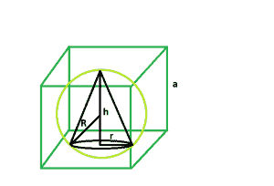

# 可被内接在球体中的最大右圆锥，该球体被内接在立方体中

> 原文:[https://www . geeksforgeeks . org/最大-右-可内接球内接圆锥-正方体内接球/](https://www.geeksforgeeks.org/largest-right-circular-cone-that-can-be-inscribed-within-a-sphere-which-is-inscribed-within-a-cube/)

给定一个边长为 **a** 的立方体，它刻制一个球体，球体又刻制一个直角圆锥。任务是找到这个圆锥体的最大可能体积。
**例:**

```
Input:  a = 5
Output: 58.1481

Input: a = 8
Output: 238.175
```



**逼近** :
让，右圆锥的高度= **h** 。
圆锥体的半径= **r**
球体的半径= **R**
我们，知道立方体内部球体的半径， **r = a/2** 。请参考[(立方体内可内切的最大球体)](https://www.geeksforgeeks.org/largest-sphere-that-can-be-inscribed-inside-a-cube/)。
同样，球体内部圆锥体的高度， **h = 4r/3** 。
球体内部的圆锥半径， **r = 2√2r/3** 。请参考[(球面内可内切的最大右圆锥)](https://www.geeksforgeeks.org/largest-right-circular-cone-that-can-be-inscribed-within-a-sphere/)。
因此，球体内部的圆锥体的高度依次内接在立方体内， **h = 2a/3** 。
球体内部的圆锥体半径，该球体又内接在立方体内， **r = √2a/3** 。
以下是上述方法的实施:

## C++

```
// C++ Program to find the biggest right circular cone
// that can be inscribed within a right circular cone
// which in turn is inscribed within a cube

#include <bits/stdc++.h>
using namespace std;

// Function to find the biggest right circular cone
float cone(float a)
{

    // side cannot be negative
    if (a < 0)
        return -1;

    // radius of right circular cone
    float r = (a * sqrt(2)) / 3;

    // height of right circular cone
    float h = (2 * a) / 3;

    // volume of right circular cone
    float V = 3.14 * pow(r, 2) * h;

    return V;
}

// Driver code
int main()
{
    float a = 5;
    cout << cone(a) << endl;

    return 0;
}
```

## Java 语言(一种计算机语言，尤用于创建网站)

```
// Java Program to find the biggest right circular cone
// that can be inscribed within a right circular cone
// which in turn is inscribed within a cube
import java.io.*;

class GFG
{

// Function to find the biggest right circular cone
static float cone(float a)
{

    // side cannot be negative
    if (a < 0)
        return -1;

    // radius of right circular cone
    float r = (float) (a * Math.sqrt(2)) / 3;

    // height of right circular cone
    float h = (2 * a) / 3;

    // volume of right circular cone
    float V = (float)(3.14 *Math. pow(r, 2) * h);

    return V;
}

// Driver code
public static void main (String[] args)
{
    float a = 5;
    System.out.println( cone(a));
}
}

// This code is contributed by anuj_67..
```

## 蟒蛇 3

```
# Python3 Program to find the biggest right
# circular cone that can be inscribed within
# a right circular cone which in turn is
# inscribed within a cube
import math

# Function to find the biggest
# right circular cone
def cone(a):

    # side cannot be negative
    if (a < 0):
        return -1;

    # radius of right circular cone
    r = (a * math.sqrt(2)) / 3;

    # height of right circular cone
    h = (2 * a) / 3;

    # volume of right circular cone
    V = 3.14 * math.pow(r, 2) * h;

    return V;

# Driver code
a = 5;
print(cone(a));

# This code is contributed by
# Shivi_Aggarwal
```

## C#

```
// C# Program to find the biggest
// right circular cone that can be
// inscribed within a right circular cone
// which in turn is inscribed within a cube
using System;

class GFG
{

// Function to find the biggest
// right circular cone
static double cone(double a)
{

    // side cannot be negative
    if (a < 0)
        return -1;

    // radius of right circular cone
    double r = (double) (a * Math.Sqrt(2)) / 3;

    // height of right circular cone
    double h = (2 * a) / 3;

    // volume of right circular cone
    double V = (double)(3.14 * Math.Pow(r, 2) * h);

    return Math.Round(V,4);
}

// Driver code
static void Main ()
{
    double a = 5;
    Console.WriteLine(cone(a));
}
}

// This code is contributed by chandan_jnu
```

## 服务器端编程语言（Professional Hypertext Preprocessor 的缩写）

```
<?php
// PHP Program to find the biggest right
// circular cone that can be inscribed
// within a right circular cone which in
// turn is inscribed within a cube

// Function to find the biggest
// right circular cone
function cone($a)
{

    // side cannot be negative
    if ($a < 0)
        return -1;

    // radius of right circular cone
    $r = ($a * sqrt(2)) / 3;

    // height of right circular cone
    $h = (2 * $a) / 3;

    // volume of right circular cone
    $V = 3.14 * pow($r, 2) * $h;

    return $V;
}

// Driver code
$a = 5;
echo round(cone($a), 4);

// This code is contributed by Ryuga
?>
```

## java 描述语言

```
<script>

// javascript Program to find the biggest right circular cone
// that can be inscribed within a right circular cone
// which in turn is inscribed within a cube

// Function to find the biggest right circular cone
function cone(a)
{

    // side cannot be negative
    if (a < 0)
        return -1;

    // radius of right circular cone
    var r =  (a * Math.sqrt(2)) / 3;

    // height of right circular cone
    var h = (2 * a) / 3;

    // volume of right circular cone
    var V = (3.14 *Math. pow(r, 2) * h);

    return V;
}

// Driver code
var a = 5;
document.write( cone(a).toFixed(5));

// This code is contributed by Amit Katiyar

</script>
```

**Output:** 

```
58.1481
```