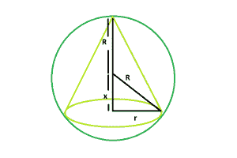
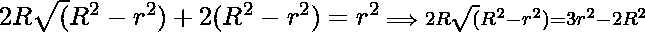

# 可在球体中内接的最大右圆锥

> 原文:[https://www . geeksforgeeks . org/最大-右-可在球体中内接的圆锥形/](https://www.geeksforgeeks.org/largest-right-circular-cone-that-can-be-inscribed-within-a-sphere/)

给定半径范围。任务是找到可以内接的最大右圆锥的底半径和高度。
**示例** :

```
Input : R = 10
Output : r = 9.42809, h = 13.3333

Input : R = 25
Output : r = 23.5702, h = 33.3333
```



**逼近** :
让圆锥体的半径= **r**
圆锥体的高度= **h**
从图中可以清楚地看出:
**x = √(r^2–r^2)和 h=x+R**
现在使用这些值我们得到，

> 为了最大化圆锥体的体积(V):
> T1】V =(πR<sup>2</sup>h)/3T5】从图中可以看出，
> T7】V =(πR<sup>2</sup>R)/3+πR<sup>2</sup>√(R<sup>2</sup>–R<sup>2</sup>)/3T17】取 **V** 相对于【的一阶导数
> ![\frac{2\pi r}{3}[R+\sqrt(R^2-r^2)] =\frac{ \pi r^3}{3\sqrt(R^2 - r^2}  ](img/faef8a2cb7e11f82886155b8fbc20faf.png "Rendered by QuickLaTeX.com")
> ![2[R+\sqrt(R^2-r^2)] =\frac{r^2}{\sqrt(R^2 - r^2)}  ](img/abfe8f6ceb80102f8799fea65ef20e27.png "Rendered by QuickLaTeX.com")
> 
> 两边平方并求解我们得到，
> 
> 
> 自，**h = R+√(R<sup>2</sup>–R<sup>2</sup>)**
> 现在计算二阶导数我们得到
> 
> ```
> *** QuickLaTeX cannot compile formula:
>  
> 
> *** Error message:
> Error: Nothing to show, formula is empty
> 
> ```
> 
> 因此 r=(2R√2)/3 是最大值点
> 所以， **h = 4R/3**

以下是上述方法的实现:

## C++

```
// C++ Program to find the biggest cone
// that can be inscribed within a sphere
#include <bits/stdc++.h>
using namespace std;

// Function to find the radius of the cone
float coner(float R)
{

    // radius cannot be negative
    if (R < 0)
        return -1;

    // radius of the cone
    float r = (2 * sqrt(2) * R) / 3;
    return r;
}

// Function to find the height of the cone
float coneh(float R)
{

    // side cannot be negative
    if (R < 0)
        return -1;

    // height of the cone
    float h = (4 * R) / 3;
    return h;
}

// Driver code
int main()
{
    float R = 10;

    cout << "r = " << coner(R) << ", "
         << "h = " << coneh(R) << endl;

    return 0;
}
```

## Java 语言(一种计算机语言，尤用于创建网站)

```
// Java Program to find the biggest cone
// that can be inscribed within a sphere
import java.util.*;
import java.lang.*;

class GFG
{
// Function to find the radius
// of the cone
static float coner(float R)
{
    // radius cannot be negative
    if (R < 0)
        return -1;

    // radius of the cone
    float r = (float)(2 *
            Math.sqrt(2) * R) / 3;
    return r;
}

// Function to find the
// height of the cone
static float coneh(float R)
{

    // side cannot be negative
    if (R < 0)
        return -1;

    // height of the cone
    float h = (4 * R) / 3;
    return h;
}

// Driver code
public static void main(String args[])
{
    float R = 10;

    System.out.println("r = " + coner(R) +
                       ", " + "h = " + coneh(R));
}
}

// This code is contributed
// by Akanksha Rai
```

## 蟒蛇 3

```
# Python 3 Program to find the biggest cone
# that can be inscribed within a sphere
import math

# Function to find the radius
# of the cone
def coner(R):

    # radius cannot be negative
    if (R < 0):
        return -1;

    # radius of the cone
    r = (2 * math.sqrt(2) * R) / 3
    return float(r)

# Function to find the height
# of the cone
def coneh(R):

    # side cannot be negative
    if (R < 0):
        return -1;

    # height of the cone
    h = (4 * R) / 3
    return float(h)

# Driver code
R = 10
print("r = " , coner(R) ,
      ", ", "h = " , coneh(R))

# This code is contributed
# by 29AjayKumar
```

## C#

```
// C# Program to find the biggest cone
// that can be inscribed within a sphere
using System;

class GFG
{
// Function to find the radius
// of the cone
static float coner(float R)
{
    // radius cannot be negative
    if (R < 0)
        return -1;

    // radius of the cone
    float r = (float)(2 *
               Math.Sqrt(2) * R) / 3;
    return r;
}

// Function to find the
// height of the cone
static float coneh(float R)
{

    // side cannot be negative
    if (R < 0)
        return -1;

    // height of the cone
    float h = (4 * R) / 3;
    return h;
}

// Driver code
public static void Main()
{
    float R = 10;

    Console.WriteLine("r = " + coner(R) +
                      ", " + "h = " + coneh(R));
}
}

// This code is contributed
// by Akanksha Rai
```

## 服务器端编程语言（Professional Hypertext Preprocessor 的缩写）

```
<?php
// PHP Program to find the biggest
// cone that can be inscribed
// within a sphere

// Function to find the radius
// of the cone
function coner($R)
{

    // radius cannot be negative
    if ($R < 0)
        return -1;

    // radius of the cone
    $r = (2 * sqrt(2) * $R) / 3;
    return $r;
}

// Function to find the height
// of the cone
function coneh($R)
{

    // side cannot be negative
    if ($R < 0)
        return -1;

    // height of the cone
    $h = (4 * $R) / 3;
    return $h;
}

// Driver code
$R = 10;

echo ("r = ");
echo coner($R);
echo (", ");
echo ("h = ");
echo (coneh($R));

// This code is contributed
// by Shivi_Aggarwal
?>
```

## java 描述语言

```
<script>
// javascript Program to find the biggest cone
// that can be inscribed within a sphere

// Function to find the radius
// of the cone
function coner(R)
{

    // radius cannot be negative
    if (R < 0)
        return -1;

    // radius of the cone
    var r = (2 *
            Math.sqrt(2) * R) / 3;
    return r;
}

// Function to find the
// height of the cone
function coneh(R)
{

    // side cannot be negative
    if (R < 0)
        return -1;

    // height of the cone
    var h = (4 * R) / 3;
    return h;
}

// Driver code
var R = 10;
document.write("r = " + coner(R).toFixed(5) +
                   ", " + "h = " + coneh(R).toFixed(5));

// This code is contributed by 29AjayKumar
</script>
```

**Output:** 

```
r = 9.42809, h = 13.3333
```