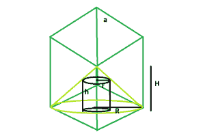

# 最大的右圆柱体，可以被内接在圆锥体中，而圆锥体又被内接在立方体中

> 原文:[https://www . geeksforgeeks . org/最大-右-可内接圆锥的圆柱-依次内接立方体/](https://www.geeksforgeeks.org/largest-right-circular-cylinder-that-can-be-inscribed-within-a-cone-which-is-in-turn-inscribed-within-a-cube/)

这里给定的是一个边长为**和**的立方体，立方体上刻有一个圆锥体，圆锥体又刻有一个正圆柱体。任务是找到这个圆柱体的最大可能体积。
**例:**

```
Input: a = 5
Output: 232.593

Input: a = 8
Output: 952.699
```



**逼近** :
从图中可以很清楚的看到，圆锥体的高度， **H = a** 和圆锥体的半径， **R = a√2** ，请参考[立方体内可内接的最大圆锥体](https://www.geeksforgeeks.org/largest-cone-that-can-be-inscribed-within-a-cube/)。
和，圆柱体的半径， **r = 2R/3** 和圆柱体的高度， **h = 2H/3** ，请参考[可内接在圆锥体内的最大右圆柱体](https://www.geeksforgeeks.org/largest-right-circular-cylinder-that-can-be-inscribed-within-a-cone/)。
所以，圆柱体相对于立方体的半径， **r = 2a√2/3** 和圆柱体相对于立方体的高度， **h = 2a/3** 。
所以，气缸的容积， **V = 16πa^3/27** 。
以下是上述方法的实施:

## C++

```
// C++ Program to find the biggest right circular
// cylinder that can be inscribed within a right
// circular cone which in turn is inscribed
// within a cube
#include <bits/stdc++.h>
using namespace std;

// Function to find the biggest
// right circular cylinder
float cyl(float a)
{

    // side cannot be negative
    if (a < 0)
        return -1;

    // radius of right circular cylinder
    float r = (2 * a * sqrt(2)) / 3;

    // height of right circular cylinder
    float h = (2 * a) / 3;

    // volume of right circular cylinder
    float V = 3.14 * pow(r, 2) * h;

    return V;
}

// Driver code
int main()
{
    float a = 5;
    cout << cyl(a) << endl;

    return 0;
}
```

## Java 语言(一种计算机语言，尤用于创建网站)

```
// Java Program to find the biggest right circular
// cylinder that can be inscribed within a right
// circular cone which in turn is inscribed
// within a cube
import java.lang.Math;

class cfg
{

// Function to find the biggest
// right circular cylinder
static float cyl(float a)
{

    // side cannot be negative
    if (a < 0)
        return -1;

    // radius of right circular cylinder
    float r = (2 * a *(float)(Math.sqrt (2)) / 3);

    // height of right circular cylinder
    float h = (2 * a) / 3;

    // volume of right circular cylinder
    float V =(3.14f *(float)(Math.pow(r, 2) * h));

    return V;
}

// Driver code
public static void main(String[] args)
{
    float a = 5;
    System.out.println(cyl(a));
}
}

// This code is contributed by Mukul Singh.
```

## 蟒蛇 3

```
# Python3 Program to find the biggest
# right circular cylinder that can be
# inscribed within a right circular
# cone which in turn is inscribed
# within a cube
import math as mt

# Function to find the biggest
# right circular cylinder
def cyl(a):

    # side cannot be negative
    if (a < 0):
        return -1

    # radius of right circular cylinder
    r = (2 * a * mt.sqrt(2)) / 3

    # height of right circular cylinder
    h = (2 * a) / 3

    # volume of right circular cylinder
    V = 3.14 * pow(r, 2) * h

    return V

# Driver code
a = 5
print(cyl(a))

# This code is contributed by
# Mohit kumar 29
```

## C#

```
// C# Program to find the biggest
// right circular cylinder that can
// be inscribed within a right circular
// cone which in turn is inscribed
// within a cube
using System;

class GFG
{

    // Function to find the biggest
    // right circular cylinder
    static float cyl(float a)
    {

        // side cannot be negative
        if (a < 0)
            return -1;

        // radius of right circular cylinder
        float r = (2 * a * (float)(Math.Sqrt (2)) / 3);

        // height of right circular cylinder
        float h = (2 * a) / 3;

        // volume of right circular cylinder
        float V =(3.14f * (float)(Math.Pow(r, 2) * h));
        return V;
    }

    // Driver code
    public static void Main()
    {
        float a = 5;
        Console.Write(cyl(a));
    }
}

// This code is contributed by Rajput-Ji
```

## 服务器端编程语言（Professional Hypertext Preprocessor 的缩写）

```
<?php
// PHP Program to find the biggest right
// circular cylinder that can be inscribed
// within a right circular cone which in
// turn is inscribed within a cube

// Function to find the biggest
// right circular cylinder
function cyl( $a )
{

    // side cannot be negative
    if ($a < 0)
        return -1;

    // radius of right circular cylinder
    $r = (2 * $a * sqrt(2)) / 3;

    // height of right circular cylinder
    $h = (2 * $a) / 3;

    // volume of right circular cylinder
    $V = 3.14 * pow($r, 2) * $h;

    return $V;
}

// Driver code
$a = 5;
echo cyl($a);

// This code is contributed by Mahadev99
?>
```

## java 描述语言

```
<script>

// javascript Program to find the biggest right circular
// cylinder that can be inscribed within a right
// circular cone which in turn is inscribed
// within a cube

// Function to find the biggest
// right circular cylinder
function cyl(a)
{

    // side cannot be negative
    if (a < 0)
        return -1;

    // radius of right circular cylinder
    var r = (2 * a *(Math.sqrt (2)) / 3);

    // height of right circular cylinder
    var h = (2 * a) / 3;

    // volume of right circular cylinder
    var V =(3.14 *(Math.pow(r, 2) * h));

    return V;
}

// Driver code

var a = 5;
document.write(cyl(a).toFixed(5));

// This code contributed by Princi Singh

</script>
```

**Output:** 

```
232.593
```