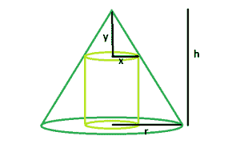

# 可内接圆锥的最大右圆柱

> 原文:[https://www . geesforgeks . org/最大-右-可内接圆锥的圆柱/](https://www.geeksforgeeks.org/largest-right-circular-cylinder-that-can-be-inscribed-within-a-cone/)

给定一个内接高度为 **h** 和基础半径为 **r** 的圆锥体的右圆柱体。任务是找到圆柱体的最大可能体积。
**例:**

```
Input: r = 4, h = 8
Output: 119.087

Input: r = 5, h = 9
Output: 209.333
```



**逼近**:圆柱体的体积为 **V = πr^2h**
在这个问题中，首先根据圆锥体的高度和半径，利用相似的三角形推导出体积方程。一旦我们修改了体积方程，我们将得到体积的导数并求解最大值。
设 **x** 为圆柱体半径， **y** 为圆锥体顶部到内接圆柱体顶部的距离。因此，圆柱体的高度为**h–y**
内接圆柱体的体积为 **V = πx^2(h-y)** 。
我们用相似比的方法找到高度和半径的关系，**h-y****x**。
**y/x = h/r**
**y = hx/r**
将 **y** 的方程式代入体积方程式，V.

> **v = πx^2(h-y)**
> **v = πx^2(h-hx/r)**
> **v = πx^2h–πx^3h/r**
> 现在，**dv/dx = d(πx^2h–πx^3h/r)/dx**
> 和设置 **dV/dx = 0**
> 我们得到， **x = 0，2r/3**
> 所以， **x = 2r/3**
> 和， **y**

以下是上述方法的实现:

## C++

```
// C++ Program to find the biggest
// right circular cylinder that can
// be fit within a right circular cone

#include <bits/stdc++.h>
using namespace std;

// Function to find the biggest right circular cylinder
float cyl(float r, float h)
{

    // radius and height cannot be negative
    if (r < 0 && h < 0)
        return -1;

    // radius of right circular cylinder
    float R = (2 * r) / 3;

    // height of right circular cylinder
    float H = (2 * h) / 3;

    // volume of right circular cylinder
    float V = 3.14 * pow(R, 2) * H;

    return V;
}

// Driver code
int main()
{
    float r = 4, h = 8;
    cout << cyl(r, h) << endl;

    return 0;
}
```

## Java 语言(一种计算机语言，尤用于创建网站)

```
// Java Program to find the biggest
// right circular cylinder that can
// be fit within a right circular cone

import java.io.*;

class GFG {
// Function to find the biggest right circular cylinder
static double cyl(double r, double h)
{

    // radius and height cannot be negative
    if (r < 0 && h < 0)
        return -1;

    // radius of right circular cylinder
    double R = (2 * r) / 3;

    // height of right circular cylinder
    double H = (2 * h) / 3;

    // volume of right circular cylinder
    double V = 3.14 * Math.pow(R, 2) * H;

    return V;
}

// Driver code

    public static void main (String[] args) {

    double r = 4, h = 8;
    System.out.println (cyl(r, h));
    }
//This code is contributed by ajit
}
```

## 蟒蛇 3

```
# Python 3 Program to find the biggest
# right circular cylinder that can
# be fit within a right circular cone
import math

# Function to find the biggest
# right circular cylinder
def cyl(r, h):

    # radius and height cannot
    # be negative
    if (r < 0 and h < 0):
        return -1

    # radius of right circular cylinder
    R = (2 * r) / 3

    # height of right circular cylinder
    H = (2 * h) / 3

    # volume of right circular cylinder
    V = 3.14 * math.pow(R, 2) * H

    return V

# Driver code
r = 4; h = 8;
print(cyl(r, h), "\n")

# This code is contributed
# by Akanksha Rai
```

## C#

```
// C# Program to find the biggest
// right circular cylinder that
// can be fit within a right circular cone
using System;

class GFG
{

// Function to find the biggest
// right circular cylinder
static double cyl(double r, double h)
{

    // radius and height cannot
    // be negative
    if (r < 0 && h < 0)
        return -1;

    // radius of right circular cylinder
    double R = (2 * r) / 3;

    // height of right circular cylinder
    double H = (2 * h) / 3;

    // volume of right circular cylinder
    double V = 3.14 * Math.Pow(R, 2) * H;

    return V;
}

// Driver code
static public void Main ()
{
    double r = 4, h = 8;
    Console.WriteLine(cyl(r, h));
}
}

// This code is contributed by jit_t
```

## 服务器端编程语言（Professional Hypertext Preprocessor 的缩写）

```
<?php
// PHP Program to find the biggest
// right circular cylinder that can
// be fit within a right circular cone

// Function to find the biggest
// right circular cylinder
function cyl($r, $h)
{

    // radius and height cannot
    // be negative
    if ($r < 0 && $h < 0)
        return -1;

    // radius of right circular cylinder
    $R = (int)(2 * $r) / 3;

    // height of right circular cylinder
    $H = (int)(2 * $h) / 3;

    // volume of right circular cylinder
    $V = 3.14 * pow($R, 2) * $H;

    return $V;
}

// Driver code
$r = 4;
$h = 8;
echo cyl($r, $h);

// This code is contributed by ajit
?>
```

## java 描述语言

```
<script>
// javascript Program to find the biggest
// right circular cylinder that can
// be fit within a right circular cone

// Function to find the biggest right circular cylinder
function cyl(r , h)
{

    // radius and height cannot be negative
    if (r < 0 && h < 0)
        return -1;

    // radius of right circular cylinder
    var R = (2 * r) / 3;

    // height of right circular cylinder
    var H = (2 * h) / 3;

    // volume of right circular cylinder
    var V = 3.14 * Math.pow(R, 2) * H;

    return V;
}

// Driver code

var r = 4, h = 8;
document.write(cyl(r, h).toFixed(5));

// This code is contributed by shikhasingrajput
</script>
```

**Output:** 

```
119.087
```