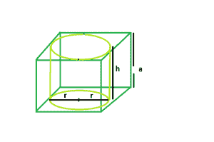

# 立方体内最大的右圆柱体

> 原文:[https://www . geesforgeks . org/最大-右侧-立方体内的圆形圆柱体/](https://www.geeksforgeeks.org/largest-right-circular-cylinder-within-a-cube/)

给定一个边长为**和**的立方体。任务是找出最大的右圆柱体内可内接的体积。
**例:**

```
Input :  a = 4
Output : 50.24

Input : a = 5
Output : 98.125
```



**进场** :
让:

*   气缸高度为 **h** 。
*   圆柱体的半径为 **r** 。

从图中可以清楚地看到:

*   圆柱体的高度=立方体的边
*   圆柱体的半径=立方体的边/2

所以，

```
h = a
r = a/2
```

以下是上述方法的实现:

## C++

```
// C++ Program to find the biggest right
// circular cylinder that can be fit within a cube
#include <bits/stdc++.h>
using namespace std;

// Function to find the biggest right circular cylinder
float findVolume(float a)
{
    // side cannot be negative
    if (a < 0)
        return -1;

    // radius of right circular cylinder
    float r = a / 2;

    // height of right circular cylinder
    float h = a;

    // volume of right circular cylinder
    float V = 3.14 * pow(r, 2) * h;

    return V;
}

// Driver code
int main()
{
    float a = 5;

    cout << findVolume(a) << endl;

    return 0;
}
```

## Java 语言(一种计算机语言，尤用于创建网站)

```
// Java Program to find the biggest right
// circular cylinder that can be fit within a cube

import java.io.*;

class GFG {

// Function to find the biggest right circular cylinder
 static float findVolume(float a)
{
    // side cannot be negative
    if (a < 0)
        return -1;

    // radius of right circular cylinder
    float r = a / 2;

    // height of right circular cylinder
    float h = a;

    // volume of right circular cylinder
    float V = (float)(3.14 * Math.pow(r, 2) * h);

    return V;
}

// Driver code

    public static void main (String[] args) {
            float a = 5;

    System.out.print(findVolume(a));
    }
}
// This code is contributed by anuj_67..
```

## 蟒蛇 3

```
# Python3 Program to find the biggest
# right circular cylinder that can be
# fit within a cube

# Function to find the biggest right
# circular cylinder
def findVolume(a) :

    # side cannot be negative
    if (a < 0) :
        return -1

    # radius of right circular cylinder
    r = a / 2

    # height of right circular cylinder
    h = a

    # volume of right circular cylinder
    V = 3.14 * pow(r, 2) * h

    return V

# Driver code
if __name__ == "__main__" :

    a = 5

    print(findVolume(a))

# This code is contributed by Ryuga
```

## C#

```
// C# Program to find the biggest right
// circular cylinder that can be fit within a cube

using System;
class GFG {

// Function to find the biggest right circular cylinder
static float findVolume(float a)
{
    // side cannot be negative
    if (a < 0)
        return -1;

    // radius of right circular cylinder
    float r = a / 2;

    // height of right circular cylinder
    float h = a;

    // volume of right circular cylinder
    float V = (float)(3.14 * Math.Pow(r, 2) * h);

    return V;
}

// Driver code

    public static void Main () {
            float a = 5;

   Console.WriteLine(findVolume(a));
    }
}
// This code is contributed by anuj_67..
```

## 服务器端编程语言（Professional Hypertext Preprocessor 的缩写）

```
<?php
// PHP Program to find the biggest
// right circular cylinder that can
// be fit within a cube

// Function to find the biggest
// right circular cylinder
function findVolume($a)
{
    // side cannot be negative
    if ($a < 0)
        return -1;

    // radius of right circular cylinder
    $r = $a / 2;

    // height of right circular cylinder
    $h = $a;

    // volume of right circular cylinder
    $V = 3.14 * pow($r, 2) * $h;

    return $V;
}

// Driver code
$a = 5;

echo findVolume($a) . "\n";

// This code is contributed
// by Akanksha Rai
```

## java 描述语言

```
<script>
// Javascript Program to find the biggest right
// circular cylinder that can be fit within a cube

// Function to find the biggest right circular cylinder
 function findVolume(a)
{

    // side cannot be negative
    if (a < 0)
        return -1;

    // radius of right circular cylinder
    var r = a / 2;

    // height of right circular cylinder
    var h = a;

    // volume of right circular cylinder
    var V = (3.14 * Math.pow(r, 2) * h);

    return V;
}

// Driver code
var a = 5;
document.write(findVolume(a));

// This code is contributed by Princi Singh
</script>
```

**Output:** 

```
98.125
```