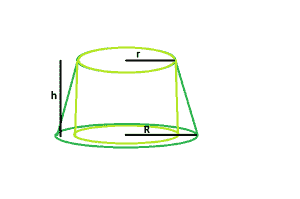

# 平截头体内最大的右圆柱体

> 原文:[https://www . geesforgeks . org/最大-右-圆台内圆柱/](https://www.geeksforgeeks.org/largest-right-circular-cylinder-within-a-frustum/)

给定平截头体高度，顶半径 &底半径。任务是找出最大的右圆柱体内可内接的体积。
**示例:**

```
Input  : r = 5, R = 10, h = 4
Output : 314

Input : r = 7, R = 11, h = 6
Output : 923.16
```



**进场** :
让:

*   气缸的高度= **h1**
*   圆柱体半径= **r1**

从图中可以清楚地看出:

*   圆柱体的高度=平截头体的高度
*   圆柱体半径= Rop-平截头体半径

所以，

```
h1 = h
r1 = r
```

以下是上述方法的实现:

## C++

```
// C++ Program to find the biggest right circular cylinder
// that can be fit within a frustum
#include <bits/stdc++.h>
using namespace std;

// Function to find the biggest right circular cylinder
float cyl(float r, float R, float h)
{
    // radii and height cannot be negative
    if (h < 0 && r < 0 && R < 0)
        return -1;

    // radius of right circular cylinder
    float r1 = r;
    // height of right circular cylinder
    float h1 = h;
    // volume of right circular cylinder
    float V = 3.14 * pow(r1, 2) * h1;

    return V;
}

// Driver code
int main()
{
    float r = 7, R = 11, h = 6;

    cout << cyl(r, R, h) << endl;

    return 0;
}
```

## Java 语言(一种计算机语言，尤用于创建网站)

```
// Java Program to find the biggest right circular cylinder
// that can be fit within a frustum

import java.io.*;

class GFG {

// Function to find the biggest right circular cylinder
 static float cyl(float r, float R, float h)
{
    // radii and height cannot be negative
    if (h < 0 && r < 0 && R < 0)
        return -1;

    // radius of right circular cylinder
    float r1 = r;
    // height of right circular cylinder
    float h1 = h;
    // volume of right circular cylinder
    float V = (float)(3.14 * Math.pow(r1, 2) * h1);

    return V;
}

// Driver code
    public static void main (String[] args) {
            float r = 7, R = 11, h = 6;

    System.out.print( cyl(r, R, h));
    }
}
// This code is contributed by anuj_67..
```

## 蟒蛇 3

```
# Python3 Program to find the biggest right circular cylinder
# that can be fit within a frustum

# Function to find the biggest right circular cylinder
def cyl(r, R, h) :

    # radii and height cannot be negative
    if (h < 0 and r < 0 and R < 0) :
        return -1

    # radius of right circular cylinder
    r1 = r
    # height of right circular cylinder
    h1 = h
    # volume of right circular cylinder
    V = 3.14 * pow(r1, 2) * h1

    return round(V,2)

# Driver code
if __name__ == "__main__" :

    r, R, h = 7, 11, 6

    print(cyl(r, R, h))

# This code is contributed by Ryuga
```

## C#

```
// C# Program to find the biggest right circular cylinder
// that can be fit within a frustum
using System;

class GFG {

// Function to find the biggest right circular cylinder
static float cyl(float r, float R, float h)
{
    // radii and height cannot be negative
    if (h < 0 && r < 0 && R < 0)
        return -1;

    // radius of right circular cylinder
    float r1 = r;
    // height of right circular cylinder
    float h1 = h;
    // volume of right circular cylinder
    float V = (float)(3.14 * Math.Pow(r1, 2) * h1);

    return V;
}

// Driver code
    public static void Main () {
            float r = 7, R = 11, h = 6;

    Console.WriteLine( cyl(r, R, h));
    }
}
// This code is contributed by anuj_67..
```

## 服务器端编程语言（Professional Hypertext Preprocessor 的缩写）

```
<?php
// PHP Program to find the biggest
// right circular cylinder that can
// be fit within a frustum

// Function to find the biggest
// right circular cylinder
function cyl($r, $R, $h)
{
    // radii and height cannot be negative
    if ($h < 0 && $r < 0 && $R < 0)
        return -1;

    // radius of right circular cylinder
    $r1 = $r;

    // height of right circular cylinder
    $h1 = $h;

    // volume of right circular cylinder
    $V = (3.14 * pow($r1, 2) * $h1);

    return $V;
}

// Driver code
$r = 7; $R = 11; $h = 6;

echo cyl($r, $R, $h);

// This code is contributed
// by Mukul Singh.
```

## java 描述语言

```
<script>
// javascript Program to find the biggest right circular cylinder
// that can be fit within a frustum

// Function to find the biggest right circular cylinder
 function cyl(r , R , h)
{

    // radii and height cannot be negative
    if (h < 0 && r < 0 && R < 0)
        return -1;

    // radius of right circular cylinder
    var r1 = r;

    // height of right circular cylinder
    var h1 = h;

    // volume of right circular cylinder
    var V = (3.14 * Math.pow(r1, 2) * h1);
    return V;
}

// Driver code
var r = 7, R = 11, h = 6;
document.write( cyl(r, R, h).toFixed(5));

// This code is contributed by Princi Singh
</script>
```

**Output:** 

```
923.16
```