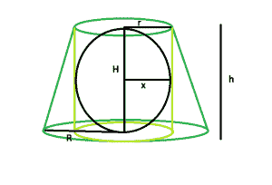

# 可内接在平截头体内接的正圆柱体内的最大球体

> 原文:[https://www . geeksforgeeks . org/最大-可内接直角球-圆柱-内接平截头体/](https://www.geeksforgeeks.org/largest-sphere-that-can-be-inscribed-in-a-right-circular-cylinder-inscribed-in-a-frustum/)

这里给定的是一个平截头体高度 **h** ，顶半径 **r** &底半径 **R** ，它描绘了一个右圆柱体，而右圆柱体又描绘了一个球体。任务是找到这个球体的最大可能体积。
**举例:**

```
Input: r = 5, R = 8, h = 11
Output: 523.333

Input: r = 9, R = 14, h = 20
Output:3052.08
```



**逼近**:让圆柱体的高度= **H** ，球体的半径= **x**
我们知道，圆台内接圆柱体的高度和半径分别等于圆台的高度和顶半径[(这里请参考)](https://www.geeksforgeeks.org/largest-right-circular-cylinder-within-a-frustum/)。所以圆柱体的高度= **h** ，圆柱体的半径= **r** 。
同样，圆柱内接球体的半径等于圆柱的半径[(请参考此处)](https://www.geeksforgeeks.org/volume-of-biggest-sphere-within-a-right-circular-cylinder/)，所以 **x = r** 。
所以，球体的体积， **V = 4*π*r^3/3** 。
以下是上述办法的实施:

## C++

```
// C++ Program to find the biggest sphere
// that can be inscribed within a right
// circular cylinder which in turn is inscribed
// within a frustum
#include <bits/stdc++.h>
using namespace std;

// Function to find the biggest sphere
float sph(float r, float R, float h)
{

    // the radii and height cannot be negative
    if (r < 0 && R < 0 && h < 0)
        return -1;

    // radius of the sphere
    float x = r;

    // volume of the sphere
    float V = (4 * 3.14 * pow(r, 3)) / 3;

    return V;
}

// Driver code
int main()
{
    float r = 5, R = 8, h = 11;
    cout << sph(r, R, h) << endl;

    return 0;
}
```

## Java 语言(一种计算机语言，尤用于创建网站)

```
// Java Program to find the biggest sphere
// that can be inscribed within a right
// circular cylinder which in turn is inscribed
// within a frustum
import java.lang.Math;

class gfg
{

// Function to find the biggest sphere
static float sph(float r, float R, float h)
{

    // the radii and height cannot be negative
    if (r < 0 && R < 0 && h < 0)
        return -1;

    // radius of the sphere
    float x = r;

    // volume of the sphere
    float V = (float)(4 * 3.14f * Math.pow(r, 3)) / 3;

    return V;
}

// Driver code
public static void main(String[] args)
{
    float r = 5, R = 8, h = 11;
    System.out.println(sph(r, R, h));
}
}

// This Code is contributed by Code_Mech.
```

## 蟒蛇 3

```
# Python3 Program to find the biggest sphere
# that can be inscribed within a right
# circular cylinder which in turn is inscribed
# within a frustum
import math as mt

# Function to find the biggest sphere
def sph(r, R, h):

    # the radii and height cannot
    # be negative
    if (r < 0 and R < 0 and h < 0):
        return -1

    # radius of the sphere
    x = r

    # volume of the sphere
    V = (4 * 3.14 * pow(r, 3)) / 3

    return V

# Driver code
r, R, h = 5, 8, 11
print(sph(r, R, h))

# This code is contributed by
# Mohit kumar 29
```

## C#

```
// C# Program to find the biggest sphere
// that can be inscribed within a right
// circular cylinder which in turn is
// inscribed within a frustum
using System;

class gfg
{

    // Function to find the biggest sphere
    static float sph(float r, float R, float h)
    {

        // the radii and height
        // cannot be negative
        if (r < 0 && R < 0 && h < 0)
            return -1;

        // radius of the sphere
        float x = r;

        // volume of the sphere
        float V = (float)(4 * 3.14f *
                    Math.Pow(r, 3)) / 3;

        return V;
    }

    // Driver code
    public static void Main()
    {
        float r = 5, R = 8, h = 11;
        Console.WriteLine(sph(r, R, h));
    }
}

// This code is contributed by Ryuga
```

## 服务器端编程语言（Professional Hypertext Preprocessor 的缩写）

```
<?php
// PHP Program to find the biggest sphere
// that can be inscribed within a right
// circular cylinder which in turn is
// inscribed within a frustum Function
// to find the biggest sphere

function sph($r, $R, $h)
{

    // the radii and height
    // cannot be negative
    if ($r < 0 && $R < 0 && $h < 0)
        return -1;

    // radius of the sphere
    $x = $r;

    // volume of the sphere
    $V = (4 * 3.14 * pow($r, 3)) / 3;

    return $V;
}

// Driver code
    $r = 5;
    $R = 8;
    $h = 11;
    echo sph($r, $R, $h);

#This Code is contributed by ajit..
?>
```

## java 描述语言

```
<script>

// javascript Program to find the biggest sphere
// that can be inscribed within a right
// circular cylinder which in turn is inscribed
// within a frustum

// Function to find the biggest sphere
function sph(r , R , h)
{

    // the radii and height cannot be negative
    if (r < 0 && R < 0 && h < 0)
        return -1;

    // radius of the sphere
    var x = r;

    // volume of the sphere
    var V = ((4 * 3.14 * Math.pow(r, 3)) / 3);

    return V;
}

// Driver code
 var r = 5, R = 8, h = 11;
document.write(sph(r, R, h).toFixed(5));

// This code is contributed by Amit Katiyar

</script>
```

**Output:** 

```
523.333
```