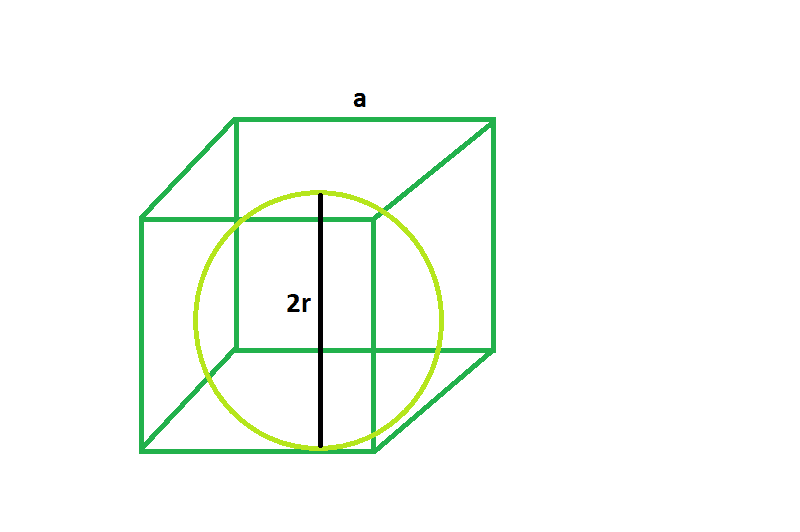

# 立方体内可内切的最大球体

> 原文:[https://www . geeksforgeeks . org/最大可内接球体立方体/](https://www.geeksforgeeks.org/largest-sphere-that-can-be-inscribed-inside-a-cube/)

这里给定的是一个边长为 **a** 的立方体，任务是找到可以在其中内接的最大球体。
**例:**

```
Input: a = 4
Output: 2

Input: a = 5
Output: 2.5
```



**接近** :

> 从 2d 图中可以清楚地看到， **2r = a** ，
> 其中， **a** =立方体的边
> **r** =球体的半径
> 所以 **r = a/2** 。

以下是上述方法的实现:

## C++

```
// C++ Program to find the biggest sphere
// inscribed within a cube
#include <bits/stdc++.h>
using namespace std;

// Function to find the radius of the sphere
float sphere(float a)
{

    // side cannot be negative
    if (a < 0)
        return -1;

    // radius of the sphere
    float r = a / 2;

    return r;
}

// Driver code
int main()
{
    float a = 5;
    cout << sphere(a) << endl;

    return 0;
}
```

## Java 语言(一种计算机语言，尤用于创建网站)

```
// Java Program to find the biggest sphere
// inscribed within a cube

class GFG{
// Function to find the radius of the sphere
static float sphere(float a)
{

    // side cannot be negative
    if (a < 0)
        return -1;

    // radius of the sphere
    float r = a / 2;

    return r;
}

// Driver code
public static void main(String[] args)
{
    float a = 5;
    System.out.println(sphere(a));

}
}
// This code is contributed by mits
```

## 蟒蛇 3

```
# Python 3 Program to find the biggest
# sphere inscribed within a cube

# Function to find the radius
# of the sphere
def sphere(a):

    # side cannot be negative
    if (a < 0):
        return -1

    # radius of the sphere
    r = a / 2

    return r

# Driver code
if __name__ == '__main__':
    a = 5
    print(sphere(a))

# This code is contributed
# by SURENDRA_GANGWAR
```

## C#

```
// C# Program to find the biggest
// sphere inscribed within a cube
using System;

class GFG
{
// Function to find the radius
// of the sphere
static float sphere(float a)
{

    // side cannot be negative
    if (a < 0)
        return -1;

    // radius of the sphere
    float r = a / 2;

    return r;
}

// Driver code
static public void Main ()
{
    float a = 5;
    Console.WriteLine(sphere(a));
}
}

// This code is contributed by ajit
```

## 服务器端编程语言（Professional Hypertext Preprocessor 的缩写）

```
<?php
// PHP Program to find the biggest
// sphere inscribed within a cube

// Function to find the radius
// of the sphere
function sphere($a)
{

    // side cannot be negative
    if ($a < 0)
        return -1;

    // radius of the sphere
    $r = ($a / 2);

    return $r;
}

// Driver code
$a = 5;
echo sphere($a);

// This code is contributed by akt_mit
?>
```

## java 描述语言

```
<script>
// javascript Program to find the biggest sphere
// inscribed within a cube

// Function to find the radius of the sphere
function sphere(a)
{

    // side cannot be negative
    if (a < 0)
        return -1;

    // radius of the sphere
    var r = a / 2;
    return r;
}

// Driver code
var a = 5;
document.write(sphere(a));

// This code is contributed by 29AjayKumar
</script>
```

**Output:** 

```
2.5
```