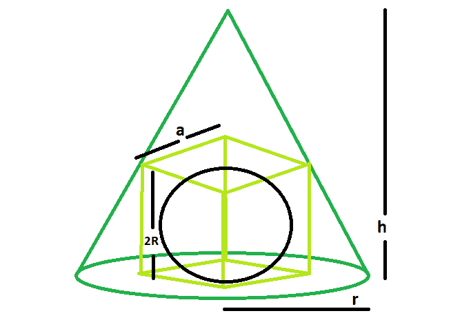

# 可被内接在正方体中的最大球体，而正方体又被内接在一个直角圆锥中

> 原文:[https://www . geeksforgeeks . org/可在正方体中内接的最大球体-依次内接在直角圆锥内/](https://www.geeksforgeeks.org/largest-sphere-that-can-be-inscribed-within-a-cube-which-is-in-turn-inscribed-within-a-right-circular-cone/)

这里给定的是一个半径为 **r** 且垂直高度为 **h** 的右圆锥，它被内接在一个正方体中，正方体又被内接在一个球体中，任务是求球体的半径。
**例:**

```
Input: h = 5, r = 6 
Output: 1.57306

Input: h = 8, r = 11
Output: 2.64156
```



**接近** :

*   让立方体的边= **a**
*   让球体的半径= **R**
*   我们知道， **a=h*r√2/(h+√2*r)** [(请参考此处)](https://www.geeksforgeeks.org/largest-cube-that-can-be-inscribed-within-a-right-circular-cone/)
*   还有， **R=a/2** [(请参考此处)](https://www.geeksforgeeks.org/largest-sphere-that-can-be-inscribed-inside-a-cube/)
*   于是，**r =(h * rⅰ2/(h+√2r)]/2**

以下是上述方法的实现:

## C++

```
// C++ Program to find the biggest sphere
// which is inscribed within a cube which in turn
// inscribed within a right circular cone

#include <bits/stdc++.h>
using namespace std;

// Function to find the radius of the sphere
float sphereSide(float h, float r)
{
    // height and radius cannot be negative
    if (h < 0 && r < 0)
        return -1;

    // radius of the sphere
    float R = ((h * r * sqrt(2)) / (h + sqrt(2) * r)) / 2;

    return R;
}

// Driver code
int main()
{
    float h = 5, r = 6;

    cout << sphereSide(h, r) << endl;

    return 0;
}
```

## Java 语言(一种计算机语言，尤用于创建网站)

```
// Java Program to find the biggest sphere
// which is inscribed within a cube which in turn
// inscribed within a right circular cone
import java.lang.Math;

class GFG
{

// Function to find the radius of the sphere
static float sphereSide(float h, float r)
{
    // height and radius cannot be negative
    if (h < 0 && r < 0)
        return -1;

    // radius of the sphere
    float R = (float)((h * r * Math.sqrt(2)) /
                    (h + Math.sqrt(2) * r)) / 2;

    return R;
}

// Driver code
public static void main(String[] args)
{
    float h = 5, r = 6;

    System.out.println(sphereSide(h, r));

}
}

// This code is contributed by Code_Mech.
```

## 蟒蛇 3

```
# Program to find the biggest sphere
# which is inscribed within a cube which in turn
# inscribed within a right circular cone
import math

# Function to find the radius of the sphere
def sphereSide(h, r):

    # height and radius cannot be negative
    if h < 0 and r < 0:
        return -1

    # radius of the sphere
    R = (((h * r * math.sqrt(2))) /
              (h + math.sqrt(2) * r) / 2)

    return R

# Driver code
h = 5; r = 6
print(sphereSide(h, r))

# This code is contributed by Shrikant13
```

## C#

```
// C# Program to find the biggest sphere
// which is inscribed within a cube which in turn
// inscribed within a right circular cone
using System;

class GFG
{

// Function to find the radius of the sphere
static float sphereSide(float h, float r)
{
    // height and radius cannot be negative
    if (h < 0 && r < 0)
        return -1;

    // radius of the sphere
    float R = (float)((h * r * Math.Sqrt(2)) /
                      (h + Math.Sqrt(2) * r)) / 2;

    return R;
}

// Driver code
public static void Main()
{
    float h = 5, r = 6;

    Console.WriteLine(sphereSide(h, r));
}
}

// This code is contributed by Code_Mech
```

## 服务器端编程语言（Professional Hypertext Preprocessor 的缩写）

```
<?php
// PHP Program to find the biggest sphere
// which is inscribed within a cube which in turn
// inscribed within a right circular cone

// Function to find the radius of the sphere
function sphereSide($h, $r)
{
    // height and radius cannot be negative
    if ($h < 0 && $r < 0)
        return -1;

    // radius of the sphere
    $R = (($h * $r * sqrt(2)) /
          ($h + sqrt(2) * $r)) / 2;

    return $R;
}

// Driver code
$h = 5; $r = 6;

echo(sphereSide($h, $r));

// This code is contributed by Code_Mech.
?>
```

## java 描述语言

```
<script>

// javascript Program to find the biggest sphere
// which is inscribed within a cube which in turn
// inscribed within a right circular cone

// Function to find the radius of the sphere
function sphereSide(h , r)
{
    // height and radius cannot be negative
    if (h < 0 && r < 0)
        return -1;

    // radius of the sphere
    var R = ((h * r * Math.sqrt(2)) /
                    (h + Math.sqrt(2) * r)) / 2;

    return R;
}

// Driver code
var h = 5, r = 6;

document.write(sphereSide(h, r).toFixed(5));

// This code is contributed by Amit Katiyar

</script>
```

**Output:** 

```
1.57306
```