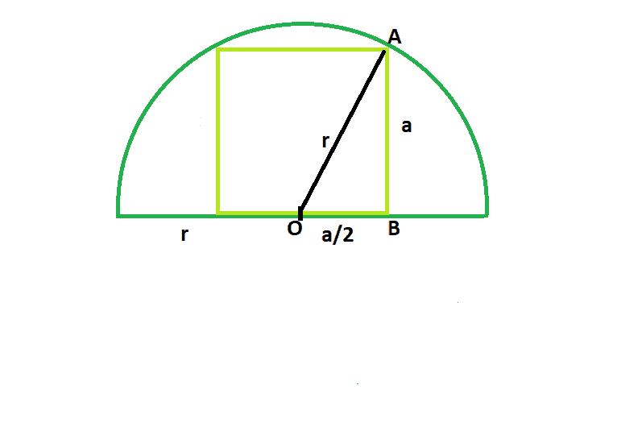

# 可内接半圆的最大正方形

> 原文:[https://www . geeksforgeeks . org/最大可内接半圆正方形/](https://www.geeksforgeeks.org/largest-square-that-can-be-inscribed-in-a-semicircle/)

给定一个半径为 **r** 的半圆，我们必须找到半圆中可以内接的最大正方形，底边位于直径上。

**示例:**

```
Input: r = 5
Output: 20

Input: r = 8
Output: 51.2
```



**逼近**:让 **r** 为半圆& a 的半径为**正方形**的边长。
从图中我们可以看出，圆心也是正方形底边的中点。所以在直角三角形 **AOB** 中，从**勾股定理**可知:

> a^2+(a/2)^2 = r^2
> 5*(a^2/4)= r^2
> a^2 = 4*(r^2/5)即广场面积

**以下是上述方法**的实现:

## C++

```
// C++ Program to find the biggest square
// which can be inscribed within the semicircle
#include <bits/stdc++.h>
using namespace std;

// Function to find the area
// of the square
float squarearea(float r)
{

    // the radius cannot be negative
    if (r < 0)
        return -1;

    // area of the square
    float a = 4 * (pow(r, 2) / 5);

    return a;
}

// Driver code
int main()
{
    float r = 5;
    cout << squarearea(r) << endl;

    return 0;
}
```

## Java 语言(一种计算机语言，尤用于创建网站)

```
// Java Program to find the biggest square
// which can be inscribed within the semicircle

import java.io.*;

class GFG {

// Function to find the area
// of the square
static float squarearea(float r)
{

    // the radius cannot be negative
    if (r < 0)
        return -1;

    // area of the square
    float a = 4 * (float)(Math.pow(r, 2) / 5);

    return a;
}

// Driver code

    public static void main (String[] args) {
         float r = 5;
    System.out.println( squarearea(r));
    }
}
// This code is contributed by chandan_jnu.
```

## 蟒蛇 3

```
# Python 3 program to find the
# biggest square which can be
# inscribed within the semicircle

# Function to find the area
# of the square
def squarearea(r):

    # the radius cannot be
    # negative
    if (r < 0):
        return -1

    # area of the square
    a = 4 * (pow(r, 2) / 5)

    return a

# Driver code
if __name__ == "__main__":

    r = 5
    print(int(squarearea(r)))

# This code is contributed
# by ChitraNayal
```

## C#

```
// C# Program to find the
// biggest square which can be
// inscribed within the semicircle
using System;

class GFG
{

// Function to find the
// area of the square
static float squarearea(float r)
{

    // the radius cannot be negative
    if (r < 0)
        return -1;

    // area of the square
    float a = 4 * (float)(Math.Pow(r, 2) / 5);

    return a;
}

// Driver code
public static void Main ()
{
    float r = 5;
    Console.WriteLine(squarearea(r));
}
}

// This code is contributed
// by anuj_67
```

## 服务器端编程语言（Professional Hypertext Preprocessor 的缩写）

```
<?php
// PHP Program to find the
// biggest square which can be
// inscribed within the semicircle

// Function to find the area
// of the square
function squarearea($r)
{

    // the radius cannot be negative
    if ($r < 0)
        return -1;

    // area of the square
    $a = 4 * (pow($r, 2) / 5);

    return $a;
}

// Driver code
$r = 5;
echo squarearea($r);

// This code is contributed
// by Shivi_Aggarwal
?>
```

## java 描述语言

```
<script>

// javascript Program to find the biggest square
// which can be inscribed within the semicircle

// Function to find the area
// of the square
function squarearea(r)
{

    // the radius cannot be negative
    if (r < 0)
        return -1;

    // area of the square
    var a = 4 * (Math.pow(r, 2) / 5);

    return a;
}

// Driver code
var r = 5;
document.write( squarearea(r));

// This code contributed by Princi Singh

</script>
```

**Output:** 

```
20
```