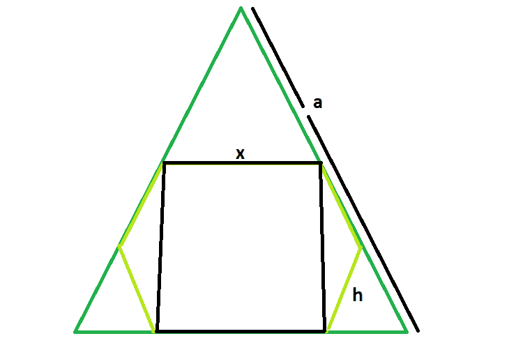

# 内切圆内接等边三角形的六边形内接的最大正方形

> 原文:[https://www . geeksforgeeks . org/可内切圆的最大正方形/等边三角形内切圆/](https://www.geeksforgeeks.org/largest-square-that-can-be-inscribed-within-a-hexagon-which-is-inscribed-within-an-equilateral-triangle/)

这里给出了一个边长为 **a** 的等边三角形，它描绘了一个六边形，而这个六边形又描绘了一个正方形。任务是找出正方形的边长。
**例:**

```
Input:  a = 6
Output: 2.538

Input: a = 8
Output: 3.384
```



**逼近** :
我们知道，内接在等边三角形内的六边形的边长是 **h = a/3** 。请参考[等边三角形内可内接的最大六边形](https://www.geeksforgeeks.org/largest-hexagon-that-can-be-inscribed-within-an-equilateral-triangle/)。
同样，六边形内可内接的正方形边长为 **x = 1.268h** 请参考[六边形内可内接的最大正方形](https://www.geeksforgeeks.org/largest-square-that-can-be-inscribed-within-a-hexagon/)。
所以，内接在六边形内的正方形的边长依次内接在等边三角形内， **x = 0.423a** 。
以下是上述方法的实施:

## C++

```
// C++ program to find the side of the largest square
// that can be inscribed within the hexagon which in return
// is incsribed within an equilateral triangle
#include <bits/stdc++.h>
using namespace std;

// Function to find the side
// of the square
float squareSide(float a)
{

    // Side cannot be negative
    if (a < 0)
        return -1;

    // side of the square
    float x = 0.423 * a;
    return x;
}

// Driver code
int main()
{
    float a = 8;
    cout << squareSide(a) << endl;

    return 0;
}
```

## Java 语言(一种计算机语言，尤用于创建网站)

```
// Java program to find the side of the
// largest square that can be inscribed
// within the hexagon which in return is
// incsribed within an equilateral triangle
class cfg
{

// Function to find the side
// of the square
static float squareSide(float a)
{

    // Side cannot be negative
    if (a < 0)
        return -1;

    // side of the square
    float x = (0.423f * a);
    return x;
}

// Driver code
public static void main(String[] args)
{
    float a = 8;
    System.out.println(squareSide(a));

}
}

// This code is contributed by
// Mukul Singh.
```

## 蟒蛇 3

```
# Python 3 program to find the side of the
# largest square that can be inscribed
# within the hexagon which in return
# is incsribed within an equilateral triangle

# Function to find the side of the square
def squareSide(a):

    # Side cannot be negative
    if (a < 0):
        return -1

    # side of the square
    x = 0.423 * a
    return x

# Driver code
if __name__ == '__main__':
    a = 8
    print(squareSide(a))

# This code is contributed by
# Sanjit_Prasad
```

## C#

```
// C# program to find the side of the
// largest square that can be inscribed
// within the hexagon which in return is
// incsribed within an equilateral triangle
using System;

class GFG
{

// Function to find the side
// of the square
static float squareSide(float a)
{

    // Side cannot be negative
    if (a < 0)
        return -1;

    // side of the square
    float x = (0.423f * a);
    return x;
}

// Driver code
public static void Main()
{
    float a = 8;
    Console.WriteLine(squareSide(a));
}
}

// This code is contributed by
// shs
```

## 服务器端编程语言（Professional Hypertext Preprocessor 的缩写）

```
<?php
// PHP program to find the side of the
// largest square that can be inscribed
// within the hexagon which in return is
// incsribed within an equilateral triangle

// Function to find the side of the square
function squareSide($a)
{

    // Side cannot be negative
    if ($a < 0)
        return -1;

    // side of the square
    $x = 0.423 * $a;
    return $x;
}

// Driver code
$a = 8;
echo squareSide($a);

// This code is contributed by ajit.
?>
```

## java 描述语言

```
<script>
// javascript program to find the side of the
// largest square that can be inscribed
// within the hexagon which in return is
// incsribed within an equilateral triangle

// Function to find the side
// of the square
function squareSide(a)
{

    // Side cannot be negative
    if (a < 0)
        return -1;

    // side of the square
    var x = (0.423 * a);
    return x;
}

// Driver code
var a = 8;
document.write(squareSide(a));

// This code is contributed by Princi Singh
</script>
```

**Output:** 

```
3.384
```