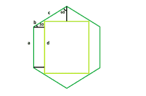

# 六边形内接的最大正方形

> 原文:[https://www . geeksforgeeks . org/六边形内接最大正方形/](https://www.geeksforgeeks.org/largest-square-that-can-be-inscribed-within-a-hexagon/)

给定一个规则的六边形长度 **a** ，任务是找到可以在其中内接的最大正方形的面积。
**例:**

> **输入:** a = 6
> **输出:** 57.8817
> **输入:** a = 8
> **输出:** 102.901



**方法:**我们将导出的正方形将具有六边形的相同中心和轴。这是因为如果我们旋转它，正方形会变小。

> 六边形的边相等，即 **a = b + c** 。
> 现在，让 **d** 为内接正方形边长，
> 然后为正方形顶边， **d = 2 * c * sin(60)** 。
> 还有，左边的方块， **d = a + 2 * b * sin(30)** 。
> 代替 c，**d = 2 *(a–b)* sin(60)**。
> 现在取 d 重新排列，我们得到，**b/a =(2 * sin(60)–1)/(2 *(sin(30)+sin(60)))**
> 所以，**b/a = 2–√3**
> 现在，代入正方形左手边方程中 **b** 和 **a** 的关系，我们得到，
> **d/a = 0**

以下是上述方法的实现:

## C++

```
// C++ program to find the area of the largest square
// that can be inscribed within the hexagon
#include <bits/stdc++.h>
using namespace std;

// Function to find the area
// of the square
float squareArea(float a)
{

    // Side cannot be negative
    if (a < 0)
        return -1;

    // Area of the square
    float area = pow(1.268, 2) * pow(a, 2);
    return area;
}

// Driver code
int main()
{
    float a = 6;
    cout << squareArea(a) << endl;
    return 0;
}
```

## Java 语言(一种计算机语言，尤用于创建网站)

```
// Java program to find the area of the largest square
// that can be inscribed within the hexagon
class Solution {
    // Function to find the area
    // of the square
    static float squareArea(float a)
    {

        // Side cannot be negative
        if (a < 0)
            return -1;

        // Area of the square
        float area = (float)(Math.pow(1.268, 2) * Math.pow(a, 2));
        return area;
    }

    // Driver code
    public static void main(String args[])
    {
        float a = 6;
        System.out.println(squareArea(a));
    }
}

// This code is contributed by Arnab Kundu
```

## 蟒蛇 3

```
# Python program to find the area of the largest square
# that can be inscribed within the hexagon

# Function to find the area
# of the square
def squareArea(a):

    # Side cannot be negative
    if (a < 0):
        return -1;

    # Area of the square
    area = (1.268 ** 2) * (a ** 2);
    return area;

# Driver code
a = 6;
print(squareArea(a));

# This code contributed by PrinciRaj1992
```

## C#

```
// C# program to find the area of the largest square
// that can be inscribed within the hexagon
using System;
class Solution {
    // Function to find the area
    // of the square
    static float squareArea(float a)
    {

        // Side cannot be negative
        if (a < 0)
            return -1;

        // Area of the square
        float area = (float)(Math.Pow(1.268, 2) * Math.Pow(a, 2));
        return area;
    }

    // Driver code
    public static void Main()
    {
        float a = 6;
        Console.WriteLine(squareArea(a));
    }
}

// This code is contributed by  anuj_67..
```

## 服务器端编程语言（Professional Hypertext Preprocessor 的缩写）

```
<?php
// PHP program to find the area of the largest square
// that can be inscribed within the hexagon

// Function to find the area
// of the square
function squareArea($a)
{

    // Side cannot be negative
    if ($a < 0)
        return -1;

    // Area of the square
    $area = pow(1.268, 2) * pow($a, 2);
    return $area;
}

// Driver code
$a = 6;
echo squareArea($a), "\n";

// This code is contributed by Tushil
?>
```

## java 描述语言

```
<script>
// javascript program to find the area of the largest square
// that can be inscribed within the hexagon

// Function to find the area
// of the square
function squareArea(a)
{

  // Side cannot be negative
  if (a < 0)
  return -1;

  // Area of the square
  var area = (Math.pow(1.268, 2) * Math.pow(a, 2));
  return area;
}

// Driver code

var a = 6;
document.write(squareArea(a).toFixed(5));

// This code is contributed by Princi Singh
</script>
```

**Output:** 

```
57.8817
```