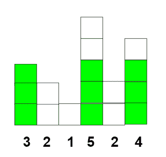

# 使用给定的矩形块可以形成的最大正方形

> 原文:[https://www . geeksforgeeks . org/使用给定矩形块可以形成的最大正方形/](https://www.geeksforgeeks.org/largest-square-which-can-be-formed-using-given-rectangular-blocks/)

给定一个正整数的[数组](https://www.geeksforgeeks.org/introduction-to-arrays/) **arr[]** ，其中数组的每个元素代表矩形块的长度。任务是找到可以用矩形块形成的正方形的最大长度。

**示例:**

> **输入:** arr[] = {3，2，1，5，2，4}
> **输出:** 3
> **说明:**
> 利用长度为 3，5，4 的矩形块，边长为 3 的正方形可构造如下:
> 
> 
> 
> **输入:** arr[] = {1，2，3 }
> T3】输出: 2

**进场:**

1.  [按降序对给定数组进行排序](https://www.geeksforgeeks.org/sorting-algorithms/)。
2.  将最大边长初始化为 0。
3.  遍历数组 **arr[]** ，如果 **arr[i] >最大长度**，则增加最大长度，并为下一次迭代检查该条件。
4.  如果上述条件不满足，则中断循环并打印**最大长度**。

下面是上述方法的实现:

## C++

```
// C++ program for the above approach
#include <bits/stdc++.h>
using namespace std;

// Function to find maximum side
// length of square
void maxSide(int a[], int n)
{
    int sideLength = 0;

    // Sort array in asc order
    sort(a, a + n);

    // Traverse array in desc order
    for (int i = n - 1; i >= 0; i--) {

        if (a[i] > sideLength) {
            sideLength++;
        }
        else {
            break;
        }
    }
    cout << sideLength << endl;
}

// Driver Code
int main()
{
    int N = 6;

    // Given array arr[]
    int arr[] = { 3, 2, 1, 5, 2, 4 };

    // Function Call
    maxSide(arr, N);
    return 0;
}
```

## Java 语言(一种计算机语言，尤用于创建网站)

```
// Java program for the above approach
import java.util.Arrays;

class GFG{

// Function to find maximum side
// length of square
static void maxSide(int a[], int n)
{
    int sideLength = 0;

    // Sort array in asc order
    Arrays.sort(a);

    // Traverse array in desc order
    for(int i = n - 1; i >= 0; i--)
    {
       if (a[i] > sideLength)
       {
           sideLength++;
       }
       else
       {
           break;
       }
    }
    System.out.println(sideLength);
}

// Driver code
public static void main (String[] args)
{
    int N = 6;

    // Given array arr[]
    int arr[] = new int[]{ 3, 2, 1,
                           5, 2, 4 };

    // Function Call
    maxSide(arr, N);
}
}

// This code is contributed by Pratima Pandey
```

## 蟒蛇 3

```
# Python3 program for the above approach

# Function to find maximum side
# length of square
def maxSide(a, n):

    sideLength = 0

    # Sort array in asc order
    a.sort

    # Traverse array in desc order
    for i in range(n - 1, -1, -1):
        if (a[i] > sideLength):
            sideLength += 1
        else:
            break

    print(sideLength)

# Driver code
N = 6

# Given array arr[]
arr = [ 3, 2, 1, 5, 2, 4 ]

# Function Call
maxSide(arr, N)

# This code is contributed by divyeshrabadiya07
```

## C#

```
// C# program for the above approach
using System;
class GFG{

// Function to find maximum side
// length of square
static void maxSide(int []a, int n)
{
    int sideLength = 0;

    // Sort array in asc order
    Array.Sort(a);

    // Traverse array in desc order
    for(int i = n - 1; i >= 0; i--)
    {
        if (a[i] > sideLength)
        {
            sideLength++;
        }
        else
        {
            break;
        }
    }
    Console.Write(sideLength);
}

// Driver code
public static void Main()
{
    int N = 6;

    // Given array arr[]
    int []arr = new int[]{ 3, 2, 1,
                           5, 2, 4 };

    // Function Call
    maxSide(arr, N);
}
}

// This code is contributed by Code_Mech
```

## java 描述语言

```
<script>
// Javascript program for the above approach
    // Function to find maximum side
    // length of square
    function maxSide( a, n) {
        let sideLength = 0;

        // Sort array in asc order
        a.sort();

        // Traverse array in desc order
        for ( i = n - 1; i >= 0; i--) {
            if (a[i] > sideLength) {
                sideLength++;
            } else {
                break;
            }
        }
        document.write(sideLength);
    }

    // Driver code

        let N = 6;

        // Given array arr
        let arr = [3, 2, 1, 5, 2, 4 ];

        // Function Call
        maxSide(arr, N);

// This code contributed by aashish1995
</script>
```

**Output:** 

```
3
```

**时间复杂度:***O(N * log N)*
T5】辅助空间: *O(1)*