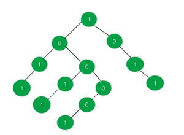

# 1 和 0 相等的最大子树

> 原文:[https://www . geeksforgeeks . org/最大-子树-具有-等于-不等于-1 和-0/](https://www.geeksforgeeks.org/largest-sub-tree-having-equal-no-of-1s-and-0s/)

给定一棵每个节点的值都为 **0** 或 **1** 的树，任务是在给定的树中找到具有相同数量 0 和 1 的子树的最大大小，如果不存在这样的子树，则打印 **-1** 。
**举例:**

> **输入:**
> 
> 
> 
> **输出:**6
> T3】输入:T5】
> 
> 
> 
> **输出:** -1

**进场:**

1.  将树的所有节点 **0** 更改为 **-1** 。现在问题简化为寻找节点数为 **0** 的子树和的最大尺寸。
2.  更新树的所有节点，使它们代表以当前节点为根的子树中所有节点的总和。
3.  现在找到根在一个值为 **0** 的节点上的最大子树的大小。如果没有找到这样的节点，则打印 **-1**

以下是上述方法的实现:

## C++

```
// C++ implementation of the approach
#include <iostream>
using namespace std;

// To store the size of the maximum sub-tree
// with equal number of 0's and 1's
int maxSize = -1;

// Represents a node of the tree
struct node {
    int data;
    struct node *right, *left;
};

// To create a new node
struct node* newnode(int key)
{
    struct node* temp = new node;
    temp->data = key;
    temp->right = NULL;
    temp->left = NULL;
    return temp;
}

// Function to perform inorder traversal on
// the tree and print the nodes in that order
void inorder(struct node* root)
{
    if (root == NULL)
        return;
    inorder(root->left);
    cout << root->data << endl;
    inorder(root->right);
}

// Function to return the maximum size of
// the sub-tree having equal number of 0's and 1's
int maxsize(struct node* root)
{
    int a = 0, b = 0;
    if (root == NULL)
        return 0;

    // Max size in the right sub-tree
    a = maxsize(root->right);

    // 1 is added for the parent
    a = a + 1;

    // Max size in the left sub-tree
    b = maxsize(root->left);

    // Total size of the tree
    // rooted at the current node
    a = b + a;

    // If the current tree has equal
    // number of 0's and 1's
    if (root->data == 0)

        // If the total size exceeds
        // the current max
        if (a >= maxSize)
            maxSize = a;

    return a;
}

// Function to update and return the sum
// of all the tree nodes rooted at
// the passed node
int sum_tree(struct node* root)
{

    if (root != NULL)

        // If current node's value is 0
        // then update it to -1
        if (root->data == 0)
            root->data = -1;

    int a = 0, b = 0;

    // If left child exists
    if (root->left != NULL)
        a = sum_tree(root->left);

    // If right child exists
    if (root->right != NULL)
        b = sum_tree(root->right);
    root->data += (a + b);

    return root->data;
}

// Driver code
int main()
{
    struct node* root = newnode(1);
    root->right = newnode(0);
    root->right->right = newnode(1);
    root->right->right->right = newnode(1);
    root->left = newnode(0);
    root->left->left = newnode(1);
    root->left->left->left = newnode(1);
    root->left->right = newnode(0);
    root->left->right->left = newnode(1);
    root->left->right->left->left = newnode(1);
    root->left->right->right = newnode(0);
    root->left->right->right->left = newnode(0);
    root->left->right->right->left->left = newnode(1);

    sum_tree(root);

    maxsize(root);

    cout << maxSize;

    return 0;
}
```

## Java 语言(一种计算机语言，尤用于创建网站)

```
// Java implementation of the approach
class GFG
{

// To store the size of the maximum sub-tree
// with equal number of 0's and 1's
static int maxSize = -1;

// Represents a node of the tree
static class node
{
    int data;
    node right, left;
};

// To create a new node
static node newnode(int key)
{
    node temp = new node();
    temp.data = key;
    temp.right = null;
    temp.left = null;
    return temp;
}

// Function to perform inorder traversal on
// the tree and print the nodes in that order
static void inorder(node root)
{
    if (root == null)
        return;
    inorder(root.left);
    System.out.print(root.data +"\n");
    inorder(root.right);
}

// Function to return the maximum size of
// the sub-tree having equal number of 0's and 1's
static int maxsize(node root)
{
    int a = 0, b = 0;
    if (root == null)
        return 0;

    // Max size in the right sub-tree
    a = maxsize(root.right);

    // 1 is added for the parent
    a = a + 1;

    // Max size in the left sub-tree
    b = maxsize(root.left);

    // Total size of the tree
    // rooted at the current node
    a = b + a;

    // If the current tree has equal
    // number of 0's and 1's
    if (root.data == 0)

        // If the total size exceeds
        // the current max
        if (a >= maxSize)
            maxSize = a;

    return a;
}

// Function to update and return the sum
// of all the tree nodes rooted at
// the passed node
static int sum_tree(node root)
{

    if (root != null)

        // If current node's value is 0
        // then update it to -1
        if (root.data == 0)
            root.data = -1;

    int a = 0, b = 0;

    // If left child exists
    if (root.left != null)
        a = sum_tree(root.left);

    // If right child exists
    if (root.right != null)
        b = sum_tree(root.right);
    root.data += (a + b);

    return root.data;
}

// Driver code
public static void main(String[] args)
{
    node root = newnode(1);
    root.right = newnode(0);
    root.right.right = newnode(1);
    root.right.right.right = newnode(1);
    root.left = newnode(0);
    root.left.left = newnode(1);
    root.left.left.left = newnode(1);
    root.left.right = newnode(0);
    root.left.right.left = newnode(1);
    root.left.right.left.left = newnode(1);
    root.left.right.right = newnode(0);
    root.left.right.right.left = newnode(0);
    root.left.right.right.left.left = newnode(1);

    sum_tree(root);

    maxsize(root);

    System.out.print(maxSize);
}
}

// This code is contributed by PrinciRaj1992
```

## C#

```
// C# implementation of the approach
using System;

class GFG
{

// To store the size of the maximum sub-tree
// with equal number of 0's and 1's
static int maxSize = -1;

// Represents a node of the tree
public class node
{
    public int data;
    public node right, left;
};

// To create a new node
static node newnode(int key)
{
    node temp = new node();
    temp.data = key;
    temp.right = null;
    temp.left = null;
    return temp;
}

// Function to perform inorder traversal on
// the tree and print the nodes in that order
static void inorder(node root)
{
    if (root == null)
        return;
    inorder(root.left);
    Console.Write(root.data +"\n");
    inorder(root.right);
}

// Function to return the maximum size of
// the sub-tree having equal number of 0's and 1's
static int maxsize(node root)
{
    int a = 0, b = 0;
    if (root == null)
        return 0;

    // Max size in the right sub-tree
    a = maxsize(root.right);

    // 1 is added for the parent
    a = a + 1;

    // Max size in the left sub-tree
    b = maxsize(root.left);

    // Total size of the tree
    // rooted at the current node
    a = b + a;

    // If the current tree has equal
    // number of 0's and 1's
    if (root.data == 0)

        // If the total size exceeds
        // the current max
        if (a >= maxSize)
            maxSize = a;

    return a;
}

// Function to update and return the sum
// of all the tree nodes rooted at
// the passed node
static int sum_tree(node root)
{

    if (root != null)

        // If current node's value is 0
        // then update it to -1
        if (root.data == 0)
            root.data = -1;

    int a = 0, b = 0;

    // If left child exists
    if (root.left != null)
        a = sum_tree(root.left);

    // If right child exists
    if (root.right != null)
        b = sum_tree(root.right);
    root.data += (a + b);

    return root.data;
}

// Driver code
public static void Main(String[] args)
{
    node root = newnode(1);
    root.right = newnode(0);
    root.right.right = newnode(1);
    root.right.right.right = newnode(1);
    root.left = newnode(0);
    root.left.left = newnode(1);
    root.left.left.left = newnode(1);
    root.left.right = newnode(0);
    root.left.right.left = newnode(1);
    root.left.right.left.left = newnode(1);
    root.left.right.right = newnode(0);
    root.left.right.right.left = newnode(0);
    root.left.right.right.left.left = newnode(1);

    sum_tree(root);

    maxsize(root);

    Console.Write(maxSize);
}
}

// This code is contributed by Rajput-Ji
```

## java 描述语言

```
<script>

// JavaScript implementation of the approach   
// To store the size of the maximum sub-tree
    // with equal number of 0's and 1's
    var maxSize = -1;

    // Represents a node of the tree
    class Node {
        constructor(val) {
            this.data = val;
            this.left = null;
            this.right = null;
        }
    }

    // To create a new node
     function newnode(key) {
        var temp = new Node();
        temp.data = key;
        temp.right = null;
        temp.left = null;
        return temp;
    }

    // Function to perform inorder traversal on
    // the tree and print the nodes in that order
    function inorder( root) {
        if (root == null)
            return;
        inorder(root.left);
        document.write(root.data + "\n");
        inorder(root.right);
    }

    // Function to return the maximum size of
    // the sub-tree having equal number of 0's and 1's
    function maxsize( root) {
        var a = 0, b = 0;
        if (root == null)
            return 0;

        // Max size in the right sub-tree
        a = maxsize(root.right);

        // 1 is added for the parent
        a = a + 1;

        // Max size in the left sub-tree
        b = maxsize(root.left);

        // Total size of the tree
        // rooted at the current node
        a = b + a;

        // If the current tree has equal
        // number of 0's and 1's
        if (root.data == 0)

            // If the total size exceeds
            // the current max
            if (a >= maxSize)
                maxSize = a;

        return a;
    }

    // Function to update and return the sum
    // of all the tree nodes rooted at
    // the passed node
    function sum_tree( root) {

        if (root != null)

            // If current node's value is 0
            // then update it to -1
            if (root.data == 0)
                root.data = -1;

        var a = 0, b = 0;

        // If left child exists
        if (root.left != null)
            a = sum_tree(root.left);

        // If right child exists
        if (root.right != null)
            b = sum_tree(root.right);
        root.data += (a + b);

        return root.data;
    }

    // Driver code

        var root = newnode(1);
        root.right = newnode(0);
        root.right.right = newnode(1);
        root.right.right.right = newnode(1);
        root.left = newnode(0);
        root.left.left = newnode(1);
        root.left.left.left = newnode(1);
        root.left.right = newnode(0);
        root.left.right.left = newnode(1);
        root.left.right.left.left = newnode(1);
        root.left.right.right = newnode(0);
        root.left.right.right.left = newnode(0);
        root.left.right.right.left.left = newnode(1);

        sum_tree(root);

        maxsize(root);

        document.write(maxSize);

// This code contributed by aashish1995

</script>
```

**Output:** 

```
6
```