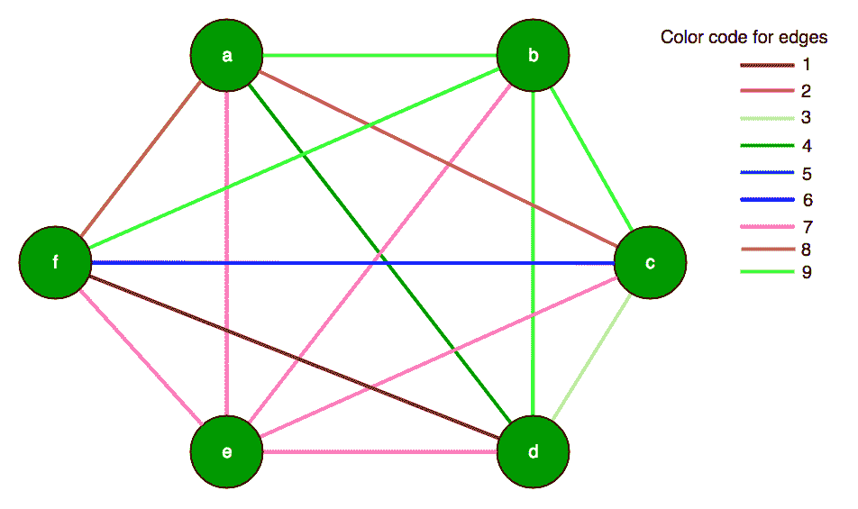
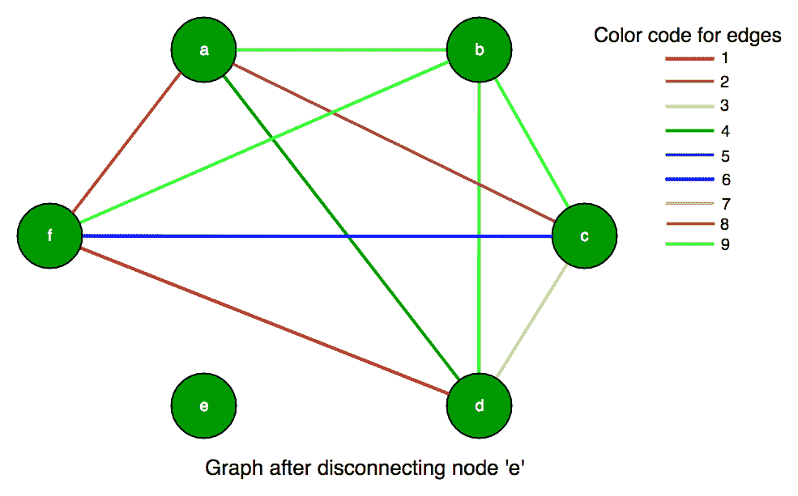

# 图顶点的最大子集，具有 2 种或更多颜色的边

> 原文:[https://www . geesforgeks . org/最大-子集-图-顶点-边-2-颜色/](https://www.geeksforgeeks.org/largest-subset-graph-vertices-edges-2-colors/)

给定一个有 **N 个**节点或顶点的无向图。图的边是有颜色的，找到最大的顶点子集，边有两种或两种以上的颜色。我们给出图为邻接矩阵 C[][]，其中 C[i][j]是从顶点 I 到顶点 j 的边的颜色，由于图是无向图，C[j][i]的值 C[i][j]是相同的。

我们把 C[i][i]定义为零，尽管不存在这样的边。即该图不包含自循环。

**示例:**

> **<u>例 1:</u>**
> 
> 输入:C[][]= {{0，1，2}，
> 
>                 {1, 0, 3},
> 
>                 {2, 3, 0}} 
> 
> 产出:3
> 
> 
> 
> **<u>例 2:</u>**
> 
> 输入:C[][]= {{0，1，1}，
> 
>                 {1, 0, 3},
> 
>                 {1, 3, 0}} 
> 
> 输出:0
> 
> 

由于图形是完整的，每个边可以是 n*(n-1)/2 +1 种不同颜色中的一种。这些颜色标记为从 0 到 n*(n-1)/2，包括 0 和 2。但并不是所有这些 n*(n-1)/2 +1 的颜色都需要用到。即，两个不同的边缘可能具有相同的颜色。

如果一个顶点的所有邻居都是同一个颜色，我们就称它为“坏的”。显然，我们的子集中不能有这样的坏顶点，所以从图中移除这样的坏顶点。这可能会引入更多的坏顶点，但是我们可以继续重复这个过程，直到找到一个没有坏顶点的子集。所以，最后，我们应该通过一个没有坏顶点的图来保持，这意味着我们子集的每个顶点都至少有两条与其他相邻顶点不同的颜色边。

**示例:**
<u>输入:</u>
让 C[6][6]:
{{0，9，2，4，7，8}，
{9，0，9，9，7，9}，
{2，9，0，3，7，6}，
{4，9，3，0，7，1}，
{7，7，7，0，7}，
{8，9，6



<u>第一步:</u>首先，我们可以看到第 5 行(节点‘e’)只包含 7，这意味着节点‘e’通过具有颜色代码 7 的边连接，因此它没有一个以上的颜色边，因此我们必须从子集中移除 5。现在，我们的图将只包含 5 个顶点，如下所示:
C[5][5]:
{{0，9，2，4，8}，
{9，0，9，9，9}，
{2，9，0，3，6}，
{4，9，3，0，1}，
{8，9，6，1，0 } }；



<u>第二步:</u>此外，我们可以看到第 2 行(节点‘b’)也不包含超过 1 个颜色边，所以我们也应该删除第 2 行和第 2 列。这导致我们的新图形为:
C[4][4]:
{{0，2，4，8}，
{2，0，3，6}，
{4，3，0，1}，
{8，6，1，0 } }；


<u>第三步:</u>现在，我们可以看到每个顶点都有 1 条以上不同颜色的边。所以，子集的顶点总数是 4。

## C++

```
// C++ program to find size of subset of graph vertex
// such that each vertex has more than 1 color edges
#include <bits/stdc++.h>
using namespace std;

// Number of vertices
const int N = 6;

// function to calculate max subset size
int subsetGraph(int C[][N])
{
    // set for number of vertices
    set<int> vertices;
    for (int i = 0; i < N; ++i)
        vertices.insert(i);

    // loop for deletion of vertex from set
    while (!vertices.empty())
    {
        // if subset has only 1 vertex return 0
        if (vertices.size() == 1)
            return 1;

        // for each vertex iterate and keep removing
        // a vertex while we find a vertex with all
        // edges of same color.
        bool someone_removed = false;
        for (int x : vertices)
        {
            // note down different color values
            // for each vertex
            set<int> values;
            for (int y : vertices)
                if (y != x)
                    values.insert(C[x][y]);

            // if only one color is found
            // erase that vertex (bad vertex)
            if (values.size() == 1)
            {
                vertices.erase(x);
                someone_removed = true;
                break;
            }
        }

        // If no vertex was removed in the
        // above loop.
        if (!someone_removed)
            break;
    }

    return (vertices.size());
}

// Driver program
int main()
{
    int C[][N] = {{0, 9, 2, 4, 7, 8},
        {9, 0, 9, 9, 7, 9},
        {2, 9, 0, 3, 7, 6},
        {4, 9, 3, 0, 7, 1},
        {7, 7, 7, 7, 0, 7},
        {8, 9, 6, 1, 7, 0}
    };
    cout << subsetGraph(C);
    return 0;
}
```

## Java 语言(一种计算机语言，尤用于创建网站)

```
// Java program to find size of 
// subset of graph vertex such that 
// each vertex has more than 1 color edges 
import java.util.*;

class GFG 
{

    // Number of vertices 
    static int N = 6;

    // function to calculate max subset size 
    static int subsetGraph(int C[][])
    {
        // set for number of vertices 
        HashSet<Integer> vertices = new HashSet<>();
        for (int i = 0; i < N; ++i) 
        {
            vertices.add(i);
        }

        // loop for deletion of vertex from set 
        while (!vertices.isEmpty())
        {

            // if subset has only 1 vertex return 0 
            if (vertices.size() == 1)
            {
                return 1;
            }

            // for each vertex iterate and keep removing 
            // a vertex while we find a vertex with all 
            // edges of same color. 
            boolean someone_removed = false;
            for (int x : vertices) 
            {

                // note down different color values 
                // for each vertex 
                HashSet<Integer> values = new HashSet<>();
                for (int y : vertices) 
                {
                    if (y != x) 
                    {
                        values.add(C[x][y]);
                    }
                }

                // if only one color is found 
                // erase that vertex (bad vertex) 
                if (values.size() == 1) 
                {
                    vertices.remove(x);
                    someone_removed = true;
                    break;
                }
            }

            // If no vertex was removed in the 
            // above loop. 
            if (!someone_removed) 
            {
                break;
            }
        }

        return (vertices.size());
    }

    // Driver code 
    public static void main(String[] args)
    {
        int C[][] = {{0, 9, 2, 4, 7, 8},
        {9, 0, 9, 9, 7, 9},
        {2, 9, 0, 3, 7, 6},
        {4, 9, 3, 0, 7, 1},
        {7, 7, 7, 7, 0, 7},
        {8, 9, 6, 1, 7, 0}
        };
        System.out.println(subsetGraph(C));
    }
} 

// This code has been contributed by 29AjayKumar
```

## 蟒蛇 3

```
# Python3 program to find size of subset 
# of graph vertex such that each vertex
# has more than 1 color edges

# function to calculate max subset size 
def subsetGraph(C):
    global N

    # set for number of vertices 
    vertices = set()
    for i in range(N):
        vertices.add(i) 

    # loop for deletion of vertex from set 
    while (len(vertices) != 0):

        # if subset has only 1 vertex return 0 
        if (len(vertices) == 1): 
            return 1

        # for each vertex iterate and keep removing 
        # a vertex while we find a vertex with all 
        # edges of same color. 
        someone_removed = False
        for x in vertices:

            # note down different color values 
            # for each vertex 
            values = set()
            for y in vertices:
                if (y != x): 
                    values.add(C[x][y]) 

            # if only one color is found 
            # erase that vertex (bad vertex) 
            if (len(values) == 1):
                vertices.remove(x) 
                someone_removed = True
                break

        # If no vertex was removed in the 
        # above loop. 
        if (not someone_removed): 
            break

    return len(vertices)

# Driver Code

# Number of vertices 
N = 6
C = [[0, 9, 2, 4, 7, 8], 
     [9, 0, 9, 9, 7, 9],
     [2, 9, 0, 3, 7, 6],
     [4, 9, 3, 0, 7, 1],
     [7, 7, 7, 7, 0, 7],
     [8, 9, 6, 1, 7, 0]]
print(subsetGraph(C))

# This code is contributed by PranchalK
```

## C#

```
// C# program to find size of 
// subset of graph vertex such that 
// each vertex has more than 1 color edges 
using System;
using System.Collections.Generic; 

class GFG 
{

    // Number of vertices 
    static int N = 6;

    // function to calculate max subset size 
    static int subsetGraph(int [,]C)
    {
        // set for number of vertices 
        HashSet<int> vertices = new HashSet<int>();
        for (int i = 0; i < N; ++i) 
        {
            vertices.Add(i);
        }

        // loop for deletion of vertex from set 
        while (vertices.Count != 0)
        {

            // if subset has only 1 vertex return 0 
            if (vertices.Count == 1)
            {
                return 1;
            }

            // for each vertex iterate and keep removing 
            // a vertex while we find a vertex with all 
            // edges of same color. 
            Boolean someone_removed = false;
            foreach (int x in vertices) 
            {

                // note down different color values 
                // for each vertex 
                HashSet<int> values = new HashSet<int>();
                foreach (int y in vertices) 
                {
                    if (y != x) 
                    {
                        values.Add(C[x, y]);
                    }
                }

                // if only one color is found 
                // erase that vertex (bad vertex) 
                if (values.Count == 1) 
                {
                    vertices.Remove(x);
                    someone_removed = true;
                    break;
                }
            }

            // If no vertex was removed in the 
            // above loop. 
            if (!someone_removed) 
            {
                break;
            }
        }

        return (vertices.Count);
    }

    // Driver code 
    public static void Main(String[] args)
    {
        int [,]C = {{0, 9, 2, 4, 7, 8},
                    {9, 0, 9, 9, 7, 9},
                    {2, 9, 0, 3, 7, 6},
                    {4, 9, 3, 0, 7, 1},
                    {7, 7, 7, 7, 0, 7},
                    {8, 9, 6, 1, 7, 0}};
        Console.WriteLine(subsetGraph(C));
    }
}

// This code is contributed by Rajput-Ji
```

## java 描述语言

```
<script>

// Javascript program to find size of 
// subset of graph vertex such that 
// each vertex has more than 1 color edges 

// Number of vertices 
let N = 6;

// Function to calculate max subset size 
function subsetGraph(C)
{

    // Set for number of vertices 
    let vertices = new Set();
    for(let i = 0; i < N; ++i) 
    {
        vertices.add(i);
    }

    // Loop for deletion of vertex from set 
    while (vertices.size != 0)
    {

        // If subset has only 1 vertex return 0 
        if (vertices.size == 1)
        {
            return 1;
        }

        // For each vertex iterate and keep removing 
        // a vertex while we find a vertex with all 
        // edges of same color. 
        let someone_removed = false;

        for(let x of vertices.values()) 
        {

            // Note down different color values 
            // for each vertex 
            let values = new Set();
            for(let y of vertices.values()) 
            {
                if (y != x) 
                {
                    values.add(C[x][y]);
                }
            }

            // If only one color is found 
            // erase that vertex (bad vertex) 
            if (values.size == 1) 
            {
                vertices.delete(x);
                someone_removed = true;
                break;
            }
        }

        // If no vertex was removed in the 
        // above loop. 
        if (!someone_removed) 
        {
            break;
        }
    }
    return (vertices.size);
}

// Driver code     
let C = [ [ 0, 9, 2, 4, 7, 8 ],
          [ 9, 0, 9, 9, 7, 9 ],
          [ 2, 9, 0, 3, 7, 6 ],
          [ 4, 9, 3, 0, 7, 1 ],
          [ 7, 7, 7, 7, 0, 7 ],
          [ 8, 9, 6, 1, 7, 0 ] ];

document.write(subsetGraph(C));

// This code is contributed by rag2127

</script>
```

**输出:**

```
4
```

本文由[**Shivam Pradhan(anuj _ charm)**](https://www.facebook.com/anuj.charm)供稿。如果你喜欢 GeeksforGeeks 并想投稿，你也可以使用[write.geeksforgeeks.org](https://write.geeksforgeeks.org)写一篇文章或者把你的文章邮寄到 review-team@geeksforgeeks.org。看到你的文章出现在极客博客主页上，帮助其他极客。
如果发现有不正确的地方，或者想分享更多关于上述话题的信息，请写评论。