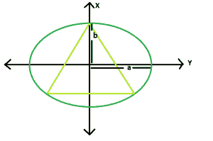

# 椭圆内接的最大三角形

> 原文:[https://www . geesforgeks . org/最大椭圆内接三角形/](https://www.geeksforgeeks.org/largest-triangle-that-can-be-inscribed-in-an-ellipse/)

给定一个椭圆，长轴长度为 **2a** & **2b** ，任务是找出其中可内接的最大三角形的面积。
**例:**

```
Input: a = 4, b = 2
Output: 10.3923

Input: a = 5, b = 3
Output: 10.8253
```



**逼近:**所以我们知道椭圆只是圆的缩放阴影。让我们找到比例因子。

> **x^2/a^2 + y^2/b^2 = 1** 是一个椭圆。将此改写为:
> **(y*(a/b))^2+x^2 = a^2**

这只是一个半径 **a** 垂直缩小的圆(认为光从顶部以一定角度落下)，垂直因子是 **a/b** 。椭圆中最大的三角形是圆中最大三角形的放大版本。用一点几何图形，并考虑到对称性，我们可以理解，最大的这样的三角形是等边三角形。它的边将是 **√3a** ，面积将是 **(3√3)a^2/4**
将其转换为椭圆术语–我们将水平尺寸放大一倍 **a/b** ，椭圆中最大三角形的面积为

> **A = (3√3)a^2/4b**

以下是上述方法的实现:

## C++

```
// C++ Program to find the biggest triangle
// which can be inscribed within the ellipse
#include <bits/stdc++.h>
using namespace std;

// Function to find the area
// of the triangle
float trianglearea(float a, float b)
{

    // a and b cannot be negative
    if (a < 0 || b < 0)
        return -1;

    // area of the triangle
    float area = (3 * sqrt(3) * pow(a, 2)) / (4 * b);

    return area;
}

// Driver code
int main()
{
    float a = 4, b = 2;
    cout << trianglearea(a, b) << endl;

    return 0;
}
```

## Java 语言(一种计算机语言，尤用于创建网站)

```
//Java Program to find the biggest triangle
//which can be inscribed within the ellipse

public class GFG {

    //Function to find the area
    //of the triangle
    static float trianglearea(float a, float b)
    {

     // a and b cannot be negative
     if (a < 0 || b < 0)
         return -1;

     // area of the triangle
     float area = (float)(3 * Math.sqrt(3) * Math.pow(a, 2)) / (4 * b);

     return area;
    }

    //Driver code
    public static void main(String[] args) {

        float a = 4, b = 2;
         System.out.println(trianglearea(a, b));
    }
}
```

## 蟒蛇 3

```
# Python 3 Program to find the biggest triangle
# which can be inscribed within the ellipse

from math import *

# Function to find the area
# of the triangle
def trianglearea(a, b) :

    # a and b cannot be negative
    if a < 0 or b < 0 :
        return -1

    # area of the triangle
    area = (3 * sqrt(3) * pow(a, 2)) / (4 * b)

    return area

# Driver Code
if __name__ == "__main__" :

    a, b = 4, 2
    print(round(trianglearea(a, b),4))

# This code is contributed by ANKITRAI1
```

## C#

```
// C# Program to find the biggest
// triangle which can be inscribed
// within the ellipse
using System;

class GFG
{

// Function to find the area
// of the triangle
static float trianglearea(float a, float b)
{

// a and b cannot be negative
if (a < 0 || b < 0)
    return -1;

// area of the triangle
float area = (float)(3 * Math.Sqrt(3) *
                         Math.Pow(a, 2)) / (4 * b);

return area;
}

// Driver code
public static void Main()
{
    float a = 4, b = 2;
    Console.WriteLine(trianglearea(a, b));
}
}

// This code is contributed
// by Akanksha Rai(Abby_akku)
```

## 服务器端编程语言（Professional Hypertext Preprocessor 的缩写）

```
<?php
// PHP Program to find the biggest
// triangle which can be inscribed
// within the ellipse

// Function to find the area
// of the triangle
function trianglearea($a, $b)
{

    // a and b cannot be negative
    if ($a < 0 || $b < 0)
        return -1;

    // area of the triangle
    $area = (3 * sqrt(3) *
            pow($a, 2)) / (4 * $b);

    return $area;
}

// Driver code
$a = 4;
$b = 2;
echo trianglearea($a, $b);

// This code is contributed
// by Shivi_Aggarwal
?>
```

## java 描述语言

```
<script>

// javascript Program to find the biggest triangle
// which can be inscribed within the ellipse

// Function to find the area
// of the triangle
function trianglearea(a , b)
{

 // a and b cannot be negative
 if (a < 0 || b < 0)
     return -1;

 // area of the triangle
 var area = (3 * Math.sqrt(3) * Math.pow(a, 2)) / (4 * b);

 return area;
}

// Driver code

var a = 4, b = 2;
document.write(trianglearea(a, b).toFixed(4));

// This code contributed by shikhasingrajput

</script>
```

**Output:** 

```
10.3923
```