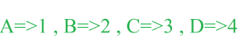

# 拉丁字母密码

> 原文:[https://www . geesforgeks . org/Latin-alphabet-cipher-encryption/](https://www.geeksforgeeks.org/latin-alphabet-cipher-encryption/)

拉丁字母密码加密技术是最早和最简单的数据加密技术之一。这只是一种替换密码技术，也就是说，给定文本的每个字母都被按字母顺序表示的相应数字所替换。例如，我们给了一个字符串“大家好”，那么它的拉丁密码加密将是“8 5 12 12 15 5 22 5 18 25 15 14 5”。



**示例:**

```
Input : geeksforgeeks
Output : Encrypted Code using Latin Alphabet
         7 5 5 11 19 6 15 18 7 5 5 11 19 

Input : hello everyone
Output : Encrypted Code using Latin Alphabet
         8 5 12 12 15  5 22 5 18 25 15 14 5  
```

先决条件: [isalpha()和 isdigit()函数在 C/C++中使用示例](https://www.geeksforgeeks.org/isalpha-isdigit-functions-c-example/)
下面是将给定字符串转换为其拉丁字母密码的程序:

## C++

```
// Latin Alphabet Cipher Encryption header files
#include <bits/stdc++.h>

// function for calculating the encryption
void cipher(char str[])
{
    for (int i = 0; str[i] != '\0'; i++) {
        if (isalpha(str[i]) == 0 && str[i] != ' ') {
            printf("Enter only alphabets and space\n");
            return;
        }
    }

    printf("Encrypted Code using Latin Alphabet\n");
    for (int i = 0; str[i] != '\0'; i++) {

        if (str[i] >= 'A' && str[i] <= 'Z')
            printf("%d ", str[i] - 'A' + 1);

        else if (str[i] >= 'a' && str[i] <= 'z')
            printf("%d ", str[i] - 'a' + 1);
        if (str[i] == ' ')
            printf("%c", str[i]);
    }
    printf("\n");
}

// driver code
int main()
{
    char str[] = "geeksforgeeks";
    cipher(str);
    return 0;
}
```

## Java 语言(一种计算机语言，尤用于创建网站)

```
// Java program to demonstrate
// Latin Alphabet Cipher

class LatinCipher
{
    // function for calculating the encryption
    static void cipher(String str)
    {
        for (int i = 0; i < str.length(); i++)
        {
            if (!Character.isLetter(str.charAt(i)) &&
            str.charAt(i) != ' ')
            {
                System.out.println("Enter only alphabets and space");
                return;
            }
        }

        System.out.println("Encrypted Code using Latin Alphabet");
        for (int i = 0; i < str.length(); i++)
        {
            if (str.charAt(i) >= 'A' && str.charAt(i) <= 'Z')
            {
                System.out.print(str.charAt(i) - 'A' + 1 + " ");
            }
            else if (str.charAt(i) >= 'a' && str.charAt(i) <= 'z')
            {
                System.out.print(str.charAt(i) - 'a' + 1 + " ");
            }
            if (str.charAt(i) == ' ')
                System.out.print(str.charAt(i));

        }
        System.out.println();
    }

    // Driver Code
    public static void main(String[] args)
    {
        String str = "geeksforgeeks";
        cipher(str);
    }
}

// This code is contributed by Vivekkumar Singh
```

## 蟒蛇 3

```
# Python program to demonstrate
# Latin Alphabet Cipher

# function for calculating the encryption
def cipher(str):

    for i in range(len(str)):
        if str[i].isalpha() == 0 and str[i] != " ":
            print("Enter only alphabets and space")
            return

    print("Encrypted Code using Latin Alphabet")
    for i in range(len(str)):

        if str[i] >= "A" and str[i] <= "Z":
            print(ord(str[i])-ord("A")+1, end=" ")

        elif str[i] >= "a" and str[i] <= 'z':
            print(ord(str[i])-ord("a")+1, end=" ")

        if str[i] == " ":
            print(str[i])

    print()

# Driver Code
if __name__ == "__main__":
    str = "geeksforgeeks"
    cipher(str)

# This code is contributed by
# sanjeev2552
```

## C#

```
// C# program to demonstrate
// Latin Alphabet Cipher
using System;

public class LatinCipher
{
    // function for calculating the encryption
    static void cipher(String str)
    {
        for (int i = 0; i < str.Length; i++)
        {
            if (!char.IsLetter(str[i]) &&
            str[i] != ' ')
            {
                Console.WriteLine("Enter only alphabets and space");
                return;
            }
        }

        Console.WriteLine("Encrypted Code using Latin Alphabet");
        for (int i = 0; i < str.Length; i++)
        {
            if (str[i] >= 'A' && str[i] <= 'Z')
            {
                Console.Write(str[i] - 'A' + 1 + " ");
            }
            else if (str[i] >= 'a' && str[i] <= 'z')
            {
                Console.Write(str[i] - 'a' + 1 + " ");
            }
            if (str[i] == ' ')
                Console.Write(str[i]);

        }
        Console.WriteLine();
    }

    // Driver Code
    public static void Main(String[] args)
    {
        String str = "geeksforgeeks";
        cipher(str);
    }
}

// This code has been contributed by 29AjayKumar
```

## 服务器端编程语言（Professional Hypertext Preprocessor 的缩写）

```
<?php
// Latin Alphabet Cipher
// Encryption header files

// function for calculating
// the encryption
function cipher($str)
{
        if (!ctype_alpha($str))
        {
            printf("Enter only " +
                   "alphabets and space\n");
            return;
        }

    printf("Encrypted Code using ");
    printf("Latin Alphabet\n");
    for ($i = 0; $i < strlen($str); $i++)
    {
        if ($str[$i] >= 'A' &&
            $str[$i] <= 'Z')
            echo (ord($str[$i]) -
                    65 + 1). " ";

        else if ($str[$i] >= 'a' &&
                 $str[$i] <= 'z')
            echo (ord($str[$i]) -
                    97 + 1). " ";

    }
    echo "\n";
}

// Driver Code
$str = "geeksforgeeks";
cipher($str);

// This code is contributed by mits.
?>
```

## java 描述语言

```
<script>
    // JavaScript program to demonstrate
    // Latin Alphabet Cipher
    // function for calculating the encryption
    function cipher(str) {
        for (var i = 0; i < str.length; i++) {
            if (!isLetter(str[i]) && str[i] !== " ") {
                document.write("Enter only alphabets and space");
                return;
              }
        }

        document.write("Encrypted Code using Latin Alphabet <br>");
            for (var i = 0; i < str.length; i++) {
                  if (str[i] >= "A" && str[i] <= "Z") {
                    document.write(str[i].charCodeAt(0)
                                   - "A".charCodeAt(0) + 1 + "");
                  }
                  else if (str[i] >= "a" && str[i] <= "z") {
                    document.write(str[i].charCodeAt(0)
                               - "a".charCodeAt(0) + 1 + " ");
                  }
                  if (str[i] == " ")
                    document.write(str[i]);
            }
            document.write("<br>");
      }

      //check isLetter
      function isLetter(str) {
            return str.length === 1 && str.match(/[a-z]/i);
      }

      // Driver Code
      var str = "geeksforgeeks";
      cipher(str);
</script>
```

**Output:** 

```
Encrypted Code using Latin Alphabet
7 5 5 11 19 6 15 18 7 5 5 11 19
```