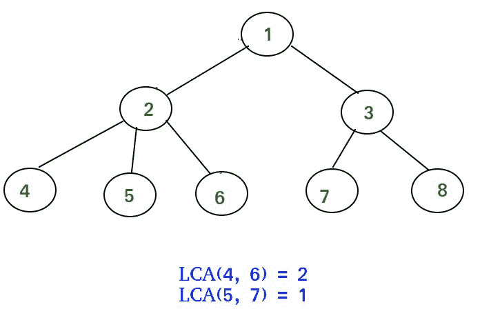

# 一般树或 n 元树的生命周期评价(稀疏矩阵动态规划方法)

> 原文:[https://www . geesforgeks . org/LCA-for-general-or-n-ary-trees-稀疏矩阵-dp-approach-onlogn-ologn/](https://www.geeksforgeeks.org/lca-for-general-or-n-ary-trees-sparse-matrix-dp-approach-onlogn-ologn/)

在之前的帖子中，我们已经讨论了如何计算二叉树和二叉查找树([这个](https://www.geeksforgeeks.org/lowest-common-ancestor-binary-tree-set-1/)、[这个](https://www.geeksforgeeks.org/lowest-common-ancestor-in-a-binary-tree-set-2-using-parent-pointer/)和[这个](https://www.geeksforgeeks.org/find-lca-in-binary-tree-using-rmq/))的最低共同祖先(LCA)。现在我们来看一个可以计算任意树(不仅仅是二叉树)的 LCA 的方法。在我们的方法中，我们使用了动态规划和稀疏矩阵方法。当需要回答一棵树的多个生命周期评价查询时，这种方法非常方便快捷。



先决条件:–
1)[DFS](https://www.geeksforgeeks.org/depth-first-traversal-for-a-graph/)T3】2)基础 DP 知识([本](https://www.geeksforgeeks.org/dynamic-programming-set-1/)和[本](https://www.geeksforgeeks.org/dynamic-programming-set-2-optimal-substructure-property/) )
3) [范围最小查询(平方根分解和稀疏表)](https://www.geeksforgeeks.org/range-minimum-query-for-static-array/)

**天真方法:- O(n)**
这种一般树 LCA 计算的天真方法将与二叉树 LCA 计算的天真方法相同(这种天真方法在这里已经很好地描述了)。

天真方法的实现如下所示

## C++

```
/* Program to find LCA of n1 and n2 using one DFS on
   the Tree */
#include<bits/stdc++.h>
using namespace std;

// Maximum number of nodes is 100000 and nodes are
// numbered from 1 to 100000
#define MAXN 100001

vector < int > tree[MAXN];
int path[3][MAXN]; // storing root to node path

// storing the path from root to node
void dfs(int cur, int prev, int pathNumber, int ptr,
                             int node, bool &flag)
{
    for (int i=0; i<tree[cur].size(); i++)
    {
        if (tree[cur][i] != prev and !flag)
        {
            // pushing current node into the path
            path[pathNumber][ptr] = tree[cur][i];
            if (tree[cur][i] == node)
            {
                // node found
                flag = true;

                // terminating the path
                path[pathNumber][ptr+1] = -1;
                return;
            }
            dfs(tree[cur][i], cur, pathNumber, ptr+1,
                                        node, flag);
        }
    }
}

// This Function compares the path from root to 'a' & root
// to 'b' and returns LCA of a and b. Time Complexity : O(n)
int LCA(int a, int b)
{
    // trivial case
    if (a == b)
        return a;

    // setting root to be first element in path
    path[1][0] = path[2][0] = 1;

    // calculating path from root to a
    bool flag = false;
    dfs(1, 0, 1, 1, a, flag);

    // calculating path from root to b
    flag = false;
    dfs(1, 0, 2, 1, b, flag);

    // runs till path 1 & path 2 mathches
    int i = 0;
    while (path[1][i] == path[2][i])
        i++;

    // returns the last matching node in the paths
    return path[1][i-1];
}

void addEdge(int a,int b)
{
    tree[a].push_back(b);
    tree[b].push_back(a);
}

// Driver code
int main()
{
    int n = 8; // Number of nodes
    addEdge(1,2);
    addEdge(1,3);
    addEdge(2,4);
    addEdge(2,5);
    addEdge(2,6);
    addEdge(3,7);
    addEdge(3,8);

    cout << "LCA(4, 7) = " << LCA(4,7) << endl;
    cout << "LCA(4, 6) = " << LCA(4,6) << endl;
    return 0;
}
```

## Java 语言(一种计算机语言，尤用于创建网站)

```
/* Program to find LCA of n1 and n2 using one DFS on
the Tree */

import java.util.*;

class GFG
{

    // Maximum number of nodes is 100000 and nodes are
    // numbered from 1 to 100000
    static final int MAXN = 100001;

    static Vector<Integer>[] tree = new Vector[MAXN];
    static int[][] path = new int[3][MAXN]; // storing root to node path
    static boolean flag;

    // storing the path from root to node
    static void dfs(int cur, int prev, int pathNumber, int ptr, int node)
    {
        for (int i = 0; i < tree[cur].size(); i++)
        {
            if (tree[cur].get(i) != prev && !flag)
            {
                // pushing current node into the path
                path[pathNumber][ptr] = tree[cur].get(i);
                if (tree[cur].get(i) == node)
                {
                    // node found
                    flag = true;

                    // terminating the path
                    path[pathNumber][ptr + 1] = -1;
                    return;
                }
                dfs(tree[cur].get(i), cur, pathNumber, ptr + 1, node);
            }
        }
    }

    // This Function compares the path from root to 'a' & root
    // to 'b' and returns LCA of a and b. Time Complexity : O(n)
    static int LCA(int a, int b)
    {
        // trivial case
        if (a == b)
            return a;

        // setting root to be first element in path
        path[1][0] = path[2][0] = 1;

        // calculating path from root to a
        flag = false;
        dfs(1, 0, 1, 1, a);

        // calculating path from root to b
        flag = false;
        dfs(1, 0, 2, 1, b);

        // runs till path 1 & path 2 mathches
        int i = 0;
        while (i < MAXN && path[1][i] == path[2][i])
            i++;

        // returns the last matching node in the paths
        return path[1][i - 1];
    }

    static void addEdge(int a, int b)
    {
        tree[a].add(b);
        tree[b].add(a);
    }

    // Driver code
    public static void main(String[] args)
    {
        for (int i = 0; i < MAXN; i++)
            tree[i] = new Vector<Integer>();

        // Number of nodes
        addEdge(1, 2);
        addEdge(1, 3);
        addEdge(2, 4);
        addEdge(2, 5);
        addEdge(2, 6);
        addEdge(3, 7);
        addEdge(3, 8);

        System.out.print("LCA(4, 7) = " + LCA(4, 7) + "\n");
        System.out.print("LCA(4, 6) = " + LCA(4, 6) + "\n");
    }
}

// This code is contributed by 29AjayKumar
```

## 蟒蛇 3

```
# Python3 program to find LCA of n1 and
# n2 using one DFS on the Tree

# Maximum number of nodes is 100000 and
# nodes are numbered from 1 to 100000
MAXN = 100001

tree = [0] * MAXN
for i in range(MAXN):
    tree[i] = []

# Storing root to node path
path = [0] * 3
for i in range(3):
    path[i] = [0] * MAXN

flag = False

# Storing the path from root to node
def dfs(cur: int, prev: int, pathNumber: int,
        ptr: int, node: int) -> None:

    global tree, path, flag

    for i in range(len(tree[cur])):
        if (tree[cur][i] != prev and not flag):

            # Pushing current node into the path
            path[pathNumber][ptr] = tree[cur][i]

            if (tree[cur][i] == node):

                # Node found
                flag = True

                # Terminating the path
                path[pathNumber][ptr + 1] = -1
                return

            dfs(tree[cur][i], cur, pathNumber,
                ptr + 1, node)

# This Function compares the path from root
# to 'a' & root to 'b' and returns LCA of
# a and b. Time Complexity : O(n)
def LCA(a: int, b: int) -> int:

    global flag

    # Trivial case
    if (a == b):
        return a

    # Setting root to be first element
    # in path
    path[1][0] = path[2][0] = 1

    # Calculating path from root to a
    flag = False
    dfs(1, 0, 1, 1, a)

    # Calculating path from root to b
    flag = False
    dfs(1, 0, 2, 1, b)

    # Runs till path 1 & path 2 mathches
    i = 0
    while (path[1][i] == path[2][i]):
        i += 1

    # Returns the last matching
    # node in the paths
    return path[1][i - 1]

def addEdge(a: int, b: int) -> None:

    tree[a].append(b)
    tree[b].append(a)

# Driver code
if __name__ == "__main__":

    n = 8

    # Number of nodes
    addEdge(1, 2)
    addEdge(1, 3)
    addEdge(2, 4)
    addEdge(2, 5)
    addEdge(2, 6)
    addEdge(3, 7)
    addEdge(3, 8)

    print("LCA(4, 7) = {}".format(LCA(4, 7)))
    print("LCA(4, 6) = {}".format(LCA(4, 6)))

# This code is contributed by sanjeev2552
```

## C#

```
/* C# Program to find LCA of n1 and n2 using one DFS on
the Tree */
using System;
using System.Collections.Generic;

class GFG
{

    // Maximum number of nodes is 100000 and nodes are
    // numbered from 1 to 100000
    static readonly int MAXN = 100001;

    static List<int>[] tree = new List<int>[MAXN];
    static int[,] path = new int[3, MAXN]; // storing root to node path
    static bool flag;

    // storing the path from root to node
    static void dfs(int cur, int prev, int pathNumber, int ptr, int node)
    {
        for (int i = 0; i < tree[cur].Count; i++)
        {
            if (tree[cur][i] != prev && !flag)
            {
                // pushing current node into the path
                path[pathNumber,ptr] = tree[cur][i];
                if (tree[cur][i] == node)
                {
                    // node found
                    flag = true;

                    // terminating the path
                    path[pathNumber, ptr + 1] = -1;
                    return;
                }
                dfs(tree[cur][i], cur, pathNumber, ptr + 1, node);
            }
        }
    }

    // This Function compares the path from root to 'a' & root
    // to 'b' and returns LCA of a and b. Time Complexity : O(n)
    static int LCA(int a, int b)
    {
        // trivial case
        if (a == b)
            return a;

        // setting root to be first element in path
        path[1, 0] = path[2, 0] = 1;

        // calculating path from root to a
        flag = false;
        dfs(1, 0, 1, 1, a);

        // calculating path from root to b
        flag = false;
        dfs(1, 0, 2, 1, b);

        // runs till path 1 & path 2 mathches
        int i = 0;
        while (i < MAXN && path[1, i] == path[2, i])
            i++;

        // returns the last matching node in the paths
        return path[1, i - 1];
    }

    static void addEdge(int a, int b)
    {
        tree[a].Add(b);
        tree[b].Add(a);
    }

    // Driver code
    public static void Main(String[] args)
    {
        for (int i = 0; i < MAXN; i++)
            tree[i] = new List<int>();

        // Number of nodes
        addEdge(1, 2);
        addEdge(1, 3);
        addEdge(2, 4);
        addEdge(2, 5);
        addEdge(2, 6);
        addEdge(3, 7);
        addEdge(3, 8);

        Console.Write("LCA(4, 7) = " + LCA(4, 7) + "\n");
        Console.Write("LCA(4, 6) = " + LCA(4, 6) + "\n");
    }
}

// This code is contributed by Rajput-Ji
```

## java 描述语言

```
<script>
/* Program to find LCA of n1 and n2 using one DFS on
the Tree */

// Maximum number of nodes is 100000 and nodes are
    // numbered from 1 to 100000
let MAXN = 100001;

let tree = new Array(MAXN);

let path = new Array(3);

for(let i = 0; i < 3; i++)
{
    path[i] = new Array(MAXN);
    for(let j = 0; j < MAXN; j++)
    {
        path[i][j] = 0;
    }
}

let flag;

/// storing the path from root to node
function dfs(cur,prev,pathNumber,ptr,node)
{
    for (let i = 0; i < tree[cur].length; i++)
        {
            if (tree[cur][i] != prev && !flag)
            {
                // pushing current node into the path
                path[pathNumber][ptr] = tree[cur][i];
                if (tree[cur][i] == node)
                {
                    // node found
                    flag = true;

                    // terminating the path
                    path[pathNumber][ptr + 1] = -1;
                    return;
                }
                dfs(tree[cur][i], cur, pathNumber, ptr + 1, node);
            }
        }
}

// This Function compares the path from root to 'a' & root
    // to 'b' and returns LCA of a and b. Time Complexity : O(n)
function LCA(a,b)
{
    // trivial case
        if (a == b)
            return a;

        // setting root to be first element in path
        path[1][0] = path[2][0] = 1;

        // calculating path from root to a
        flag = false;
        dfs(1, 0, 1, 1, a);

        // calculating path from root to b
        flag = false;
        dfs(1, 0, 2, 1, b);

        // runs till path 1 & path 2 mathches
        let i = 0;
        while (i < MAXN && path[1][i] == path[2][i])
            i++;

        // returns the last matching node in the paths
        return path[1][i - 1];
}

function addEdge(a,b)
{
    tree[a].push(b);
    tree[b].push(a);
}

// Driver code
for (let i = 0; i < MAXN; i++)
    tree[i] = [];

// Number of nodes
addEdge(1, 2);
addEdge(1, 3);
addEdge(2, 4);
addEdge(2, 5);
addEdge(2, 6);
addEdge(3, 7);
addEdge(3, 8);

document.write("LCA(4, 7) = " + LCA(4, 7) + "<br>");
document.write("LCA(4, 6) = " + LCA(4, 6) + "<br>");

// This code is contributed by rag2127
</script>
```

**输出:**

```
LCA(4, 7) = 1
LCA(4, 6) = 2
```

**稀疏矩阵方法(O(nlogn)预处理，o(log n)–查询)**
**预计算** :-这里我们存储每个节点的第 2^i 父节点，其中 0 < = i <级别，这里的“级别”是一个常数整数，表示第 2^i 祖先可能的最大数量。
因此，我们假设最坏的情况，看看常数 LEVEL 的值是多少。在最坏的情况下，我们树中的每个节点最多有一个父节点和一个子节点，或者我们可以说它只是一个链表。
所以，在这种情况下 LEVEL = ceil ( log(节点数))。

我们还使用一个 dfs 在 O(n)时间内预先计算每个节点的高度。

```
int n             // number of nodes
int parent[MAXN][LEVEL] // all initialized to -1 

parent[node][0] : contains the 2^0th(first) 
parent of all the nodes pre-computed using DFS

// Sparse matrix Approach
for node -> 1 to n :        
  for i-> 1 to LEVEL :
    if ( parent[node][i-1] != -1 ) :
      parent[node][i]  =  
         parent[ parent[node][i-1] ][i-1]
```

现在，正如我们看到的，上面的动态编程代码运行两个嵌套循环，这两个循环分别在它们的整个范围内运行。
因此，很容易推断其渐近时间复杂度为 O(节点数* LEVEL) ~ O(n*LEVEL) ~ O(nlogn)。

**返回 LCA(u，v)** :-
1)第一步是使两个节点处于同一高度。因为我们已经预先计算了每个节点的高度。我们首先计算 u 和 v 的高度差(假设 v > =u)。现在我们需要节点“v”来跳过上面的 h 个节点。这可以很容易地在 O(log h)时间内完成(其中 h 是 u 和 v 的高度差),因为我们已经为每个节点存储了 2^i 父节点。这个过程与用 O(log y)时间计算 x^y 完全相同。(请参见代码以获得更好的理解)。
2)现在 u 和 v 节点都在同一高度。因此，现在我们将再次使用 2^i 跳跃策略来到达 u 和 v 的第一个共同父节点。

```
Pseudo-code:
For i->  LEVEL to 0 :
      If parent[u][i] != parent[v][i] :
           u = parent[u][i]
           v = parent[v][i]
```

下面给出了上述算法的实现:

## C++

```
// Sparse Matrix DP approach to find LCA of two nodes
#include <bits/stdc++.h>
using namespace std;
#define MAXN 100000
#define level 18

vector <int> tree[MAXN];
int depth[MAXN];
int parent[MAXN][level];

// pre-compute the depth for each node and their
// first parent(2^0th parent)
// time complexity : O(n)
void dfs(int cur, int prev)
{
    depth[cur] = depth[prev] + 1;
    parent[cur][0] = prev;
    for (int i=0; i<tree[cur].size(); i++)
    {
        if (tree[cur][i] != prev)
            dfs(tree[cur][i], cur);
    }
}

// Dynamic Programming Sparse Matrix Approach
// populating 2^i parent for each node
// Time complexity : O(nlogn)
void precomputeSparseMatrix(int n)
{
    for (int i=1; i<level; i++)
    {
        for (int node = 1; node <= n; node++)
        {
            if (parent[node][i-1] != -1)
                parent[node][i] =
                    parent[parent[node][i-1]][i-1];
        }
    }
}

// Returning the LCA of u and v
// Time complexity : O(log n)
int lca(int u, int v)
{
    if (depth[v] < depth[u])
        swap(u, v);

    int diff = depth[v] - depth[u];

    // Step 1 of the pseudocode
    for (int i=0; i<level; i++)
        if ((diff>>i)&1)
            v = parent[v][i];

    // now depth[u] == depth[v]
    if (u == v)
        return u;

    // Step 2 of the pseudocode
    for (int i=level-1; i>=0; i--)
        if (parent[u][i] != parent[v][i])
        {
            u = parent[u][i];
            v = parent[v][i];
        }

    return parent[u][0];
}

void addEdge(int u,int v)
{
    tree[u].push_back(v);
    tree[v].push_back(u);
}

// driver function
int main()
{
    memset(parent,-1,sizeof(parent));
    int n = 8;
    addEdge(1,2);
    addEdge(1,3);
    addEdge(2,4);
    addEdge(2,5);
    addEdge(2,6);
    addEdge(3,7);
    addEdge(3,8);
    depth[0] = 0;

    // running dfs and precalculating depth
    // of each node.
    dfs(1,0);

    // Precomputing the 2^i th ancestor for evey node
    precomputeSparseMatrix(n);

    // calling the LCA function
    cout << "LCA(4, 7) = " << lca(4,7) << endl;
    cout << "LCA(4, 6) = " << lca(4,6) << endl;
    return 0;
}
```

## Java 语言(一种计算机语言，尤用于创建网站)

```
// Sparse Matrix DP approach to find LCA of two nodes
import java.util.*;

class GFG
{
    static final int MAXN = 100000;
    static final int level = 18;

      @SuppressWarnings("unchecked")
    static Vector<Integer>[] tree = new Vector[MAXN];
    static int[] depth = new int[MAXN];
    static int[][] parent = new int[MAXN][level];

    // pre-compute the depth for each node and their
    // first parent(2^0th parent)
    // time complexity : O(n)
    static void dfs(int cur, int prev)
    {
        depth[cur] = depth[prev] + 1;
        parent[cur][0] = prev;
        for (int i = 0; i < tree[cur].size(); i++)
        {
            if (tree[cur].get(i) != prev)
                dfs(tree[cur].get(i), cur);
        }
    }

    // Dynamic Programming Sparse Matrix Approach
    // populating 2^i parent for each node
    // Time complexity : O(nlogn)
    static void precomputeSparseMatrix(int n)
    {
        for (int i = 1; i < level; i++)
        {
            for (int node = 1; node <= n; node++)
            {
                if (parent[node][i - 1] != -1)
                    parent[node][i] = parent[parent[node][i - 1]][i - 1];
            }
        }
    }

    // Returning the LCA of u and v
    // Time complexity : O(log n)
    static int lca(int u, int v)
    {
        if (depth[v] < depth[u])
        {
            u = u + v;
            v = u - v;
            u = u - v;
        }

        int diff = depth[v] - depth[u];

        // Step 1 of the pseudocode
        for (int i = 0; i < level; i++)
            if (((diff >> i) & 1) == 1)
                v = parent[v][i];

        // now depth[u] == depth[v]
        if (u == v)
            return u;

        // Step 2 of the pseudocode
        for (int i = level - 1; i >= 0; i--)
            if (parent[u][i] != parent[v][i])
            {
                u = parent[u][i];
                v = parent[v][i];
            }

        return parent[u][0];
    }

    static void addEdge(int u, int v)
    {
        tree[u].add(v);
        tree[v].add(u);
    }

    static void memset(int value)
    {
        for (int i = 0; i < MAXN; i++)
        {
            for (int j = 0; j < level; j++)
            {
                parent[i][j] = -1;
            }
        }
    }

    // driver function
    public static void main(String[] args)
    {
        memset(-1);
        for (int i = 0; i < MAXN; i++)
            tree[i] = new Vector<Integer>();
        int n = 8;
        addEdge(1, 2);
        addEdge(1, 3);
        addEdge(2, 4);
        addEdge(2, 5);
        addEdge(2, 6);
        addEdge(3, 7);
        addEdge(3, 8);
        depth[0] = 0;

        // running dfs and precalculating depth
        // of each node.
        dfs(1, 0);

        // Precomputing the 2^i th ancestor for evey node
        precomputeSparseMatrix(n);

        // calling the LCA function
        System.out.print("LCA(4, 7) = " + lca(4, 7) + "\n");
        System.out.print("LCA(4, 6) = " + lca(4, 6) + "\n");
    }
}

// This code is contributed by 29AjayKumar
```

## C#

```
// Sparse Matrix DP approach to find LCA of two nodes
using System;
using System.Collections.Generic;

class GFG
{
    static readonly int MAXN = 100000;
    static readonly int level = 18;

    static List<int>[] tree = new List<int>[MAXN];
    static int[] depth = new int[MAXN];
    static int[,] parent = new int[MAXN, level];

    // pre-compute the depth for each node and their
    // first parent(2^0th parent)
    // time complexity : O(n)
    static void dfs(int cur, int prev)
    {
        depth[cur] = depth[prev] + 1;
        parent[cur,0] = prev;
        for (int i = 0; i < tree[cur].Count; i++)
        {
            if (tree[cur][i] != prev)
                dfs(tree[cur][i], cur);
        }
    }

    // Dynamic Programming Sparse Matrix Approach
    // populating 2^i parent for each node
    // Time complexity : O(nlogn)
    static void precomputeSparseMatrix(int n)
    {
        for (int i = 1; i < level; i++)
        {
            for (int node = 1; node <= n; node++)
            {
                if (parent[node, i - 1] != -1)
                    parent[node, i] = parent[parent[node, i - 1], i - 1];
            }
        }
    }

    // Returning the LCA of u and v
    // Time complexity : O(log n)
    static int lca(int u, int v)
    {
        if (depth[v] < depth[u])
        {
            u = u + v;
            v = u - v;
            u = u - v;
        }

        int diff = depth[v] - depth[u];

        // Step 1 of the pseudocode
        for (int i = 0; i < level; i++)
            if (((diff >> i) & 1) == 1)
                v = parent[v, i];

        // now depth[u] == depth[v]
        if (u == v)
            return u;

        // Step 2 of the pseudocode
        for (int i = level - 1; i >= 0; i--)
            if (parent[u, i] != parent[v, i])
            {
                u = parent[u, i];
                v = parent[v, i];
            }

        return parent[u, 0];
    }

    static void addEdge(int u, int v)
    {
        tree[u].Add(v);
        tree[v].Add(u);
    }

    static void memset(int value)
    {
        for (int i = 0; i < MAXN; i++)
        {
            for (int j = 0; j < level; j++)
            {
                parent[i, j] = -1;
            }
        }
    }

    // Driver function
    public static void Main(String[] args)
    {
        memset(-1);
        for (int i = 0; i < MAXN; i++)
            tree[i] = new List<int>();
        int n = 8;
        addEdge(1, 2);
        addEdge(1, 3);
        addEdge(2, 4);
        addEdge(2, 5);
        addEdge(2, 6);
        addEdge(3, 7);
        addEdge(3, 8);
        depth[0] = 0;

        // running dfs and precalculating depth
        // of each node.
        dfs(1, 0);

        // Precomputing the 2^i th ancestor for evey node
        precomputeSparseMatrix(n);

        // calling the LCA function
        Console.Write("LCA(4, 7) = " + lca(4, 7) + "\n");
        Console.Write("LCA(4, 6) = " + lca(4, 6) + "\n");
    }
}

// This code is contributed by PrinciRaj1992
```

## java 描述语言

```
<script>

// Sparse Matrix DP approach to find LCA of two nodes
var MAXN = 100000;
var level = 18;
var tree = Array.from(Array(MAXN), ()=>Array());
var depth = Array(MAXN).fill(0);
var parent = Array.from(Array(MAXN), ()=>Array(level).fill(-1));
// pre-compute the depth for each node and their
// first parent(2^0th parent)
// time complexity : O(n)
function dfs(cur, prev)
{
    depth[cur] = depth[prev] + 1;
    parent[cur][0] = prev;
    for (var i = 0; i < tree[cur].length; i++)
    {
        if (tree[cur][i] != prev)
            dfs(tree[cur][i], cur);
    }
}
// Dynamic Programming Sparse Matrix Approach
// populating 2^i parent for each node
// Time complexity : O(nlogn)
function precomputeSparseMatrix(n)
{
    for (var i = 1; i < level; i++)
    {
        for(var node = 1; node <= n; node++)
        {
            if (parent[node][i - 1] != -1)
                parent[node][i] = parent[parent[node][i - 1]][i - 1];
        }
    }
}
// Returning the LCA of u and v
// Time complexity : O(log n)
function lca(u, v)
{
    if (depth[v] < depth[u])
    {
        u = u + v;
        v = u - v;
        u = u - v;
    }
    var diff = depth[v] - depth[u];
    // Step 1 of the pseudocode
    for (var i = 0; i < level; i++)
        if (((diff >> i) & 1) == 1)
            v = parent[v][i];
    // now depth[u] == depth[v]
    if (u == v)
        return u;
    // Step 2 of the pseudocode
    for (var i = level - 1; i >= 0; i--)
        if (parent[u][i] != parent[v][i])
        {
            u = parent[u][i];
            v = parent[v][i];
        }
    return parent[u][0];
}
function addEdge(u, v)
{
    tree[u].push(v);
    tree[v].push(u);
}
function memset(value)
{
    for (var i = 0; i < MAXN; i++)
    {
        for (var j = 0; j < level; j++)
        {
            parent[i][j] = -1;
        }
    }
}
// Driver function
memset(-1);
var n = 8;
addEdge(1, 2);
addEdge(1, 3);
addEdge(2, 4);
addEdge(2, 5);
addEdge(2, 6);
addEdge(3, 7);
addEdge(3, 8);
depth[0] = 0;
// running dfs and precalculating depth
// of each node.
dfs(1, 0);
// Precomputing the 2^i th ancestor for evey node
precomputeSparseMatrix(n);
// calling the LCA function
document.write("LCA(4, 7) = " + lca(4, 7) + "<br>");
document.write("LCA(4, 6) = " + lca(4, 6) + "<br>");

</script>
```

**输出:**

```
LCA(4,7) = 1
LCA(4,6) = 2
```

**时间复杂度:**回答单个 LCA 查询的时间复杂度将是 O(logn ),但是总体时间复杂度由每个节点的 2^i 第(0 < =i < =level)祖先的预先计算支配。因此，总的渐近时间复杂度将是 0(n * logn)，空间复杂度将是 0(nlogn)，用于存储关于每个节点的祖先的数据。

本文由**尼提什·库马尔**供稿。如果你喜欢 GeeksforGeeks 并想投稿，你也可以使用[write.geeksforgeeks.org](https://write.geeksforgeeks.org)写一篇文章或者把你的文章邮寄到 review-team@geeksforgeeks.org。看到你的文章出现在极客博客主页上，帮助其他极客。
如果你发现任何不正确的地方，或者你想分享更多关于上面讨论的话题的信息，请写评论。