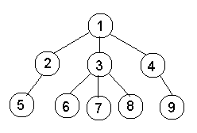

# 使用二元提升技术在树中进行生命周期评价

> 原文:[https://www . geesforgeks . org/LCA-in-a-a-tree-use-binary-lifting-technology/](https://www.geeksforgeeks.org/lca-in-a-tree-using-binary-lifting-technique/)

给定一棵二叉树，任务是找到树中给定两个节点的[最低共同祖先](https://www.geeksforgeeks.org/lowest-common-ancestor-in-a-binary-search-tree/)。
假设 G 是一棵树，那么两个节点 u 和 v 的 LCA 定义为树中的节点 w，它是 u 和 v 的祖先，并且离根节点最远。如果一个节点是另一个节点的祖先，那么该特定节点就是这两个节点的生命周期评价。
**例:**

> **输入:**
> 
> 
> 
> **输出:**
> 6 和 9 的 LCA 为 1。
> 5 和 9 的 LCA 为 1。
> 6 和 8 的生命周期评价为 3。
> 6 和 1 的 LCA 为 1。

**方法:**本文描述了一种称为二进制提升的方法，用于查找树中两个节点的最低公共祖先。可以有许多方法来解决生命周期评价问题。我们正在讨论二进制提升技术，其他的可以从[这里](https://www.geeksforgeeks.org/find-lca-in-binary-tree-using-rmq/)和[这里](https://www.geeksforgeeks.org/lowest-common-ancestor-binary-tree-set-1/)阅读。
二进制提升是一种动态编程方法，其中我们预先计算数组 memo[1，n][1，log(n)]，其中 memo[i][j]包含节点 I 的 2^j-th 祖先。为了计算 memo[][]的值，可以使用以下递归

> 备忘录状态:
> 
> memo[i][j] =路径中第 I 个节点的 2^(j)th 祖先
> 
> 备忘录初始化:
> 
> memo[i][j] = memo[i][0](给出了每个节点的第一个父节点(2^0))
> 
> 备忘录传输:
> 
> 备忘录[i][j] =备忘录[备忘录[I][j–1]]
> 
> 含义:A(i,2^j)=A( A(i，2^(j-1))、2^(j-1)
> 
> 要找到 I 的 2^j)-th 祖先，递归地找到第 I 个节点的 2^(j-1)th 祖先的 2^(j-1)th 祖先。(2^(j) = 2^(j-1) + 2^(j-1)
> 
> 所以:
> 
> 如果 j = 0，memo[i][j] =父[i]，如果 j >为 0，memo[I][j]= memo[memo[I][j–1]][j–1]。

我们首先检查一个节点是否是其他节点的祖先，如果一个节点是其他节点的祖先，那么它就是这两个节点的生命周期评价，否则我们会发现一个节点不是 u 和 v 的共同祖先，并且是树中最高的(即节点 x，这样 x 不是 u 和 v 的共同祖先，但是 memo[x][0]是)。找到这样一个节点后(让它是 x)，我们打印 x 的第一个祖先，即 memo[x][0]，这将是所需的 LCA。
以下是上述方法的实现:

## C++

```
// C++ implementation of the approach
#include <bits/stdc++.h>
using namespace std;

// Pre-processing to calculate values of memo[][]
void dfs(int u, int p, int **memo, int *lev, int log, vector<int> *g)
{
    // Using recursion formula to calculate
    // the values of memo[][]
    memo[u][0] = p;
    for (int i = 1; i <= log; i++)
        memo[u][i] = memo[memo[u][i - 1]][i - 1];
    for (int v : g[u])
    {
        if (v != p)
        {
            lev[v] = lev[u] + 1;
            dfs(v, u, memo, lev, log, g);
        }
    }
}

// Function to return the LCA of nodes u and v
int lca(int u, int v, int log, int *lev, int **memo)
{
    // The node which is present farthest
    // from the root node is taken as u
    // If v is farther from root node
    // then swap the two
    if (lev[u] < lev[v])
        swap(u, v);

    // Finding the ancestor of u
    // which is at same level as v
    for (int i = log; i >= 0; i--)
        if ((lev[u] - pow(2, i)) >= lev[v])
            u = memo[u][i];

    // If v is the ancestor of u
    // then v is the LCA of u and v
    if (u == v)
        return u;

    // Finding the node closest to the root which is
    // not the common ancestor of u and v i.e. a node
    // x such that x is not the common ancestor of u
    // and v but memo[x][0] is
    for (int i = log; i >= 0; i--)
    {
        if (memo[u][i] != memo[v][i])
        {
            u = memo[u][i];
            v = memo[v][i];
        }
    }

    // Returning the first ancestor
    // of above found node
    return memo[u][0];
}

// Driver Code
int main()
{
    // Number of nodes
    int n = 9;

    // vector to store tree
    vector<int> g[n + 1];

    int log = (int)ceil(log2(n));
    int **memo = new int *[n + 1];
    for (int i = 0; i < n + 1; i++)
        memo[i] = new int[log + 1];

    // Stores the level of each node
    int *lev = new int[n + 1];

    // Initialising memo values with -1
    for (int i = 0; i <= n; i++)
        memset(memo[i], -1, sizeof memo[i]);

    // Add edges
    g[1].push_back(2);
    g[2].push_back(1);
    g[1].push_back(3);
    g[3].push_back(1);
    g[1].push_back(4);
    g[4].push_back(1);
    g[2].push_back(5);
    g[5].push_back(2);
    g[3].push_back(6);
    g[6].push_back(3);
    g[3].push_back(7);
    g[7].push_back(3);
    g[3].push_back(8);
    g[8].push_back(3);
    g[4].push_back(9);
    g[9].push_back(4);
    dfs(1, 1, memo, lev, log, g);
    cout << "The LCA of 6 and 9 is " << lca(6, 9, log, lev, memo) << endl;
    cout << "The LCA of 5 and 9 is " << lca(5, 9, log, lev, memo) << endl;
    cout << "The LCA of 6 and 8 is " << lca(6, 8, log, lev, memo) << endl;
    cout << "The LCA of 6 and 1 is " << lca(6, 1, log, lev, memo) << endl;

    return 0;
}

// This code is contributed by
// sanjeev2552
```

## Java 语言(一种计算机语言，尤用于创建网站)

```
// Java implementation of the approach
import java.util.*;
public class GFG {

    // ArrayList to store tree
    static ArrayList<Integer> g[];
    static int memo[][], lev[], log;

    // Pre-processing to calculate values of memo[][]
    static void dfs(int u, int p)
    {

        // Using recursion formula to calculate
        // the values of memo[][]
        memo[u][0] = p;
        for (int i = 1; i <= log; i++)
            memo[u][i] = memo[memo[u][i - 1]][i - 1];
        for (int v : g[u]) {
            if (v != p) {

                // Calculating the level of each node
                lev[v] = lev[u] + 1;
                dfs(v, u);
            }
        }
    }

    // Function to return the LCA of nodes u and v
    static int lca(int u, int v)
    {
        // The node which is present farthest
        // from the root node is taken as u
        // If v is farther from root node
        // then swap the two
        if (lev[u] < lev[v]) {
            int temp = u;
            u = v;
            v = temp;
        }

        // Finding the ancestor of u
        // which is at same level as v
        for (int i = log; i >= 0; i--) {
            if ((lev[u] - (int)Math.pow(2, i)) >= lev[v])
                u = memo[u][i];
        }

        // If v is the ancestor of u
        // then v is the LCA of u and v
        if (u == v)
            return u;

        // Finding the node closest to the root which is
        // not the common ancestor of u and v i.e. a node
        // x such that x is not the common ancestor of u
        // and v but memo[x][0] is
        for (int i = log; i >= 0; i--) {
            if (memo[u][i] != memo[v][i]) {
                u = memo[u][i];
                v = memo[v][i];
            }
        }

        // Returning the first ancestor
        // of above found node
        return memo[u][0];
    }

    // Driver code
    public static void main(String args[])
    {

        // Number of nodes
        int n = 9;
        g = new ArrayList[n + 1];

        // log(n) with base 2
        log = (int)Math.ceil(Math.log(n) / Math.log(2));
        memo = new int[n + 1][log + 1];

        // Stores the level of each node
        lev = new int[n + 1];

        // Initialising memo values with -1
        for (int i = 0; i <= n; i++)
            Arrays.fill(memo[i], -1);
        for (int i = 0; i <= n; i++)
            g[i] = new ArrayList<>();

        // Add edges
        g[1].add(2);
        g[2].add(1);
        g[1].add(3);
        g[3].add(1);
        g[1].add(4);
        g[4].add(1);
        g[2].add(5);
        g[5].add(2);
        g[3].add(6);
        g[6].add(3);
        g[3].add(7);
        g[7].add(3);
        g[3].add(8);
        g[8].add(3);
        g[4].add(9);
        g[9].add(4);
        dfs(1, 1);
        System.out.println("The LCA of 6 and 9 is " + lca(6, 9));
        System.out.println("The LCA of 5 and 9 is " + lca(5, 9));
        System.out.println("The LCA of 6 and 8 is " + lca(6, 8));
        System.out.println("The LCA of 6 and 1 is " + lca(6, 1));
    }
}
```

## 蟒蛇 3

```
# Python3 implementation of the above approach
import math

# Pre-processing to calculate values of memo[][]
def dfs(u, p, memo, lev, log, g):

    # Using recursion formula to calculate
    # the values of memo[][]
    memo[u][0] = p
    for i in range(1, log + 1):
        memo[u][i] = memo[memo[u][i - 1]][i - 1]

    for v in g[u]:
        if v != p:
            lev[v] = lev[u] + 1
            dfs(v, u, memo, lev, log, g)

# Function to return the LCA of nodes u and v
def lca(u, v, log, lev, memo):

    # The node which is present farthest
    # from the root node is taken as u
    # If v is farther from root node
    # then swap the two
    if lev[u] < lev[v]:
        swap(u, v)

    # Finding the ancestor of u
    # which is at same level as v
    for i in range(log, -1, -1):
        if (lev[u] - pow(2, i)) >= lev[v]:
            u = memo[u][i]

    # If v is the ancestor of u
    # then v is the LCA of u and v        
    if u == v:
        return v

    # Finding the node closest to the
    # root which is not the common ancestor
    # of u and v i.e. a node x such that x
    # is not the common ancestor of u
    # and v but memo[x][0] is
    for i in range(log, -1, -1):
        if memo[u][i] != memo[v][i]:
            u = memo[u][i]
            v = memo[v][i]

    # Returning the first ancestor
    # of above found node        
    return memo[u][0]

# Driver code

# Number of nodes
n = 9

log = math.ceil(math.log(n, 2))
g = [[] for i in range(n + 1)]

memo = [[-1 for i in range(log + 1)]
            for j in range(n + 1)]

# Stores the level of each node            
lev = [0 for i in range(n + 1)]

# Add edges
g[1].append(2)
g[2].append(1)
g[1].append(3)
g[3].append(1)
g[1].append(4)
g[4].append(1)
g[2].append(5)
g[5].append(2)
g[3].append(6)
g[6].append(3)
g[3].append(7)
g[7].append(3)
g[3].append(8)
g[8].append(3)
g[4].append(9)
g[9].append(4)

dfs(1, 1, memo, lev, log, g)

print("The LCA of 6 and 9 is", lca(6, 9, log, lev, memo))
print("The LCA of 5 and 9 is", lca(5, 9, log, lev, memo))
print("The LCA of 6 and 8 is", lca(6, 8, log, lev, memo))
print("The LCA of 6 and 1 is", lca(6, 1, log, lev, memo))

# This code is contributed by Bhaskar
```

## C#

```
// C# implementation of the approach
using System;
using System.Collections.Generic;

class GFG
{

    // List to store tree
    static List<int> []g;
    static int [,]memo;
    static int []lev;
    static int log;

    // Pre-processing to calculate
    // values of memo[,]
    static void dfs(int u, int p)
    {

        // Using recursion formula to
        // calculate the values of memo[,]
        memo[u, 0] = p;
        for (int i = 1; i <= log; i++)
            memo[u, i] = memo[memo[u, i - 1],
                                    i - 1];
        foreach (int v in g[u])
        {
            if (v != p)
            {

                // Calculating the level of each node
                lev[v] = lev[u] + 1;
                dfs(v, u);
            }
        }
    }

    // Function to return the LCA of
    // nodes u and v
    static int lca(int u, int v)
    {
        // The node which is present farthest
        // from the root node is taken as u
        // If v is farther from root node
        // then swap the two
        if (lev[u] < lev[v])
        {
            int temp = u;
            u = v;
            v = temp;
        }

        // Finding the ancestor of u
        // which is at same level as v
        for (int i = log; i >= 0; i--)
        {
            if ((lev[u] - (int)Math.Pow(2, i)) >= lev[v])
                u = memo[u, i];
        }

        // If v is the ancestor of u
        // then v is the LCA of u and v
        if (u == v)
            return u;

        // Finding the node closest to the root
        // which is not the common ancestor of
        // u and v i.e. a node x such that
        // x is not the common ancestor of u
        // and v but memo[x,0] is
        for (int i = log; i >= 0; i--)
        {
            if (memo[u, i] != memo[v, i])
            {
                u = memo[u, i];
                v = memo[v, i];
            }
        }

        // Returning the first ancestor
        // of above found node
        return memo[u, 0];
    }

    // Driver code
    public static void Main(String []args)
    {

        // Number of nodes
        int n = 9;
        g = new List<int>[n + 1];

        // log(n) with base 2
        log = (int)Math.Ceiling(Math.Log(n) / Math.Log(2));
        memo = new int[n + 1, log + 1];

        // Stores the level of each node
        lev = new int[n + 1];

        // Initialising memo values with -1
        for (int i = 0; i <= n; i++)
            for (int j = 0; j <= log; j++)
                memo[i, j] = -1;
        for (int i = 0; i <= n; i++)
            g[i] = new List<int>();

        // Add edges
        g[1].Add(2);
        g[2].Add(1);
        g[1].Add(3);
        g[3].Add(1);
        g[1].Add(4);
        g[4].Add(1);
        g[2].Add(5);
        g[5].Add(2);
        g[3].Add(6);
        g[6].Add(3);
        g[3].Add(7);
        g[7].Add(3);
        g[3].Add(8);
        g[8].Add(3);
        g[4].Add(9);
        g[9].Add(4);
        dfs(1, 1);
        Console.WriteLine("The LCA of 6 and 9 is " +
                                        lca(6, 9));
        Console.WriteLine("The LCA of 5 and 9 is " +
                                        lca(5, 9));
        Console.WriteLine("The LCA of 6 and 8 is " +
                                        lca(6, 8));
        Console.WriteLine("The LCA of 6 and 1 is " +
                                        lca(6, 1));
    }
}

// This code is contributed by PrinciRaj1992
```

## java 描述语言

```
<script>

    // JavaScript implementation of the approach

    // ArrayList to store tree
    let g;
    let memo, lev, log;

    // Pre-processing to calculate values of memo[][]
    function dfs(u, p)
    {

        // Using recursion formula to calculate
        // the values of memo[][]
        memo[u][0] = p;
        for (let i = 1; i <= log; i++)
            memo[u][i] = memo[memo[u][i - 1]][i - 1];
        for (let v = 0; v < g[u].length; v++) {
            if (g[u][v] != p) {

                // Calculating the level of each node
                lev[g[u][v]] = lev[u] + 1;
                dfs(g[u][v], u);
            }
        }
    }

    // Function to return the LCA of nodes u and v
    function lca(u, v)
    {
        // The node which is present farthest
        // from the root node is taken as u
        // If v is farther from root node
        // then swap the two
        if (lev[u] < lev[v]) {
            let temp = u;
            u = v;
            v = temp;
        }

        // Finding the ancestor of u
        // which is at same level as v
        for (let i = log; i >= 0; i--) {
            if ((lev[u] - Math.pow(2, i)) >= lev[v])
                u = memo[u][i];
        }

        // If v is the ancestor of u
        // then v is the LCA of u and v
        if (u == v)
            return u;

        // Finding the node closest to the root which is
        // not the common ancestor of u and v i.e. a node
        // x such that x is not the common ancestor of u
        // and v but memo[x][0] is
        for (let i = log; i >= 0; i--) {
            if (memo[u][i] != memo[v][i]) {
                u = memo[u][i];
                v = memo[v][i];
            }
        }

        // Returning the first ancestor
        // of above found node
        return memo[u][0];
    }

    // Number of nodes
    let n = 9;
    g = new Array(n + 1);

    // log(n) with base 2
    log = Math.ceil(Math.log(n) / Math.log(2));
    memo = new Array(n + 1);

    // Stores the level of each node
    lev = new Array(n + 1);
    lev.fill(0);

    // Initialising memo values with -1
    for (let i = 0; i <= n; i++)
    {
        memo[i] = new Array(log+1);
        for (let j = 0; j < log+1; j++)
        {
            memo[i][j] = -1;
        }
    }
    for (let i = 0; i <= n; i++)
      g[i] = [];

    // Add edges
    g[1].push(2);
    g[2].push(1);
    g[1].push(3);
    g[3].push(1);
    g[1].push(4);
    g[4].push(1);
    g[2].push(5);
    g[5].push(2);
    g[3].push(6);
    g[6].push(3);
    g[3].push(7);
    g[7].push(3);
    g[3].push(8);
    g[8].push(3);
    g[4].push(9);
    g[9].push(4);
    dfs(1, 1);
    document.write("The LCA of 6 and 9 is " + lca(6, 9) + "</br>");
    document.write("The LCA of 5 and 9 is " + lca(5, 9) + "</br>");
    document.write("The LCA of 6 and 8 is " + lca(6, 8) + "</br>");
    document.write("The LCA of 6 and 1 is " + lca(6, 1));

</script>
```

**Output:** 

```
The LCA of 6 and 9 is 1
The LCA of 5 and 9 is 1
The LCA of 6 and 8 is 3
The LCA of 6 and 1 is 1
```

**时间复杂度:**预处理花费的时间为 O(NlogN)，每个查询花费 O(logN)时间。所以解决方案的整体时间复杂度是 O(NlogN)。
**辅助空间:** O(NlogN)