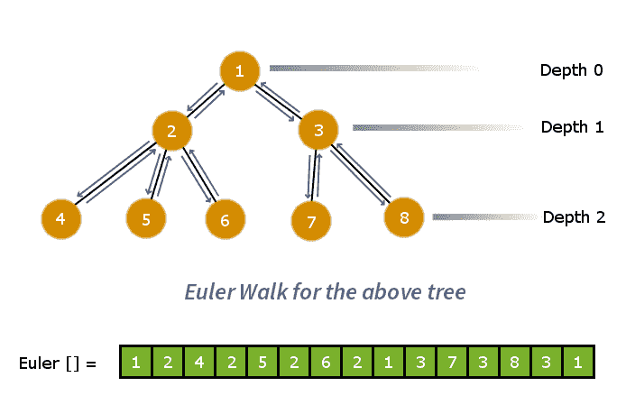
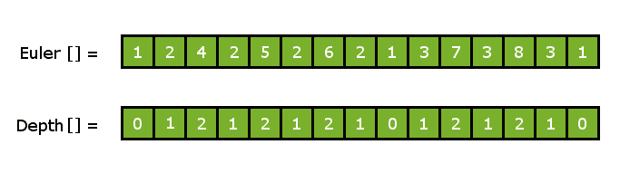
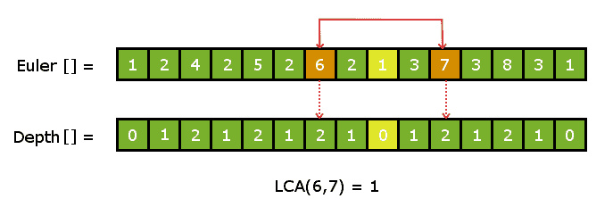

# n 元树的 LCA 常量查询 O(1)

> 原文:[https://www . geesforgeks . org/LCA-n-ary-tree-constant-query-O1/](https://www.geeksforgeeks.org/lca-n-ary-tree-constant-query-o1/)

我们已经看到了各种具有不同时间复杂度的方法来计算 n 元树中的 LCA:-
**方法 1 :** [朴素方法(通过计算根到节点的路径)| O(n)每个查询](https://www.geeksforgeeks.org/sqrt-square-root-decomposition-set-2-lca-tree-osqrth-time/)
**方法 2 :** [使用 Sqrt 分解| O(sqrt H)](https://www.geeksforgeeks.org/sqrt-square-root-decomposition-set-2-lca-tree-osqrth-time/)
**方法 3 :** [使用稀疏矩阵 DP 方法| O(logn)](https://www.geeksforgeeks.org/lca-for-general-or-n-ary-trees-sparse-matrix-dp-approach-onlogn-ologn/)

让我们研究另一种方法，它的查询时间比上述所有方法都要快。所以，我们的目标将是在**恒定时间~ O(1)** 计算 LCA。让我们看看如何实现它。

**方法四:使用范围最小查询**

我们已经讨论了二叉树的生命周期评价和 RMQ。这里我们讨论 n 元树的生命周期评价问题到 RMQ 问题的转换。

```
Pre-requisites:- LCA in Binary Tree using RMQ
                 RMQ using sparse table
```

> **关键概念:**在这个方法中，我们将把 LCA 问题简化为静态数组上的 RMQ(范围最小查询)问题。一旦我们这样做了，那么我们将把范围最小查询与所需的生命周期评价查询联系起来。

第一步是将树分解成扁平的线性阵列。为此，我们可以应用欧拉行走。欧拉行走将给出图的预序遍历。因此，我们将在树上执行欧拉行走，并在访问节点时将其存储在数组中。这个过程将树形数据结构简化为一个简单的线性数组。

考虑下面的树和欧拉走在上面:-



现在让我们用一般的术语来思考:考虑树上的任意两个节点。正好有一条路径连接两个节点，路径中深度值最小的节点将是两个给定节点的生命周期评价。
现在取欧拉走阵中任意两个截然不同的节点，比如 **u** 和 **v** 。现在，从 u 到 v 的路径中的所有元素都将位于欧拉行走数组中节点 u 和 v 的索引之间。因此，我们只需要计算欧拉数组中节点 u 的索引和节点 v 之间深度最小的节点。

为此，我们将维护另一个数组，该数组将包含所有节点的深度，这些节点对应于它们在欧拉行走数组中的位置，以便我们可以在其上应用我们的 RMQ 算法。

下面给出的是与其深度轨迹阵列平行的欧拉行走阵列。



示例:-考虑欧拉数组中的两个节点**节点 6** 和**节点 7** 。为了计算节点 6 和节点 7 的生命周期评价，我们寻找节点 6 和节点 7 之间所有节点的最小深度值。
因此，**节点 1** 具有最小的*深度值= 0* ，因此，它是节点 6 和节点 7 的 LCA。



**实施:-**

```
We will be maintaining three arrays 1)Euler Path   
                                    2)Depth array   
                                    3)First Appearance Index
```

欧拉路径和深度数组与上述相同

***【首次出现索引 FAI】:***首次出现索引数组将存储欧拉路径数组中每个节点的第一个位置的索引。第一次出现在欧拉行走数组中。

上述方法的实施如下

## C++

```
// C++ program to demonstrate LCA of n-ary tree
// in constant time.
#include "bits/stdc++.h"
using namespace std;
#define sz 101

vector < int > adj[sz];    // stores the tree
vector < int > euler;      // tracks the eulerwalk
vector < int > depthArr;   // depth for each node corresponding
                           // to eulerwalk

int FAI[sz];     // stores first appearance index of every node
int level[sz];   // stores depth for all nodes in the tree
int ptr;         // pointer to euler walk
int dp[sz][18];  // sparse table
int logn[sz];    // stores log values
int p2[20];      // stores power of 2

void buildSparseTable(int n)
{
    // initializing sparse table
    memset(dp,-1,sizeof(dp));

    // filling base case values
    for (int i=1; i<n; i++)
        dp[i-1][0] = (depthArr[i]>depthArr[i-1])?i-1:i;

    // dp to fill sparse table
    for (int l=1; l<15; l++)
      for (int i=0; i<n; i++)
        if (dp[i][l-1]!=-1 and dp[i+p2[l-1]][l-1]!=-1)
          dp[i][l] =
            (depthArr[dp[i][l-1]]>depthArr[dp[i+p2[l-1]][l-1]])?
             dp[i+p2[l-1]][l-1] : dp[i][l-1];
        else
             break;
}

int query(int l,int r)
{
    int d = r-l;
    int dx = logn[d];
    if (l==r) return l;
    if (depthArr[dp[l][dx]] > depthArr[dp[r-p2[dx]][dx]])
        return dp[r-p2[dx]][dx];
    else
        return dp[l][dx];
}

void preprocess()
{
    // memorizing powers of 2
    p2[0] = 1;
    for (int i=1; i<18; i++)
        p2[i] = p2[i-1]*2;

    // memorizing all log(n) values
    int val = 1,ptr=0;
    for (int i=1; i<sz; i++)
    {
        logn[i] = ptr-1;
        if (val==i)
        {
            val*=2;
            logn[i] = ptr;
            ptr++;
        }
    }
}

/**
 * Euler Walk ( preorder traversal)
 * converting tree to linear depthArray
 * Time Complexity : O(n)
 * */
void dfs(int cur,int prev,int dep)
{
    // marking FAI for cur node
    if (FAI[cur]==-1)
        FAI[cur] = ptr;

    level[cur] = dep;

    // pushing root to euler walk
    euler.push_back(cur);

    // incrementing euler walk pointer
    ptr++;

    for (auto x:adj[cur])
    {
        if (x != prev)
        {
            dfs(x,cur,dep+1);

            // pushing cur again in backtrack
            // of euler walk
            euler.push_back(cur);

            // increment euler walk pointer
            ptr++;
        }
    }
}

// Create Level depthArray corresponding
// to the Euler walk Array
void makeArr()
{
    for (auto x : euler)
        depthArr.push_back(level[x]);
}

int LCA(int u,int v)
{
    // trivial case
    if (u==v)
       return u;

    if (FAI[u] > FAI[v])
       swap(u,v);

    // doing RMQ in the required range
    return euler[query(FAI[u], FAI[v])];
}

void addEdge(int u,int v)
{
    adj[u].push_back(v);
    adj[v].push_back(u);
}

int main(int argc, char const *argv[])
{
    // constructing the described tree
    int numberOfNodes = 8;
    addEdge(1,2);
    addEdge(1,3);
    addEdge(2,4);
    addEdge(2,5);
    addEdge(2,6);
    addEdge(3,7);
    addEdge(3,8);

    // performing required precalculations
    preprocess();

    // doing the Euler walk
    ptr = 0;
    memset(FAI,-1,sizeof(FAI));
    dfs(1,0,0);

    // creating depthArray corresponding to euler[]
    makeArr();

    // building sparse table
    buildSparseTable(depthArr.size());

    cout << "LCA(6,7) : " << LCA(6,7) << "\n";
    cout << "LCA(6,4) : " << LCA(6,4) << "\n";

    return 0;
}
```

## Java 语言(一种计算机语言，尤用于创建网站)

```
// Java program to demonstrate LCA of n-ary
// tree in constant time.
import java.util.ArrayList;
import java.util.Arrays;

class GFG{

static int sz = 101;

@SuppressWarnings("unchecked")
// Stores the tree
static ArrayList<Integer>[] adj = new ArrayList[sz];

// Tracks the eulerwalk
static ArrayList<Integer> euler = new ArrayList<>();

// Depth for each node corresponding
static ArrayList<Integer> depthArr = new ArrayList<>();
// to eulerwalk

// Stores first appearance index of every node
static int[] FAI = new int[sz];

// Stores depth for all nodes in the tree
static int[] level = new int[sz];

// Pointer to euler walk
static int ptr;

// Sparse table
static int[][] dp = new int[sz][18];

// Stores log values
static int[] logn = new int[sz];

// Stores power of 2
static int[] p2 = new int[20];

static void buildSparseTable(int n)
{

    // Initializing sparse table
    for(int i = 0; i < sz; i++)
    {
        for(int j = 0; j < 18; j++)
        {
            dp[i][j] = -1;
        }
    }

    // Filling base case values
    for(int i = 1; i < n; i++)
        dp[i - 1][0] = (depthArr.get(i) >
                        depthArr.get(i - 1)) ?
                                     i - 1 : i;

    // dp to fill sparse table
    for(int l = 1; l < 15; l++)
        for(int i = 0; i < n; i++)
            if (dp[i][l - 1] != -1 &&
               dp[i + p2[l - 1]][l - 1] != -1)
                dp[i][l] = (depthArr.get(dp[i][l - 1]) >
                            depthArr.get(
                                dp[i + p2[l - 1]][l - 1])) ?
                                dp[i + p2[l - 1]][l - 1] :
                                dp[i][l - 1];
            else
                break;
}

static int query(int l, int r)
{
    int d = r - l;
    int dx = logn[d];

    if (l == r)
        return l;

    if (depthArr.get(dp[l][dx]) >
        depthArr.get(dp[r - p2[dx]][dx]))
        return dp[r - p2[dx]][dx];
    else
        return dp[l][dx];
}

static void preprocess()
{

    // Memorizing powers of 2
    p2[0] = 1;
    for(int i = 1; i < 18; i++)
        p2[i] = p2[i - 1] * 2;

    // Memorizing all log(n) values
    int val = 1, ptr = 0;
    for(int i = 1; i < sz; i++)
    {
        logn[i] = ptr - 1;
        if (val == i)
        {
            val *= 2;
            logn[i] = ptr;
            ptr++;
        }
    }
}

// Euler Walk ( preorder traversal) converting
// tree to linear depthArray
// Time Complexity : O(n)
static void dfs(int cur, int prev, int dep)
{

    // Marking FAI for cur node
    if (FAI[cur] == -1)
        FAI[cur] = ptr;

    level[cur] = dep;

    // Pushing root to euler walk
    euler.add(cur);

    // Incrementing euler walk pointer
    ptr++;

    for(Integer x : adj[cur])
    {
        if (x != prev)
        {
            dfs(x, cur, dep + 1);

            // Pushing cur again in backtrack
            // of euler walk
            euler.add(cur);

            // Increment euler walk pointer
            ptr++;
        }
    }
}

// Create Level depthArray corresponding
// to the Euler walk Array
static void makeArr()
{
    for(Integer x : euler)
        depthArr.add(level[x]);
}

static int LCA(int u, int v)
{

    // Trivial case
    if (u == v)
        return u;

    if (FAI[u] > FAI[v])
    {
        int temp = u;
        u = v;
        v = temp;
    }

    // Doing RMQ in the required range
    return euler.get(query(FAI[u], FAI[v]));
}

static void addEdge(int u, int v)
{
    adj[u].add(v);
    adj[v].add(u);
}

// Driver code
public static void main(String[] args)
{
    for(int i = 0; i < sz; i++)
    {
        adj[i] = new ArrayList<>();
    }

    // Constructing the described tree
    int numberOfNodes = 8;
    addEdge(1, 2);
    addEdge(1, 3);
    addEdge(2, 4);
    addEdge(2, 5);
    addEdge(2, 6);
    addEdge(3, 7);
    addEdge(3, 8);

    // Performing required precalculations
    preprocess();

    // Doing the Euler walk
    ptr = 0;
    Arrays.fill(FAI, -1);
    dfs(1, 0, 0);

    // Creating depthArray corresponding to euler[]
    makeArr();

    // Building sparse table
    buildSparseTable(depthArr.size());

    System.out.println("LCA(6,7) : " + LCA(6, 7));
    System.out.println("LCA(6,4) : " + LCA(6, 4));
}
}

// This code is contributed by sanjeev2552
```

**输出:**

```
LCA(6,7) : 1
LCA(6,4) : 2
```

**注意:**我们正在预先计算 2 的所有所需幂，也预先计算所有所需的日志值，以确保每个查询的时间复杂度恒定。否则，如果我们对每个查询操作进行日志计算，我们的时间复杂度就不会是常数。

**时间复杂度:**从 LCA 到 RMQ 的转换过程由欧拉行走完成，耗时 O(n)。
RMQ 稀疏表的预处理需要 0(nlogn)时间，回答每个查询是一个恒定时间的过程。因此，总的时间复杂度为 0(nlogn)–预处理和每个查询的**0(1)**。

本文由 [**尼提什·库马尔**](https://in.linkedin.com/in/nk17kumar) 供稿。如果你喜欢 GeeksforGeeks 并想投稿，你也可以使用[write.geeksforgeeks.org](http://www.write.geeksforgeeks.org)写一篇文章或者把你的文章邮寄到 review-team@geeksforgeeks.org。看到你的文章出现在极客博客主页上，帮助其他极客。
如果发现有不正确的地方，或者想分享更多关于上述话题的信息，请写评论。