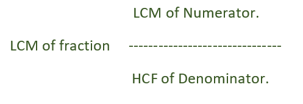
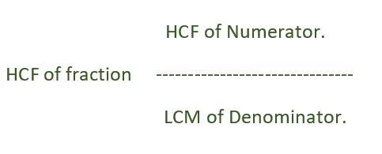

# 馏分的 LCM 和 HCF

> 原文:[https://www.geeksforgeeks.org/lcm-and-hcf-of-fractions/](https://www.geeksforgeeks.org/lcm-and-hcf-of-fractions/)

给定 n 个分数作为两个数组 **Num** 和 **Den** 。任务是找出分数的 **L.C.M** 。

**示例:**

> **输入:** num[] = {1，7，4}，den[] = {2，3，6}
> **输出:** LCM 为= 28/1
> 给定分数为 1/2，7/3 和 4/6。
> LCM 为 28/1
> 
> **输入:** num[] = {24，48，72，96}，den[] = {2，6，8，3 }
> T3】输出: LCM 为= 288/1

A/B 和 C/D 的 LCM =(A 和 C 的 LCM)/(B 和 D 的 HCF)



下面是上述方法的实现:

## C++

```
// C++ program to find LCM of array of fractions
#include <bits/stdc++.h>
using namespace std;

// Function that will calculate
// the Lcm of Numerator
int LCM(int num[], int N)
{
    int ans = num[0];
    for (int i = 1; i < N; i++)
        ans = (((num[i] * ans)) / (__gcd(num[i], ans)));
    return ans;
}

// Function that will calculate
// the Hcf of Denominator
int HCF(int den[], int N)
{
    int ans = den[0];   
    for(int i = 1; i < N; i++)
        ans = __gcd(den[i], ans);   
    return ans;
}

int LCMOfFractions(int num[], int den[], int N)
{
    int Numerator = LCM(num, N);
    int Denominator = HCF(den, N);

    int gcd = __gcd(Numerator, Denominator);

    Numerator = Numerator / gcd;
    Denominator = Denominator / gcd;

    cout << "LCM is = " << Numerator << "/" << Denominator;
}

// Driver code
int main()
{
    int num[] = { 1, 7, 4 }, den[] = { 2, 3, 6 };
    int N = sizeof(num) / sizeof(num[0]);
    LCMOfFractions(num, den, N);
    return 0;
}
```

## Java 语言(一种计算机语言，尤用于创建网站)

```
// Java program to find LCM of array of fractions

class GFG{

// Recursive function to return gcd of a and b
    static int gcd(int a, int b)
    {
        // Everything divides 0 
        if (a == 0)
          return b;
        if (b == 0)
          return a;

        // base case
        if (a == b)
            return a;

        // a is greater
        if (a > b)
            return gcd(a-b, b);
        return gcd(a, b-a);
    }

// Function that will calculate
// the Lcm of Numerator
static int LCM(int num[], int N)
{
    int ans = num[0];
    for (int i = 1; i < N; i++)
        ans = (((num[i] * ans)) / (gcd(num[i], ans)));
    return ans;
}

// Function that will calculate
// the Hcf of Denominator
static int HCF(int den[], int N)
{
    int ans = den[0];
    for(int i = 1; i < N; i++)
        ans = gcd(den[i], ans);
    return ans;
}

static int LCMOfFractions(int num[], int den[], int N)
{
    int Numerator = LCM(num, N);
    int Denominator = HCF(den, N);

    int gcd1 = gcd(Numerator, Denominator);

    Numerator = Numerator / gcd1;
    Denominator = Denominator / gcd1;

    System.out.println("LCM is = " +Numerator+ "/" + Denominator);
    return 0;
}

// Driver code
public static void main(String args[])
{
    int num[] = { 1, 7, 4 }, den[] = { 2, 3, 6 };
    int N = num.length;
    LCMOfFractions(num, den, N);
}
}
```

## 蟒蛇 3

```
# Python3 def program to find LCM of
# array of fractions

# Recursive function to
# return gcd of a and b
def gcd(a, b):

    # Everything divides 0
    if (a == 0):
        return b;
    if (b == 0):
        return a;

    # base case
    if (a == b):
        return a;

    # a is greater
    if (a > b):
        return gcd(a - b, b);
    return gcd(a, b - a);

# Function that will calculate
# the Lcm of Numerator
def LCM(num, N):

    ans = num[0];
    for i in range(1,N):
        ans = (((num[i] * ans)) / (gcd(num[i], ans)));
    return ans;

# Function that will calculate
# the Hcf of Denominator
def HCF(den, N):

    ans = den[0];
    for i in range(1,N):
        ans = gcd(den[i], ans);
    return ans;

def LCMOfFractions(num, den, N):

    Numerator = LCM(num, N);
    Denominator = HCF(den, N);

    gcd1 = gcd(Numerator, Denominator);

    Numerator = int(Numerator / gcd1);
    Denominator = int(Denominator / gcd1);

    print("LCM is =",Numerator,"/",Denominator);

# Driver code
num = [1, 7, 4 ];
den = [2, 3, 6 ];
N = len(num);
LCMOfFractions(num, den, N);

# This code is contributed
# by mits
```

## C#

```
// C# program to find LCM of
// array of fractions
using System;

class GFG
{

// Recursive function to return
// gcd of a and b
static int gcd(int a, int b)
{
    // Everything divides 0
    if (a == 0)
        return b;
    if (b == 0)
        return a;

    // base case
    if (a == b)
        return a;

    // a is greater
    if (a > b)
        return gcd(a - b, b);
    return gcd(a, b - a);
}

// Function that will calculate
// the Lcm of Numerator
static int LCM(int []num, int N)
{
    int ans = num[0];
    for (int i = 1; i < N; i++)
        ans = (((num[i] * ans)) /
                (gcd(num[i], ans)));
    return ans;
}

// Function that will calculate
// the Hcf of Denominator
static int HCF(int []den, int N)
{
    int ans = den[0];
    for(int i = 1; i < N; i++)
        ans = gcd(den[i], ans);
    return ans;
}

static int LCMOfFractions(int []num,
                          int []den, int N)
{
    int Numerator = LCM(num, N);
    int Denominator = HCF(den, N);

    int gcd1 = gcd(Numerator, Denominator);

    Numerator = Numerator / gcd1;
    Denominator = Denominator / gcd1;

    Console.WriteLine("LCM is = " + Numerator +
                            "/" + Denominator);
    return 0;
}

// Driver code
static public void Main(String []args)
{
    int[] num = { 1, 7, 4 }, den = { 2, 3, 6 };
    int N = num.Length;
    LCMOfFractions(num, den, N);
}
}

// This code is contributed by Arnab Kundu
```

## 服务器端编程语言（Professional Hypertext Preprocessor 的缩写）

```
<?php
// PHP program to find LCM of
// array of fractions

// Recursive function to
// return gcd of a and b
function gcd($a, $b)
{
    // Everything divides 0
    if ($a == 0)
        return $b;
    if ($b == 0)
        return $a;

    // base case
    if ($a == $b)
        return $a;

    // a is greater
    if ($a > $b)
        return gcd($a - $b, $b);
    return gcd($a, $b - $a);
}

// Function that will calculate
// the Lcm of Numerator
function LCM($num, $N)
{
    $ans = $num[0];
    for ($i = 1; $i < $N; $i++)
        $ans = ((($num[$i] * $ans)) /
             (gcd($num[$i], $ans)));
    return $ans;
}

// Function that will calculate
// the Hcf of Denominator
function HCF($den, $N)
{
    $ans = $den[0];
    for($i = 1; $i < $N; $i++)
        $ans = gcd($den[$i], $ans);
    return $ans;
}

function LCMOfFractions($num, $den, $N)
{
    $Numerator = LCM($num, $N);
    $Denominator = HCF($den, $N);

    $gcd1 = gcd($Numerator, $Denominator);

    $Numerator = $Numerator / $gcd1;
    $Denominator = $Denominator / $gcd1;

    echo "LCM is = " . $Numerator .
                 "/" . $Denominator;
    return 0;
}

// Driver code
$num = array(1, 7, 4 );
$den = array(2, 3, 6 );
$N = sizeof($num);
LCMOfFractions($num, $den, $N);

// This code is contributed
// by Akanksha Rai
```

## java 描述语言

```
<script>

// Javascript program to find LCM of
// array of fractions
var num = [ 1, 7, 4 ];
var den = [ 2, 3, 6 ];

// Recursive function to return
// gcd of a and b
function gcd(a, b)
{

    // Everything divides 0 
    if (a == 0)
        return b;
    if (b == 0)
        return a;

    // Base case
    if (a == b)
        return a;

    // a is greater
    if (a > b)
        return gcd(a - b, b);

    return gcd(a, b - a);
}

// Function that will calculate
// the Lcm of Numerator
function LCM(num, N)
{
    var ans = num[0];
    for(var i = 1; i < N; i++)
        ans = (((num[i] * ans)) /
            (gcd(num[i], ans)));

    return ans;
}

// Function that will calculate
// the Hcf of Denominator
function HCF(den, N)
{
    var ans = den[0];
    for(var i = 1; i < N; i++)
        ans = gcd(den[i], ans);

    return ans;
}

function LCMOfFractions(num, den, N)
{
    var Numerator = LCM(num, N);
    var Denominator = HCF(den, N);

    var gcd1 = gcd(Numerator, Denominator);

    Numerator = Numerator / gcd1;
    Denominator = Denominator / gcd1;

    document.write("LCM is = " + Numerator +
                           "/" + Denominator);
    return 0;
}

// Driver code
var N = num.length;

LCMOfFractions(num, den, N);

// This code is contributed by Ankita saini

</script>
```

**Output:** 

```
LCM is = 28/1
```

**给定 n 个分数作为两个数组 Num 和 Den。任务是找出分数的升程。**

> **输入:** num[] = {1，7，4}，den[] = {2，3，6}
> **输出:** HCF 为 1/6
> 给定分数为 1/2，7/3 和 4/6。
> HCF 为 1/6
> 
> **输入:** num[] = {24，48，72，96}，den[] = {2，6，8，3 }
> T3】输出: HCF 为 1/1

甲乙丙丁的碳氢化合物=(甲乙丙丁的碳氢化合物)/(甲乙丙丁的碳氢化合物)



下面是上述方法的实现:

## C++

```
// CPP program to find GCD of array of fractions
#include <bits/stdc++.h>
using namespace std;

// Function that will calculate
// the Lcm of Denominator
int LCM(int den[], int N)
{
    int ans = den[0];
    for (int i = 1; i < N; i++)
        ans = (((den[i] * ans)) / (__gcd(den[i], ans)));
    return ans;
}

// Function that will calculate
// the Hcf of Numerator
int HCF(int num[], int N)
{
    int ans = num[0];
    for (int i = 1; i < N; i++)
        ans = __gcd(num[i], ans);
    return ans;
}

int HCFOfFractions(int num[], int den[], int N)
{
    int Numerator = HCF(num, N);
    int Denominator = LCM(den, N);

    int result = __gcd(Numerator, Denominator);

    Numerator = Numerator / result;
    Denominator = Denominator / result;

    cout << "HCF is = " << Numerator << "/" << Denominator;
}

// Driver code
int main()
{
    int num[] = { 24, 48, 72, 96 }, den[] = { 2, 6, 8, 3 };
    int N = sizeof(num) / sizeof(num[0]);
    HCFOfFractions(num, den, N);
    return 0;
}
```

## Java 语言(一种计算机语言，尤用于创建网站)

```
// Java program to find GCD of array of fractions

class GFG{

static int __gcd(int a, int b)
{
    if (a == 0)
        return b;
    return __gcd(b % a, a);
}
// Function that will calculate
// the Lcm of Denominator
static int LCM(int den[], int N)
{
    int ans = den[0];
    for (int i = 1; i < N; i++)
        ans = (((den[i] * ans)) / (__gcd(den[i], ans)));
    return ans;
}

// Function that will calculate
// the Hcf of Numerator
static int HCF(int num[], int N)
{
    int ans = num[0];
    for (int i = 1; i < N; i++)
        ans = __gcd(num[i], ans);
    return ans;
}

static void HCFOfFractions(int num[], int den[], int N)
{
    int Numerator = HCF(num, N);
    int Denominator = LCM(den, N);

    int result = __gcd(Numerator, Denominator);

    Numerator = Numerator / result;
    Denominator = Denominator / result;

    System.out.println("HCF is = "+Numerator+"/"+Denominator);
}

// Driver code
public static void main(String[] args)
{
    int num[] = { 24, 48, 72, 96 }, den[] = { 2, 6, 8, 3 };
    int N = num.length;
    HCFOfFractions(num, den, N);

}
}
// This code is contributed by mits
```

## 蟒蛇 3

```
# Python3 def program to find LCM
# of array of fractions

# Recursive function to
# return gcd of a and b
def gcd(a, b):

    # Everything divides 0
    if (a == 0):
        return b;
    if (b == 0):
        return a;

    # base case
    if (a == b):
        return a;

    # a is greater
    if (a > b):
        return gcd(a - b, b);
    return gcd(a, b - a);

# Function that will calculate
# the Lcm of Numerator
def LCM(den, N):

    ans = den[0];
    for i in range(1,N):
        ans = (((den[i] * ans)) /
                (gcd(den[i], ans)));
    return ans;

# Function that will calculate
# the Hcf of Denominator
def HCF(num, N):

    ans = num[0];
    for i in range(1, N):
        ans = gcd(num[i], ans);
    return ans;

def HCFOfFractions(num, den, N):

    Numerator = HCF(num, N);
    Denominator = LCM(den, N);

    gcd1 = gcd(Numerator, Denominator);

    Numerator = int(Numerator / gcd1);
    Denominator = int(Denominator / gcd1);

    print("HCF is =", Numerator,
                 "/", Denominator);

# Driver code
num = [24, 48, 72, 96 ];
den = [2, 6, 8, 3 ];
N = len(num);
HCFOfFractions(num, den, N);

# This code is contributed
# by Akanksha Rai
```

## C#

```
// C# program to find GCD of array of fractions
using System;
class GFG{

static int __gcd(int a, int b)
{
    if (a == 0)
        return b;
    return __gcd(b % a, a);
}
// Function that will calculate
// the Lcm of Denominator
static int LCM(int[] den, int N)
{
    int ans = den[0];
    for (int i = 1; i < N; i++)
        ans = (((den[i] * ans)) / (__gcd(den[i], ans)));
    return ans;
}

// Function that will calculate
// the Hcf of Numerator
static int HCF(int[] num, int N)
{
    int ans = num[0];
    for (int i = 1; i < N; i++)
        ans = __gcd(num[i], ans);
    return ans;
}

static void HCFOfFractions(int[] num, int[] den, int N)
{
    int Numerator = HCF(num, N);
    int Denominator = LCM(den, N);

    int result = __gcd(Numerator, Denominator);

    Numerator = Numerator / result;
    Denominator = Denominator / result;

    Console.WriteLine("HCF is = "+Numerator+"/"+Denominator);
}

// Driver code
public static void Main()
{
    int[] num = { 24, 48, 72, 96 }, den = { 2, 6, 8, 3 };
    int N = num.Length;
    HCFOfFractions(num, den, N);

}
}
// This code is contributed by mits
```

## 服务器端编程语言（Professional Hypertext Preprocessor 的缩写）

```
<?php
// PHP program to find GCD of
// array of fractions
function __gcd($a, $b)
{
    if ($a == 0)
        return $b;
    return __gcd($b % $a, $a);
}

// Function that will calculate
// the Lcm of Denominator
function LCM($den, $N)
{
    $ans = $den[0];
    for ($i = 1; $i < $N; $i++)
        $ans = ((($den[$i] * $ans)) /
               (__gcd($den[$i], $ans)));
    return $ans;
}

// Function that will calculate
// the Hcf of Numerator
function HCF($num, $N)
{
    $ans = $num[0];
    for ($i = 1; $i < $N; $i++)
        $ans = __gcd($num[$i], $ans);
    return $ans;
}

function HCFOfFractions($num, $den, $N)
{
    $Numerator = HCF($num, $N);
    $Denominator = LCM($den, $N);

    $result = __gcd($Numerator, $Denominator);

    $Numerator = $Numerator / $result;
    $Denominator = $Denominator / $result;

    echo "HCF is = " . $Numerator .
                 "/" . $Denominator;
}

// Driver code
$num = array( 24, 48, 72, 96 );
$den = array( 2, 6, 8, 3 );
$N = count($num);
HCFOfFractions($num, $den, $N);

// This code is contributed by mits
?>
```

## java 描述语言

```
<script>

// Javascript program to find GCD of array of fractions

const __gcd = (a, b) => {
  if(a == 0){
    return b;
  }
  return __gcd(b % a, a);
}

// Function that will calculate 
// the Lcm of Denominator

const LCM = (den, N) => { 
    let ans = den[0]; 
    for (var i = 1; i < N; i++) 
        ans = (((den[i] * ans)) / 
               (__gcd(den[i], ans))); 
    return ans; 
}

// Function that will calculate 
// the Hcf of Numerator 
const HCF = (num, N) => { 
    let ans = num[0]; 
    for (var i = 1; i < N; i++) 
        ans = __gcd(num[i], ans); 
    return ans; 
} 

const HCFOfFractions = (num, den, N) => { 
    let Numerator = HCF(num, N); 
    let Denominator = LCM(den, N); 

    let result = __gcd(Numerator, Denominator); 

    Numerator = Numerator / result; 
    Denominator = Denominator / result; 

    document.write(`HCF is = ${Numerator} / ${Denominator}`); 
}

// Driver code 
let num = [24, 48, 72, 96 ];
let den = [2, 6, 8, 3 ]; 
let N = num.length; 
HCFOfFractions(num, den, N); 

// This code is contributed by _saurabh_jaiswal

</script>
```

**Output:** 

```
HCF is = 1/1
```