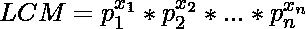

# 以 M 为模的 N 个数的 LCM

> 原文:[https://www.geeksforgeeks.org/lcm-of-n-numbers-modulo-m/](https://www.geeksforgeeks.org/lcm-of-n-numbers-modulo-m/)

给定一个整数数组 **arr[]** ，任务是找到数组所有元素的 [LCM](https://www.geeksforgeeks.org/lcm-and-hcf/) 模 **M** ，其中 **M = 10 <sup>9</sup> + 7** 。
**示例:**

> **输入:** arr[] = {10000000，12345，159873}
> **输出:** 780789722
> LCM 的(100000000，12345，159873)为 131575479000000
> 1315754790000000% 10000000000

**方法:**如果你已经看完了计算数组元素 LCM 的[帖子](https://www.geeksforgeeks.org/lcm-of-given-array-elements/)，第一个想到的方法就是在计算*T5】ansT7】和*T9】arr【I】T11】的 LCM 时，每一步都取模。** 

> ans = 1
> //对于 i = 1 到 n–1
> ans = LCM(ans，arr[i]) % 1000000007 //错误的方法

但是，这种方法是错误的，错误可以在下面的示例中实现:

> 取 M = 41 和 arr[] = {13，18，30}
> 不正确解:
> LCM(13，18，30) % 41
> LCM(LCM(13，18) % 41，30) % 41
> LCM(234 % 41，30) % 41
> LCM(29，30) % 41
> 870 % 41
> 9
> 正确解:
> LCM

**注意:**每当 2 个数的 **LCM** 变成**T15【M】T5 时，进场不起作用。
**正确的方法**是[素因子分解](https://www.geeksforgeeks.org/print-all-prime-factors-of-a-given-number/)数组的元素，并跟踪每个元素的每个素的最高幂。LCM 将是这些素数在数组中提升到最高幂的乘积。
**插图** :** 

> 设元素为[36，480，500，343]
> 素分解结果:
> 36 = 2<sup>2</sup>* 3<sup>2</sup>T6】480 = 2<sup>5</sup>* 3 * 5
> 500 = 2<sup>2</sup>* 5<sup>3</sup>T14】343 = 7<sup>3</sup>T17】2 阿蒙格全阵最高幂 0，0) = 2
> 所有数组元素的最高 5 次方= Max(0，1，3，0) = 3
> 所有数组元素的最高 7 次方= Max(0，0，0，3) = 3
> 因此，LCM = 2<sup>5</sup>* 3<sup>2</sup>* 5<sup>3</sup>* 7<sup>3</sup>= 12348000

让 **p** 成为阵中某个元素的*素因子*，让 **x** 成为其在整个阵中的*最高功率*。然后，

> 

利用上述公式，我们可以很容易地计算出整个阵列的 LCM，我们的 MOD 问题也将得到解决。简化表达式，我们得到:

> 

由于模运算在乘法上是分布的，我们可以安全地写出下面的表达式。

> 

现在，问题出现了，如何有效地计算质因数及其幂。为此，我们可以用厄拉多塞的筛子。参考这篇文章:[用筛子计算质因数及其幂。](https://www.geeksforgeeks.org/print-all-prime-factors-and-their-powers/)
以下是上述办法的实施:

## C++

```
// C++ program to compute LCM of array elements modulo M
#include <bits/stdc++.h>
#define F first
#define S second
#define MAX 10000003
using namespace std;

typedef long long ll;
const int mod = 1000000007;

int prime[MAX];
unordered_map<int, int> max_map;

// Function to return a^n
int power(int a, int n)
{
    if (n == 0)
        return 1;
    int p = power(a, n / 2) % mod;
    p = (p * p) % mod;
    if (n & 1)
        p = (p * a) % mod;
    return p;
}

// Function to find the smallest prime factors
// of numbers upto MAX
void sieve()
{
    prime[0] = prime[1] = 1;
    for (int i = 2; i < MAX; i++) {
        if (prime[i] == 0) {
            for (int j = i * 2; j < MAX; j += i) {
                if (prime[j] == 0) {
                    prime[j] = i;
                }
            }
            prime[i] = i;
        }
    }
}

// Function to return the LCM modulo M
ll lcmModuloM(const int* ar, int n)
{

    for (int i = 0; i < n; i++) {
        int num = ar[i];
        unordered_map<int, int> temp;

        // Temp stores mapping of prime factor to
        // its power for the current element
        while (num > 1) {

            // Factor is the smallest prime factor of num
            int factor = prime[num];

            // Increase count of factor in temp
            temp[factor]++;

            // Reduce num by its prime factor
            num /= factor;
        }

        for (auto it : temp) {

            // Store the highest power of every prime
            // found till now in a new map max_map
            max_map[it.first] = max(max_map[it.first], it.second);
        }
    }

    ll ans = 1;

    for (auto it : max_map) {

        // LCM is product of primes to their highest powers modulo M
        ans = (ans * power(it.F, it.S)) % mod;
    }

    return ans;
}

// Driver code
int main()
{
    sieve();
    int arr[] = { 36, 500, 480, 343 };
    int n = sizeof(arr) / sizeof(arr[0]);
    cout << lcmModuloM(arr, n);
    return 0;
}
```

## Java 语言(一种计算机语言，尤用于创建网站)

```
// Java program to compute LCM of
// array elements modulo M
import java.util.*;

class GFG{

final static int MAX = 10000003;
final static int mod = 1000000007;
static int[] prime = new int[MAX];

// Function to return a^n    
public static int power(int a, int n)
{
    if(n == 0)
       return 1;

    int p = power(a, n / 2) % mod;
    p = (p * p) % mod;

    if((n & 1) > 0)
       p = (p * a) % mod;

    return p;
}

// Function to find the smallest prime
// factors of numbers upto MAX
public static void sieve()
{
    prime[0] = 1;
    prime[1] = 1;

    for(int i = 2; i < MAX; i++)
    {
       if(prime[i] == 0)
       {
           for(int j = i * 2;
                   j < MAX; j += i)
           {
              if(prime[j] == 0)
              {
                  prime[j] = i;
              }
           }
           prime[i] = i;
       }
    } 
}

// Function to return the LCM modulo M    
public static long lcmModuloM(int[] arr, int n)
{
    HashMap<Integer,
            Integer> maxMap = new HashMap<>();

    for(int i = 0; i < n; i++)
    {
        HashMap<Integer,
                Integer> temp = new HashMap<>();
        int num = arr[i];

        // Temp stores mapping of prime 
        // factor to its power for the
        // current element
        while(num > 1)
        {

            // Factor is the smallest prime
            // factor of num
            int factor = prime[num];

            if(temp.containsKey(factor))
               temp.put(factor, temp.get(factor) + 1);
            else
               temp.put(factor, 1);

            // Factor is the smallest prime
            // factor of num    
            num = num / factor;
        }

        for(Map.Entry<Integer,
                      Integer> m : temp.entrySet())
        {
           if(maxMap.containsKey(m.getKey()))
           {
               int maxPower = Math.max(m.getValue(),
                                       maxMap.get(
                                       m.getKey()));
               maxMap.put(m.getKey(), maxPower);
           }
           else
           {
               maxMap.put(m.getKey(),m.getValue());
           }
        }
    }

    long ans = 1;
    for(Map.Entry<Integer,
                  Integer> m : maxMap.entrySet())
    {

       // LCM is product of primes to their
       // highest powers modulo M
       ans = (ans * power(m.getKey(),
                          m.getValue()) % mod);
    }

    return ans;
}

// Driver code   
public static void main(String[] args)
{
    sieve();
    int[] arr = new int[]{36, 500, 480, 343 };
    int n = arr.length;

    System.out.println(lcmModuloM(arr, n));
}
}

// This code is contributed by parshavnahta97
```

## 蟒蛇 3

```
# Python3 program to compute LCM of
# array elements modulo M
MAX = 10000003

mod = 1000000007

prime = [0 for i in range(MAX)]

max_map = dict()

# function to return a^n
def power(a, n):

    if n == 0:
        return 1
    p = power(a, n // 2) % mod
    p = (p * p) % mod

    if n & 1:
        p = (p * a) % mod
    return p

# function to find the smallest prime
# factors of numbers upto MAX
def sieve():
    prime[0], prime[1] = 1, 1
    for i in range(2, MAX):
        if prime[i] == 0:
            for j in range(i * 2, MAX, i):
                if prime[j] == 0:
                    prime[j] = i
            prime[i] = i

# function to return the LCM modulo M
def lcmModuloM(arr, n):

    for i in range(n):
        num = arr[i]

        temp = dict()

        # temp stores mapping of prime factors
        # to its power for the current element
        while num > 1:

            # factor is the smallest prime
            # factor of num
            factor = prime[num]

            # Increase count of factor in temp
            if factor in temp.keys():
                temp[factor] += 1
            else:
                temp[factor] = 1

            # Reduce num by its prime factor
            num = num // factor

        for i in temp:
            # store the highest power of every prime
            # found till now in a new map max_map
            if i in max_map.keys():
                max_map[i] = max(max_map[i], temp[i])
            else:
                max_map[i] = temp[i]

    ans = 1

    for i in max_map:

        # LCM is product of primes to their
        # highest powers modulo M
        ans = (ans * power(i, max_map[i])) % mod
    return ans

# Driver code
sieve()
arr = [36, 500, 480, 343]
n = len(arr)
print(lcmModuloM(arr, n))

# This code is contributed
# by Mohit kumar 29
```

## C#

```
// C# program to compute LCM of
// array elements modulo M
using System;
using System.Collections.Generic;
class GFG{

readonly static int MAX = 10000003;
readonly static int mod = 1000000007;
static int[] prime = new int[MAX];

// Function to return a^n    
public static int power(int a,
                        int n)
{
  if(n == 0)
    return 1;

  int p = power(a, n / 2) %
          mod;
  p = (p * p) % mod;

  if((n & 1) > 0)
    p = (p * a) % mod;

  return p;
}

// Function to find the smallest
// prime factors of numbers upto
// MAX
public static void sieve()
{
  prime[0] = 1;
  prime[1] = 1;

  for(int i = 2; i < MAX; i++)
  {
    if(prime[i] == 0)
    {
      for(int j = i * 2;
              j < MAX; j += i)
      {
        if(prime[j] == 0)
        {
          prime[j] = i;
        }
      }
      prime[i] = i;
    }
  } 
}

// Function to return the
// LCM modulo M    
public static long lcmModuloM(int[] arr,
                              int n)
{
  Dictionary<int,
             int> maxMap =
             new Dictionary<int,
                            int>();

  for(int i = 0; i < n; i++)
  {
    Dictionary<int,
               int> temp =
               new Dictionary<int,
                              int>();
    int num = arr[i];

    // Temp stores mapping of prime 
    // factor to its power for the
    // current element
    while(num > 1)
    {
      // Factor is the smallest
      // prime factor of num
      int factor = prime[num];

      if(temp.ContainsKey(factor))
        temp[factor]++;
      else
        temp.Add(factor, 1);

      // Factor is the smallest
      // prime factor of num    
      num = num / factor;
    }

    foreach(KeyValuePair<int,
                         int> m in temp)
    {
      if(maxMap.ContainsKey(m.Key))
      {
        int maxPower = Math.Max(m.Value,
                                maxMap[m.Key]);
        maxMap[m.Key] = maxPower;
      }
      else
      {
        maxMap.Add(m.Key,m.Value);
      }
    }
  }

  long ans = 1;
  foreach(KeyValuePair<int,
                       int> m in maxMap)
  {
    // LCM is product of primes to their
    // highest powers modulo M
    ans = (ans * power(m.Key,
                       m.Value) %
                       mod);
  }

  return ans;
}

// Driver code   
public static void Main(String[] args)
{
  sieve();
  int[] arr = new int[]{36, 500,
                        480, 343};
  int n = arr.Length;
  Console.WriteLine(lcmModuloM(arr, n));
}
}

// This code is contributed by 29AjayKumar
```

## java 描述语言

```
<script>

// Javascript program to compute LCM of
// array elements modulo M
let MAX = 10000003;
let mod = 1000000007;
let prime = new Array(MAX);
for(let i = 0; i < MAX; i++)
{   
    prime[i] = 0;
}

// Function to return a^n          
function power(a, n)
{
    if(n == 0)
       return 1;

    let p = power(a, n / 2) % mod;
    p = (p * p) % mod;

    if((n & 1) > 0)
       p = (p * a) % mod;

    return p;
}

// Function to find the smallest prime
// factors of numbers upto MAX
function sieve()
{
    prime[0] = 1;
    prime[1] = 1;

    for(let i = 2; i < MAX; i++)
    {
       if(prime[i] == 0)
       {
           for(let j = i * 2;
                   j < MAX; j += i)
           {
              if(prime[j] == 0)
              {
                  prime[j] = i;
              }
           }
           prime[i] = i;
       }
    }
}

// Function to return the LCM modulo M   
function lcmModuloM(arr,n)
{
    let maxMap = new Map();

    for(let i = 0; i < n; i++)
    {
        let temp = new Map();
        let num = arr[i];

        // Temp stores mapping of prime
        // factor to its power for the
        // current element
        while(num > 1)
        {

            // Factor is the smallest prime
            // factor of num
            let factor = prime[num];

            if(temp.has(factor))
               temp.set(factor, temp.get(factor) + 1);
            else
               temp.set(factor, 1);

            // Factor is the smallest prime
            // factor of num   
            num = num / factor;
        }

        for(let [key, value] of temp.entries())
        {
           if(maxMap.has(key))
           {
               let maxPower = Math.max(value,
                                       maxMap.get(
                                       key));
               maxMap.set(key, maxPower);
           }
           else
           {
               maxMap.set(key,value);
           }
        }
    }

    let ans = 1;
    for(let [key, value] of maxMap.entries())
    {

       // LCM is product of primes to their
       // highest powers modulo M
       ans = (ans * power(key,
                          value) % mod);
    }    
    return ans;
}

// Driver code  
sieve();
let arr = [36, 500, 480, 343];
let n = arr.length;
document.write(lcmModuloM(arr, n));

// This code is contributed by unknown2108.
</script>
```

**Output:** 

```
12348000
```

上述代码适用于以下约束:

![1 <= N <= 10^6 \newline 1 <= A[i] <= 10^7       ](img/0081a5625b6ce17b99df02cc4840c46a.png "Rendered by QuickLaTeX.com")

**参考文献:**[https://stackoverflow . com/questions/16633449/calculate-LCM-of-n-numbers-modal-1000000007](https://stackoverflow.com/questions/16633449/calculate-lcm-of-n-numbers-modulo-1000000007)