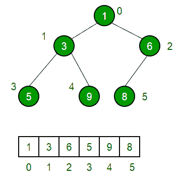

# 二进制堆数据结构中的叶起始点

> 原文:[https://www . geesforgeks . org/leaf-起点-二进制-堆-数据-结构/](https://www.geeksforgeeks.org/leaf-starting-point-binary-heap-data-structure/)

[二进制堆](https://www.geeksforgeeks.org/binary-heap/)是一个完整的树(除了可能的最后一级，所有级别都被完全填充，最后一级尽可能保留所有键)。换句话说，我们可以说它是一棵几乎完整的二叉树。

一个[二进制堆](https://www.geeksforgeeks.org/binary-heap/)通常表示为数组。如果我们仔细看一下，我们可以注意到，在节点数为 n 的堆中，叶子从一个特定的索引开始，然后跟随它，直到索引 n，所有的节点都是叶子。

让我们看一个例子来观察这一点:

```
            10 
         /      \               
       20        100          
      /                      
    30                     

```

让我们以数组 Arr 的形式来表示它，数组的索引从 1 开始:
我们有:
Arr[1]= 10
Arr[2]= 20
Arr[3]= 100
Arr[4]= 30
如果我们观察，第一片叶子(即 100)从索引 3 开始。紧随其后的是一片叶子。

通过仔细分析，观察到以下结论:

> 堆中的第一片叶子从**【楼层(n/2)】+1**开始，一直到
> **n** 的所有节点都是叶子。

结论:在有 n 个元素的堆中，从索引 **[(楼层(n/2)+1)到 n]** 的元素是叶子。

**如果索引从 0 开始而不是从 1 开始，那么叶子的开始索引是什么？**
上面的解释假设索引从 1 开始，但是在大多数编程语言中，索引从 0 开始。


> 如果我们以 0 为起始指标，那么叶子从**层(n/2)** 开始，一直存在到结束，即(n-1)。

本文由 [**【巨然活女神】**](https://auth.geeksforgeeks.org/profile.php?user=Ranju Kumari) 供稿。如果你喜欢 GeeksforGeeks 并想投稿，你也可以使用[contribute.geeksforgeeks.org](http://www.contribute.geeksforgeeks.org)写一篇文章或者把你的文章邮寄到 contribute@geeksforgeeks.org。看到你的文章出现在极客博客主页上，帮助其他极客。

如果你发现任何不正确的地方，或者你想分享更多关于上面讨论的话题的信息，请写评论。