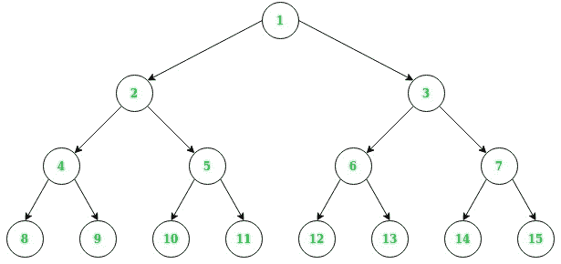

# 二叉树中任意数量节点的最小公共祖先

> 原文:[https://www . geesforgeks . org/二进制树中任意数量节点的最小公共祖先/](https://www.geeksforgeeks.org/least-common-ancestor-of-any-number-of-nodes-in-binary-tree/)

给定一棵二叉树(不是二叉查找树树)和任意数量的关键节点，任务是找到所有关键节点的最小公共祖先。

**以下是** [**维基百科**](http://en.wikipedia.org/wiki/Lowest_common_ancestor) **对 LCA 的定义:**
让 T 成为一棵扎根的树。两个节点 n1 和 n2 之间的最低公共祖先被定义为 T 中同时具有 n1 和 n2 作为后代的最低节点(这里我们允许一个节点是其自身的后代)。

T 中任意数量节点的 LCA 是离根最远的节点的共享共同祖先。



**例:**上图中:

```
LCA of nodes 12, 14, 15 is node 3
LCA of nodes 3, 14, 15 is node 3
LCA of nodes 6, 7, 15 is node 3
LCA of nodes 5, 13, 14, 15 is node 1
LCA of nodes 6, 12 is node 6
```

**方法:**
以下是针对任意数量节点的最小共同祖先的简单方法。

*   对于每个节点，计算该节点及其子树的匹配节点数。
    *   如果根也是匹配的节点。

> 匹配节点=左侧子树中的匹配节点+右侧子树中的匹配节点+ 1

*   如果根不是匹配的节点。

> 匹配节点=匹配左子树中的节点+匹配右子树中的节点

*   如果任何节点上的匹配节点计数等于键的数量，则将该节点添加到祖先列表中。
*   祖先列表中的第一个节点是所有给定键的最小公共祖先。

下面是上述方法的实现。

## C++

```
// C++ implementation to find
// Ancestors of any number of nodes
#include <bits/stdc++.h>
using namespace std;

// Tree Class
class TreeNode
{
    public:
        int data;
        TreeNode *left, *right;

        TreeNode(int value)
        {
            this->data = value;
            this->left = NULL;
            this->right = NULL;
        }
};

int getKeysCount(TreeNode *root, vector<int> &keyNodes,
                 int matchingNodes,
                 vector<TreeNode *> &ancestors)
{

    // Base Case. When root is Null
    if (root == NULL)
    {
        return 0;
    }

    // Search for left and right subtree
    // for matching child Key Node.
    matchingNodes += getKeysCount(root->left, keyNodes,
                                  matchingNodes, ancestors) +
                     getKeysCount(root->right, keyNodes,
                                  matchingNodes, ancestors);

    // Condition to check if Root Node
    // is also in Key Node
    if (find(keyNodes.begin(),
             keyNodes.end(), root->data) != keyNodes.end())
    {
        matchingNodes++;
    }

    // Condition when matching Nodes is
    // equal to the Key Nodes found
    if (matchingNodes == keyNodes.size())
    {
        ancestors.push_back(root);
    }

    return matchingNodes;
}

// Function to find Least Common
// Ancestors of N number of nodes
TreeNode *lcaOfNodes(TreeNode *root,
                     vector<int> &keyNodes)
{

    // Create a new list for
    // capturing all the ancestors
    // of the given nodes
    vector<TreeNode *> ancestors;

    // Initially there is No Matching Nodes
    int matchingNodes = 0;
    getKeysCount(root, keyNodes,
                 matchingNodes, ancestors);

    // First Node in the Ancestors list
    // is the Least Common Ancestor of
    // Given keyNodes
    return ancestors[0];
}

// Driver Code
int main()
{

    // Creation of Tree
    TreeNode *root = new TreeNode(1);

    root->left = new TreeNode(2);
    root->right = new TreeNode(3);
    root->left->left = new TreeNode(4);
    root->left->right = new TreeNode(5);
    root->right->left = new TreeNode(6);
    root->right->right = new TreeNode(7);
    root->left->left->left = new TreeNode(8);
    root->left->left->right = new TreeNode(9);
    root->left->right->left = new TreeNode(10);
    root->left->right->right = new TreeNode(11);
    root->right->left->left = new TreeNode(12);
    root->right->left->right = new TreeNode(13);
    root->right->right->left = new TreeNode(14);
    root->right->right->right = new TreeNode(15);

    // Key Nodes for LCA
    vector<int> keyNodes;
    keyNodes.push_back(12);
    keyNodes.push_back(14);
    keyNodes.push_back(15);

    cout << lcaOfNodes(root, keyNodes)->data
         << endl;

    return 0;
}

// This code is contributed by sanjeev2552
```

## Java 语言(一种计算机语言，尤用于创建网站)

```
// Java implementation to find
// Ancestors of any number of nodes
import java.util.ArrayList;

// Tree Class
class TreeNode {
    int data;
    TreeNode left;
    TreeNode right;

    public TreeNode(int value)
    {
        this.data = value;
        left = right = null;
    }
}

public class LCAofAnyNumberOfNodes {

    // Function to find Least Common
    // Ancestors of N number of nodes
    public static TreeNode lcaOfNodes(
        TreeNode root,
        ArrayList<Integer> keyNodes)
    {
        // Create a new list for
        // capturing all the ancestors
        // of the given nodes
        ArrayList<TreeNode> ancestors =
                    new ArrayList<TreeNode>();

        // Initially there is No Matching Nodes
        int matchingNodes = 0;
        getKeysCount(root, keyNodes,
                 matchingNodes, ancestors);

        // First Node in the Ancestors list
        // is the Least Common Ancestor of
        // Given keyNodes
        return ancestors.get(0);
    }

    private static int getKeysCount(
        TreeNode root, ArrayList<Integer> keyNodes,
        int matchingNodes,
        ArrayList<TreeNode> ancestors)
    {
        // Base Case. When root is Null
        if (root == null)
            return 0;

        // Search for left and right subtree
        // for matching child Key Node.
        matchingNodes += getKeysCount(root.left,
                keyNodes, matchingNodes, ancestors)
            + getKeysCount(root.right,
                keyNodes, matchingNodes, ancestors);

        // Condition to check if Root Node 
        // is also in Key Node
        if (keyNodes.contains(root.data)){
            matchingNodes++;
        }

        // Condition when matching Nodes is
        // equal to the Key Nodes found
        if (matchingNodes == keyNodes.size())
            ancestors.add(root);
        return matchingNodes;
    }

    // Driver Code
    public static void main(String[] args)
    {

        // Creation of Tree
        TreeNode root = new TreeNode(1);

        root.left = new TreeNode(2);
        root.right = new TreeNode(3);
        root.left.left = new TreeNode(4);
        root.left.right =
                        new TreeNode(5);
        root.right.left =
                        new TreeNode(6);
        root.right.right =
                        new TreeNode(7);
        root.left.left.left =
                        new TreeNode(8);
        root.left.left.right =
                        new TreeNode(9);
        root.left.right.left =
                        new TreeNode(10);
        root.left.right.right =
                        new TreeNode(11);
        root.right.left.left =
                        new TreeNode(12);
        root.right.left.right =
                        new TreeNode(13);
        root.right.right.left =
                        new TreeNode(14);
        root.right.right.right =
                        new TreeNode(15);

        // Key Nodes for LCA
        ArrayList<Integer> keyNodes =
                new ArrayList<Integer>();
        keyNodes.add(12);
        keyNodes.add(14);
        keyNodes.add(15);
        System.out.println(
            lcaOfNodes(root, keyNodes).data
        );
    }
}
```

## 蟒蛇 3

```
# Python3 implementation to find
# Ancestors of any number of nodes

# Tree Class
class TreeNode:
    def __init__(self, value):
        self.data = value
        self.left = None
        self.right = None

# Create a new list for
# capturing all the ancestors
# of the given nodes
ancestors =  []

# Function to find Least Common
# Ancestors of N number of nodes
def lcaOfNodes(root, keyNodes):

    # Initially there is No Matching Nodes
    matchingNodes = 0
    getKeysCount(root, keyNodes, matchingNodes)

    # First Node in the Ancestors list
    # is the Least Common Ancestor of
    # Given keyNodes
    ancestors[0].data-=1
    return ancestors[0]

def getKeysCount(root, keyNodes, matchingNodes):
    # Base Case. When root is Null
    if root == None:
        return 0

    # Search for left and right subtree
    # for matching child Key Node.
    matchingNodes += getKeysCount(root.left, keyNodes, matchingNodes) + getKeysCount(root.right, keyNodes, matchingNodes)

    # Condition to check if Root Node
    # is also in Key Node
    if keyNodes:
        matchingNodes+=1

    # Condition when matching Nodes is
    # equal to the Key Nodes found
    if matchingNodes == len(keyNodes):
        ancestors.append(root)
    return matchingNodes

# Creation of Tree
root = TreeNode(1)
root.left = TreeNode(2)
root.right = TreeNode(3)
root.left.left = TreeNode(4)
root.left.right = TreeNode(5)
root.right.left = TreeNode(6)
root.right.right = TreeNode(7)
root.left.left.left = TreeNode(8)
root.left.left.right = TreeNode(9)
root.left.right.left = TreeNode(10)
root.left.right.right = TreeNode(11)
root.right.left.left = TreeNode(12)
root.right.left.right = TreeNode(13)
root.right.right.left = TreeNode(14)
root.right.right.right = TreeNode(15)

# Key Nodes for LCA
keyNodes = []
keyNodes.append(12)
keyNodes.append(14)
keyNodes.append(15)
tmp = lcaOfNodes(root, keyNodes)
print(tmp.data)

# This code is contributed by suresh07.
```

## C#

```
// C# implementation to find
// Ancestors of any number of nodes
using System;
using System.Collections.Generic;

// Tree Class
class TreeNode {
    public int data;
    public TreeNode left;
    public TreeNode right;

    public TreeNode(int value)
    {
        this.data = value;
        left = right = null;
    }
}

public class LCAofAnyNumberOfNodes {

    // Function to find Least Common
    // Ancestors of N number of nodes
    static TreeNode lcaOfNodes(
        TreeNode root,
        List<int> keyNodes)
    {
        // Create a new list for
        // capturing all the ancestors
        // of the given nodes
        List<TreeNode> ancestors =
                    new List<TreeNode>();

        // Initially there is No Matching Nodes
        int matchingNodes = 0;
        getKeysCount(root, keyNodes,
                 matchingNodes, ancestors);

        // First Node in the Ancestors list
        // is the Least Common Ancestor of
        // Given keyNodes
        return ancestors[0];
    }

    private static int getKeysCount(
        TreeNode root, List<int> keyNodes,
        int matchingNodes,
        List<TreeNode> ancestors)
    {
        // Base Case. When root is Null
        if (root == null)
            return 0;

        // Search for left and right subtree
        // for matching child Key Node.
        matchingNodes += getKeysCount(root.left,
                keyNodes, matchingNodes, ancestors)
            + getKeysCount(root.right,
                keyNodes, matchingNodes, ancestors);

        // Condition to check if Root Node 
        // is also in Key Node
        if (keyNodes.Contains(root.data)){
            matchingNodes++;
        }

        // Condition when matching Nodes is
        // equal to the Key Nodes found
        if (matchingNodes == keyNodes.Count)
            ancestors.Add(root);
        return matchingNodes;
    }

    // Driver Code
    public static void Main(String[] args)
    {

        // Creation of Tree
        TreeNode root = new TreeNode(1);

        root.left = new TreeNode(2);
        root.right = new TreeNode(3);
        root.left.left = new TreeNode(4);
        root.left.right =
                        new TreeNode(5);
        root.right.left =
                        new TreeNode(6);
        root.right.right =
                        new TreeNode(7);
        root.left.left.left =
                        new TreeNode(8);
        root.left.left.right =
                        new TreeNode(9);
        root.left.right.left =
                        new TreeNode(10);
        root.left.right.right =
                        new TreeNode(11);
        root.right.left.left =
                        new TreeNode(12);
        root.right.left.right =
                        new TreeNode(13);
        root.right.right.left =
                        new TreeNode(14);
        root.right.right.right =
                        new TreeNode(15);

        // Key Nodes for LCA
        List<int> keyNodes = new List<int>();
        keyNodes.Add(12);
        keyNodes.Add(14);
        keyNodes.Add(15);
        Console.WriteLine(
            lcaOfNodes(root, keyNodes).data
        );
    }
}

// This code is contributed by PrinciRaj1992
```

## java 描述语言

```
<script>

// JavaScript implementation to find
// Ancestors of any number of nodes

// Tree Class
class TreeNode {

    constructor(value)
    {
        this.data = value;
        this.left = null;
        this.right = null;
    }
}

// Create a new list for
// capturing all the ancestors
// of the given nodes
var ancestors =  [];

// Function to find Least Common
// Ancestors of N number of nodes
function lcaOfNodes( root, keyNodes)
{

    // Initially there is No Matching Nodes
    var matchingNodes = 0;
    getKeysCount(root, keyNodes,
             matchingNodes);

    // First Node in the Ancestors list
    // is the Least Common Ancestor of
    // Given keyNodes
    return ancestors[0];
}

function getKeysCount( root, keyNodes, matchingNodes)
{
    // Base Case. When root is Null
    if (root == null)
        return 0;

    // Search for left and right subtree
    // for matching child Key Node.
    matchingNodes += getKeysCount(root.left,
            keyNodes, matchingNodes)
        + getKeysCount(root.right,
            keyNodes, matchingNodes);

    // Condition to check if Root Node 
    // is also in Key Node
    if (keyNodes.includes(root.data)){
        matchingNodes++;
    }

    // Condition when matching Nodes is
    // equal to the Key Nodes found
    if (matchingNodes == keyNodes.length)
        ancestors.push(root);
    return matchingNodes;
}

// Driver Code
// Creation of Tree
var root = new TreeNode(1);
root.left = new TreeNode(2);
root.right = new TreeNode(3);
root.left.left = new TreeNode(4);
root.left.right =
                new TreeNode(5);
root.right.left =
                new TreeNode(6);
root.right.right =
                new TreeNode(7);
root.left.left.left =
                new TreeNode(8);
root.left.left.right =
                new TreeNode(9);
root.left.right.left =
                new TreeNode(10);
root.left.right.right =
                new TreeNode(11);
root.right.left.left =
                new TreeNode(12);
root.right.left.right =
                new TreeNode(13);
root.right.right.left =
                new TreeNode(14);
root.right.right.right =
                new TreeNode(15);

// Key Nodes for LCA
var keyNodes = [];
keyNodes.push(12);
keyNodes.push(14);
keyNodes.push(15);
var tmp = lcaOfNodes(root, keyNodes);
document.write(tmp.data);

</script>
```

**Output:** 

```
3
```