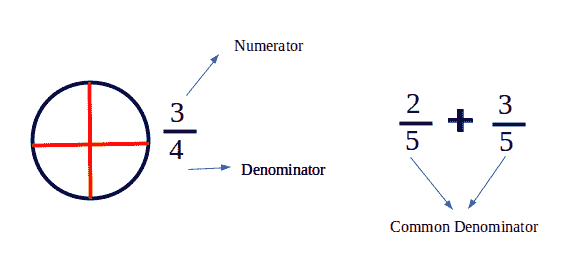
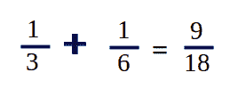
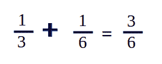

# 最小公分母(液晶显示器)

> 原文:[https://www.geeksforgeeks.org/least-common-denominator-lcd/](https://www.geeksforgeeks.org/least-common-denominator-lcd/)

**最小公分母**或**最小公分母**是一组分数分母的[最小公倍数](https://www.geeksforgeeks.org/c-program-find-lcm-two-numbers/)。



**公分母**:两个或两个以上分数的分母相同时。
最小公分母是所有公分母中最小的。
为什么我们需要**液晶**？
简化了加减法和比分数。
公分母可以简单地通过乘以分母来计算。在这种情况下，3 * 6 = 18



但这可能并不总是最小公分母，因为在这种情况下，液晶显示器= 6，而不是 18。液晶显示器实际上是分母的液晶显示器。
**例:**

```
LCD for fractions 5/12 and 7/15 is 60.
We can write both fractions as 25/60 and
28/60 so that they can be added and 
subtracted easily.

LCD for fractions 1/3 and 4/7 is 21.
```



例题:给定两个分数，用最小公约数求它们的和。
**例** :

```
Input :  1/6  +  7/15    
Output : 19/30
         Explanation : LCM of 6 and 15 is 30\. 
         So, 5/30  +  14/30 = 19/30 
Input :  1/3  +  1/6
Output : 3/6
         Explanation : LCM of 3 and 6 is 6\. 
         So, 2/6  +  1/6 = 3/6
```

**注*** 这些答案可以通过反常抵消进一步简化。

## C++

```
// C++ Program to determine
// LCD of two fractions and
// Perform addition on fractions
#include <iostream>
using namespace std;

// function to calculate gcd
// or hcf of two numbers.
int gcd(int a, int b)
{
    if (a == 0)
        return b;
    return gcd(b % a, a);
}

// function to calculate
// lcm of two numbers.
int lcm(int a, int b)
{
    return (a * b) / gcd(a, b);
}

void printSum(int num1, int den1,
              int num2, int den2)
{
    // least common multiple
    // of denominators LCD
    // of 6 and 15 is 30.
    int lcd = lcm(den1, den2);

    // Computing the numerators for LCD:
    // Writing 1/6 as 5/30 and 7/15 as
    // 14/30
    num1 *= (lcd / den1);
    num2 *= (lcd / den2);

    // Our sum is going to be res_num/lcd
    int res_num = num1 + num2;
    cout << res_num << "/" << lcd;
}

// Driver Code
int main()
{
    // First fraction is 1/6
    int num1 = 1, den1 = 6;

    // Second fraction is 7/15
    int num2 = 7, den2 = 15;

    printSum(num1, den1, num2, den2);
    return 0;
}
```

## Java 语言(一种计算机语言，尤用于创建网站)

```
// Java Program to determine LCD of two
// fractions and Perform addition on
// fractions
public class GFG {

    // function to calculate gcd or
    // hcf of two numbers.
    static int gcd(int a, int b)
    {
        if (a == 0)
            return b;

        return gcd(b % a, a);
    }

    // function to calculate lcm of
    // two numbers.
    static int lcm(int a, int b)
    {
        return (a * b) / gcd(a, b);
    }

    static void printSum(int num1, int den1,
                         int num2, int den2)
    {

        // least common multiple of
        // denominators LCD of 6 and 15
        // is 30.
        int lcd = lcm(den1, den2);

        // Computing the numerators for LCD:
        // Writing 1/6 as 5/30 and 7/15 as
        // 14/30
        num1 *= (lcd / den1);
        num2 *= (lcd / den2);

        // Our sum is going to be res_num/lcd
        int res_num = num1 + num2;

        System.out.print( res_num + "/" + lcd);
    }

    // Driver code
    public static void main(String args[])
    {

        // First fraction is 1/6
        int num1 = 1, den1 = 6;

        // Second fraction is 7/15
        int num2 = 7, den2 = 15;

        printSum(num1, den1, num2, den2);
    }
}

// This code is contributed by Sam007.
```

## 蟒蛇 3

```
# python Program to determine
# LCD of two fractions and
# Perform addition on fractions

# function to calculate gcd
# or hcf of two numbers.
def gcd(a, b):

    if (a == 0):
        return b
    return gcd(b % a, a)

# function to calculate
# lcm of two numbers.
def lcm(a, b):

    return (a * b) / gcd(a, b)

def printSum(num1, den1,
                  num2, den2):

    # least common multiple
    # of denominators LCD
    # of 6 and 15 is 30.
    lcd = lcm(den1, den2);

    # Computing the numerators
    # for LCD: Writing 1/6 as
    # 5/30 and 7/15 as 14/30
    num1 *= (lcd / den1)
    num2 *= (lcd / den2)

    # Our sum is going to be
    # res_num/lcd
    res_num = num1 + num2;
    print( int(res_num) , "/" ,
                       int(lcd))

# Driver Code
# First fraction is 1/6
num1 = 1
den1 = 6

# Second fraction is 7/15
num2 = 7
den2 = 15
printSum(num1, den1, num2, den2);

# This code is contributed
# by Sam007
```

## C#

```
// C# Program to determine LCD of two
// fractions and Perform addition on
// fractions
using System;

class GFG {

    // function to calculate gcd or
    // hcf of two numbers.
    static int gcd(int a, int b)
    {
        if (a == 0)
            return b;

        return gcd(b % a, a);
    }

    // function to calculate lcm of
    // two numbers.
    static int lcm(int a, int b)
    {
        return (a * b) / gcd(a, b);
    }

    static void printSum(int num1, int den1,
                         int num2, int den2)
    {

        // least common multiple of
        // denominators LCD of 6 and 15
        // is 30.
        int lcd = lcm(den1, den2);

        // Computing the numerators for LCD:
        // Writing 1/6 as 5/30 and 7/15 as
        // 14/30
        num1 *= (lcd / den1);
        num2 *= (lcd / den2);

        // Our sum is going to be res_num/lcd
        int res_num = num1 + num2;

        Console.Write( res_num + "/" + lcd);
    }

    // Driver code
    public static void Main ()
    {

        // First fraction is 1/6
        int num1 = 1, den1 = 6;

        // Second fraction is 7/15
        int num2 = 7, den2 = 15;

        printSum(num1, den1, num2, den2);
    }
}

// This code is contributed by Sam007.
```

## 服务器端编程语言（Professional Hypertext Preprocessor 的缩写）

```
<?php
// PHP Program to determine
// LCD of two fractions and
// Perform addition on fractions

// function to calculate gcd
// or hcf of two numbers.
function gcd($a,$b)
{
    if ($a == 0)
        return $b;
    return gcd($b % $a, $a);
}

// function to calculate
// lcm of two numbers.
function lcm($a,$b)
{
    return ($a * $b) / gcd($a, $b);
}

function printSum($num1, $den1,
                  $num2, $den2)
{
    // least common multiple
    // of denominators
    // LCD of 6 and 15 is 30.
    $lcd = lcm($den1, $den2);

    // Computing the numerators for LCD:
    // Writing 1/6 as 5/30 and 7/15 as
    // 14/30
    $num1 *= ($lcd / $den1);
    $num2 *= ($lcd / $den2);

    // Our sum is going to be res_num/lcd
    $res_num = $num1 + $num2;
    echo $res_num . "/" . $lcd;
}
    // Driver Code
    // First fraction is 1/6
    $num1 = 1;
    $den1 = 6;

    // Second fraction is 7/15
    $num2 = 7;
    $den2 = 15;

    printSum($num1, $den1, $num2, $den2);

// This code is contributed by Sam007.
?>
```

## java 描述语言

```
<script>
// javascript Program to determine LCD of two
// fractions and Perform addition on
// fractions

    // function to calculate gcd or
    // hcf of two numbers.
    function gcd(a , b)
    {
        if (a == 0)
            return b;

        return gcd(b % a, a);
    }

    // function to calculate lcm of
    // two numbers.
    function lcm(a , b)
    {
        return (a * b) / gcd(a, b);
    }

    function printSum(num1 , den1 , num2 , den2)
    {

        // least common multiple of
        // denominators LCD of 6 and 15
        // is 30.
        var lcd = lcm(den1, den2);

        // Computing the numerators for LCD:
        // Writing 1/6 as 5/30 and 7/15 as
        // 14/30
        num1 *= (lcd / den1);
        num2 *= (lcd / den2);

        // Our sum is going to be res_num/lcd
        var res_num = num1 + num2;

        document.write(res_num + "/" + lcd);
    }

    // Driver code

        // First fraction is 1/6
        var num1 = 1, den1 = 6;

        // Second fraction is 7/15
        var num2 = 7, den2 = 15;

        printSum(num1, den1, num2, den2);

// This code is contributed by todaysgaurav
</script>
```

**输出:**

```
19/30
```

本文由 [**舒巴姆拉纳**](https://auth.geeksforgeeks.org/profile.php?user=shubham_rana_77&list=practice) 供稿。如果你喜欢 GeeksforGeeks 并想投稿，你也可以使用[contribute.geeksforgeeks.org](http://www.contribute.geeksforgeeks.org)写一篇文章或者把你的文章邮寄到 contribute@geeksforgeeks.org。看到你的文章出现在极客博客主页上，帮助其他极客。
如果发现有不正确的地方，或者想分享更多关于上述话题的信息，请写评论。