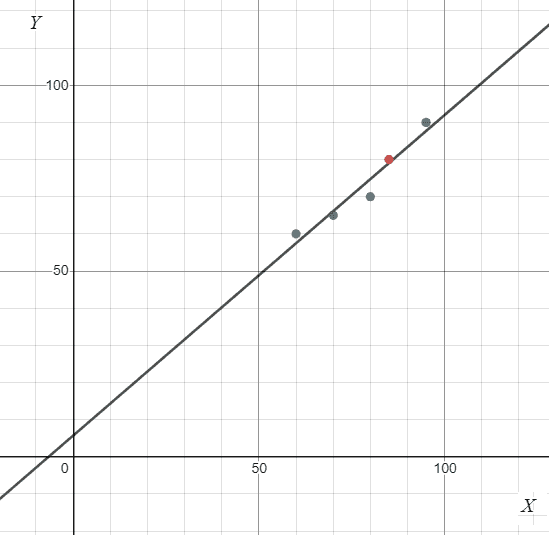
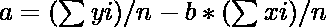
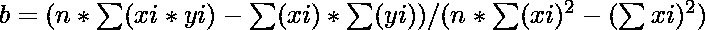

# 最小二乘回归线

> 原文:[https://www.geeksforgeeks.org/least-square-regression-line/](https://www.geeksforgeeks.org/least-square-regression-line/)

给定一组 **(X，Y)** 形式的坐标，任务是找到能形成的最少的回归线。

> 在统计学中，[线性回归](https://www.geeksforgeeks.org/linear-regression-python-implementation/)是一种线性方法，用于模拟标量响应(或因变量)如 Y 和一个或多个解释变量(或自变量)如 X 之间的关系。
> **回归线**:如果我们的数据显示 X 和 Y 之间存在线性关系，那么最能描述这种关系的直线就是回归线。它是覆盖图中最大点的直线。

**例:**

> **输入:**X =【95，85，80，70，60】
> Y =【90，80，70，65，60】
> T4】输出:Y = 5.685+0.863 * X
> T7】说明:
> 下面给出的数据图形为:
> X =【95，85，80，70，60】
> Y =【90
> 
> 
> 
> 该图显示回归线是覆盖最大点的线。
> **输入:**X =【100，95，85，80，70，60】
> Y =【90，95，80，70，65，60】
> T5】输出: Y = 4.007 + 0.89*X

**进场:**

> 回归线给出为 **Y = a + b*X** ，其中 **b** 和 **a** 的公式给出为:
> **b =(nσ(x<sub>I</sub>y<sub>I</sub>)–σ(x<sub>I</sub>)σ(y<sub>I</sub>)】(nσ(x<sub>I</sub><sup>2</sup>**

1.  要找到回归线，我们需要找到 a 和 b。
2.  计算 a，由给出
3.  计算 b，由
    给出
4.  把 a 和 b 的值放在回归线方程中。

下面是上述方法的实现。

## C++

```
// C++ program to find the
// regression line
#include<bits/stdc++.h>
using namespace std;

// Function to calculate b
double calculateB(int x[], int y[], int n)
{

    // sum of array x
    int sx = accumulate(x, x + n, 0);

    // sum of array y
    int sy = accumulate(y, y + n, 0);

    // for sum of product of x and y
    int sxsy = 0;

    // sum of square of x
    int sx2 = 0;
    for(int i = 0; i < n; i++)
    {
        sxsy += x[i] * y[i];
         sx2 += x[i] * x[i];
    }
    double b = (double)(n * sxsy - sx * sy) /
                       (n * sx2 - sx * sx);

    return b;
}

// Function to find the
// least regression line
void leastRegLine( int X[], int Y[], int n)
{

    // Finding b
    double b = calculateB(X, Y, n);

    int meanX = accumulate(X, X + n, 0) / n;
    int meanY = accumulate(Y, Y + n, 0) / n;

    // Calculating a
    double a = meanY - b * meanX;

    // Printing regression line
    cout << ("Regression line:") << endl;
    cout << ("Y = ");
    printf("%.3f + ", a);
    printf("%.3f *X", b);
}

// Driver code
int main()
{

    // Statistical data
    int X[] = { 95, 85, 80, 70, 60 };
    int Y[] = { 90, 80, 70, 65, 60 };

    int n = sizeof(X) / sizeof(X[0]);

    leastRegLine(X, Y, n);
}

// This code is contributed by PrinciRaj1992
```

## Java 语言(一种计算机语言，尤用于创建网站)

```
// Java program to find the
// regression line

import java.util.Arrays;

public class GFG {

    // Function to calculate b
    private static double calculateB(
        int[] x, int[] y)
    {
        int n = x.length;

        // sum of array x
        int sx = Arrays.stream(x).sum();

        // sum of array y
        int sy = Arrays.stream(y).sum();

        // for sum of product of x and y
        int sxsy = 0;

        // sum of square of x
        int sx2 = 0;
        for (int i = 0; i < n; i++) {
            sxsy += x[i] * y[i];
            sx2 += x[i] * x[i];
        }
        double b = (double)(n * sxsy - sx * sy)
                   / (n * sx2 - sx * sx);

        return b;
    }

    // Function to find the
    // least regression line
    public static void leastRegLine(
        int X[], int Y[])
    {

        // Finding b
        double b = calculateB(X, Y);

        int n = X.length;
        int meanX = Arrays.stream(X).sum() / n;
        int meanY = Arrays.stream(Y).sum() / n;

        // calculating a
        double a = meanY - b * meanX;

        // Printing regression line
        System.out.println("Regression line:");
        System.out.print("Y = ");
        System.out.printf("%.3f", a);
        System.out.print(" + ");
        System.out.printf("%.3f", b);
        System.out.print("*X");
    }

    // Driver code
    public static void main(String[] args)
    {
        // statistical data
        int X[] = { 95, 85, 80, 70, 60 };
        int Y[] = { 90, 80, 70, 65, 60 };

        leastRegLine(X, Y);
    }
}
```

## 蟒蛇 3

```
# Python program to find the
# regression line

# Function to calculate b
def calculateB(x, y, n):

    # sum of array x
    sx = sum(x)

    # sum of array y
    sy = sum(y)

    # for sum of product of x and y
    sxsy = 0

    # sum of square of x
    sx2 = 0

    for i in range(n):
        sxsy += x[i] * y[i]
        sx2 += x[i] * x[i]
    b = (n * sxsy - sx * sy)/(n * sx2 - sx * sx)
    return b

# Function to find the
# least regression line
def leastRegLine(X,Y,n):

    # Finding b
    b = calculateB(X, Y, n)
    meanX = int(sum(X)/n)
    meanY = int(sum(Y)/n)

    # Calculating a
    a = meanY - b * meanX

    # Printing regression line
    print("Regression line:")
    print("Y = ", '%.3f'%a, " + ", '%.3f'%b, "*X", sep="")

# Driver code

# Statistical data
X = [95, 85, 80, 70, 60 ]
Y = [90, 80, 70, 65, 60 ]
n = len(X)
leastRegLine(X, Y, n)

# This code is contributed by avanitrachhadiya2155
```

## C#

```
// C# program to find the
// regression line
using System;
using System.Linq;

class GFG{

// Function to calculate b
private static double calculateB(int[] x,
                                 int[] y)
{
    int n = x.Length;

    // Sum of array x
    int sx = x.Sum();

    // Sum of array y
    int sy = y.Sum();

    // For sum of product of x and y
    int sxsy = 0;

    // Sum of square of x
    int sx2 = 0;
    for(int i = 0; i < n; i++)
    {
        sxsy += x[i] * y[i];
         sx2 += x[i] * x[i];
    }
    double b = (double)(n * sxsy - sx * sy) /
                       (n * sx2 - sx * sx);

    return b;
}

// Function to find the
// least regression line
public static void leastRegLine(int []X, int []Y)
{

    // Finding b
    double b = calculateB(X, Y);

    int n = X.Length;
    int meanX = X.Sum() / n;
    int meanY = Y.Sum() / n;

    // Calculating a
    double a = meanY - b * meanX;

    // Printing regression line
    Console.WriteLine("Regression line:");
    Console.Write("Y = ");
    Console.Write("{0:F3}",a );
    Console.Write(" + ");
    Console.Write("{0:F3}", b);
    Console.Write("*X");
}

// Driver code
public static void Main(String[] args)
{

    // Statistical data
    int []X = { 95, 85, 80, 70, 60 };
    int []Y = { 90, 80, 70, 65, 60 };

    leastRegLine(X, Y);
}
}

// This code is contributed by gauravrajput1
```

## java 描述语言

```
<script>
// Javascript program to find the
// regression line

// Function to calculate b
function calculateB(x,y)
{
    let n = x.length;

        // sum of array x
        let sx = x.reduce((a, b) => a + b, 0);

        // sum of array y
        let sy =y.reduce((a, b) => a + b, 0)

        // for sum of product of x and y
        let sxsy = 0;

        // sum of square of x
        let sx2 = 0;
        for (let i = 0; i < n; i++) {
            sxsy += x[i] * y[i];
            sx2 += x[i] * x[i];
        }
        let b = (n * sxsy - sx * sy)
                   / (n * sx2 - sx * sx);

        return b;
}

// Function to find the
    // least regression line
function leastRegLine(X,Y)
{
    // Finding b
        let b = calculateB(X, Y);

        let n = X.length;
        let meanX = X.reduce((a, b) => a + b, 0) / n;
        let meanY = Y.reduce((a, b) => a + b, 0) / n;

        // calculating a
        let a = meanY - b * meanX;

        // Printing regression line
        document.write("Regression line:<br>");
        document.write("Y = ");
        document.write( a.toFixed(3));
        document.write(" + ");
        document.write( b.toFixed(3));
        document.write("*X");
}

// Driver code
// statistical data
let X = [95, 85, 80, 70, 60 ];
let Y = [90, 80, 70, 65, 60];
leastRegLine(X, Y);

// This code is contributed by ab2127
</script>
```

**Output:** 

```
Regression line:
Y = 5.685 + 0.863*X
```