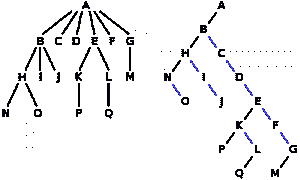
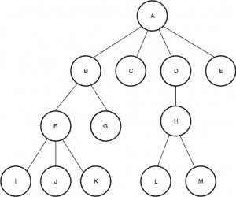
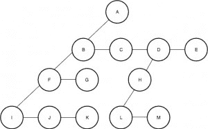

# 树的左-子右-兄弟表示

> 原文:[https://www . geesforgeks . org/left-child-right-同胞-表征-tree/](https://www.geeksforgeeks.org/left-child-right-sibling-representation-tree/)

计算机科学中的 n 元树是节点的集合，通常以下列方式分层表示。

1.  树从根节点开始。
2.  树的每个节点都有一个子节点的引用列表。
3.  一个节点的子节点数小于或等于 n。

n 元树的典型表示使用 n 个引用(或指针)的数组来存储子级(注意，n 是子级数量的上限)。我们能做得更好吗？左-子右-兄弟表示的思想是在每个节点中只存储两个指针。

**Left-Child Right Sibling Representation**

它是 n 元树的不同表示，其中一个节点只保存两个引用，第一个引用它的第一个子节点，另一个引用它的下一个兄弟节点，而不是保存对每个子节点的引用。这种新的转换不仅消除了预先了解节点子节点数量的需要，而且将引用数量限制在最多两个，从而使编码变得更加容易。需要注意的一点是，在前面的表示中，两个节点之间的链接表示父子关系，而在这个表示中，两个节点之间的链接可能表示父子关系或兄弟姐妹关系。

**优势:**
1。这种表示通过将每个节点所需的最大引用数限制为两个来节省内存。
2。更容易编码。

**劣势:**
1。像搜索/插入/删除这样的基本操作往往需要更长的时间，因为为了找到合适的位置，我们必须遍历要搜索/插入/删除的节点的所有兄弟节点(在最坏的情况下)。
左边的图像是 6 元树的正常表示，右边的图像是它对应的“左-子-右-兄弟”表示。



图片来源:https://en . Wikipedia . org/wiki/Left-child _ right-sibling _ binary _ tree

**一个示例问题:**
现在让我们来看一个问题，并尝试使用两个讨论过的表示来解决它。
给定一个家谱。在树中找到某个成员 X 的第 k 个子代。
用户输入两件事。
1。字符 P(代表要找到其孩子的父母)
2。整数 k(代表子数)
这个问题本身看起来很简单。这里唯一的问题是，一个节点可以拥有的最大子节点数量是未指定的，这使得构建树变得相当棘手。

示例:
考虑下面的家谱。



```
Input : A 2
Output : C
In this case, the user wishes to know A's
second child which according to the figure
is C.

Input : F 3
Output : K
Similar to the first case, the user wishes 
to know F's third child which is K.
```

**Method 1 (Storing n pointers with every node):**

在这个方法中，我们假设一个节点可以有最大数量的子节点，然后继续。这个方法唯一(明显)的问题是孩子数量的上限。如果该值太低，那么在某些情况下代码会失败，如果该值太高，那么大量的内存会被不必要地浪费掉。
如果程序员事先知道树的结构，那么上限可以设置为节点在该特定结构中的最大子节点数。但是即使在这种情况下，也会有一些内存浪费(所有节点可能不一定有相同数量的子节点，有些甚至可能更少。**例:叶节点没有子节点**。

## C++

```
// C++ program to find k-th child of a given
// node using typical representation that uses
// an array of pointers.
#include <iostream>
using namespace std;

// Maximum number of children
const int N = 10;

class Node
{
public:
    char val;
    Node * child[N];
    Node(char P)
    {
        val = P;
        for (int i=0; i<MAX; i++)
            child[i] = NULL;
    }
};

// Traverses given n-ary tree to find K-th
// child of P.
void printKthChild(Node *root, char P, int k)
{
    // If P is current root
    if (root->val == P)
    {
         if (root->child[k-1] == NULL)
             cout << "Error : Does not exist\n";
         else
             cout << root->child[k-1]->val << endl;
    }

    // If P lies in a subtree
    for (int i=0; i<N; i++)
        if (root->child[i] != NULL)
            printKthChild(root->child[i], P, k);
}

// Driver code
int main()
{
    Node *root = new Node('A');
    root->child[0] = new Node('B');
    root->child[1] = new Node('C');
    root->child[2] = new Node('D');
    root->child[3] = new Node('E');
    root->child[0]->child[0] = new Node('F');
    root->child[0]->child[1] = new Node('G');
    root->child[2]->child[0] = new Node('H');
    root->child[0]->child[0]->child[0] = new Node('I');
    root->child[0]->child[0]->child[1] = new Node('J');
    root->child[0]->child[0]->child[2] = new Node('K');
    root->child[2]->child[0]->child[0] = new Node('L');
    root->child[2]->child[0]->child[1] = new Node('M');

    // Print F's 2nd child
    char P = 'F';
    cout << "F's second child is : ";
    printKthChild(root, P, 2);

    P = 'A';
    cout << "A's seventh child is : ";
    printKthChild(root, P, 7);
    return 0;
}
```

## Java 语言(一种计算机语言，尤用于创建网站)

```
// Java program to find k-th child
// of a given node using typical
// representation that uses
// an array of pointers.
class GFG
{

    // Maximum number of children
    static int N = 10;

    static class Node
    {
        char val;
        Node[] child = new Node[N];

        Node(char P)
        {
            val = P;
            for (int i = 0; i < N; i++)
                child[i] = null;
        }
    };

    // Traverses given n-ary tree to
    // find K-th child of P.
    static void printKthChild(Node root,
                              char P, int k)
    {
        // If P is current root
        if (root.val == P)
        {
            if (root.child[k - 1] == null)
                System.out.print("Error : Does not exist\n");
            else
                System.out.print(root.child[k - 1].val + "\n");
        }

        // If P lies in a subtree
        for (int i = 0; i < N; i++)
            if (root.child[i] != null)
                printKthChild(root.child[i], P, k);
    }

    // Driver code
    public static void main(String[] args)
    {
        Node root = new Node('A');
        root.child[0] = new Node('B');
        root.child[1] = new Node('C');
        root.child[2] = new Node('D');
        root.child[3] = new Node('E');
        root.child[0].child[0] = new Node('F');
        root.child[0].child[1] = new Node('G');
        root.child[2].child[0] = new Node('H');
        root.child[0].child[0].child[0] = new Node('I');
        root.child[0].child[0].child[1] = new Node('J');
        root.child[0].child[0].child[2] = new Node('K');
        root.child[2].child[0].child[0] = new Node('L');
        root.child[2].child[0].child[1] = new Node('M');

        // Print F's 2nd child
        char P = 'F';
        System.out.print("F's second child is : ");
        printKthChild(root, P, 2);

        P = 'A';
        System.out.print("A's seventh child is : ");
        printKthChild(root, P, 7);
    }
}

// This code is contributed by Rajput-Ji
```

## 蟒蛇 3

```
# Python3 program to find k-th child of a given
# node using typical representation that uses
# an array of pointers.

# Maximum number of children
N = 10

class Node:
    def __init__(self , P):
        self.val = P
        self.child = []
        for i in range(10):
            self.child.append(None)

# Traverses given n-ary tree to find K-th
# child of P.
def printKthChild(root, P, k):

    # If P is current root
    if (root.val == P):

        if (root.child[k - 1] == None):
            print("Error : Does not exist")
        else:
            print( root.child[k - 1].val )

    # If P lies in a subtree
    for i in range(N) :
        if (root.child[i] != None):
            printKthChild(root.child[i], P, k)

# Driver code

root = Node('A')
root.child[0] = Node('B')
root.child[1] = Node('C')
root.child[2] = Node('D')
root.child[3] = Node('E')
root.child[0].child[0] = Node('F')
root.child[0].child[1] = Node('G')
root.child[2].child[0] = Node('H')
root.child[0].child[0].child[0] = Node('I')
root.child[0].child[0].child[1] = Node('J')
root.child[0].child[0].child[2] = Node('K')
root.child[2].child[0].child[0] = Node('L')
root.child[2].child[0].child[1] = Node('M')

# Print F's 2nd child
P = 'F'
print( "F's second child is : ")
printKthChild(root, P, 2)

P = 'A'
print( "A's seventh child is : ")
printKthChild(root, P, 7)

# This code is contributed by Arnab Kundu
```

## C#

```
// C# program to find k-th child
// of a given node using typical
// representation that uses
// an array of pointers.
using System;

class GFG
{

    // Maximum number of children
    static int N = 10;

    class Node
    {
        public char val;
        public Node[] child = new Node[N];

        public Node(char P)
        {
            val = P;
            for (int i = 0; i < N; i++)
                child[i] = null;
        }
    };

    // Traverses given n-ary tree to
    // find K-th child of P.
    static void printKthChild(Node root,
                              char P, int k)
    {
        // If P is current root
        if (root.val == P)
        {
            if (root.child[k - 1] == null)
                Console.Write("Error : Does not exist\n");
            else
                Console.Write(root.child[k - 1].val + "\n");
        }

        // If P lies in a subtree
        for (int i = 0; i < N; i++)
            if (root.child[i] != null)
                printKthChild(root.child[i], P, k);
    }

    // Driver code
    public static void Main(String[] args)
    {
        Node root = new Node('A');
        root.child[0] = new Node('B');
        root.child[1] = new Node('C');
        root.child[2] = new Node('D');
        root.child[3] = new Node('E');
        root.child[0].child[0] = new Node('F');
        root.child[0].child[1] = new Node('G');
        root.child[2].child[0] = new Node('H');
        root.child[0].child[0].child[0] = new Node('I');
        root.child[0].child[0].child[1] = new Node('J');
        root.child[0].child[0].child[2] = new Node('K');
        root.child[2].child[0].child[0] = new Node('L');
        root.child[2].child[0].child[1] = new Node('M');

        // Print F's 2nd child
        char P = 'F';
        Console.Write("F's second child is : ");
        printKthChild(root, P, 2);

        P = 'A';
        Console.Write("A's seventh child is : ");
        printKthChild(root, P, 7);
    }
}

// This code is contributed by Rajput-Ji
```

## java 描述语言

```
<script>

// Javascript program to find k-th child of a
// given node using typical representation that
// uses an array of pointers.Maximum number of children
var N = 10;
class Node
{
    constructor(P)
    {
        this.val = P;
        this.child = Array(N).fill(null);
    }
};

// Traverses given n-ary tree to
// find K-th child of P.
function printKthChild(root, P, k)
{

    // If P is current root
    if (root.val == P)
    {
        if (root.child[k - 1] == null)
            document.write("Error : Does not exist<br>");
        else
            document.write(root.child[k - 1].val + "<br>");
    }

    // If P lies in a subtree
    for(var i = 0; i < N; i++)
        if (root.child[i] != null)
            printKthChild(root.child[i], P, k);
}

// Driver code
var root = new Node('A');
root.child[0] = new Node('B');
root.child[1] = new Node('C');
root.child[2] = new Node('D');
root.child[3] = new Node('E');
root.child[0].child[0] = new Node('F');
root.child[0].child[1] = new Node('G');
root.child[2].child[0] = new Node('H');
root.child[0].child[0].child[0] = new Node('I');
root.child[0].child[0].child[1] = new Node('J');
root.child[0].child[0].child[2] = new Node('K');
root.child[2].child[0].child[0] = new Node('L');
root.child[2].child[0].child[1] = new Node('M');

// Print F's 2nd child
var P = 'F';
document.write("F's second child is : ");
printKthChild(root, P, 2);
P = 'A';
document.write("A's seventh child is : ");
printKthChild(root, P, 7);

// This code is contributed by noob2000

</script>
```

**输出:**

```
F's second child is : J
A's seventh child is : Error : Does not exist
```

在上面的树中，如果有一个节点有 15 个子节点，那么这个代码会给出一个分段错误。

**Method 2 : (Left-Child Right-Sibling Representation)**

在这个方法中，我们改变了家谱的结构。在标准树中，每个父节点都与其所有子节点相连。这里如上所述，不是让每个节点存储指向其所有子节点的指针，而是一个节点只存储指向其一个子节点的指针。除此之外，该节点还将存储一个指向其右边兄弟节点的指针。
下图是上面使用的例子的左-子右-兄弟等价图。



## C++

```
// C++ program to find k-th child of a given
// Node using typical representation that uses
// an array of pointers.
#include <iostream>
using namespace std;

// A Node to represent left child right sibling
// representation.
class Node
{
public:
    char val;
    Node *child;
    Node *next;
    Node(char P)
    {
        val = P;
        child = NULL;
        next = NULL;
    }
};

// Traverses given n-ary tree to find K-th
// child of P.
void printKthChild(Node *root, char P, int k)
{
    if (root == NULL)
        return;

    // If P is present at root itself
    if (root->val == P)
    {
        // Traverse children of root starting
        // from left child
        Node *t = root->child;
        int i = 1;
        while (t != NULL && i < k)
        {
            t = t->next;
            i++;
        }
        if (t == NULL)
            cout << "Error : Does not exist\n";
        else
            cout << t->val << " " << endl;
        return;

    }
    printKthChild(root->child, P, k);
    printKthChild(root->next, P, k);
}

// Driver code
int main()
{
    Node *root = new Node('A');
    root->child = new Node('B');
    root->child->next = new Node('C');
    root->child->next->next = new Node('D');
    root->child->next->next->next = new Node('E');
    root->child->child = new Node('F');
    root->child->child->next = new Node('G');
    root->child->next->next->child = new Node('H');
    root->child->next->next->child->child = new Node('L');
    root->child->next->next->child->child->next = new Node('M');
    root->child->child->child = new Node('I');
    root->child->child->child->next = new Node('J');
    root->child->child->child->next->next = new Node('K');

    // Print F's 2nd child
    char P = 'F';
    cout << "F's second child is : ";
    printKthChild(root, P, 2);

    P = 'A';
    cout << "A's seventh child is : ";
    printKthChild(root, P, 7);
    return 0;
}
```

## Java 语言(一种计算机语言，尤用于创建网站)

```
// Java program to find k-th child of a given
// Node using typical representation that uses
// an array of pointers.
class GFG
{

    // A Node to represent left child
    // right sibling representation.
    static class Node
    {
        char val;
        Node child;
        Node next;
        Node(char P)
        {
            val = P;
            child = null;
            next = null;
        }
    };

    // Traverses given n-ary tree to find K-th
    // child of P.
    static void printKthChild(Node root, char P, int k)
    {
        if (root == null)
            return;

        // If P is present at root itself
        if (root.val == P)
        {
            // Traverse children of root starting
            // from left child
            Node t = root.child;
            int i = 1;
            while (t != null && i < k)
            {
                t = t.next;
                i++;
            }
            if (t == null)
                System.out.print("Error : Does not exist\n");
            else
                System.out.print(t.val + " " + "\n");
            return;
        }
        printKthChild(root.child, P, k);
        printKthChild(root.next, P, k);
    }

    // Driver code
    public static void main(String[] args)
    {
        Node root = new Node('A');
        root.child = new Node('B');
        root.child.next = new Node('C');
        root.child.next.next = new Node('D');
        root.child.next.next.next = new Node('E');
        root.child.child = new Node('F');
        root.child.child.next = new Node('G');
        root.child.next.next.child = new Node('H');
        root.child.next.next.child.child = new Node('L');
        root.child.next.next.child.child.next = new Node('M');
        root.child.child.child = new Node('I');
        root.child.child.child.next = new Node('J');
        root.child.child.child.next.next = new Node('K');

        // Print F's 2nd child
        char P = 'F';
        System.out.print("F's second child is : ");
        printKthChild(root, P, 2);

        P = 'A';
        System.out.print("A's seventh child is : ");
        printKthChild(root, P, 7);
    }
}

// This code is contributed by 29AjayKumar
```

## C#

```
// C# program to find k-th child of a given
// Node using typical representation that uses
// an array of pointers.
using System;

class GFG
{

    // A Node to represent left child
    // right sibling representation.
    public class Node
    {
        public char val;
        public Node child;
        public Node next;
        public Node(char P)
        {
            val = P;
            child = null;
            next = null;
        }
    };

    // Traverses given n-ary tree to find K-th
    // child of P.
    static void printKthChild(Node root,           
                              char P, int k)
    {
        if (root == null)
            return;

        // If P is present at root itself
        if (root.val == P)
        {
            // Traverse children of root starting
            // from left child
            Node t = root.child;
            int i = 1;
            while (t != null && i < k)
            {
                t = t.next;
                i++;
            }
            if (t == null)
                Console.Write("Error : Does not exist\n");
            else
                Console.Write(t.val + " " + "\n");
            return;
        }
        printKthChild(root.child, P, k);
        printKthChild(root.next, P, k);
    }

    // Driver code
    public static void Main(String[] args)
    {
        Node root = new Node('A');
        root.child = new Node('B');
        root.child.next = new Node('C');
        root.child.next.next = new Node('D');
        root.child.next.next.next = new Node('E');
        root.child.child = new Node('F');
        root.child.child.next = new Node('G');
        root.child.next.next.child = new Node('H');
        root.child.next.next.child.child = new Node('L');
        root.child.next.next.child.child.next = new Node('M');
        root.child.child.child = new Node('I');
        root.child.child.child.next = new Node('J');
        root.child.child.child.next.next = new Node('K');

        // Print F's 2nd child
        char P = 'F';
        Console.Write("F's second child is : ");
        printKthChild(root, P, 2);

        P = 'A';
        Console.Write("A's seventh child is : ");
        printKthChild(root, P, 7);
    }
}

// This code is contributed by Rajput-Ji
```

## java 描述语言

```
<script>
// Javascript program to find k-th child of a given
// Node using typical representation that uses
// an array of pointers.

// A Node to represent left child
    // right sibling representation.
class Node
{
    constructor(P)
    {
        this.val = P;
        this.child = null;
        this.next = null;
    }
}

// Traverses given n-ary tree to find K-th
    // child of P.
function printKthChild(root, P, k)
{
    if (root == null)
            return;

        // If P is present at root itself
        if (root.val == P)
        {
            // Traverse children of root starting
            // from left child
            let t = root.child;
            let i = 1;
            while (t != null && i < k)
            {
                t = t.next;
                i++;
            }
            if (t == null)
                document.write("Error : Does not exist<br>");
            else
                document.write(t.val + " " + "<br>");
            return;
        }
        printKthChild(root.child, P, k);
        printKthChild(root.next, P, k);
}

// Driver code
let root = new Node('A');
root.child = new Node('B');
root.child.next = new Node('C');
root.child.next.next = new Node('D');
root.child.next.next.next = new Node('E');
root.child.child = new Node('F');
root.child.child.next = new Node('G');
root.child.next.next.child = new Node('H');
root.child.next.next.child.child = new Node('L');
root.child.next.next.child.child.next = new Node('M');
root.child.child.child = new Node('I');
root.child.child.child.next = new Node('J');
root.child.child.child.next.next = new Node('K');

// Print F's 2nd child
let P = 'F';
document.write("F's second child is : ");
printKthChild(root, P, 2);

P = 'A';
document.write("A's seventh child is : ");
printKthChild(root, P, 7);

// This code is contributed by avanitrachhadiya2155
</script>
```

**输出:**

```
F's second child is : J
A's seventh child is : Error : Does not exist
```

**相关文章:**
[创建一个具有左-子右-兄弟表示的树](https://www.geeksforgeeks.org/creating-tree-left-child-right-sibling-representation/)

本文由**阿基尔·戈埃尔**供稿。如果你喜欢 GeeksforGeeks 并想投稿，你也可以使用[write.geeksforgeeks.org](https://write.geeksforgeeks.org)写一篇文章或者把你的文章邮寄到 review-team@geeksforgeeks.org。看到你的文章出现在极客博客主页上，帮助其他极客。
如果你发现任何不正确的地方，或者你想分享更多关于上面讨论的话题的信息，请写评论。