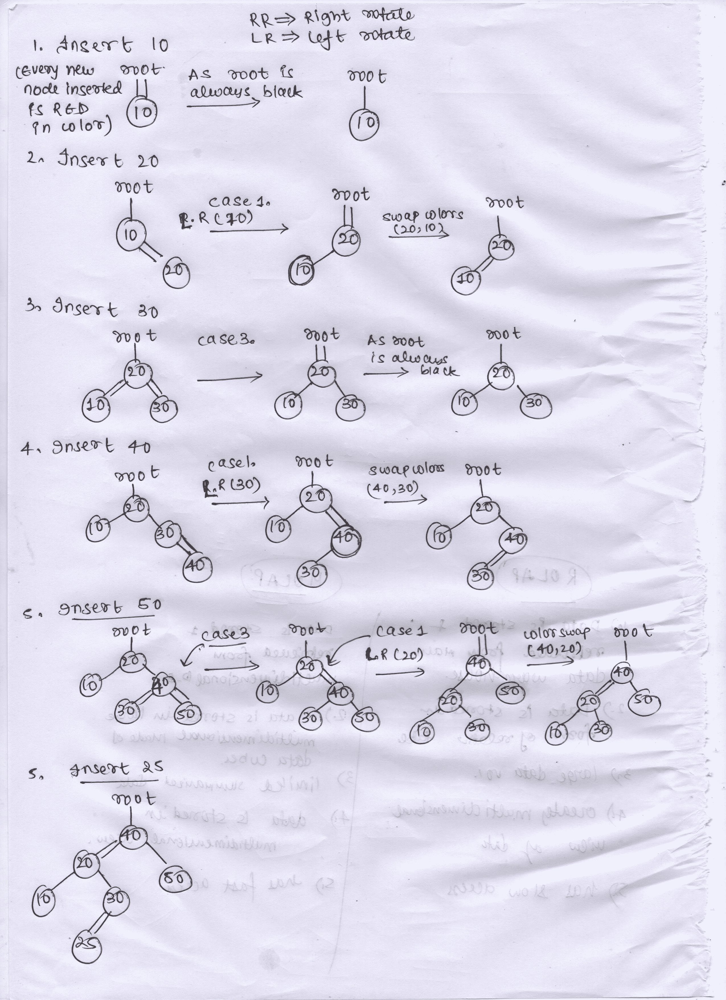

# 左倾红黑树(插入)

> 原文:[https://www . geesforgeks . org/左倾-红色-黑色-树插入/](https://www.geeksforgeeks.org/left-leaning-red-black-tree-insertion/)

先决条件:[红黑树。](https://www.geeksforgeeks.org/red-black-tree-set-1-introduction-2/)
左倾红黑树或 **(LLRB)** 是红黑树的变种，比红黑树本身容易实现很多，保证了 O(logn)时间内的所有搜索、删除和插入操作。

**哪些节点是红色的，哪些是黑色的？**
有双入边的节点颜色为红色。
具有单一入边的节点颜色为黑色。

**LLRB**的特点
1。根节点的颜色始终为黑色。
2。插入的每个新节点总是红色的。
3。节点的每个空子节点都被认为是黑色的。
例如:树中只有 40 个。

```

     root
       |
       40 <-- as 40 is the root so it 
      /  \    is also Black in color. 
    NULL  NULL <-- Black in color.
```

4.不应存在具有右红色子节点和左黑色子节点(或空子节点，因为所有空值都是黑色)的节点，如果存在，向左旋转该节点，并交换当前节点及其**左**子节点的颜色，以保持规则 2 的一致性，即新节点的颜色必须是红色。

```
 CASE 1.
   root                        root     
     |                          ||      
     40      LeftRotate(40)     50     
    /  \\        --->          /  \    
  NULL  50                   40   NULL    

                               root              
                                |               
         ColorSwap(50, 40)      50 
           --->               //  \              
                             40  NULL                     
```

5.不应该有一个节点有 LEFT RED 子节点和 LEFT RED 孙节点，如果存在的话，向右旋转该节点，并在节点和它的 **RIGHT** 子节点之间交换颜色，以遵循规则 2。

```
  CASE 2.
   root                         root      
    |                            ||        
    40        RightRotate(40)    20        
   //  \         --->          //   \      
  20    50                    10    40           
 //                                   \      
10                                     50

                          root
                           |
    ColorSwap(20, 40)      20
      --->                // \\
                         10   40
                               \
                               50

```

6.不应该有一个节点有左红色子节点和右红色子节点，如果有的话，反转所有节点的颜色，即当前节点、左子节点和右子节点。

```
   CASE 3.
   root                           root      
    |       !color(20, 10, 30)     ||       
    20            --->             20                
  //  \\                          /  \  
 10    30                        10  30 

                                     root
        As the root is always black    |                     
                --->                  20   
                                     /  \
                                   10   30   
```

我们为什么要遵循上面提到的规则？因为通过遵循上述特征/规则，我们能够模拟红黑树的所有属性，而无需考虑它的复杂实现。

**示例:**

```
Insert the following data into LEFT LEANING RED-BLACK
TREE and display the inorder traversal of tree.
Input : 10 20 30 40 50 25
Output : 10 20 30 40 50 25
        root
         |
         40
       //  \
      20    50
     /  \
   10    30
        //
       25 
```

方法:
在 LLRB 中插入就像插入到[二叉查找树](https://www.geeksforgeeks.org/binary-search-tree-set-1-search-and-insertion/)中一样。不同的是，在我们将节点插入到树中之后，我们将回溯我们的步骤回到根，并尝试对 LLRB 执行上述规则。
在进行上述旋转和颜色交换时，我们的根可能会变成红色，所以我们也是。我们必须确保我们的根始终保持黑色。



## C++

```
// C++ program to implement insert operation
// in Red Black Tree.
#include <bits/stdc++.h>
using namespace std;

typedef struct node
{
    struct node *left, *right;
    int data;

    // red ==> true, black ==> false
    bool color;

}node;

// Utility function to create a node.
node* createNode(int data, bool color)
{
    node *myNode = new node();
    myNode -> left = myNode -> right = NULL;
    myNode -> data = data;

    // New Node which is created is
    // always red in color.
    myNode -> color = true;
    return myNode;
}

// Utility function to rotate node anticlockwise.
node* rotateLeft(node* myNode)
{
    cout << "left rotation!!\n";
    node *child = myNode -> right;
    node *childLeft = child -> left;

    child -> left = myNode;
    myNode -> right = childLeft;

    return child;
}

// Utility function to rotate node clockwise.
node* rotateRight(node* myNode)
{
    cout << "right rotation\n";
    node *child = myNode -> left;
    node *childRight =  child -> right;

    child -> right = myNode;
    myNode -> left = childRight;

    return child;
}

// Utility function to check whether
// node is red in color or not.
int isRed(node *myNode)
{
    if (myNode == NULL)
       return 0;

    return (myNode -> color == true);
}

// Utility function to swap color of two
// nodes.
void swapColors(node *node1, node *node2)
{
    bool temp = node1 -> color;
    node1 -> color = node2 -> color;
    node2 -> color = temp;
}

// Insertion into Left Leaning Red Black Tree.
node* insert(node* myNode, int data)
{

    // Normal insertion code for any Binary
    // Search tree.
    if (myNode == NULL)
        return createNode(data, false);   

    if (data < myNode -> data)
        myNode -> left = insert(myNode -> left, data);

    else if (data > myNode -> data)
        myNode -> right = insert(myNode -> right, data);

    else   
        return myNode;

    // case 1.
    // when right child is Red but left child is
    // Black or doesn't exist.
    if (isRed(myNode -> right) &&
       !isRed(myNode -> left))
    {

        // Left rotate the node to make it into
        // valid structure.
        myNode = rotateLeft(myNode);

        // Swap the colors as the child node
        // should always be red
        swapColors(myNode, myNode -> left);
    }

    // case 2
    // when left child as well as left grand
    // child in Red
    if (isRed(myNode -> left) &&
        isRed(myNode -> left -> left))
    {  

        // Right rotate the current node to make
        // it into a valid structure.
        myNode = rotateRight(myNode);
        swapColors(myNode, myNode -> right);
    }

    // case 3
    // when both left and right child are Red in color.
    if (isRed(myNode -> left) && isRed(myNode -> right))
    {

        // Invert the color of node as well
        // it's left and right child.
        myNode -> color = !myNode -> color;

        // Change the color to black.
        myNode -> left -> color = false;
        myNode -> right -> color = false;
    }
    return myNode;
}

// Inorder traversal
void inorder(node *node)
{
    if (node)
    {
        inorder(node -> left);
        cout<< node -> data << " ";
        inorder(node -> right);
    }
}

// Driver code
int main()
{

    node *root = NULL;

    /* LLRB tree made after all insertions are made.

    1\. Nodes which have double INCOMING edge means
       that they are RED in color.
    2\. Nodes which have single INCOMING edge means
       that they are BLACK in color.

        root
         |
         40
       //  \
      20    50
     /  \
    10    30
        //
       25    */

    root = insert(root, 10);

    // To make sure that root remains
    // black is color
    root -> color = false;

    root = insert(root, 20);
    root -> color = false;

    root = insert(root, 30);
    root -> color = false;

    root = insert(root, 40);
    root -> color = false;

    root = insert(root, 50);
    root -> color = false;

    root = insert(root, 25);
    root -> color = false;

    // Display the tree through inorder traversal.
    inorder(root);

    return 0;
}

// This code is contributed by rutvik_56
```

## C

```
// C program to implement insert operation
// in Red Black Tree.
#include <stdio.h>
#include <stdlib.h>
#include <stdbool.h>

typedef struct node
{
    struct node *left, *right;
    int data;

    // red ==> true, black ==> false
    bool color;
} node;

// utility function to create a node.
node* createNode(int data, bool color)
{
    node *myNode = (node *) malloc(sizeof(node));
    myNode -> left = myNode -> right = NULL;
    myNode -> data = data;

    // New Node which is created is
    // always red in color.
    myNode -> color = true;
    return myNode;
}

// utility function to rotate node anticlockwise.
node* rotateLeft(node* myNode)
{
    printf("left rotation!!\n");
    node *child = myNode -> right;
    node *childLeft = child -> left;

    child -> left = myNode;
    myNode -> right = childLeft;

    return child;
}

// utility function to rotate node clockwise.
node* rotateRight(node* myNode)
{
    printf("right rotation\n");
    node *child = myNode -> left;
    node *childRight =  child -> right;

    child -> right = myNode;
    myNode -> left = childRight;

    return child;
}

// utility function to check whether
// node is red in color or not.
int isRed(node *myNode)
{
    if (myNode == NULL)
       return 0;
    return (myNode -> color == true);
}

// utility function to swap color of two
// nodes.
void swapColors(node *node1, node *node2)
{
    bool temp = node1 -> color;
    node1 -> color = node2 -> color;
    node2 -> color = temp;
}

// insertion into Left Leaning Red Black Tree.
node* insert(node* myNode, int data)
{
    // Normal insertion code for any Binary
    // Search tree.
    if (myNode == NULL)
        return createNode(data, false);   

    if (data < myNode -> data)
        myNode -> left = insert(myNode -> left, data);

    else if (data > myNode -> data)
        myNode -> right = insert(myNode -> right, data);

    else   
        return myNode;

    // case 1.
    // when right child is Red but left child is
    // Black or doesn't exist.
    if (isRed(myNode -> right) && !isRed(myNode -> left))
    {
        // left rotate the node to make it into
        // valid structure.
        myNode = rotateLeft(myNode);

        // swap the colors as the child node
        // should always be red
        swapColors(myNode, myNode -> left);

    }

    // case 2
    // when left child as well as left grand child in Red
    if (isRed(myNode -> left) && isRed(myNode -> left -> left))
    {  
        // right rotate the current node to make
        // it into a valid structure.
        myNode = rotateRight(myNode);
        swapColors(myNode, myNode -> right);
    }

    // case 3
    // when both left and right child are Red in color.
    if (isRed(myNode -> left) && isRed(myNode -> right))
    {
        // invert the color of node as well
        // it's left and right child.
        myNode -> color = !myNode -> color;

        // change the color to black.
        myNode -> left -> color = false;
        myNode -> right -> color = false;
    }

    return myNode;
}

// Inorder traversal
void inorder(node *node)
{
    if (node)
    {
        inorder(node -> left);
        printf("%d ", node -> data);
        inorder(node -> right);
    }
}

// Driver function
int main()
{
    node *root = NULL;
    /* LLRB tree made after all insertions are made.

    1\. Nodes which have double INCOMING edge means
       that they are RED in color.
    2\. Nodes which have single INCOMING edge means
       that they are BLACK in color.

        root
         |
         40
       //  \
      20    50
     /  \
   10    30
        //
       25    */

    root = insert(root, 10);
    // to make sure that root remains
    // black is color
    root -> color = false;

    root = insert(root, 20);
    root -> color = false;

    root = insert(root, 30);
    root -> color = false;

    root = insert(root, 40);
    root -> color = false;

    root = insert(root, 50);
    root -> color = false;

    root = insert(root, 25);
    root -> color = false;

    // display the tree through inorder traversal.
    inorder(root);

    return 0;
}
```

## Java 语言(一种计算机语言，尤用于创建网站)

```
// Java program to implement insert operation
// in Red Black Tree.

class node
{
    node left, right;
    int data;

    // red ==> true, black ==> false
    boolean color;

    node(int data)
    {
        this.data = data;
        left = null;
        right = null;

        // New Node which is created is
        // always red in color.
        color = true;
    }
}

public class LLRBTREE {

    private static node root = null;

    // utility function to rotate node anticlockwise.
    node rotateLeft(node myNode)
    {
        System.out.printf("left rotation!!\n");
        node child = myNode.right;
        node childLeft = child.left;

        child.left = myNode;
        myNode.right = childLeft;

        return child;
    }

    // utility function to rotate node clockwise.
    node rotateRight(node myNode)
    {
        System.out.printf("right rotation\n");
        node child = myNode.left;
        node childRight = child.right;

        child.right = myNode;
        myNode.left = childRight;

        return child;
    }

    // utility function to check whether
    // node is red in color or not.
    boolean isRed(node myNode)
    {
        if (myNode == null)
            return false;
        return (myNode.color == true);
    }

    // utility function to swap color of two
    // nodes.
    void swapColors(node node1, node node2)
    {
        boolean temp = node1.color;
        node1.color = node2.color;
        node2.color = temp;
    }

    // insertion into Left Leaning Red Black Tree.
    node insert(node myNode, int data)
    {
        // Normal insertion code for any Binary
        // Search tree.
        if (myNode == null)
            return new node(data);

        if (data < myNode.data)
            myNode.left = insert(myNode.left, data);

        else if (data > myNode.data)
            myNode.right = insert(myNode.right, data);

        else
            return myNode;

        // case 1.
        // when right child is Red but left child is
        // Black or doesn't exist.
        if (isRed(myNode.right) && !isRed(myNode.left))
        {
            // left rotate the node to make it into
            // valid structure.
            myNode = rotateLeft(myNode);

            // swap the colors as the child node
            // should always be red
            swapColors(myNode, myNode.left);

        }

        // case 2
        // when left child as well as left grand child in Red
        if (isRed(myNode.left) && isRed(myNode.left.left))
        {
            // right rotate the current node to make
            // it into a valid structure.
            myNode = rotateRight(myNode);
            swapColors(myNode, myNode.right);
        }

        // case 3
        // when both left and right child are Red in color.
        if (isRed(myNode.left) && isRed(myNode.right))
        {
            // invert the color of node as well
            // it's left and right child.
            myNode.color = !myNode.color;

            // change the color to black.
            myNode.left.color = false;
            myNode.right.color = false;
        }

        return myNode;
    }

    // Inorder traversal
    void inorder(node node)
    {
        if (node != null)
        {
            inorder(node.left);
            System.out.print(node.data + " ");
            inorder(node.right);
        }
    }

    public static void main(String[] args) {
    /* LLRB tree made after all insertions are made.

    1\. Nodes which have double INCOMING edge means
        that they are RED in color.
    2\. Nodes which have single INCOMING edge means
        that they are BLACK in color.

        root
        |
        40
        // \
    20 50
    / \
    10 30
        //
        25 */

    LLRBTREE node = new LLRBTREE();

    root = node.insert(root, 10);
    // to make sure that root remains
    // black is color
    root.color = false;

    root = node.insert(root, 20);
    root.color = false;

    root = node.insert(root, 30);
    root.color = false;

    root = node.insert(root, 40);
    root.color = false;

    root = node.insert(root, 50);
    root.color = false;

    root = node.insert(root, 25);
    root.color = false;

    // display the tree through inorder traversal.
    node.inorder(root);

    }

}

// This code is contributed by ARSHPREET_SINGH
```

## C#

```
// C# program to implement insert
// operation in Red Black Tree.
using System;

class node
{
    public node left, right;
    public int data;

    // red ==> true, black ==> false
    public Boolean color;

    public node(int data)
    {
        this.data = data;
        left = null;
        right = null;

        // New Node which is created
        // is always red in color.
        color = true;
    }
}

public class LLRBTREE
{

private static node root = null;

// utility function to rotate
// node anticlockwise.
node rotateLeft(node myNode)
{
    Console.Write("left rotation!!\n");
    node child = myNode.right;
    node childLeft = child.left;

    child.left = myNode;
    myNode.right = childLeft;

    return child;
}

// utility function to rotate
// node clockwise.
node rotateRight(node myNode)
{
    Console.Write("right rotation\n");
    node child = myNode.left;
    node childRight = child.right;

    child.right = myNode;
    myNode.left = childRight;

    return child;
}

// utility function to check whether
// node is red in color or not.
Boolean isRed(node myNode)
{
    if (myNode == null)
        return false;
    return (myNode.color == true);
}

// utility function to swap
// color of two nodes.
void swapColors(node node1, node node2)
{
    Boolean temp = node1.color;
    node1.color = node2.color;
    node2.color = temp;
}

// insertion into Left
// Leaning Red Black Tree.
node insert(node myNode, int data)
{
    // Normal insertion code for
    // any Binary Search tree.
    if (myNode == null)
        return new node(data);

    if (data < myNode.data)
        myNode.left = insert(myNode.left, data);

    else if (data > myNode.data)
        myNode.right = insert(myNode.right, data);

    else
        return myNode;

    // case 1.
    // when right child is Red
    // but left child is
    // Black or doesn't exist.
    if (isRed(myNode.right) &&
        !isRed(myNode.left))
    {
        // left rotate the node to make
        // it into valid structure.
        myNode = rotateLeft(myNode);

        // swap the colors as the child
        // node should always be red
        swapColors(myNode, myNode.left);

    }

    // case 2
    // when left child as well as
    // left grand child in Red
    if (isRed(myNode.left) &&
        isRed(myNode.left.left))
    {
        // right rotate the current node
        // to make it into a valid structure.
        myNode = rotateRight(myNode);
        swapColors(myNode, myNode.right);
    }

    // case 3
    // when both left and right
    // child are Red in color.
    if (isRed(myNode.left) &&
        isRed(myNode.right))
    {
        // invert the color of node as well
        // it's left and right child.
        myNode.color = !myNode.color;

        // change the color to black.
        myNode.left.color = false;
        myNode.right.color = false;
    }

    return myNode;
}

// Inorder traversal
void inorder(node node)
{
    if (node != null)
    {
        inorder(node.left);
        Console.Write(node.data + " ");
        inorder(node.right);
    }
}

// Driver Code
static public void Main(String []args)
{
/* LLRB tree made after all
   insertions are made.

1\. Nodes which have double INCOMING
   edge means that they are RED in color.
2\. Nodes which have single INCOMING edge 
   means that they are BLACK in color.

            root
             |
             40
           //   \
          20    50
        /    \
       10    30
            //
           25
*/

LLRBTREE node = new LLRBTREE();

root = node.insert(root, 10);

// to make sure that root 
// remains black is color
root.color = false;

root = node.insert(root, 20);
root.color = false;

root = node.insert(root, 30);
root.color = false;

root = node.insert(root, 40);
root.color = false;

root = node.insert(root, 50);
root.color = false;

root = node.insert(root, 25);
root.color = false;

// display the tree through
// inorder traversal.
node.inorder(root);
}
}

// This code is contributed
// by Arnab Kundu
```

## java 描述语言

```
<script>
// Javascript program to implement insert operation
// in Red Black Tree.
 class node
{
    constructor(data)
    {
        this.data = data;
        this.left = null;
        this.right = null;

        // New Node which is created is
        // always red in color.
        this.color = true;
    }
}

let root = null;

// utility function to rotate node anticlockwise.
function rotateLeft(myNode)
{
    document.write("left rotation!!<br>");
        let child = myNode.right;
        let childLeft = child.left;

        child.left = myNode;
        myNode.right = childLeft;

        return child;
}

// utility function to rotate node clockwise.
function rotateRight(myNode)
{
    document.write("right rotation<br>");
        let child = myNode.left;
        let childRight = child.right;

        child.right = myNode;
        myNode.left = childRight;

        return child;
}

// utility function to check whether
    // node is red in color or not.
function isRed(myNode)
{
    if (myNode == null)
    return false;
    return (myNode.color == true);
}   

// utility function to swap color of two
    // nodes.
function swapColors(node1,node2)
{
    let temp = node1.color;
        node1.color = node2.color;
        node2.color = temp;
}

// insertion into Left Leaning Red Black Tree.
function insert(myNode,data)
{
    // Normal insertion code for any Binary
        // Search tree.
        if (myNode == null)
            return new node(data);

        if (data < myNode.data)
            myNode.left = insert(myNode.left, data);

        else if (data > myNode.data)
            myNode.right = insert(myNode.right, data);

        else
            return myNode;

        // case 1.
        // when right child is Red but left child is
        // Black or doesn't exist.
        if (isRed(myNode.right) && !isRed(myNode.left))
        {
            // left rotate the node to make it into
            // valid structure.
            myNode = rotateLeft(myNode);

            // swap the colors as the child node
            // should always be red
            swapColors(myNode, myNode.left);

        }

        // case 2
        // when left child as well as left grand child in Red
        if (isRed(myNode.left) && isRed(myNode.left.left))
        {
            // right rotate the current node to make
            // it into a valid structure.
            myNode = rotateRight(myNode);
            swapColors(myNode, myNode.right);
        }

        // case 3
        // when both left and right child are Red in color.
        if (isRed(myNode.left) && isRed(myNode.right))
        {
            // invert the color of node as well
            // it's left and right child.
            myNode.color = !myNode.color;

            // change the color to black.
            myNode.left.color = false;
            myNode.right.color = false;
        }

        return myNode;
}

// Inorder traversal
function inorder(node)
{
    if (node != null)
        {
            inorder(node.left);
            document.write(node.data + " ");
            inorder(node.right);
        }
}

/* LLRB tree made after all insertions are made.

    1\. Nodes which have double INCOMING edge means
        that they are RED in color.
    2\. Nodes which have single INCOMING edge means
        that they are BLACK in color.

        root
        |
        40
        // \
    20 50
    / \
    10 30
        //
        25 */

root = insert(root, 10);
// to make sure that root remains
// black is color
root.color = false;

root = insert(root, 20);
root.color = false;

root = insert(root, 30);
root.color = false;

root = insert(root, 40);
root.color = false;

root = insert(root, 50);
root.color = false;

root = insert(root, 25);
root.color = false;

// display the tree through inorder traversal.
inorder(root);

// This code is contributed by avanitrachhadiya2155
</script>
```

**输出:**

```
left rotation!!
left rotation!!
left rotation!!
10 20 25 30 40 50 
```

**时间复杂度:** O(log n)
**参考文献**
[左倾红黑树](https://www.cs.princeton.edu/~rs/talks/LLRB/RedBlack.pdf)
本文由[**<u>Arshpreet Soodan</u>**](https://www.linkedin.com/in/arshpreet-soodan-717a5412a/)供稿。如果你喜欢 GeeksforGeeks 并想投稿，你也可以使用[write.geeksforgeeks.org](https://write.geeksforgeeks.org)写一篇文章或者把你的文章邮寄到 review-team@geeksforgeeks.org。看到你的文章出现在极客博客主页上，帮助其他极客。
如果发现有不正确的地方，或者想分享更多关于上述话题的信息，请写评论。