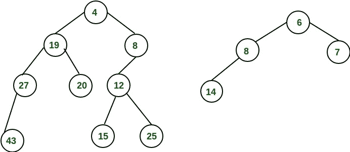
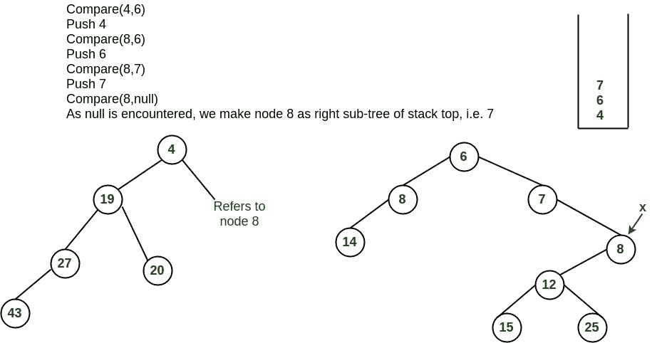
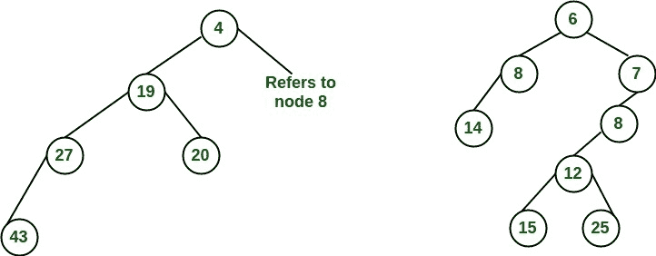
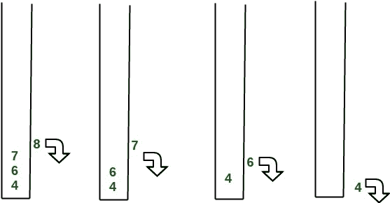
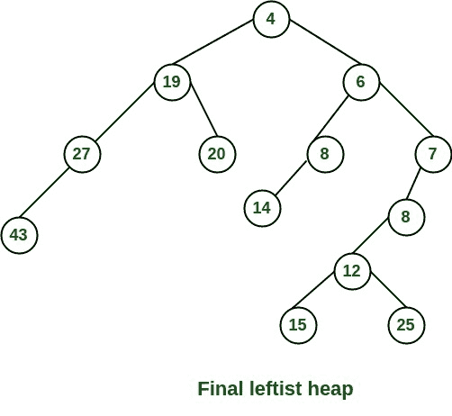
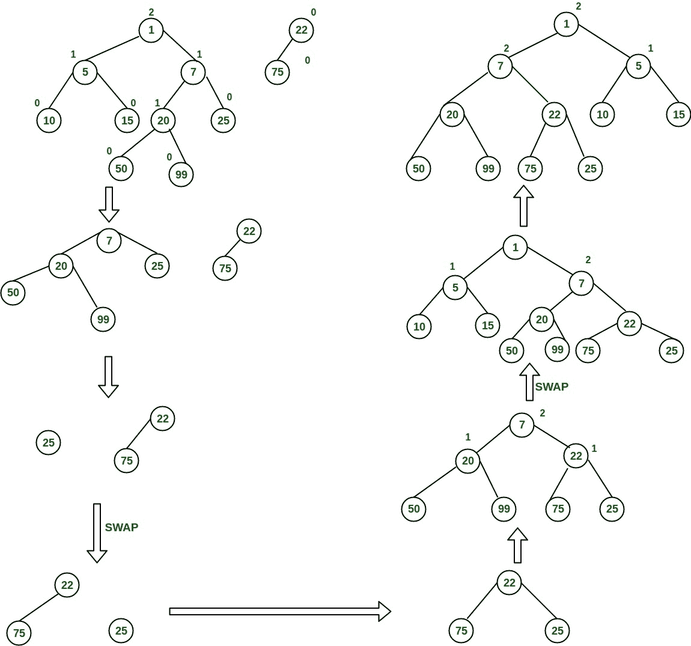

# 左派树/左派堆

> 原文:[https://www.geeksforgeeks.org/leftist-tree-leftist-heap/](https://www.geeksforgeeks.org/leftist-tree-leftist-heap/)

左树或左堆是用二进制堆的变体实现的优先级队列。每个节点都有一个 **s 值(或等级或距离)**，它是到最近的叶子的距离。与二进制堆(总是一个[完整的二叉树](https://www.geeksforgeeks.org/binary-tree-set-3-types-of-binary-tree/)相比，左树可能非常不平衡。

以下是**左翼树/堆**的[时间复杂度](https://www.geeksforgeeks.org/analysis-algorithm-set-5-amortized-analysis-introduction/)。

```
  Function       Complexity              Comparison
1) Get Min:       O(1)      [same as both Binary and Binomial]
2) Delete Min:    O(Log n)  [same as both Binary and Binomial]
3) Insert:        O(Log n)  [O(Log n) in Binary and O(1) in 
                            Binomial and O(Log n) for worst case]                                                                  
4) Merge:         O(Log n)  [O(Log n) in Binomial]
```

左树是一棵二叉树，它具有以下特性:

1.  **正常最小堆属性:**键(i) > =键(父(I))
2.  **Heavier on left side :** dist(right(i)) <= dist(left(i)). here, dist(i) is the number of edges on shortest path from node i to a leaf in extended binary tree representation (in this representation, null child considered as external or node). descendant through right child. every subtree also leftist and dist( )="1" + right( ).< ol>

    **示例:**下面的左树显示了通过上述过程为每个节点计算的距离。最右边的节点的等级为 0，因为该节点的右子树为空，其父节点的距离为 1 乘 dist( i ) = 1 + dist( right( i))。每个节点都遵循相同的方法，并计算它们的 s 值(或等级)。

    [](https://media.geeksforgeeks.org/wp-content/uploads/leftist_tree.jpg)

    从上述第二个性质，我们可以得出两个结论:

    1.  从根到最右边叶子的路径是从根到叶子的最短路径。
    2.  如果最右边的叶的路径有 x 个节点，那么左边的堆至少有 2 个<sup>x</sup>–1 个节点。这意味着对于具有 n 个节点的左边堆，到最右边叶的路径长度是 O(log n)。

    **操作:**

    1.  主要操作是合并()。
    2.  deleteMin()(或 extractMin())可以通过移除根并为左右子树调用 merge()来完成。
    3.  insert()可以通过创建一个带有单键(要插入的键)的左树，并为给定的树和带有单个节点的树调用 merge()来完成。

    **合并背后的想法:**
    由于右子树较小，所以想法是将一棵树的右子树与其他树合并。下面是一些抽象的步骤。

    1.  将值较小的根作为新根。
    2.  把它左边的子树挂在左边。
    3.  递归合并它的右子树和另一棵树。
    4.  从递归返回之前:
        –更新合并根的 dist()。
        –如果需要，交换根下的左右子树，以保持合并后的
        结果的左属性

    来源:[http://courses . cs . Washington . edu/courses/CSE 326/08 sp/讲座/05-左派-heaps.pdf](http://courses.cs.washington.edu/courses/cse326/08sp/lectures/05-leftist-heaps.pdf)

    **合并的详细步骤:**

    1.  比较两个堆的根。
    2.  将小键推入空堆栈，并移动到小键的右子键。
    3.  递归地比较两个键，继续将较小的键推到堆栈上，并移动到它的右子键。
    4.  重复上述操作，直到到达空节点。
    5.  取最后一个处理过的节点，使其成为栈顶节点的右子节点，如果违反了左堆的属性，则转换为左堆。
    6.  递归地继续从栈中弹出元素，并使它们成为新栈顶的右子元素。

    **例:**
    考虑下面给出的两个左派堆:
    [](https://media.geeksforgeeks.org/wp-content/uploads/leftist_heap1.jpg)

    将他们合并成一个左翼阵营

    [](https://media.geeksforgeeks.org/wp-content/uploads/leftist_heap2.jpg)

    节点 7 的子树违反了左堆的属性，所以我们用左子树交换它，保留左堆的属性。
    [](https://media.geeksforgeeks.org/wp-content/uploads/leftist_heap3.jpg)

    皈依左翼堆。重复这个过程

    [](https://media.geeksforgeeks.org/wp-content/uploads/leftist_heap4.jpg) 
    [](https://media.geeksforgeeks.org/wp-content/uploads/leftist_heap5.jpg)

    该算法最差情况下的时间复杂度为 O(log n)，其中 n 是最左边堆中的节点数。

    **合并两个左派堆的另一个例子:**
    [](https://media.geeksforgeeks.org/wp-content/uploads/mergingTwoLeftistTree-1.jpg)

    **左树/左堆的实现:**

    ```
    //C++ program for leftist heap / leftist tree
    #include <bits/stdc++.h>
    using namespace std;

    // Node Class Declaration
    class LeftistNode
    {
    public:
        int element;
        LeftistNode *left;
        LeftistNode *right;
        int dist;
        LeftistNode(int & element, LeftistNode *lt = NULL,
                    LeftistNode *rt = NULL, int np = 0)
        {
            this->element = element;
            right = rt;
            left = lt,
            dist = np;
        }
    };

    //Class Declaration
    class LeftistHeap
    {
    public:
        LeftistHeap();
        LeftistHeap(LeftistHeap &rhs);
        ~LeftistHeap();
        bool isEmpty();
        bool isFull();
        int &findMin();
        void Insert(int &x);
        void deleteMin();
        void deleteMin(int &minItem);
        void makeEmpty();
        void Merge(LeftistHeap &rhs);
        LeftistHeap & operator =(LeftistHeap &rhs);
    private:
        LeftistNode *root;
        LeftistNode *Merge(LeftistNode *h1,
                           LeftistNode *h2);
        LeftistNode *Merge1(LeftistNode *h1,
                            LeftistNode *h2);
        void swapChildren(LeftistNode * t);
        void reclaimMemory(LeftistNode * t);
        LeftistNode *clone(LeftistNode *t);
    };

    // Construct the leftist heap
    LeftistHeap::LeftistHeap()
    {
        root = NULL;
    }

    // Copy constructor.
    LeftistHeap::LeftistHeap(LeftistHeap &rhs)
    {
        root = NULL;
        *this = rhs;
    }

    // Destruct the leftist heap
    LeftistHeap::~LeftistHeap()
    {
        makeEmpty( );
    }

    /* Merge rhs into the priority queue.
    rhs becomes empty. rhs must be different
    from this.*/
    void LeftistHeap::Merge(LeftistHeap &rhs)
    {
        if (this == &rhs)
            return;
        root = Merge(root, rhs.root);
        rhs.root = NULL;
    }

    /* Internal method to merge two roots.
     Deals with deviant cases and calls recursive Merge1.*/
    LeftistNode *LeftistHeap::Merge(LeftistNode * h1,
                                    LeftistNode * h2)
    {
        if (h1 == NULL)
            return h2;
        if (h2 == NULL)
            return h1;
        if (h1->element < h2->element)
            return Merge1(h1, h2);
        else
            return Merge1(h2, h1);
    }

    /* Internal method to merge two roots.
     Assumes trees are not empty, and h1's root contains
      smallest item.*/
    LeftistNode *LeftistHeap::Merge1(LeftistNode * h1,
                                     LeftistNode * h2)
    {
        if (h1->left == NULL)
            h1->left = h2;
        else
        {
            h1->right = Merge(h1->right, h2);
            if (h1->left->dist < h1->right->dist)
                swapChildren(h1);
            h1->dist = h1->right->dist + 1;
        }
        return h1;
    }

    // Swaps t's two children.
    void LeftistHeap::swapChildren(LeftistNode * t)
    {
        LeftistNode *tmp = t->left;
        t->left = t->right;
        t->right = tmp;
    }

    /* Insert item x into the priority queue, maintaining
      heap order.*/
    void LeftistHeap::Insert(int &x)
    {
        root = Merge(new LeftistNode(x), root);
    }

    /* Find the smallest item in the priority queue.
    Return the smallest item, or throw Underflow if empty.*/
    int &LeftistHeap::findMin()
    {
        return root->element;
    }

    /* Remove the smallest item from the priority queue.
    Throws Underflow if empty.*/
    void LeftistHeap::deleteMin()
    {
        LeftistNode *oldRoot = root;
        root = Merge(root->left, root->right);
        delete oldRoot;
    }

    /* Remove the smallest item from the priority queue.
    Pass back the smallest item, or throw Underflow if empty.*/
    void LeftistHeap::deleteMin(int &minItem)
    {
        if (isEmpty())
        {
            cout<<"Heap is Empty"<<endl;
            return;
        }
        minItem = findMin();
        deleteMin();
    }

    /* Test if the priority queue is logically empty.
     Returns true if empty, false otherwise*/
    bool LeftistHeap::isEmpty()
    {
        return root == NULL;
    }

    /* Test if the priority queue is logically full.
     Returns false in this implementation.*/
    bool LeftistHeap::isFull()
    {
        return false;
    }

    // Make the priority queue logically empty
    void LeftistHeap::makeEmpty()
    {
        reclaimMemory(root);
        root = NULL;
    }

    // Deep copy
    LeftistHeap &LeftistHeap::operator =(LeftistHeap & rhs)
    {
        if (this != &rhs)
        {
            makeEmpty();
            root = clone(rhs.root);
        }
        return *this;
    }

    // Internal method to make the tree empty.
    void LeftistHeap::reclaimMemory(LeftistNode * t)
    {
        if (t != NULL)
        {
            reclaimMemory(t->left);
            reclaimMemory(t->right);
            delete t;
        }
    }

    // Internal method to clone subtree.
    LeftistNode *LeftistHeap::clone(LeftistNode * t)
    {
        if (t == NULL)
            return NULL;
        else
            return new LeftistNode(t->element, clone(t->left),
                                   clone(t->right), t->dist);
    }

    //Driver program
    int main()
    {
        LeftistHeap h;
        LeftistHeap h1;
        LeftistHeap h2;
        int x;
        int arr[]= {1, 5, 7, 10, 15};
        int arr1[]= {22, 75};

        h.Insert(arr[0]);
        h.Insert(arr[1]);
        h.Insert(arr[2]);
        h.Insert(arr[3]);
        h.Insert(arr[4]);
        h1.Insert(arr1[0]);
        h1.Insert(arr1[1]);

        h.deleteMin(x);
        cout<< x <<endl;

        h1.deleteMin(x);
        cout<< x <<endl;

        h.Merge(h1);
        h2 = h;

        h2.deleteMin(x);
        cout<< x << endl;

        return 0;
    }
    ```

    **输出:**

    ```
    1
    22
    5

    ```

    **参考文献:**
    [维基百科-左派树](https://en.wikipedia.org/wiki/Leftist_tree)
    [CSC378:左派树](http://www.dgp.toronto.edu/people/JamesStewart/378notes/10leftist/)

    本文由**贾芳·科利和米纳尔·苏尼尔·帕尔尚**供稿。如果你喜欢 GeeksforGeeks 并想投稿，你也可以使用[contribute.geeksforgeeks.org](http://www.contribute.geeksforgeeks.org)写一篇文章或者把你的文章邮寄到 contribute@geeksforgeeks.org。看到你的文章出现在极客博客主页上，帮助其他极客。

    如果你发现任何不正确的地方，或者你想分享更多关于上面讨论的话题的信息，请写评论。

    =>