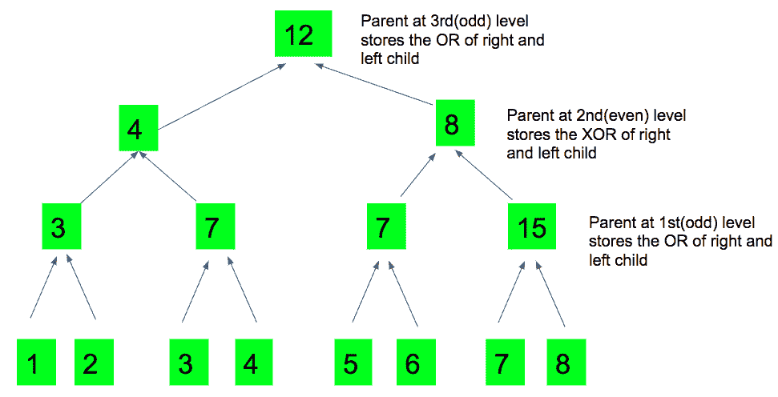

# 对相邻对执行交替逐位“或”和逐位“异或”运算后的剩余元素

> 原文:[https://www . geeksforgeeks . org/剩余元素-执行-交替-逐位-逐位-异或-运算-相邻对/](https://www.geeksforgeeks.org/leftover-element-performing-alternate-bitwise-bitwise-xor-operations-adjacent-pairs/)

给定一个由 **N(总是 2 的幂)**元素和 **Q** 查询组成的数组。
每个查询由两个元素组成，一个**索引**，一个**值**……我们需要编写一个程序，将*值*赋给一个<sub>索引</sub>，并打印每个查询执行以下操作后剩下的单个元素:

*   在交替步骤中，对相邻元素执行**逐位“或”**和**逐位“异或”**运算。
*   在第一次迭代中，选择，选择从左向右移动的 n/2 对，并对所有对值进行按位“或”运算。在第二次迭代中，选择(n/2)/2 个剩余对，并对它们进行按位异或运算。在第三次迭代中，选择，选择((n/2)/2)/2 个从左向右移动的剩余对，并对所有对值进行按位或运算。
*   继续以上步骤，直到只剩下一个元素。

**示例:**

```
Input : n = 4   m = 2 
        arr = [1, 4, 5, 6] 
        Queries- 
        1st: index=0 value=2  
        2nd: index=3 value=5
Output : 1 
         3 
Explanation: 

1st query:
Assigning 2 to index 0, the sequence is now 
[2, 4, 5, 6]. 
1st iteration: There are 4/2=2 pairs (2, 4) and (5, 6) 
2 OR 4 gives 6, and 5 OR 6 gives us 7\. So the 
sequence is now [6, 7]. 

2nd iteration: There is 1 pair left now (6, 7) 
6^7=1\. 

Hence the last element left is 1 which is the 
answer to our first query. 

2nd Query:
Assigning 5 to index 3, the sequence is now 
[2, 4, 5, 5]. 
1st iteration: There are 4/2=2 pairs (2, 4) and (5, 5) 
2 OR 4 gives 6, and 5 OR 5 gives us 5\. So the 
sequence is now [6, 5]. 

2nd iteration: There is 1 pair left now (6, 5) 
6^5=3\. 

Hence the last element left is 3 which is the
answer to our second query. 
```

**天真的方法**:天真的方法是执行每一步，直到我们只剩下一个元素。使用二维向量，我们将存储每一步后留下的结果元素。五[步骤-1][0..size]给出上一步的元素数量。如果步数是奇数，我们执行按位“或”运算，否则执行按位“异或”运算。重复这些步骤，直到我们剩下一个元素。剩下的最后一个要素将是我们的答案。

下面是天真方法的实现:

## C++

```
// CPP program to print the Leftover element after
// performing alternate Bitwise OR and Bitwise XOR
// operations to the pairs.
#include <bits/stdc++.h>
using namespace std;
#define N 1000

int lastElement(int a[],int n)
{
    // count the step number
    int steps = 1;
    vector<int>v[N];

    // if one element is there, it will be the answer
    if (n==1) return a[0];

    // at first step we do a bitwise OR
    for (int i = 0 ; i < n ; i += 2)
        v[steps].push_back(a[i] | a[i+1]);

    // keep on doing bitwise operations till the
    // last element is left
    while (v[steps].size()>1)
    {

        steps += 1;

        // perform operations
        for (int i = 0 ; i < v[steps-1].size(); i+=2)
        {
            // if step is the odd step
            if (steps&1)
                v[steps].push_back(v[steps-1][i] | v[steps-1][i+1]);
            else  // even step
                v[steps].push_back(v[steps-1][i] ^ v[steps-1][i+1]);
        }
    }

    // answer when one element is left
    return v[steps][0];
}

// Driver Code
int main()
{
    int a[] = {1, 4, 5, 6};
    int n = sizeof(a)/sizeof(a[0]);

    // 1st query
    int index = 0;
    int value = 2;
    a[0] = 2;
    cout << lastElement(a,n) << endl;

    // 2nd query
    index = 3;
    value = 5;
    a[index] = value;
    cout << lastElement(a,n)  << endl;

    return 0;
}
```

## Java 语言(一种计算机语言，尤用于创建网站)

```
// Java program to print the Leftover element 
// after performing alternate Bitwise OR and 
// Bitwise XOR operations to the pairs.
import java.util.*;

class GFG
{
static int N = 1000;

static int lastElement(int a[], int n)
{
    // count the step number
    int steps = 1;
    Vector<Integer> []v = new Vector[N];
    for (int i = 0; i < N; i++)
        v[i] = new Vector<Integer>();

    // if one element is there, 
    // it will be the answer
    if (n == 1) return a[0];

    // at first step we do a bitwise OR
    for (int i = 0 ; i < n ; i += 2)
        v[steps].add(a[i] | a[i + 1]);

    // keep on doing bitwise operations 
    // till the last element is left
    while (v[steps].size() > 1)
    {

        steps += 1;

        // perform operations
        for (int i = 0; i < v[steps - 1].size(); i += 2)
        {
            // if step is the odd step
            if (steps % 2 == 1)
                v[steps].add(v[steps - 1].get(i) | 
                             v[steps - 1].get(i + 1));
            else // even step
                v[steps].add(v[steps - 1].get(i) ^ 
                             v[steps - 1].get(i + 1));
        }
    }

    // answer when one element is left
    return v[steps].get(0);
}

// Driver Code
public static void main(String[] args)
{
    int a[] = {1, 4, 5, 6};
    int n = a.length;

    // 1st query
    int index = 0;
    int value = 2;
    a[0] = 2;
    System.out.println(lastElement(a, n));

    // 2nd query
    index = 3;
    value = 5;
    a[index] = value;
    System.out.println(lastElement(a, n));
}
}

// This code is contributed by 29AjayKumar
```

## 蟒蛇 3

```
# Python3 program to print the Leftover element 
# after performing alternate Bitwise OR and 
# Bitwise XOR operations to the pairs. 
N = 1000 

def lastElement(a, n): 

    # count the step number 
    steps = 1 
    v = [[] for i in range(n)] 

    # if one element is there, it will be the answer 
    if n == 1: return a[0] 

    # at first step we do a bitwise OR 
    for i in range(0, n, 2): 
        v[steps].append(a[i] | a[i+1]) 

    # keep on doing bitwise operations 
    # till the last element is left 
    while len(v[steps]) > 1: 

        steps += 1 
        # perform operations 
        for i in range(0, len(v[steps-1]), 2): 

            # if step is the odd step 
            if steps & 1: 
                v[steps].append(v[steps-1][i] | v[steps-1][i+1]) 
            else: # even step 
                v[steps].append(v[steps-1][i] ^ v[steps-1][i+1]) 

    # answer when one element is left 
    return v[steps][0] 

# Driver Code 
if __name__ == "__main__": 

    a = [1, 4, 5, 6]
    n = len(a) 

    # 1st query 
    index, value, a[0] = 0, 2, 2 
    print(lastElement(a,n))

    # 2nd query 
    index, value = 3, 5 
    value = 5 
    a[index] = value 
    print(lastElement(a,n))

# This code is contributed by Rituraj Jain
```

## C#

```
// C# program to print the Leftover element 
// after performing alternate Bitwise OR and 
// Bitwise XOR operations to the pairs.
using System;
using System.Collections.Generic;

class GFG
{
static int N = 1000;

static int lastElement(int []a, int n)
{
    // count the step number
    int steps = 1;
    List<int> []v = new List<int>[N];
    for (int i = 0; i < N; i++)
        v[i] = new List<int>();

    // if one element is there, 
    // it will be the answer
    if (n == 1) 
        return a[0];

    // at first step we do a bitwise OR
    for (int i = 0 ; i < n ; i += 2)
        v[steps].Add(a[i] | a[i + 1]);

    // keep on doing bitwise operations 
    // till the last element is left
    while (v[steps].Count > 1)
    {
        steps += 1;

        // perform operations
        for (int i = 0; i < v[steps - 1].Count; i += 2)
        {
            // if step is the odd step
            if (steps % 2 == 1)
                v[steps].Add(v[steps - 1][i] | 
                             v[steps - 1][i + 1]);
            else // even step
                v[steps].Add(v[steps - 1][i] ^ 
                             v[steps - 1][i + 1]);
        }
    }

    // answer when one element is left
    return v[steps][0];
}

// Driver Code
public static void Main(String[] args)
{
    int []a = {1, 4, 5, 6};
    int n = a.Length;

    // 1st query
    int index = 0;
    int value = 2;
    a[0] = 2;
    Console.WriteLine(lastElement(a, n));

    // 2nd query
    index = 3;
    value = 5;
    a[index] = value;
    Console.WriteLine(lastElement(a, n));
}
}

// This code is contributed by 29AjayKumar
```

## java 描述语言

```
<script>

// Javascript program to print the Leftover element after
// performing alternate Bitwise OR and Bitwise XOR
// operations to the pairs.
var N = 1000

function lastElement(a,n)
{
    // count the step number
    var steps = 1;
    var v = Array.from(Array(N), ()=>Array(0));

    // if one element is there, it will be the answer
    if (n==1) 
        return a[0];

    // at first step we do a bitwise OR
    for (var i = 0 ; i < n ; i += 2)
        v[steps].push(a[i] | a[i+1]);

    // keep on doing bitwise operations till the
    // last element is left
    while (v[steps].length>1)
    {

        steps += 1;

        // perform operations
        for (var i = 0 ; i < v[steps-1].length; i+=2)
        {
            // if step is the odd step
            if (steps&1)
                v[steps].push(v[steps-1][i] | v[steps-1][i+1]);
            else  // even step
                v[steps].push(v[steps-1][i] ^ v[steps-1][i+1]);
        }
    }

    // answer when one element is left
    return v[steps][0];
}

// Driver Code
var a = [1, 4, 5, 6];
var n = a.length;
// 1st query
var index = 0;
var value = 2;
a[0] = 2;
document.write( lastElement(a,n) + "<br>");
// 2nd query
index = 3;
value = 5;
a[index] = value;
document.write( lastElement(a,n));

</script>
```

**输出:**

```
1
3
```

**时间复杂度:**o(n * 2<sup>n</sup>)
t5】空间复杂度 : O(N ^ 2)

**高效方法**:高效方法是使用[线段树](https://www.geeksforgeeks.org/segment-tree-set-1-sum-of-given-range/)。下面是用于解决该问题的完整的段树方法。

**构建树**
段树的叶子将存储值数组，它们的父级将存储叶子的 OR。在树中向上移动，每隔一步，父节点在左右子节点之间存储按位异或或按位或。**在每一次奇数迭代中，我们执行对的按位“或”运算**、**，同样，我们在每一次偶数运算**中执行对的按位“异或”运算。因此奇数父级将存储左右子级的按位“或”。同样，偶数父级存储左右子级的按位异或。level[]是一个数组，存储从 1 开始的每个父级的级别，以确定它下面的对(右子级和左子级)是执行 OR 运算还是 XOR 运算。**每次更新操作后，树根将是我们对给定序列的答案。**



。上图解释了树的构造。如果序列是[1，2，3，4，5，6，7，8]，那么在 3 次迭代后，我们将剩下 12，这是我们的答案，并存储在根。

**回答查询**
不需要重建完整的树来执行更新操作。要进行更新，我们应该找到从根到相应叶子的**路径**，并且只为位于找到的路径上的父代重新计算值。
**父级:**
使用[树上的 DP](https://www.geeksforgeeks.org/dynamic-programming-trees-set-1/)，我们可以轻松存储每个父级的级别。将叶节点级别初始化为 0，并在我们向上移动到每个父节点时继续添加。
计算父级的递推关系为:

> 级别[父级] =级别[子级] + 1
> 这里，子级是 2*pos + 1 或 2*pos + 2

下面是上述方法的实现:

## C++

```
// CPP program to print the Leftover element after
// performing alternate Bitwise OR and
// Bitwise XOR operations to the pairs.
#include <bits/stdc++.h>
using namespace std;
#define N 1000

// array to store the tree
int tree[N];

// array to store the level of every parent
int level[N];

// function to construct the tree
void constructTree(int low, int high, int pos, int a[])
{
    if (low == high)
    {
        // level of child is always 0
        level[pos] = 0;
        tree[pos] = a[high];
        return;
    }
    int mid = (low + high) / 2;

    // recursive call
    constructTree(low, mid, 2 * pos + 1, a);
    constructTree(mid + 1, high, 2 * pos + 2, a);

    // increase the level of every parent, which is
    // level of child + 1
    level[pos] = level[2 * pos + 1] + 1;

    // if the parent is at odd level, then do a
    // bitwise OR
    if (level[pos] & 1)
        tree[pos] = tree[2 * pos + 1] | tree[2 * pos + 2];

    // if the parent is at even level, then
    // do a bitwise XOR
    else
        tree[pos] = tree[2 * pos + 1] ^ tree[2 * pos + 2];
}

// function that updates the tree
void update(int low, int high, int pos, int index, int a[])
{
    // if it is a leaf and the leaf which is 
    // to be updated
    if (low == high and low == index)
    {
        tree[pos] = a[low];
        return;
    }

    // out of range
    if (index < low || index > high)
        return;

    // not a leaf then recurse
    if (low != high)
    {
        int mid = (low + high) / 2;

        // recursive call
        update(low, mid, 2 * pos + 1, index, a);
        update(mid + 1, high, 2 * pos + 2, index, a);

        // check if the parent is at odd or even level
        // and perform OR or XOR according to that
        if (level[pos] & 1)
            tree[pos] = tree[2 * pos + 1] | tree[2 * pos + 2];
        else
            tree[pos] = tree[2 * pos + 1] ^ tree[2 * pos + 2];
    }
}

// function that assigns value to a[index]
// and calls update function to update the tree
void updateValue(int index, int value, int a[], int n)
{
    a[index] = value;
    update(0, n - 1, 0, index, a);
}

// Driver Code
int main()
{
    int a[] = { 1, 4, 5, 6 };
    int n = sizeof(a) / sizeof(a[0]);

    // builds the tree
    constructTree(0, n - 1, 0, a);

    // 1st query
    int index = 0;
    int value = 2;
    updateValue(index, value, a, n);
    cout << tree[0] << endl;

    // 2nd query
    index = 3;
    value = 5;
    updateValue(index, value, a, n);
    cout << tree[0] << endl;

    return 0;
}
```

## Java 语言(一种计算机语言，尤用于创建网站)

```
// java program to print the Leftover
// element after performing alternate
// Bitwise OR and Bitwise XOR operations
// to the pairs.
import java .io.*;

public class GFG {

    static int N = 1000;

    // array to store the tree
    static int []tree = new int[N];

    // array to store the level of
    // every parent
    static int []level = new int[N];

    // function to construct the tree
    static void constructTree(int low, int high,
                               int pos, int []a)
    {
        if (low == high)
        {

            // level of child is
            // always 0
            level[pos] = 0;
            tree[pos] = a[high];
            return;
        }
        int mid = (low + high) / 2;

        // recursive call
        constructTree(low, mid, 2 * pos + 1, a);

        constructTree(mid + 1, high, 
                                2 * pos + 2, a);

        // increase the level of every parent,
        // which is level of child + 1
        level[pos] = level[2 * pos + 1] + 1;

        // if the parent is at odd level, then
        // do a bitwise OR
        if ((level[pos] & 1) > 0)
            tree[pos] = tree[2 * pos + 1] |
                              tree[2 * pos + 2];

        // if the parent is at even level, then
        // do a bitwise XOR
        else
            tree[pos] = tree[2 * pos + 1] ^ 
                              tree[2 * pos + 2];
    }

    // function that updates the tree
    static void update(int low, int high, int pos,
                               int index, int []a)
    {

        // if it is a leaf and the leaf which is 
        // to be updated
        if (low == high && low == index)
        {
            tree[pos] = a[low];
            return;
        }

        // out of range
        if (index < low || index > high)
            return;

        // not a leaf then recurse
        if (low != high)
        {
            int mid = (low + high) / 2;

            // recursive call
            update(low, mid, 2 * pos + 1, index, a);

            update(mid + 1, high, 2 * pos + 2,
                                          index, a);

            // check if the parent is at odd or
            // even level and perform OR or XOR
            // according to that
            if ((level[pos] & 1) > 0)
                tree[pos] = tree[2 * pos + 1] |
                                  tree[2 * pos + 2];
            else
                tree[pos] = tree[2 * pos + 1] ^
                                  tree[2 * pos + 2];
        }
    }

    // function that assigns value to a[index]
    // and calls update function to update the
    // tree
    static void updateValue(int index, int value,
                                   int []a, int n)
    {
        a[index] = value;
        update(0, n - 1, 0, index, a);
    }

    // Driver Code
    static public void main (String[] args)
    {
        int []a = { 1, 4, 5, 6 };
        int n = a.length;;

        // builds the tree
        constructTree(0, n - 1, 0, a);

        // 1st query
        int index = 0;
        int value = 2;
        updateValue(index, value, a, n);
        System.out.println(tree[0]);

        // 2nd query
        index = 3;
        value = 5;
        updateValue(index, value, a, n);
        System.out.println(tree[0]);
    }
}

// This code is contributed by vt_m.
```

## 蟒蛇 3

```
# Python3 program to print the Leftover element 
# after performing alternate Bitwise OR and 
# Bitwise XOR operations to the pairs. 
N = 1000 

# array to store the tree 
tree = [None] * N

# array to store the level of every parent 
level = [None] * N 

# function to construct the tree 
def constructTree(low, high, pos, a): 

    if low == high:

        # level of child is always 0 
        level[pos], tree[pos] = 0, a[high]
        return 

    mid = (low + high) // 2 

    # Recursive call 
    constructTree(low, mid, 2 * pos + 1, a) 
    constructTree(mid + 1, high, 2 * pos + 2, a) 

    # Increase the level of every parent, 
    # which is level of child + 1 
    level[pos] = level[2 * pos + 1] + 1 

    # If the parent is at odd level, 
    # then do a bitwise OR 
    if level[pos] & 1: 
        tree[pos] = tree[2 * pos + 1] | tree[2 * pos + 2] 

    # If the parent is at even level, 
    # then do a bitwise XOR 
    else:
        tree[pos] = tree[2 * pos + 1] ^ tree[2 * pos + 2] 

# Function that updates the tree 
def update(low, high, pos, index, a): 

    # If it is a leaf and the leaf 
    # which is to be updated 
    if low == high and low == index: 

        tree[pos] = a[low] 
        return 

    # out of range 
    if index < low or index > high: 
        return 

    # not a leaf then recurse 
    if low != high: 

        mid = (low + high) // 2 

        # recursive call 
        update(low, mid, 2 * pos + 1, index, a) 
        update(mid + 1, high, 2 * pos + 2, index, a) 

        # check if the parent is at odd or even level 
        # and perform OR or XOR according to that 
        if level[pos] & 1:
            tree[pos] = tree[2 * pos + 1] | tree[2 * pos + 2] 
        else:
            tree[pos] = tree[2 * pos + 1] ^ tree[2 * pos + 2] 

# Function that assigns value to a[index] 
# and calls update function to update the tree 
def updateValue(index, value, a, n): 

    a[index] = value 
    update(0, n - 1, 0, index, a) 

# Driver Code 
if __name__ == "__main__":

    a = [1, 4, 5, 6] 
    n = len(a) 

    # builds the tree 
    constructTree(0, n - 1, 0, a) 

    # 1st query 
    index, value = 0, 2 
    updateValue(index, value, a, n) 
    print(tree[0]) 

    # 2nd query 
    index, value = 3, 5 
    updateValue(index, value, a, n) 
    print(tree[0])

# This code is contributed by Rituraj Jain
```

## C#

```
// C# program to print the Leftover
// element after performing alternate
// Bitwise OR and Bitwise XOR
// operations to the pairs.
using System;

public class GFG {

    static int N = 1000;

    // array to store the tree
    static int []tree = new int[N];

    // array to store the level of
    // every parent
    static int []level = new int[N];

    // function to construct the
    // tree
    static void constructTree(int low, int high,
                               int pos, int []a)
    {
        if (low == high)
        {

            // level of child is always 0
            level[pos] = 0;
            tree[pos] = a[high];
            return;
        }
        int mid = (low + high) / 2;

        // recursive call
        constructTree(low, mid, 2 * pos + 1, a);

        constructTree(mid + 1, high,
                                2 * pos + 2, a);

        // increase the level of every parent,
        // which is level of child + 1
        level[pos] = level[2 * pos + 1] + 1;

        // if the parent is at odd level,
        // then do a bitwise OR
        if ((level[pos] & 1) > 0)
            tree[pos] = tree[2 * pos + 1] |
                           tree[2 * pos + 2];

        // if the parent is at even level,
        // then do a bitwise XOR
        else
            tree[pos] = tree[2 * pos + 1] ^
                          tree[2 * pos + 2];
    }

    // function that updates the tree
    static void update(int low, int high,
               int pos, int index, int []a)
    {

        // if it is a leaf and the leaf
        // which is to be updated
        if (low == high && low == index)
        {
            tree[pos] = a[low];
            return;
        }

        // out of range
        if (index < low || index > high)
            return;

        // not a leaf then recurse
        if (low != high)
        {
            int mid = (low + high) / 2;

            // recursive call
            update(low, mid, 2 * pos + 1,
                                   index, a);

            update(mid + 1, high, 2 * pos + 2,
                                    index, a);

            // check if the parent is at odd
            // or even level and perform OR
            // or XOR according to that
            if ((level[pos] & 1) > 0)
                tree[pos] = tree[2 * pos + 1] |
                              tree[2 * pos + 2];
            else
                tree[pos] = tree[2 * pos + 1]
                            ^ tree[2 * pos + 2];
        }
    }

    // function that assigns value to a[index]
    // and calls update function to update
    // the tree
    static void updateValue(int index, int value,
                                 int []a, int n)
    {
        a[index] = value;
        update(0, n - 1, 0, index, a);
    }

    // Driver Code
    static public void Main ()
    {
        int []a = { 1, 4, 5, 6 };
        int n = a.Length;;

        // builds the tree
        constructTree(0, n - 1, 0, a);

        // 1st query
        int index = 0;
        int value = 2;
        updateValue(index, value, a, n);
        Console.WriteLine(tree[0]);

        // 2nd query
        index = 3;
        value = 5;
        updateValue(index, value, a, n);
        Console.WriteLine(tree[0]);
    }
}

// This code is contributed by vt_m.
```

## java 描述语言

```
<script>    
    // Javascript program to print the Leftover
    // element after performing alternate
    // Bitwise OR and Bitwise XOR
    // operations to the pairs.

    let N = 1000;

    // array to store the tree
    let tree = new Array(N);
    tree.fill(0);

    // array to store the level of
    // every parent
    let level = new Array(N);
    level.fill(0);

    // function to construct the
    // tree
    function constructTree(low, high, pos, a)
    {
        if (low == high)
        {

            // level of child is always 0
            level[pos] = 0;
            tree[pos] = a[high];
            return;
        }
        let mid = parseInt((low + high) / 2, 10);

        // recursive call
        constructTree(low, mid, 2 * pos + 1, a);

        constructTree(mid + 1, high, 2 * pos + 2, a);

        // increase the level of every parent,
        // which is level of child + 1
        level[pos] = level[2 * pos + 1] + 1;

        // if the parent is at odd level,
        // then do a bitwise OR
        if ((level[pos] & 1) > 0)
            tree[pos] = tree[2 * pos + 1] |
                           tree[2 * pos + 2];

        // if the parent is at even level,
        // then do a bitwise XOR
        else
            tree[pos] = tree[2 * pos + 1] ^
                          tree[2 * pos + 2];
    }

    // function that updates the tree
    function update(low, high, pos, index, a)
    {

        // if it is a leaf and the leaf
        // which is to be updated
        if (low == high && low == index)
        {
            tree[pos] = a[low];
            return;
        }

        // out of range
        if (index < low || index > high)
            return;

        // not a leaf then recurse
        if (low != high)
        {
            let mid = parseInt((low + high) / 2, 10);

            // recursive call
            update(low, mid, 2 * pos + 1,
                                   index, a);

            update(mid + 1, high, 2 * pos + 2,
                                    index, a);

            // check if the parent is at odd
            // or even level and perform OR
            // or XOR according to that
            if ((level[pos] & 1) > 0)
                tree[pos] = tree[2 * pos + 1] |
                              tree[2 * pos + 2];
            else
                tree[pos] = tree[2 * pos + 1]
                            ^ tree[2 * pos + 2];
        }
    }

    // function that assigns value to a[index]
    // and calls update function to update
    // the tree
    function updateValue(index, value, a, n)
    {
        a[index] = value;
        update(0, n - 1, 0, index, a);
    }

    let a = [ 1, 4, 5, 6 ];
    let n = a.length;;

    // builds the tree
    constructTree(0, n - 1, 0, a);

    // 1st query
    let index = 0;
    let value = 2;
    updateValue(index, value, a, n);
    document.write(tree[0] + "</br>");

    // 2nd query
    index = 3;
    value = 5;
    updateValue(index, value, a, n);
    document.write(tree[0]);

</script>
```

**输出:**

```
1
3
```

**时间复杂度**:

*   树木建造:O(N)
*   回答查询:O(日志 <sub>2</sub> N)

**空间复杂度** : O(N)