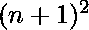
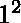
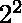
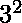
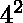
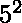

# 字幕的猜想

> 哎哎哎:# t0]https://www . geeksforgeeks . org/legendres-猜想/

它说在任意两个连续的自然数(n = 1，2，3，4，5，…)平方之间总是有一个素数。这叫[勒让德猜想](https://en.wikipedia.org/wiki/Legendre%27s_conjecture)。

**猜想:**猜想是基于不完全信息的命题或结论，没有发现证明，即没有被证明或否定。

> 数学上，
> 在到的范围内总是有一个素数 p，其中 n 是任意自然数。
> 例如-
> 2 和 3 是在到范围内的素数。
> 5 和 7 是到范围内的素数。
> 11 和 13 是到范围内的素数。
> 17 和 19 是到范围内的素数。

**示例:**

```
Input : 4 
output: Primes in the range 16 and 25 are:
        17
        19
        23
```

**说明**:这里 4 <sup>2</sup> = 16 和 5 <sup>2</sup> = 25
因此，16 和 25 之间的素数是 17，19 和 23。

```
Input : 10
Output: Primes in the range 100 and 121 are:
        101
        103
        107
        109
        113

```

## C++

```
// C++ program to verify Legendre's Conjecture
// for a given n.
#include <bits/stdc++.h>
using namespace std;

// prime checking
bool isprime(int n)
{
    for (int i = 2; i * i <= n; i++)
        if (n % i == 0)
            return false;
    return true;
}

void LegendreConjecture(int n)
{
   cout << "Primes in the range "<<n*n
        << " and "<<(n+1)*(n+1)
        <<" are:" <<endl;

   for (int i = n*n; i <= ((n+1)*(n+1)); i++)

      // searching for primes
      if (isprime(i))
          cout << i <<endl;
}

// Driver program
int main()
{
    int n = 50;
    LegendreConjecture(n);
    return 0;
}
```

## Java 语言(一种计算机语言，尤用于创建网站)

```
// Java program to verify Legendre's Conjecture
// for a given n.
class GFG {

  // prime checking
  static boolean isprime(int n)
  {
     for (int i = 2; i * i <= n; i++)
        if (n % i == 0)
            return false;
     return true;
  }

  static void LegendreConjecture(int n)
  {
     System.out.println("Primes in the range "+n*n
        +" and "+(n+1)*(n+1)
        +" are:");

     for (int i = n*n; i <= ((n+1)*(n+1)); i++)
     {
       // searching for primes
       if (isprime(i))
         System.out.println(i);
     }
  }

  // Driver program
  public static void main(String[] args)
  {
     int n = 50;
     LegendreConjecture(n);
  }
}
//This code is contributed by
//Smitha Dinesh Semwal
```

## 蟒蛇 3

```
# Python3 program to verify Legendre's Conjecture
# for a given n

import math

def isprime( n ):

    i = 2
    for i in range (2, int((math.sqrt(n)+1))):
        if n%i == 0:
            return False
    return True

def LegendreConjecture( n ):
    print ( "Primes in the range ", n*n
            , " and ", (n+1)*(n+1)
            , " are:" )

    for i in range (n*n, (((n+1)*(n+1))+1)):
        if(isprime(i)):
            print (i)

n = 50
LegendreConjecture(n)

# Contributed by _omg
```

## C#

```
// C# program to verify Legendre's
// Conjecture for a given n.
using System;

class GFG {

    // prime checking
    static Boolean isprime(int n)
    {
        for (int i = 2; i * i <= n; i++)
            if (n % i == 0)
                return false;

        return true;
    }

    static void LegendreConjecture(int n)
    {
        Console.WriteLine("Primes in the range "
           + n * n + " and " + (n + 1) * (n + 1)
                                      + " are:");

        for (int i = n * n; i <= ((n + 1)
                                * (n + 1)); i++)
        {

            // searching for primes
            if (isprime(i))
                Console.WriteLine(i);
        }
    }

    // Driver program
    public static void Main(String[] args)
    {
        int n = 50;

        LegendreConjecture(n);
    }
}

// This code is contributed by parashar.
```

## 服务器端编程语言（Professional Hypertext Preprocessor 的缩写）

```
<?php
// PHP program to verify
// Legendre's Conjecture
// for a given n.

// prime checking
function isprime($n)
{
    for ($i = 2; $i * $i <= $n; $i++)
        if ($n % $i == 0)
            return false;
    return true;
}

function LegendreConjecture($n)
{
    echo "Primes in the range ",$n* $n,
        " and ",($n + 1) * ($n + 1),
        " are:\n" ;

    for ($i = $n * $n; $i <= (($n + 1) *
                      ($n + 1)); $i++)

    // searching for primes
    if (isprime($i))
        echo $i ,"\n";
}

    // Driver Code
    $n = 50;
    LegendreConjecture($n);

// This code is contributed by ajit.
?>
```

## java 描述语言

```
<script>

// JavaScript program to verify
// Legendre's Conjecture for a given n.

// Prime checking
function isprime(n)
{
    for(let i = 2; i * i <= n; i++)
        if (n % i == 0)
            return false;

        return true;
}

function LegendreConjecture(n)
{
    document.write("Primes in the range " +
                   n * n + " and " +
                 (n + 1) * (n + 1) +
                 " are:" + "<br/>");

    for(let i = n * n;
            i <= ((n + 1) * (n + 1));
            i++)
    {

        // Searching for primes
        if (isprime(i))
            document.write(i + "<br/>");
    }
}

// Driver code
let n = 50;

LegendreConjecture(n);

// This code is contributed by splevel62

</script>
```

**输出:**

```
Primes in the range 2500 and 2601 are:
2503
2521
2531
2539
2543
2549
2551
2557
2579
2591
2593
```