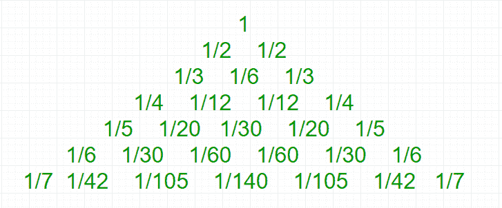
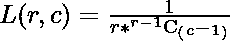

# 莱布尼茨调和三角形

> 原文:[https://www.geeksforgeeks.org/leibniz-harmonic-triangle/](https://www.geeksforgeeks.org/leibniz-harmonic-triangle/)

[**莱布尼茨调和三角形**](https://en.wikipedia.org/wiki/Leibniz_harmonic_triangle) 是单位分数的三角形排列，其中最外面的对角线由行号的倒数组成，每个内部单元格是对角线上方和左侧的单元格减去左侧的单元格。用代数的方法来说， **L(r，1) = 1/r** ，其中 r 是从 1 开始的行数，c 是数字，不超过 r 和 **L(r，c)= L(r–1，c–1)–L(r，c–1)。**



**与帕斯卡三角形**
的关系[帕斯卡三角形](https://www.geeksforgeeks.org/pascal-triangle/)中的每个条目是上一行中两个条目的总和，而莱布尼茨三角形中的每个条目是下一行中两个条目的总和。例如，在第 5 行中，条目(1/30)是第 6 行中两个(1/60)的总和。
就像帕斯卡三角形可以用二项式系数计算一样，莱布尼茨也可以:

**Properties**
如果取第 n 行的分母并相加，那么结果将等于 **n.2 <sup>n-1</sup>** 。例如，对于第三行，我们有 3 + 6 + 3 = 12 = 3 × 22。
给定正整数 **n** 。任务是打印高度为 n 的**莱布尼茨调和三角形**。

**示例:**

```
Input : n = 4
Output :
1
1/2 1/2
1/3 1/6 1/3
1/4 1/12 1/12 1/4

Input : n = 3
Output :
1
1/2 1/2
1/3 1/6 1/3
```

下面是基于上述与帕斯卡三角形的关系，打印高度为 n 的莱布尼茨调和三角形的实现。

## C++

```
// CPP Program to print Leibniz Harmonic Triangle
#include <bits/stdc++.h>
using namespace std;

// Print Leibniz Harmonic Triangle
void LeibnizHarmonicTriangle(int n)
{
    int C[n + 1][n + 1];

    // Calculate value of Binomial Coefficient in
    // bottom up manner
    for (int i = 0; i <= n; i++) {
        for (int j = 0; j <= min(i, n); j++) {

            // Base Cases
            if (j == 0 || j == i)
                C[i][j] = 1;

            // Calculate value using previously
            // stored values
            else
                C[i][j] = C[i - 1][j - 1] + C[i - 1][j];
        }
    }

    // printing Leibniz Harmonic Triangle
    for (int i = 1; i <= n; i++) {
        for (int j = 1; j <= i; j++)
            cout << "1/" << i * C[i - 1][j - 1] << " ";

        cout << endl;
    }
}

// Driven Program
int main()
{
    int n = 4;
    LeibnizHarmonicTriangle(n);
    return 0;
}
```

## Java 语言(一种计算机语言，尤用于创建网站)

```
// Java Program to print
// Leibniz Harmonic Triangle
import java.io.*;
import java.math.*;

class GFG {

    // Print Leibniz Harmonic Triangle
    static void LeibnizHarmonicTriangle(int n)
    {
        int C[][] = new int[n + 1][n + 1];

        // Calculate value of Binomial
        // Coefficient in bottom up manner
        for (int i = 0; i <= n; i++) {
            for (int j = 0; j <= Math.min(i, n);
                                          j++) {

                // Base Cases
                if (j == 0 || j == i)
                    C[i][j] = 1;

                // Calculate value using
                // previously stored values
                else
                    C[i][j] = C[i - 1][j - 1] +
                              C[i - 1][j];
            }
        }

        // printing Leibniz Harmonic Triangle
        for (int i = 1; i <= n; i++) {
            for (int j = 1; j <= i; j++)
                System.out.print("1/" + i * C[i - 1][j - 1]
                                          + " ");

            System.out.println();
        }
    }

    // Driven Program
    public static void main(String args[])
    {
        int n = 4;
        LeibnizHarmonicTriangle(n);
    }
}

// This code is contributed by Nikita Tiwari
```

## 蟒蛇 3

```
# Python3 Program to print
# Leibniz Harmonic Triangle

# Print Leibniz Harmonic
# Triangle
def LeibnizHarmonicTriangle(n):
    C = [[0 for x in range(n + 1)]
            for y in range(n + 1)];

    # Calculate value of Binomial
    # Coefficient in bottom up manner
    for i in range(0, n + 1):
        for j in range(0, min(i, n) + 1):

            # Base Cases
            if (j == 0 or j == i):
                C[i][j] = 1;

            # Calculate value using
            # previously stored values
            else:
                C[i][j] = (C[i - 1][j - 1] +
                           C[i - 1][j]);

    # printing Leibniz
    # Harmonic Triangle
    for i in range(1, n + 1):
        for j in range(1, i + 1):
            print("1/", end = "");
            print(i * C[i - 1][j - 1],
                           end = " ");
        print();

# Driver Code
LeibnizHarmonicTriangle(4);

# This code is contributed
# by mits.
```

## C#

```
// C# Program to print Leibniz Harmonic Triangle
using System;

class GFG {

    // Print Leibniz Harmonic Triangle
    static void LeibnizHarmonicTriangle(int n)
    {
        int [,]C = new int[n + 1,n + 1];

        // Calculate value of Binomial
        // Coefficient in bottom up manner
        for (int i = 0; i <= n; i++) {
            for (int j = 0; j <= Math.Min(i, n);
                                        j++) {

                // Base Cases
                if (j == 0 || j == i)
                    C[i,j] = 1;

                // Calculate value using
                // previously stored values
                else
                    C[i,j] = C[i - 1,j - 1] +
                            C[i - 1,j];
            }
        }

        // printing Leibniz Harmonic Triangle
        for (int i = 1; i <= n; i++) {
            for (int j = 1; j <= i; j++)
                Console.Write("1/" + i * C[i - 1,j - 1]
                                        + " ");

        Console.WriteLine();
        }
    }

    // Driven Program
    public static void Main()
    {
        int n = 4;

        LeibnizHarmonicTriangle(n);
    }
}

// This code is contributed by vt_m.
```

## 服务器端编程语言（Professional Hypertext Preprocessor 的缩写）

```
<?php
// PHP Program to print
// Leibniz Harmonic Triangle

// Print Leibniz Harmonic Triangle
function LeibnizHarmonicTriangle($n)
{

    // Calculate value of
    // Binomial Coefficient in
    // bottom up manner
    for ($i = 0; $i <= $n; $i++)
    {
        for ($j = 0; $j <= min($i, $n); $j++)
        {

            // Base Cases
            if ($j == 0 || $j == $i)
                $C[$i][$j] = 1;

            // Calculate value
            // using previously
            // stored values
            else
                $C[$i][$j] = $C[$i - 1][$j - 1] +
                                 $C[$i - 1][$j];
        }
    }

    // printing Leibniz
    // Harmonic Triangle
    for ($i = 1; $i <= $n; $i++)
    {
        for ($j = 1; $j <= $i; $j++)
            echo "1/", $i * $C[$i - 1][$j - 1], " ";

        echo "\n";
    }
}

    // Driver Code
    $n = 4;
    LeibnizHarmonicTriangle($n);

// This code is contributed by aj_36
?>
```

## java 描述语言

```
<script>

// JavaScript Program to print
// Leibniz Harmonic Triangle

    // Print Leibniz Harmonic Triangle
    function LeibnizHarmonicTriangle(n)
    {
        let C = new Array(n + 1);

        // Loop to create 2D array using 1D array
        for (let i = 0; i < C.length; i++) {
                C[i] = new Array(2);
        }

        // Calculate value of Binomial
        // Coefficient in bottom up manner
        for (let i = 0; i <= n; i++) {
            for (let j = 0; j <= Math.min(i, n);
                                          j++) {

                // Base Cases
                if (j == 0 || j == i)
                    C[i][j] = 1;

                // Calculate value using
                // previously stored values
                else
                    C[i][j] = C[i - 1][j - 1] +
                              C[i - 1][j];
            }
        }

        // printing Leibniz Harmonic Triangle
        for (let i = 1; i <= n; i++)
        {
            for (let j = 1; j <= i; j++)
                document.write("1/" + i * C[i - 1][j - 1]
                                          + " ");

            document.write("<br/>");
        }
    }

// Driver Code
        let n = 4;
        LeibnizHarmonicTriangle(n);

  // This code is contributed by avijitmondal1998.
</script>
```

**输出:**

```
1/1 
1/2 1/2 
1/3 1/6 1/3 
1/4 1/12 1/12 1/4 
```