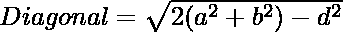
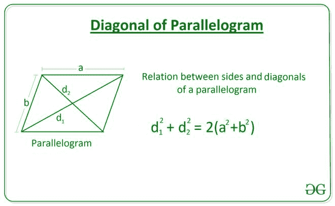

# 平行四边形的一条对角线的长度使用边和另一条对角线的长度

> 原文:[https://www . geeksforgeeks . org/平行四边形的对角线长度-使用边长和其他对角线的长度/](https://www.geeksforgeeks.org/length-of-a-diagonal-of-a-parallelogram-using-the-length-of-sides-and-the-other-diagonal/)

给定两个整数 **A** 和 **B** ，表示一个[平行四边形的长度](https://en.wikipedia.org/wiki/Parallelogram)和一个整数 **D** ，表示一条对角线的长度，任务是求平行四边形的另一条对角线的长度。

**示例:**

> **输入:** A = 10，B = 30，D = 20
> T3】输出: 40.0
> 
> **输入:** A = 6，B = 8，D = 10
> T3】输出: 10.0

**方法:**
对角线长度的平行四边形的边和对角线之间的关系由等式给出:





下面是上述方法的实现:

## C++

```
// C++ Program to implement
// the above approach
#include <bits/stdc++.h>
using namespace std;

// Function to calculate the length
// of the diagonal of a parallelogram
// using two sides and other diagonal
float Length_Diagonal(int a, int b, int d)
{

    float diagonal = sqrt(2 * ((a * a) +
                               (b * b)) - (d * d));

    return diagonal;
}

// Driver Code
int main()
{
    int A = 10;
    int B = 30;
    int D = 20;

    // Function Call
    float ans = Length_Diagonal(A, B, D);

    // Print the final answer
    printf("%0.1f", ans);
    return 0;
}

// This code is contributed by Rohit_ranjan
```

## Java 语言(一种计算机语言，尤用于创建网站)

```
// Java Program to implement
// the above approach
class GFG{

// Function to calculate the length
// of the diagonal of a parallelogram
// using two sides and other diagonal
static float Length_Diagonal(int a, int b, int d)
{

    float diagonal = (float) Math.sqrt(2 * ((a * a) +
                                 (b * b)) - (d * d));

    return diagonal;
}

// Driver Code
public static void main(String[] args)
{
    int A = 10;
    int B = 30;
    int D = 20;

    // Function Call
    float ans = Length_Diagonal(A, B, D);

    // Print the final answer
    System.out.printf("%.1f", ans);
}
}

// This code is contributed by Rajput-Ji
```

## 计算机编程语言

```
# Python Program to implement
# the above approach

import math

# Function to calculate the length
# of the diagonal of a parallelogram
# using two sides and other diagonal
def Length_Diagonal(a, b, d):

    diagonal = math.sqrt(2 * ((a**2) \
    + (b**2)) - (d**2))

    return diagonal

# Driver Code
A = 10
B = 30
D = 20

# Function Call
ans = Length_Diagonal(A, B, D)

# Print the final answer
print(round(ans, 2))
```

## C#

```
// C# Program to implement
// the above approach
using System;
class GFG{

// Function to calculate the length
// of the diagonal of a parallelogram
// using two sides and other diagonal
static float Length_Diagonal(int a, int b, int d)
{

    float diagonal = (float) Math.Sqrt(2 * ((a * a) +
                                 (b * b)) - (d * d));

    return diagonal;
}

// Driver Code
public static void Main(String[] args)
{
    int A = 10;
    int B = 30;
    int D = 20;

    // Function Call
    float ans = Length_Diagonal(A, B, D);

    // Print the readonly answer
    Console.Write("{0:F1}", ans);
}
}

// This code is contributed by Rajput-Ji
```

## java 描述语言

```
<script>
// javascript Program to implement
// the above approach

// Function to calculate the length
// of the diagonal of a parallelogram
// using two sides and other diagonal
function Length_Diagonal( a, b,  d)
{

    let diagonal = Math.sqrt(2 * ((a * a) +
                               (b * b)) - (d * d));

    return diagonal;
}

// Driver Code
    let A = 10;
    let B = 30;
    let D = 20;

    // Function Call
    let ans = Length_Diagonal(A, B, D);

    // Print the final answer
    document.write(ans.toFixed(1));

// This code is contributed by gauravrajput1
</script>
```

**Output:** 

```
40.0
```

***时间复杂度:**O(1)*
T5**辅助空间:** O(1)