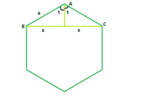

# 正多边形对角线长度

> 原文:[https://www . geesforgeks . org/n 边正多边形对角线长度/](https://www.geeksforgeeks.org/length-of-diagonal-of-a-n-sided-regular-polygon/)

给定边长为 **a** 的正多边形。任务是找出对角线的长度。
**例:**

```
Input:  a = 9, n = 10
Output:  17.119

Input: a = 4, n = 5
Output: 6.47213
```



**接近** :

> 我们知道多边形内角之和=**(n–2)* 180**其中， **n** 是多边形的边数。
> 所以，每个内角=**(n–2)* 180/n**
> 现在，我们要找到 **BC = 2 * x** 。如果我们在 **BC** 上画一条垂线 **AO** ，我们会看到这条垂线将 **BO** 和 **OC** 中的 **BC** 一分为二，作为三角形 **AOB** 和 **AOC** 相互全等。
> 现在，**t =(n–2)* 180/2n**
> 所以， **sint = x/a**
> 因此， **x = asint**
> 因此，对角线=**2x = 2 Sint = 2 asin((n–2)* 180/2n)**

## C++

```
// C++ Program to find the diagonal
// of a regular polygon with given side length
#include <bits/stdc++.h>
using namespace std;

// Function to find the diagonal
// of a regular polygon
float polydiagonal(float n, float a)
{

    // Side and side length cannot be negative
    if (a < 0 && n < 0)
        return -1;

    // diagonal
    // degree converted to radians
    return 2 * a * sin((((n - 2) * 180) / (2 * n)) * 3.14159 / 180);
}

// Driver code
int main()
{
    float a = 9, n = 10;
    cout << polydiagonal(n, a) << endl;

    return 0;
}
```

## Java 语言(一种计算机语言，尤用于创建网站)

```
// Java Program to find the diagonal
// of a regular polygon with given side length

class GFG {

// Function to find the diagonal
// of a regular polygon
    static float polydiagonal(float n, float a) {

        // Side and side length cannot be negative
        if (a < 0 && n < 0) {
            return -1;
        }

        // diagonal
        // degree converted to radians
        return (float) (2 * a * Math.sin((((n - 2) * 180) / (2 * n)) * 3.14159 / 180));
    }

// Driver code
    public static void main(String[] args) {
        float a = 9, n = 10;
        System.out.printf("%.3f",polydiagonal(n, a));

    }
}

// This code is contributed by 29AjayKumar
```

## 蟒蛇 3

```
# Python3 Program to find the diagonal
# of a regular polygon with given side length
import math as mt

# Function to find the diagonal
# of a regular polygon
def polydiagonal(n, a):

    # Side and side length cannot
    # be negative
    if (a < 0 and n < 0):
        return -1

    # diagonal degree converted to radians
    return (2 * a * mt.sin((((n - 2) * 180) /
           (2 * n)) * 3.14159 / 180))

# Driver code
a, n = 9, 10
print(polydiagonal(n, a))

# This code is contributed
# by Mohit kumar 29
```

## C#

```
// C#  Program to find the diagonal
// of a regular polygon with given side length
using System;

public class GFG{

// Function to find the diagonal
// of a regular polygon
    static float polydiagonal(float n, float a) {

        // Side and side length cannot be negative
        if (a < 0 && n < 0) {
            return -1;
        }

        // diagonal
        // degree converted to radians
        return (float) (2 * a * Math.Sin((((n - 2) * 180) / (2 * n)) * 3.14159 / 180));
    }

// Driver code
    static public void Main (){
            float a = 9, n = 10;
        Console.WriteLine(polydiagonal(n, a));

    }
}

// This code is contributed by  @Sachin...
```

## 服务器端编程语言（Professional Hypertext Preprocessor 的缩写）

```
<?php
// PHP Program to find the diagonal of a
// regular polygon with given side length

// Function to find the diagonal
// of a regular polygon
function polydiagonal ($n, $a)
{

    // Side and side length cannot
    // be negative
    if ($a < 0 && $n < 0)
        return -1;

    // diagonal
    // degree converted to radians
    return 2 * $a * sin(((($n - 2) * 180) /
          (2 * $n)) * 3.14159 / 180);
}

// Driver code
$a = 9;
$n = 10;
echo polydiagonal($n, $a);

// This code is contributed
// by Sach_Code
?>
```

## java 描述语言

```
<script>
// javascript Program to find the diagonal
// of a regular polygon with given side length

// Function to find the diagonal
// of a regular polygon
function polydiagonal(n , a) {

    // Side and side length cannot be negative
    if (a < 0 && n < 0) {
        return -1;
    }

    // diagonal
    // degree converted to radians
    return  (2 * a * Math.sin((((n - 2) * 180)
    / (2 * n)) * 3.14159 / 180));
}

// Driver code

var a = 9, n = 10;
document.write(polydiagonal(n, a).toFixed(3));

// This code contributed by Princi Singh
</script>
```

**Output:** 

```
17.119
```