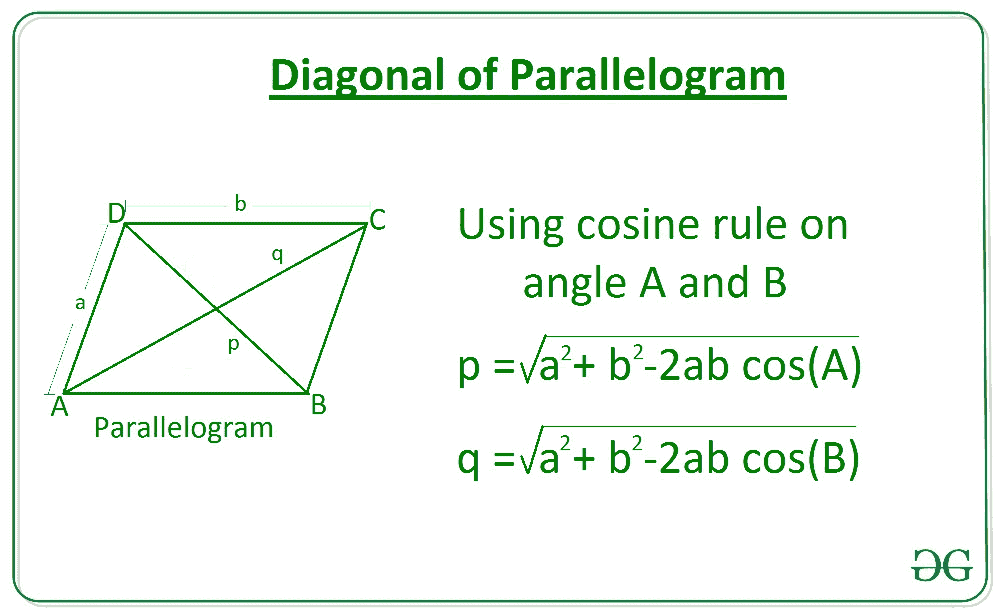

# 利用相邻边和它们之间的角度的平行四边形的对角线长度

> 原文:[https://www . geesforgeks . org/平行四边形对角线长度-使用相邻边和它们之间的角度/](https://www.geeksforgeeks.org/length-of-diagonal-of-a-parallelogram-using-adjacent-sides-and-angle-between-them/)

给定两个整数 **a** 和 **b** ，其中 **a** 和 **b** 代表平行四边形相邻边的长度和它们之间的角度 ~~**0**~~ ，任务是求平行四边形对角线的长度。

**示例:**

> **输入:** a = 6，b = 10，~~0~~= 30
> T5】输出: 6.14
> 
> **输入:** a = 3，b = 5，~~0~~= 45
> T5】输出: 3.58

**逼近:**考虑一个平行四边形 **ABCD** 有边 **a** 和 **b** ，现在在三角形 **ABD** 中以角度 **A** 应用[余弦法则](https://en.wikipedia.org/wiki/Law_of_cosines)求对角线 **p** 的长度，同样从三角形 **ABC 中求对角线 **q** 。**

[](https://media.geeksforgeeks.org/wp-content/uploads/20200808173239/AreaofRhombus.jpg)

因此对角线由下式给出:


## C++

```
// C++ program to find length
// Of diagonal of a parallelogram
// Using sides and angle between them.
#include <bits/stdc++.h>
using namespace std;
#define PI 3.147

// Function to return the length
// Of diagonal of a parallelogram
// using sides and angle between them.
double Length_Diagonal(int a, int b, double theta)
{
    double diagonal = sqrt((pow(a, 2) + pow(b, 2)) -
                      2 * a * b * cos(theta * (PI / 180)));

    return diagonal;
}

// Driver Code
int main()
{

    // Given sides
    int a = 3;
    int b = 5;

    // Given angle
    double theta = 45;

    // Function call
    double ans = Length_Diagonal(a, b, theta);

    // Print the final answer
    printf("%.2f", ans);
}

// This code is contributed by Amit Katiyar
```

## Java 语言(一种计算机语言，尤用于创建网站)

```
// Java program to find length
// Of diagonal of a parallelogram
// Using sides and angle between them.
class GFG{

// Function to return the length
// Of diagonal of a parallelogram
// using sides and angle between them.
static double Length_Diagonal(int a, int b,
                              double theta)
{
    double diagonal = Math.sqrt((Math.pow(a, 2) +
                                 Math.pow(b, 2)) -
                                 2 * a * b *
                                 Math.cos(theta *
                                 (Math.PI / 180)));

    return diagonal;
}

// Driver Code
public static void main(String[] args)
{

    // Given sides
    int a = 3;
    int b = 5;

    // Given angle
    double theta = 45;

    // Function call
    double ans = Length_Diagonal(a, b, theta);

    // Print the final answer
    System.out.printf("%.2f", ans);
}
}

// This code is contributed by amal kumar choubey
```

## 蟒蛇 3

```
# Python3 Program to find length
# Of diagonal of a parallelogram
# Using sides and angle between them.

import math 

# Function to return the length
# Of diagonal of a parallelogram
# using sides and angle between them. 
def Length_Diagonal(a, b, theta): 

    diagonal = math.sqrt( ((a**2) + (b**2))
    - 2 * a*b * math.cos(math.radians(theta)))

    return diagonal 

# Driver Code

# Given Sides
a = 3
b = 5

# Given Angle
theta = 45

# Function Call 
ans = Length_Diagonal(a, b, theta) 

# Print the final answer
print(round(ans, 2))
```

## C#

```
// C# program to find length
// Of diagonal of a parallelogram
// Using sides and angle between them.
using System;

class GFG{

// Function to return the length
// Of diagonal of a parallelogram
// using sides and angle between them.
static double Length_Diagonal(int a, int b,
                              double theta)
{
    double diagonal = Math.Sqrt((Math.Pow(a, 2) +
                                 Math.Pow(b, 2)) -
                                 2 * a * b *
                                 Math.Cos(theta *
                                (Math.PI / 180)));

    return diagonal;
}

// Driver Code
public static void Main(String[] args)
{

    // Given sides
    int a = 3;
    int b = 5;

    // Given angle
    double theta = 45;

    // Function call
    double ans = Length_Diagonal(a, b, theta);

    // Print the readonly answer
    Console.Write("{0:F2}", ans);
}
}

// This code is contributed by amal kumar choubey
```

## java 描述语言

```
<script>

// javascript program to find length
// Of diagonal of a parallelogram
// Using sides and angle between them.

// Function to return the length
// Of diagonal of a parallelogram
// using sides and angle between them.
function Length_Diagonal(a , b,theta)
{
    var diagonal = Math.sqrt((Math.pow(a, 2) +
                                 Math.pow(b, 2)) -
                                 2 * a * b *
                                 Math.cos(theta *
                                 (Math.PI / 180)));

    return diagonal;
}

// Driver Code

// Given sides
var a = 3;
var b = 5;

// Given angle
var theta = 45;

// Function call
var ans = Length_Diagonal(a, b, theta);

// Print the final answer
document.write(ans.toFixed(2));

// This code is contributed by 29AjayKumar

</script>
```

**Output:** 

```
3.58
```

**时间复杂度:**O(1)
T3】辅助空间: O(1)