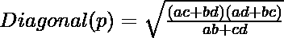
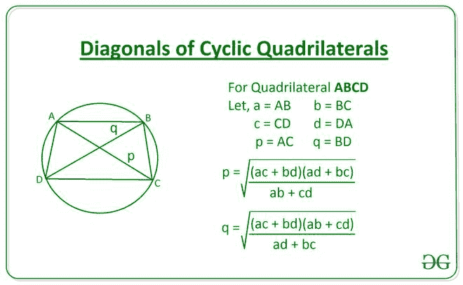

# 使用边长的循环四边形的对角线长度。

> 原文:[https://www . geesforgeks . org/使用边长的循环四边形对角线长度/](https://www.geeksforgeeks.org/length-of-diagonals-of-a-cyclic-quadrilateral-using-the-length-of-sides/)

给定整数 **A** 、 **B** 、 **C** 和 **D** ，表示一个[循环四边形](https://en.wikipedia.org/wiki/Cyclic_quadrilateral)的边长，任务是求一个循环四边形的对角线长度。

**示例:**

> **输入:** A = 10，B = 15，C = 20，D = 25
> T3】输出: 22.06 26.07
> 
> **输入:** A = 10，B = 30，C =50，D = 20
> T3】输出: 37.93 29.0

**方法:**对角线的长度可以用以下公式计算:

【tex】对角(q)= \ sqrt {(AC+BD)(ab+CD } } { ad+BC } }[/tex]



下面是上述方法的实现:

## C++

```
// C++ Program to implement
// the above approach
#include <bits/stdc++.h>
using namespace std;

// Function to calculate the length of
// diagonals of a cyclic quadrilateral
vector<float> Diagonals(int a, int b,
                        int c, int d)
{
    vector<float> ans;
    ans.push_back(sqrt(((a * c) + (b * d)) *
                       ((a * d) + (b * c)) /
                       ((a * b) + (c * d))));
    ans.push_back(sqrt(((a * c) + (b * d)) *
                       ((a * b) + (c * d)) /
                       ((a * d) + (b * c))));
    return ans;
}

// Driver Code
int main()
{
    int A = 10;
    int B = 15;
    int C = 20;
    int D = 25;

    // Function Call
    vector<float> ans = Diagonals(A, B, C, D);

    // Print the final answer
    printf("%.2f %.2f",
           (ans[0]) + .01,
            ans[1] + .01);
}

// This code is contributed by Amit Katiyar
```

## Java 语言(一种计算机语言，尤用于创建网站)

```
// Java Program to implement
// the above approach
import java.util.*;
class GFG{

// Function to calculate the length of
// diagonals of a cyclic quadrilateral
static Vector<Float> Diagonals(int a, int b,
                               int c, int d)
{
    Vector<Float> ans = new Vector<Float>();
    ans.add((float) Math.sqrt(((a * c) + (b * d)) *
                              ((a * d) + (b * c)) /
                              ((a * b) + (c * d))));
    ans.add((float) Math.sqrt(((a * c) + (b * d)) *
                              ((a * b) + (c * d)) /
                              ((a * d) + (b * c))));
    return ans;
}

// Driver Code
public static void main(String[] args)
{
    int A = 10;
    int B = 15;
    int C = 20;
    int D = 25;

    // Function Call
    Vector<Float> ans = Diagonals(A, B,
                                  C, D);

    // Print the final answer
    System.out.printf("%.2f %.2f",
                      (ans.get(0)) + .01,
                       ans.get(1) + .01);
}
}

// This code is contributed by 29AjayKumar
```

## 蟒蛇 3

```
# Python3 program to implement
# the above approach

import math

# Function to calculate the length of
# diagonals of a cyclic quadrilateral
def Diagonals(a, b, c, d):

    p = math.sqrt(((a * c)+(b * d))*((a * d)+(b * c))
                  / ((a * b)+(c * d)))
    q = math.sqrt(((a * c)+(b * d))*((a * b)+(c * d))
                  / ((a * d)+(b * c)))

    return [p, q]

# Driver Code
A = 10
B = 15
C = 20
D = 25

# Function Call
ans = Diagonals(A, B, C, D)

# Print the final answer
print(round(ans[0], 2), round(ans[1], 2))
```

## C#

```
// C# Program to implement
// the above approach
using System;
using System.Collections.Generic;
class GFG{

// Function to calculate the length of
// diagonals of a cyclic quadrilateral
static List<float> Diagonals(int a, int b,
                             int c, int d)
{
  List<float> ans = new List<float>();
  ans.Add((float) Math.Sqrt(((a * c) + (b * d)) *
                            ((a * d) + (b * c)) /
                            ((a * b) + (c * d))));
  ans.Add((float) Math.Sqrt(((a * c) + (b * d)) *
                            ((a * b) + (c * d)) /
                            ((a * d) + (b * c))));
  return ans;
}

// Driver Code
public static void Main(String[] args)
{
  int A = 10;
  int B = 15;
  int C = 20;
  int D = 25;

  // Function Call
  List<float> ans = Diagonals(A, B,
                              C, D);

  // Print the readonly answer
  Console.Write("{0:F2} {1:F2}",
                 (ans[0]) + .01,
                  ans[1] + .01);
}
}

// This code is contributed by 29AjayKumar
```

## java 描述语言

```
<script>

// Javascript Program to implement
// the above approach

// Function to calculate the length of
// diagonals of a cyclic quadrilateral
function Diagonals(a, b, c, d)
{

    var p = parseFloat(
            Math.sqrt(((a * c) + (b * d)) *
                      ((a * d) + (b * c)) /
                      ((a * b) + (c * d))));
    var q = parseFloat(
            Math.sqrt(((a * c) + (b * d)) *
                      ((a * b) + (c * d)) /
                      ((a * d) + (b * c))));

    return [p, q];
}

// Driver Code
var A = 10;
var B = 15;
var C = 20;
var D = 25;

// Function Call
var ans = Diagonals(A, B, C, D)

// Print the final answer
document.write(ans[0].toFixed(2) + " ",
               ans[1].toFixed(2));

// This code is contributed by kirti

</script>
```

**Output:** 

```
22.06 26.07
```

***时间复杂度:**O(1)*
T5**辅助空间:** O(1)