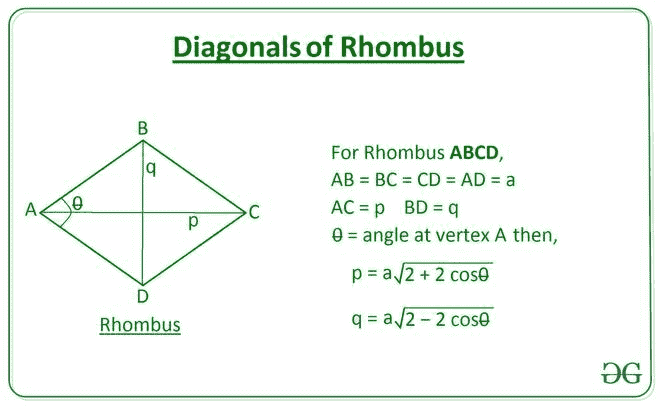

# 使用边长和顶角的菱形对角线长度

> 原文:[https://www . geesforgeks . org/菱形对角线长度-使用边长和顶角/](https://www.geeksforgeeks.org/length-of-diagonals-of-a-rhombus-using-length-of-side-and-vertex-angle/)

给定两个整数 **A** 和**θ**，分别表示一个[菱形的边长](https://en.wikipedia.org/wiki/Rhombus)和顶角，任务是求菱形对角线的长度。

**示例:**

> **输入:** A = 10，θ= 30
> T3】输出: 19.32 5.18
> 
> **输入:** A = 6，θ= 45
> T3】输出: 11.09 4.59

**方法:**
这个问题可以用[余弦定律](https://en.wikipedia.org/wiki/Law_of_cosines)来解决。使用由菱形的对角线和边形成的三角形上的余弦**定律**给出以下关系来计算对角线的长度:

> 
> 

[](https://media.geeksforgeeks.org/wp-content/uploads/20200815120907/AreaofRhombus-660x406.jpg)

下面是上述方法的实现:

## C++

```
// C++ program to implement
// the above approach
#include <bits/stdc++.h>
using namespace std;

// Function to calculate the length
// of diagonals of a rhombus using
// length of sides and vertex angle
double Length_Diagonals(int a, double theta)
{
    double p = a * sqrt(2 + (2 * cos(
           theta * (3.141 / 180))));
    double q = a * sqrt(2 - (2 * cos(
           theta * (3.141 / 180))));

    cout << fixed << setprecision(2) << p
         << " " << q;
}

// Driver Code
int main()
{
    int a = 6;
    int theta = 45;

    // Function Call
    Length_Diagonals(a, theta);

    return 0;
}

// This code is contributed by Virusbuddah_
```

## Java 语言(一种计算机语言，尤用于创建网站)

```
// Java program to implement
// the above approach
class GFG{

// Function to calculate the length
// of diagonals of a rhombus using
// length of sides and vertex angle
static double[] Length_Diagonals(int a, double theta)
{
    double p = a * Math.sqrt(2 + (2 *
                   Math.cos(theta * (Math.PI / 180))));

    double q = a * Math.sqrt(2 - (2 *
                   Math.cos(theta * (Math.PI / 180))));

    return new double[]{ p, q };
}

// Driver Code
public static void main(String[] args)
{
    int A = 6;
    double theta = 45;

    double[] ans = Length_Diagonals(A, theta);

    System.out.printf("%.2f" + " " + "%.2f",
                      ans[0], ans[1]);
}
}

// This code is contributed by Princi Singh
```

## 蟒蛇 3

```
# Python Program to implement
# the above approach
import math

# Function to calculate the length
# of diagonals of a rhombus using
# length of sides and vertex angle
def Length_Diagonals(a, theta):

    p = a * math.sqrt(2 + (2 * \
            math.cos(math.radians(theta))))

    q = a * math.sqrt(2 - (2 * \
            math.cos(math.radians(theta))))

    return [p, q]

# Driver Code
A = 6
theta = 45

ans = Length_Diagonals(A, theta)

print(round(ans[0], 2), round(ans[1], 2))
```

## C#

```
// C# program to implement
// the above approach
using System;
class GFG{

// Function to calculate the length
// of diagonals of a rhombus using
// length of sides and vertex angle
static double[] Length_Diagonals(int a, double theta)
{
    double p = a * Math.Sqrt(2 + (2 *
                   Math.Cos(theta * (Math.PI / 180))));

    double q = a * Math.Sqrt(2 - (2 *
                   Math.Cos(theta * (Math.PI / 180))));

    return new double[]{ p, q };
}

// Driver Code
public static void Main(String[] args)
{
    int A = 6;
    double theta = 45;

    double[] ans = Length_Diagonals(A, theta);

    Console.Write("{0:F2}" + " " + "{1:F2}",
                            ans[0], ans[1]);
}
}

// This code is contributed by gauravrajput1
```

## java 描述语言

```
<script>

// JavaScript program for the above approach

// Function to calculate the length
// of diagonals of a rhombus using
// length of sides and vertex angle
function Length_Diagonals(a, theta)
{
    let p = a * Math.sqrt(2 + (2 *
                Math.cos(theta * (Math.PI / 180))));

    let q = a * Math.sqrt(2 - (2 *
                Math.cos(theta * (Math.PI / 180))));

    return [ p, q ];
}

// Driver Code

      let A = 6;
    let theta = 45;

    let ans = Length_Diagonals(A, theta);

    document.write(ans[0].toFixed(2) + " "
    + ans[1].toFixed(2));

</script>
```

**Output:** 

```
11.09 4.59
```

***时间复杂度:**O(1)*
T5**辅助空间:** O(1)