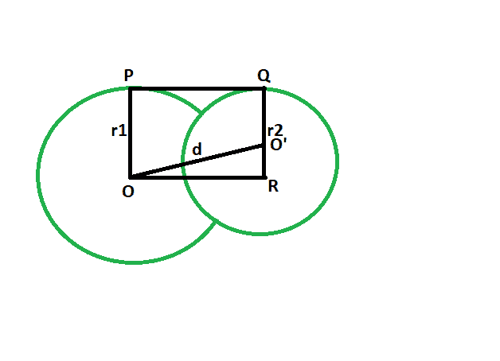
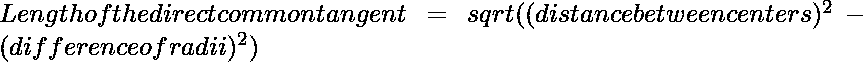

# 两个相交圆之间的直接公共切线的长度

> 原文:[https://www . geeksforgeeks . org/两个相交圆之间的直共切线长度/](https://www.geeksforgeeks.org/length-of-direct-common-tangent-between-two-intersecting-circles/)

给定半径的两个圆，它们的圆心相距给定的距离，这样两个圆在两点相交。任务是找到圆之间的直接公共切线的长度。
**例:**

```
Input: r1 = 4, r2 = 6, d = 3  
Output: 2.23607

Input: r1 = 14, r2 = 43, d = 35
Output: 19.5959
```



**接近** :

*   让圆的半径分别为 **r1** & **r2** 。

*   让中心之间的距离为 **d** 单位。

*   画一条线或平行于 PQ

*   **角度 OPQ = 90 度**
    **角度奥 QP = 90 度**
    {圆心到接触点的连线与切线成 90 度角}

*   **角度 OPQ +角度 O'QP = 180 度**
    **OP || QR**

*   由于相对的边是平行的，内角是 90°，因此 OPQR 是一个矩形。

*   所以 **OP = QR = r1 和 PQ = OR = d**

*   在**三角形 oo’r**
    **角 oro’= 90**
    由**勾股定理**
    **or^2+o'r^2 =(oo'^2)**
    **or^2+(r1-r2)^2 = d^2**

*   所以，**or^2= d^2-(r1-r2)^2**T2**或= √{d^2-(r1-r2)^2}**t5T7】

以下是上述方法的实现:

## C++

```
// C++ program to find
// the length of the direct
// common tangent between two circles
// which intersect each other
#include <bits/stdc++.h>
using namespace std;

// Function to find the length of the direct common tangent
void lengtang(double r1, double r2, double d)
{
    cout << "The length of the direct"
         <<" common tangent is "
         << sqrt(pow(d, 2) - pow((r1 - r2), 2))
         << endl;
}

// Driver code
int main()
{
    double r1 = 4, r2 = 6, d = 3;
    lengtang(r1, r2, d);
    return 0;
}
```

## Java 语言(一种计算机语言，尤用于创建网站)

```
// Java program to find
// the length of the direct
// common tangent between two circles
// which intersect each other
class GFG
{

    // Function to find the length of
    // the direct common tangent
    static void lengtang(double r1, double r2, double d)
    {
        System.out.println("The length of the direct"
                + " common tangent is "
                + (Math.sqrt(Math.pow(d, 2) -
                    Math.pow((r1 - r2), 2))));
    }

    // Driver code
    public static void main(String[] args)
    {
        double r1 = 4, r2 = 6, d = 3;
        lengtang(r1, r2, d);
    }
}

/* This code contributed by PrinciRaj1992 */
```

## 蟒蛇 3

```
# Python program to find
# the length of the direct
# common tangent between two circles
# which intersect each other

# Function to find the length of
# the direct common tangent
def lengtang(r1, r2, d):
    print("The length of the direct common tangent is "
        ,((d** 2) - ((r1 - r2)** 2))**(1/2));

# Driver code
r1 = 4; r2 = 6; d = 3;
lengtang(r1, r2, d);

# This code has been contributed by 29AjayKumar
```

## C#

```
// C# program to find
// the length of the direct
// common tangent between two circles
// which intersect each other
using System;

class GFG
{

    // Function to find the length of
    // the direct common tangent
    static void lengtang(double r1, double r2, double d)
    {
        Console.WriteLine("The length of the direct"
                + " common tangent is "
                + (Math.Sqrt(Math.Pow(d, 2) -
                    Math.Pow((r1 - r2), 2))));
    }

    // Driver code
    public static void Main(String[] args)
    {
        double r1 = 4, r2 = 6, d = 3;
        lengtang(r1, r2, d);
    }
}

/* This code contributed by PrinciRaj1992 */
```

## 服务器端编程语言（Professional Hypertext Preprocessor 的缩写）

```
<?php
// PHP program to find
// the length of the direct
// common tangent between two circles
// which intersect each other

// Function to find the length of
// the direct common tangent
function lengtang($r1, $r2, $d)
{
    echo "The length of the direct common tangent is "
        ,sqrt(pow($d, 2) - pow(($r1 - $r2), 2)) ;
}

// Driver code
$r1 = 4; $r2 = 6; $d = 3;
lengtang($r1, $r2, $d);

// This code is contributed by AnkitRai01
?>
```

## java 描述语言

```
<script>

// javascript program to find
// the length of the direct
// common tangent between two circles
// which intersect each other

// Function to find the length of
// the direct common tangent
function lengtang(r1 , r2 , d)
{
    document.write("The length of the direct"
            + " common tangent is "
            + (Math.sqrt(Math.pow(d, 2) -
                Math.pow((r1 - r2), 2))).toFixed(5));
}

// Driver code
var r1 = 4, r2 = 6, d = 3;
lengtang(r1, r2, d);

// This code contributed by Princi Singh

</script>
```

**Output:** 

```
The length of the direct common tangent is 2.23607
```