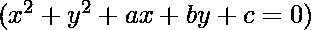
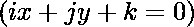
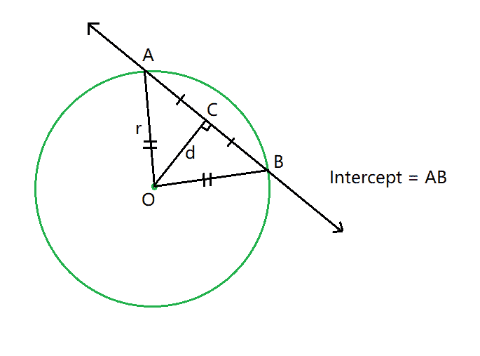
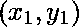
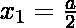
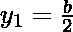
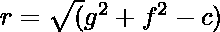
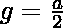
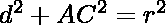
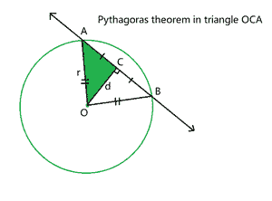

# 用圆从直线上切下的截距长度

> 原文:[https://www . geeksforgeeks . org/截距长度-从一条线到一个圆的截止距离/](https://www.geeksforgeeks.org/length-of-intercept-cut-off-from-a-line-by-a-circle/)

给定 6 个整数， **a** 、 **b** 、 **c** 、 **i** 、 **j** 、 **k** 表示圆的方程和线的方程，任务是求出从给定直线到圆的截距截点的长度。



**示例:**

> **输入:** a = 0，b = 0，c = -4，i = 2，j = -1，k = 1
> T3】输出: 3.89872
> 
> **输入:** a = 5，b = 6，c = -16，i = 1，j = 4，k = 3
> T3】输出: 6.9282

**方法:**按照以下步骤解决问题:

*   找到圆心，说为。
*   [从中心开始的垂线](https://www.geeksforgeeks.org/length-of-the-perpendicular-bisector-of-the-line-joining-the-centers-of-two-circles/)将截距分成两个相等的部分，因此计算其中一个部分的长度，然后乘以 2，得到截距的总长度。
*   使用公式计算**半径(r)** 的值:，其中和
*   利用公式计算中心 **O** 与直线的[垂直距离( **d** 值](https://www.geeksforgeeks.org/perpendicular-distance-between-a-point-and-a-line-in-2-d/)
*   现在从三角形中的勾股定理 **OCA** :
    *   
    *   
    *   



*   完成上述步骤后，打印两次 **AC** 的值，得到总截距的长度。

下面是上述方法的实现:

## C++

```
// C++ program for the above approach
#include <bits/stdc++.h>
using namespace std;

// Function to find the
// radius of a circle
double radius(int a, int b, int c)
{
    // g and f are the coordinates
    // of the center
    int g = a / 2;
    int f = b / 2;

    // Case of invalid circle
    if (g * g + f * f - c < 0)
        return (-1);

    // Apply the radius formula
    return (sqrt(g * g + f * f - c));
}

// Function to find the perpendicular
// distance between circle center and the line
double centerDistanceFromLine(int a, int b,
                              int i, int j,
                              int k)
{
    // Store the coordinates of center
    int g = a / 2;
    int f = b / 2;

    // Stores the perpendicular distance
    // between the line and the point
    double distance
        = fabs(i * g + j * f + k)
          / (sqrt(i * i + j * j));

    // Invalid Case
    if (distance < 0)
        return (-1);

    // Return the distance
    return distance;
}

// Function to find the length of intercept
// cut off from a line by a circle
void interceptLength(int a, int b, int c,
                     int i, int j,
                     int k)
{
    // Calculate the value of radius
    double rad = radius(a, b, c);

    // Calculate the perpendicular distance
    // between line and center
    double dist = centerDistanceFromLine(
        a, b, i, j, k);

    // Invalid Case
    if (rad < 0 || dist < 0) {
        cout << "circle not possible";
        return;
    }

    // If line do not cut circle
    if (dist > rad) {
        cout << "Line not cutting circle";
    }

    // Print the intercept length
    else
        cout << 2 * sqrt(
rad * rad - dist * dist);
}

// Driver Code
int main()
{
    // Given Input
    int a = 0, b = 0, c = -4;
    int i = 2, j = -1, k = 1;

    // Function Call
    interceptLength(a, b, c, i, j, k);

    return 0;
}
```

## Java 语言(一种计算机语言，尤用于创建网站)

```
// Java program for the above approach
class GFG{

// Function to find the
// radius of a circle
static double radius(int a, int b, int c)
{

    // g and f are the coordinates
    // of the center
    int g = a / 2;
    int f = b / 2;

    // Case of invalid circle
    if (g * g + f * f - c < 0)
        return (-1);

    // Apply the radius formula
    return (Math.sqrt(g * g + f * f - c));
}

// Function to find the perpendicular
// distance between circle center and the line
static double centerDistanceFromLine(int a, int b,
                                     int i, int j,
                                     int k)
{

    // Store the coordinates of center
    int g = a / 2;
    int f = b / 2;

    // Stores the perpendicular distance
    // between the line and the point
    double distance = Math.abs(i * g + j * f + k) /
                    (Math.sqrt(i * i + j * j));

    // Invalid Case
    if (distance < 0)
        return (-1);

    // Return the distance
    return distance;
}

// Function to find the length of intercept
// cut off from a line by a circle
static void interceptLength(int a, int b, int c,
                            int i, int j, int k)
{

    // Calculate the value of radius
    double rad = radius(a, b, c);

    // Calculate the perpendicular distance
    // between line and center
    double dist = centerDistanceFromLine(
        a, b, i, j, k);

    // Invalid Case
    if (rad < 0 || dist < 0)
    {
        System.out.println("circle not possible");
        return;
    }

    // If line do not cut circle
    if (dist > rad)
    {
        System.out.println("Line not cutting circle");
    }

    // Print the intercept length
    else
        System.out.println(2 * Math.sqrt(
            rad * rad - dist * dist));
}

// Driver code
public static void main(String[] args)
{

    // Given Input
    int a = 0, b = 0, c = -4;
    int i = 2, j = -1, k = 1;

    // Function Call
    interceptLength(a, b, c, i, j, k);
}
}

// This code is contributed by abhinavjain194
```

## 蟒蛇 3

```
# Python3 program for the above approach
import math

# Function to find the
# radius of a circle
def radius(a, b, c):

    # g and f are the coordinates
    # of the center
    g = a / 2
    f = b / 2

    # Case of invalid circle
    if (g * g + f * f - c < 0):
        return(-1)

    # Apply the radius formula
    return(math.sqrt(g * g + f * f - c))

# Function to find the perpendicular
# distance between circle center and the line
def centerDistanceFromLine(a, b, i, j, k):

    # Store the coordinates of center
    g = a / 2
    f = b / 2

    # Stores the perpendicular distance
    # between the line and the point
    distance = (abs(i * g + j * f + k) /
         (math.sqrt(i * i + j * j)))

    # Invalid Case
    if (distance < 0):
        return (-1)

    # Return the distance
    return distance

# Function to find the length of intercept
# cut off from a line by a circle
def interceptLength(a, b, c, i, j, k):

    # Calculate the value of radius
    rad = radius(a, b, c)

    # Calculate the perpendicular distance
    # between line and center
    dist = centerDistanceFromLine(
        a, b, i, j, k)

    # Invalid Case
    if (rad < 0 or dist < 0):
        print("circle not possible")
        return

    # If line do not cut circle
    if (dist > rad):
        print("Line not cutting circle")

    # Print the intercept length
    else:
        print(2 * math.sqrt(
            rad * rad - dist * dist))

# Driver Code
if __name__ == "__main__":

    # Given Input
    a = 0
    b = 0
    c = -4
    i = 2
    j = -1
    k = 1

    # Function Call
    interceptLength(a, b, c, i, j, k)

# This code is contributed by ukasp
```

## C#

```
// C# program for the above approach
using System;

class GFG{

// Function to find the
// radius of a circle
static double radius(int a, int b, int c)
{

    // g and f are the coordinates
    // of the center
    int g = a / 2;
    int f = b / 2;

    // Case of invalid circle
    if (g * g + f * f - c < 0)
        return (-1);

    // Apply the radius formula
    return(Math.Sqrt(g * g + f * f - c));
}

// Function to find the perpendicular
// distance between circle center and the line
static double centerDistanceFromLine(int a, int b,
                                     int i, int j,
                                     int k)
{

    // Store the coordinates of center
    int g = a / 2;
    int f = b / 2;

    // Stores the perpendicular distance
    // between the line and the point
    double distance = Math.Abs(i * g + j * f + k) /
                    (Math.Sqrt(i * i + j * j));

    // Invalid Case
    if (distance < 0)
        return (-1);

    // Return the distance
    return distance;
}

// Function to find the length of intercept
// cut off from a line by a circle
static void interceptLength(int a, int b, int c,
                            int i, int j, int k)
{

    // Calculate the value of radius
    double rad = radius(a, b, c);

    // Calculate the perpendicular distance
    // between line and center
    double dist = centerDistanceFromLine(
        a, b, i, j, k);

    // Invalid Case
    if (rad < 0 || dist < 0)
    {
        Console.WriteLine("circle not possible");
        return;
    }

    // If line do not cut circle
    if (dist > rad)
    {
        Console.WriteLine("Line not cutting circle");
    }

    // Print the intercept length
    else
        Console.WriteLine(2 * Math.Sqrt(
            rad * rad - dist * dist));
}

// Driver code
public static void Main(String []args)
{

    // Given Input
    int a = 0, b = 0, c = -4;
    int i = 2, j = -1, k = 1;

    // Function Call
    interceptLength(a, b, c, i, j, k);
}
}

// This code is contributed by sanjoy_62
```

## java 描述语言

```
<script>

        // JavaScript program for the above approach

        // Function to find the
        // radius of a circle
        function radius(a, b, c) {

            // g and f are the coordinates
            // of the center
            let g = a / 2;
            let f = b / 2;

            // Case of invalid circle
            if (g * g + f * f - c < 0)
                return (-1);

            // Apply the radius formula
            return (Math.sqrt(g * g + f * f - c));
        }

        // Function to find the perpendicular
        // distance between circle center and the line
        function centerDistanceFromLine(a, b, i, j, k) {

            // Store the coordinates of center
            let g = a / 2;
            let f = b / 2;

            // Stores the perpendicular distance
            // between the line and the point
            let distance = Math.abs(i * g + j * f + k) /
                (Math.sqrt(i * i + j * j));

            // Invalid Case
            if (distance < 0)
                return (-1);

            // Return the distance
            return distance;
        }

        // Function to find the length of intercept
        // cut off from a line by a circle
        function interceptLength(a, b, c, i, j, k) {

            // Calculate the value of radius
            let rad = radius(a, b, c);

            // Calculate the perpendicular distance
            // between line and center
            let dist = centerDistanceFromLine(
                a, b, i, j, k);

            // Invalid Case
            if (rad < 0 || dist < 0) {
                document.write("circle not possible");
                return;
            }

            // If line do not cut circle
            if (dist > rad) {
                document.write("Line not cutting circle");
            }

            // Print the intercept length
            else
                document.write(2 * Math.sqrt(
                    rad * rad - dist * dist));
        }

        // Driver code

        // Given Input
        let a = 0, b = 0, c = -4;
        let i = 2, j = -1, k = 1;

        // Function Call
        interceptLength(a, b, c, i, j, k);

        // This code is contributed by Hritik

</script>
```

**Output:** 

```
3.89872
```

***时间复杂度:**O(1)*
T5**辅助空间:** O(1)