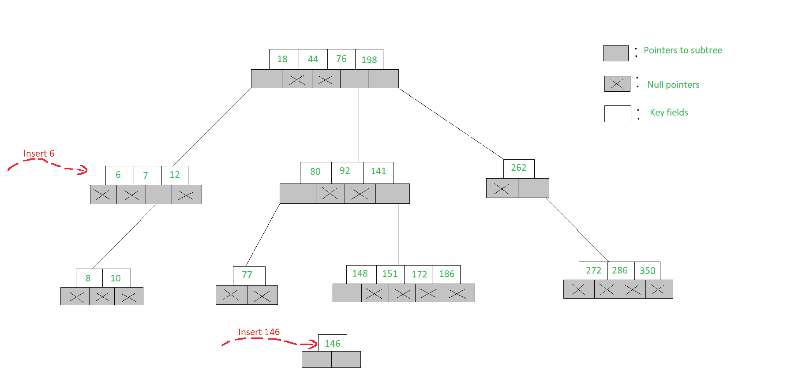
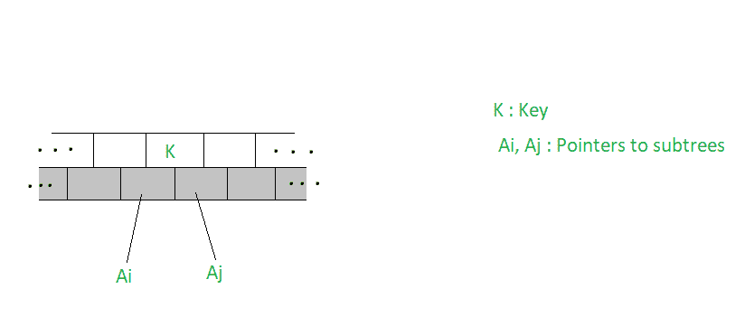

# m 路搜索树|集合-2 |插入和删除

> 原文:[https://www . geesforgeks . org/m-way-search-tree-set-2-insert-and-delete/](https://www.geeksforgeeks.org/m-way-search-tree-set-2-insertion-and-deletion/)

### **插入 m 路搜索树:**

m-Way 搜索树中的插入类似于二叉树，但一个节点中不应超过 **m-1** 个元素。如果节点已满，则将创建一个子节点来插入其他元素。
让我们看看下面的例子，在 m-Way 搜索树中插入一个元素。
**例:**

*   为了在 m-Way 搜索树中插入一个新元素，我们以同样的方式搜索该元素
*   为了将 6 插入图中所示的 5 向搜索树，我们继续搜索 6，发现我们在节点[7，12]处脱离了树，第一个子节点显示为空指针
*   由于节点只有两个键，并且一个 5 路搜索树最多可以在一个节点中容纳 4 个键，因此像[6，7，12]一样将 6 插入到节点中
*   但是要插入 146，节点[148，151，172，186]已经满了，因此我们打开一个新的子节点并在其中插入 146。这两种插入都在下面进行了说明



## C

```
// Inserts a value in the m-Way tree
struct node* insert(int val,
                    struct node* root)
{
    int i;
    struct node *c, *n;
    int flag;

    // Function setval() is called which
    // returns a value 0 if the new value
    // is inserted in the tree, otherwise
    // it returns a value 1
    flag = setval(val, root, &i, &c);

    if (flag) {
        n = (struct node*)malloc(sizeof(struct node));
        n->count = 1;
        n->value[1] = i;
        n->child[0] = root;
        n->child[1] = c;
        return n;
    }
    return root;
}
```

## C++

```
// Inserts a value in the m-Way tree
struct node* insert(int val,
                    struct node* root)
{
    int i;
    struct node *c, *n;
    int flag;

    // Function setval() is called which
    // returns a value 0 if the new value
    // is inserted in the tree, otherwise
    // it returns a value 1
    flag = setval(val, root, &i, &c);

    if (flag) {
        n = new node();
        n->count = 1;
        n->value[1] = i;
        n->child[0] = root;
        n->child[1] = c;
        return n;
    }
    return root;
}
```

## 蟒蛇 3

```
# Inserts a value in the m-Way tree
def insert(val, root):
    # Function setval() is called which
    # returns a value 0 if the new value
    # is inserted in the tree, otherwise
    # it returns a value 1
    i,c=0,None
    flag = setval(val, root, i, c)

    if (flag) :
        n = node()
        n.count = 1
        n.value[1] = i
        n.child[0] = root
        n.child[1] = c
        return n

    return root
```

**插入():**

*   函数 **insert()** 接收两个参数——新节点的地址和插入的值
*   该函数调用一个函数 **setval()** ，如果新值插入到树中，该函数将返回一个值 **0** ，否则将返回一个值 **1**
*   如果返回 **1** ，则为新节点分配内存，变量**计数**被赋予一个值 **1** ，新值被插入到节点中
*   然后将子节点的地址存储在**子**指针中，最后返回节点的地址

## C++

```
// Sets the value in the node
int setval(int val,
           struct node* n,
           int* p,
           struct node** c)
{
    int k;

    // if node is null
    if (n == NULL) {
        *p = val;
        *c = NULL;
        return 1;
    }
    else {

        // Checks whether the value to be
        // inserted is present or not
        if (searchnode(val, n, &k))
            cout << "Key value already exists\n";

        // The if-else condition checks whether
        // the number of nodes is greater or less
        // than the maximum number. If it is less
        // then it inserts the new value in the
        // same level node, otherwise, it splits the
        // node and then inserts the value
        if (setval(val, n->child[k], p, c)) {

            // if the count is less than the max
            if (n->count < MAX) {
                fillnode(*p, *c, n, k);
                return 0;
            }
            else {

                // Insert by splitting
                split(*p, *c, n, k, p, c);
                return 1;
            }
        }
        return 0;
    }
}
```

## C

```
// Sets the value in the node
int setval(int val,
           struct node* n,
           int* p,
           struct node** c)
{
    int k;

    // if node is null
    if (n == NULL) {
        *p = val;
        *c = NULL;
        return 1;
    }
    else {

        // Checks whether the value to be
        // inserted is present or not
        if (searchnode(val, n, &k))
            printf("Key value already exists\n");

        // The if-else condition checks whether
        // the number of nodes is greater or less
        // than the maximum number. If it is less
        // then it inserts the new value in the
        // same level node, otherwise, it splits the
        // node and then inserts the value
        if (setval(val, n->child[k], p, c)) {

            // if the count is less than the max
            if (n->count < MAX) {
                fillnode(*p, *c, n, k);
                return 0;
            }
            else {

                // Insert by splitting
                split(*p, *c, n, k, p, c);
                return 1;
            }
        }
        return 0;
    }
}
```

## 蟒蛇 3

```
# Sets the value in the node
def setval(val, n, p, c):
    k=0

    # if node is None
    if (n == None) :
        p = val
        c = None
        return 1

    else :

        # Checks whether the value to be
        # inserted is present or not
        if (searchnode(val, n, k)):
            print("Key value already exists")

        # The if-else condition checks whether
        # the number of nodes is greater or less
        # than the maximum number. If it is less
        # then it inserts the new value in the
        # same level node, otherwise, it splits the
        # node and then inserts the value
        if (setval(val, n.child[k], p, c)) :

            # if the count is less than the max
            if (n.count < MAX) :
                fillnode(p, c, n, k)
                return 0

            else :

                # Insert by splitting
                split(p, c, n, k, p, c)
                return 1

        return 0
```

**设置():t1** 

*   函数 **setval()** 接收四个参数
    *   第一个参数是要插入的值
    *   第二个参数是节点的地址
    *   第三个参数是一个整数指针，指向函数 **insert()** 中定义的局部标志变量
    *   最后一个参数是指向子节点的指针，该子节点将在从该函数调用的函数中设置
*   函数 **setval()** 返回一个标志值，指示该值是否被插入
*   如果该节点为空，则该函数调用函数 **searchnode()** ，检查该值是否已经存在于树中
*   如果该值已经存在，则显示合适的消息
*   然后对该节点的子节点的函数 **setval()** 进行递归调用
*   如果这次函数返回值 1，则意味着该值没有被插入
*   然后检查节点是否已满
*   如果节点未满，则调用函数 **fillnode()** 来填充节点中的值，因此此时返回值 0
*   如果节点已满，则调用函数 **split()** 分割现有节点。此时，返回值 1，将当前值添加到新节点

## C++

```
// Adjusts the value of the node
void fillnode(int val,
              struct node* c,
              struct node* n,
              int k)
{
    int i;

    // Shifting the node by one position
    for (i = n->count; i > k; i--) {
        n->value[i + 1] = n->value[i];
        n->child[i + 1] = n->child[i];
    }
    n->value[k + 1] = val;
    n->child[k + 1] = c;
    n->count++;
}
```

## C

```
// Adjusts the value of the node
void fillnode(int val,
              struct node* c,
              struct node* n,
              int k)
{
    int i;

    // Shifting the node by one position
    for (i = n->count; i > k; i--) {
        n->value[i + 1] = n->value[i];
        n->child[i + 1] = n->child[i];
    }
    n->value[k + 1] = val;
    n->child[k + 1] = c;
    n->count++;
}
```

## 蟒蛇 3

```
# Adjusts the value of the node
def fillnode(val, c, n, k):
    i=0

    # Shifting the node by one position
    for i in range(n.count, k, -1):
        n.value[i + 1] = n.value[i]
        n.child[i + 1] = n.child[i]

    n.value[k + 1] = val
    n.child[k + 1] = c
    n.count+=1
```

**充节点():**

*   函数 **fillnode()** 接收四个参数
    *   第一个是要插入的值
    *   第二个是要插入的新值的子节点的地址
    *   第三个是要插入新值的节点的地址
    *   最后一个参数是要插入新值的节点的位置

## C++

```
// Splits the node
void split(int val,
           struct node* c,
           struct node* n,
           int k, int* y,
           struct node** newnode)
{
    int i, mid;
    if (k <= MIN)
        mid = MIN;
    else
        mid = MIN + 1;

    // Allocating the memory for a new node
    *newnode = new node();

    for (i = mid + 1; i <= MAX; i++) {
        (*newnode)->value[i - mid] = n->value[i];
        (*newnode)->child[i - mid] = n->child[i];
    }

    (*newnode)->count = MAX - mid;
    n->count = mid;

    // it checks whether the new value
    // that is to be inserted is inserted
    // at a position less than or equal
    // to minimum values required in a node
    if (k <= MIN)
        fillnode(val, c, n, k);
    else
        fillnode(val, c, *newnode, k - mid);

    *y = n->value[n->count];
    (*newnode)->child[0] = n->child[n->count];
    n->count--;
}
```

## C

```
// Splits the node
void split(int val,
           struct node* c,
           struct node* n,
           int k, int* y,
           struct node** newnode)
{
    int i, mid;
    if (k <= MIN)
        mid = MIN;
    else
        mid = MIN + 1;

    // Allocating the memory for a new node
    *newnode = (struct node*)
malloc(sizeof(struct node));

    for (i = mid + 1; i <= MAX; i++) {
        (*newnode)->value[i - mid] = n->value[i];
        (*newnode)->child[i - mid] = n->child[i];
    }

    (*newnode)->count = MAX - mid;
    n->count = mid;

    // it checks whether the new value
    // that is to be inserted is inserted
    // at a position less than or equal
    // to minimum values required in a node
    if (k <= MIN)
        fillnode(val, c, n, k);
    else
        fillnode(val, c, *newnode, k - mid);

    *y = n->value[n->count];
    (*newnode)->child[0] = n->child[n->count];
    n->count--;
}
```

## 蟒蛇 3

```
# Splits the node
def split(val, c, n, k, y, newnode):
    i, mid=0,0
    if (k <= MIN):
        mid = MIN
    else:
        mid = MIN + 1

    # Allocating the memory for a new node
    newnode = node()

    for i in range(mid + 1,MAX+1) :
        newnode.value[i - mid] = n.value[i]
        newnode.child[i - mid] = n.child[i]

    newnode.count = MAX - mid
    n.count = mid

    # it checks whether the new value
    # that is to be inserted is inserted
    # at a position less than or equal
    # to minimum values required in a node
    if (k <= MIN):
        fillnode(val, c, n, k)
    else:
        fillnode(val, c, newnode, k - mid)

    y = n.value[n.count]
    newnode.child[0] = n.child[n.count]
    n.count-=1
```

**分裂():**T2】

*   函数 **split()** 接收六个参数
    *   前四个参数与函数 **fillnode()** 的情况完全相同
    *   第五个参数是指向变量的指针，该变量保存节点拆分位置的值
    *   最后一个参数是指向拆分时创建的新节点的指针的指针
*   在该函数中，首先检查要插入的新值是否插入到小于或等于节点中所需最小值的位置
*   如果条件满足，则节点在位置 **MIN** 处被分割
*   否则，节点将在比 **MIN** 多一个位置被分割
*   然后为新节点动态分配内存
*   接下来，执行 for 循环，将出现在拆分节点的值右侧的值和子节点复制到新节点中

### **m 路搜索树中的删除:**

让 **K** 成为要从 m-Way 搜索树中删除的关键字。要删除密钥，我们就像搜索密钥一样继续。让容纳键的节点如下图所示。



**方法:**
有几种情况需要删除

*   如果 **(A <sub>i</sub> = A <sub>j</sub> =空)**则删除 K
*   如果 **(A <sub>我</sub>！= NULL，A <sub>j</sub> = NULL)** 然后在 **A <sub>i</sub>** 指向的子节点中选择最大的关键元素 **K'** ，删除关键 **K'** 并用 **K'** 替换 **K**
*   显然**K’**的删除可能需要后续的替换，因此以类似的方式删除，以使键**K’**能够向上移动到树上
*   如果 **(A <sub>i</sub> =空，A <sub>j</sub> ！= NULL)** 然后从 **A <sub>j</sub>** 指向的子树中选择关键元素**K”**中最小的一个，删除**K”**，将 **K** 替换为**K”**
*   再次删除**K”**可能会触发后续的替换和删除，以使**K”**能够上移树
*   如果 **(A <sub>我</sub>！=NULL，A <sub>j</sub> ！=空)**然后从 **A <sub>i</sub>** 指向的子树中选择最大的关键元素**K’**，或者从 **A <sub>j</sub>** 指向的子树中选择最小的关键元素**K”**来替换 K
*   如前所述，要将**K’**或**K”**移到树上，可能需要后续的替换和删除

**例:**

*   为了删除 151，我们搜索 151 并观察到在它存在的叶节点[148，151，172，186]中，它的左子树指针和右子树指针都是这样的 **(A <sub>i</sub> = A <sub>j</sub> =空)**
*   因此，我们只需删除 151，节点就变成了[148，172，186]。删除 92 也遵循类似的过程
*   删除 262，我们发现它的左右子树指针 A <sub>i < /sub 和 Aj 分别是这样的</sub> **<sub>(Ai = Aj = NULL)</sub>**
*   因此，我们从子节点[272，286，350]中选择最小的元素 272，删除 272 并用 272 替换 262。注意，要删除 272，需要再次遵守删除过程
*   要删除 12，我们发现节点[7，12]容纳 12，并且密钥满足 **(A <sub>i</sub> ！=空，A <sub>j</sub> =空)**
*   因此，我们从艾指向的节点中选择最大的键，即。，10 并将 12 替换为 10。这一删除说明如下

## C++

```
// Deletes value from the node
struct node* del(int val,
                 struct node* root)
{
    struct node* temp;
    if (!delhelp(val, root)) {
        cout << '\n';
        cout << "value %d not found.\n";
    }
    else {
        if (root->count == 0) {
            temp = root;
            root = root->child[0];
            free(temp);
        }
    }
    return root;
}
```

## C

```
// Deletes value from the node
struct node* del(int val,
                 struct node* root)
{
    struct node* temp;
    if (!delhelp(val, root)) {
        printf("\n");
        printf("value %d not found.\n", val);
    }
    else {
        if (root->count == 0) {
            temp = root;
            root = root->child[0];
            free(temp);
        }
    }
    return root;
}
```

## 蟒蛇 3

```
# Deletes value from the node
def delete(val, root):
    temp=None
    if (not delhelp(val, root)) :
        print()
        print("value not found.")

    else :
        if (root.count == 0) :
            temp = root
            root = root.child[0]      

    return root
```

**del():**

*   函数 **del()** 接收两个参数。首先是要删除的值，其次是根节点的地址
*   该函数调用另一个辅助函数 **delhelp()** ，如果删除值不成功，则返回值 0，否则返回值 1
*   否则，检查条件**计数**是否为 0
*   如果是，则表示从中删除该值的节点是最后一个值
*   因此，节点的第一个子节点本身成为节点，原始节点被删除。最后，返回新根节点的地址

## C++

```
// Helper function for del()
int delhelp(int val,
            struct node* root)
{
    int i;
    int flag;
    if (root == NULL)
        return 0;
    else {

        // Again searches for the node
        flag = searchnode(val,
                          root,
                          &i);

        // if flag is true
        if (flag) {
            if (root->child[i - 1]) {
                copysucc(root, i);
                // delhelp() is called recursively
                flag = delhelp(root->value[i],
                                root->child[i])
                 if (!flag)
                {
                    cout << "\n";
                    cout << "value %d not found.\n";
                }
            }
            else
                clear(root, i);
        }
        else {
            // Recursion
            flag = delhelp(val, root->child[i]);
        }

        if (root->child[i] != NULL) {
            if (root->child[i]->count < MIN)
                restore(root, i);
        }
        return flag;
    }
}
```

## C

```
// Helper function for del()
int delhelp(int val,
            struct node* root)
{
    int i;
    int flag;
    if (root == NULL)
        return 0;
    else {

        // Again searches for the node
        flag = searchnode(val,
                          root,
                          &i);

        // if flag is true
        if (flag) {
            if (root->child[i - 1]) {
                copysucc(root, i);
                // delhelp() is called recursively
                flag = delhelp(root->value[i],
                                root->child[i])
                 if (!flag)
                {
                    printf("\n");
                    printf("value %d not found.\n", val);
                }
            }
            else
                clear(root, i);
        }
        else {
            // Recursion
            flag = delhelp(val, root->child[i]);
        }

        if (root->child[i] != NULL) {
            if (root->child[i]->count < MIN)
                restore(root, i);
        }
        return flag;
    }
}
```

## 蟒蛇 3

```
# Helper function for del()
def delhelp(val, root):
    i,flag=None,None
    if (root == None):
        return 0
    else :

        # Again searches for the node
        flag = searchnode(val,root,i)

        # if flag is true
        if (flag) :
            if (root.child[i - 1]) :
                copysucc(root, i)
                # delhelp() is called recursively
                flag = delhelp(root.value[i],
                                root.child[i])
                if (not flag):
                    print()
                    print("value not found.")

            else:
                clear(root, i)

        else :
            # Recursion
            flag = delhelp(val, root.child[i])

        if (root.child[i] != None) :
            if (root.child[i].count < MIN):
                restore(root, i)

        return flag
```

**德尔 help():**

*   函数 **delhelp()** 接收两个参数。第一个是要删除的值，第二个是要删除的节点的地址
*   首先检查该节点是否为空
*   如果是，则返回值 0
*   否则，调用函数 **searchnode()**
*   如果找到该值，则检查另一个条件，以查看该值是否有要删除的子值
*   如果是，则调用复制要删除的值的后继值的函数 **copysucc()** ，然后对要删除的值及其子值的函数 **delhelp()** 进行递归调用
*   如果子对象为空，则调用函数 **clear()** 删除该值
*   如果 **searchnode()** 函数失败，则通过传递孩子的地址对函数 **delhelp()** 进行递归调用
*   如果该节点的子节点不为空，则调用函数 **restore()** 将该子节点与其兄弟节点合并
*   最后返回**标志**的值，该值被设置为函数 **searchnode()** 的返回值

## C++

```
// Removes the value from the
// node and adjusts the values
void clear(struct node* m, int k)
{
    int i;
    for (i = k + 1; i <= m->count; i++) {
        m->value[i - 1] = m->value[i];
        m->child[i - 1] = m->child[i];
    }
    m->count--;
}
```

## C

```
// Removes the value from the
// node and adjusts the values
void clear(struct node* m, int k)
{
    int i;
    for (i = k + 1; i <= m->count; i++) {
        m->value[i - 1] = m->value[i];
        m->child[i - 1] = m->child[i];
    }
    m->count--;
}
```

## 蟒蛇 3

```
# Removes the value from the
# node and adjusts the values
def clear(m, k):
    for i in range(k + 1,m.count+1) :
        m.value[i - 1] = m.value[i]
        m.child[i - 1] = m.child[i]

    m.count-=1
```

**晴():**

*   功能 **clear()** 接收两个参数。首先是要从中删除值的节点的地址，其次是要删除的值的位置
*   该函数只是将值从要删除的值所在的位置向左移动一个位置

## C++

```
// Copies the successor of the
// value that is to be deleted
void copysucc(struct node* m, int i)
{
    struct node* temp;
    temp = p->child[i];
    while (temp->child[0])
        temp = temp->child[0];
    p->value[i] = temp->value[i];
}
```

## C

```
// Copies the successor of the
// value that is to be deleted
void copysucc(struct node* m, int i)
{
    struct node* temp;
    temp = p->child[i];
    while (temp->child[0])
        temp = temp->child[0];
    p->value[i] = temp->value[i];
}
```

## 蟒蛇 3

```
# Copies the successor of the
# value that is to be deleted
def copysucc(m, i):
    temp = p.child[i]
    while (temp.child[0]):
        temp = temp.child[0]
    p.value[i] = temp.value[i]
```

**【copy succ()**

*   函数 **copysucc()** 接收两个参数。第一个是要复制后续节点的节点地址，第二个是要用后续节点覆盖的值的位置

## C++

```
// Adjusts the node
void restore(struct node* m, int i)
{
    if (i == 0) {
        if (m->child[1]->count > MIN)
            leftshift(m, 1);
        else
            merge(m, 1);
    }
    else {
        if (i == m->count) {
            if (m->child[i - 1]->count > MIN)
                rightshift(m, i);
            else
                merge(m, i);
        }
        else {
            if (m->child[i - 1]->count > MIN)
                rightshift(m, i);
            else {
                if (m->child[i + 1]->count > MIN)
                    leftshift(m, i + 1);
                else
                    merge(m, i);
            }
        }
    }
}
```

## C

```
// Adjusts the node
void restore(struct node* m, int i)
{
    if (i == 0) {
        if (m->child[1]->count > MIN)
            leftshift(m, 1);
        else
            merge(m, 1);
    }
    else {
        if (i == m->count) {
            if (m->child[i - 1]->count > MIN)
                rightshift(m, i);
            else
                merge(m, i);
        }
        else {
            if (m->child[i - 1]->count > MIN)
                rightshift(m, i);
            else {
                if (m->child[i + 1]->count > MIN)
                    leftshift(m, i + 1);
                else
                    merge(m, i);
            }
        }
    }
}
```

## 蟒蛇 3

```
# Adjusts the node
def restore(m, i):
    if (i == 0):
        if (m.child[1].count > MIN):
            leftshift(m, 1)
        else:
            merge(m, 1)

    else :
        if (i == m.count) :
            if (m.child[i - 1].count > MIN):
                rightshift(m, i)
            else:
                merge(m, i)

        else :
            if (m.child[i - 1].count > MIN):
                rightshift(m, i)
            else :
                if (m.child[i + 1].count > MIN):
                    leftshift(m, i + 1)
                else:
                    merge(m, i)
```

**恢复():**

*   功能**恢复()**接收两个参数。第一个是要恢复的节点，第二个是从其中恢复值的值的位置
*   如果第二个参数为 0，则检查另一个条件，以找出第一个子代中存在的值是否超过所需的最小值
*   如果是这样，则通过传递节点的地址和表示该节点的值将从第一个值移位的值 1 来调用函数 **leftshift()**
*   如果条件不满足，则调用函数 **merge()** 来合并节点的两个子节点

## C++

```
// Adjusts the values and children
// while shifting the value from
// parent to right child
void rightshift(struct node* m, int k)
{
    int i;
    struct node* temp;

    temp = m->child[k];

    // Copying the nodes
    for (i = temp->count; i > 0; i--) {
        temp->value[i + 1] = temp->value[i];
        temp->child[i + 1] = temp->child[i];
    }
    temp->child[1] = temp->child[0];
    temp->count++;
    temp->value[1] = m->value[k];

    temp = m->child[k - 1];
    m->value[k] = temp->value[temp->count];
    m->child[k]->child[0]
                = temp->child[temp->count];
    temp->count--;
}

// Adjusts the values and children
// while shifting the value from
// parent to left child
void leftshift(struct node* m, int k)
{
    int i;
    struct node* temp;

    temp = m->child[k - 1];
    temp->count++;
    temp->value[temp->count] = m->value[k];
    temp->child[temp->count]
                   = m->child[k]->child[0];

    temp = m->child[k];
    m->value[k] = temp->value[1];
    temp->child[0] = temp->child[1];
    temp->count--;

    for (i = 1; i <= temp->count; i++) {
        temp->value[i] = temp->value[i + 1];
        temp->child[i] = temp->child[i + 1];
    }
}
```

## C

```
// Adjusts the values and children
// while shifting the value from
// parent to right child
void rightshift(struct node* m, int k)
{
    int i;
    struct node* temp;

    temp = m->child[k];

    // Copying the nodes
    for (i = temp->count; i > 0; i--) {
        temp->value[i + 1] = temp->value[i];
        temp->child[i + 1] = temp->child[i];
    }
    temp->child[1] = temp->child[0];
    temp->count++;
    temp->value[1] = m->value[k];

    temp = m->child[k - 1];
    m->value[k] = temp->value[temp->count];
    m->child[k]->child[0]
                = temp->child[temp->count];
    temp->count--;
}

// Adjusts the values and children
// while shifting the value from
// parent to left child
void leftshift(struct node* m, int k)
{
    int i;
    struct node* temp;

    temp = m->child[k - 1];
    temp->count++;
    temp->value[temp->count] = m->value[k];
    temp->child[temp->count]
                   = m->child[k]->child[0];

    temp = m->child[k];
    m->value[k] = temp->value[1];
    temp->child[0] = temp->child[1];
    temp->count--;

    for (i = 1; i <= temp->count; i++) {
        temp->value[i] = temp->value[i + 1];
        temp->child[i] = temp->child[i + 1];
    }
}
```

## 蟒蛇 3

```
# Adjusts the values and children
# while shifting the value from
# parent to right child
def rightshift(m, k):
    temp = m.child[k]

    # Copying the nodes
    for i in range(temp.count,0,-1) :
        temp.value[i + 1] = temp.value[i]
        temp.child[i + 1] = temp.child[i]

    temp.child[1] = temp.child[0]
    temp.count+=1
    temp.value[1] = m.value[k]

    temp = m.child[k - 1]
    m.value[k] = temp.value[temp.count]
    m.child[k].child[0] = temp.child[temp.count]
    temp.count-=1

# Adjusts the values and children
# while shifting the value from
# parent to left child
def leftshift(m, k):

    temp = m.child[k - 1]
    temp.count+=1
    temp.value[temp.count] = m.value[k]
    temp.child[temp.count] = m.child[k].child[0]

    temp = m.child[k]
    m.value[k] = temp.value[1]
    temp.child[0] = temp.child[1]
    temp.count-=1

    for i in range(1, temp.count+1):
        temp.value[i] = temp.value[i + 1]
        temp.child[i] = temp.child[i + 1]

```

**右移()和左移()**T2】

*   函数**右移()**接收两个参数
*   第一个是节点的地址，值从该节点转移到其子节点，第二个是要转移的值的位置 **k**
*   功能**左移()**与功能**右移()**完全相同
*   函数 **merge()** 接收两个参数。第一个是要将值复制到子节点的节点地址，第二个是值的位置

## C++

```
// Merges two nodes
void merge(struct node* m, int k)
{
    int i;
    struct node *temp1, *temp2;

    temp1 = m->child[k];
    temp2 = m->child[k - 1];
    temp2->count++;
    temp2->value[temp2->count] = m->value[k];
    temp2->child[temp2->count] = m->child[0];

    for (i = 0; i <= temp1->count; i++) {
        temp2->count++;
        temp2->value[temp2->count] = temp1->value[i];
        temp2->child[temp2->count] = temp1->child[i];
    }
    for (i = k; i < m->count; i++) {
        m->value[i] = m->value[i + 1];
        m->child[i] = m->child[i + 1];
    }
    m->count--;
    free(temp1);
}
```

## C

```
// Merges two nodes
void merge(struct node* m, int k)
{
    int i;
    struct node *temp1, *temp2;

    temp1 = m->child[k];
    temp2 = m->child[k - 1];
    temp2->count++;
    temp2->value[temp2->count] = m->value[k];
    temp2->child[temp2->count] = m->child[0];

    for (i = 0; i <= temp1->count; i++) {
        temp2->count++;
        temp2->value[temp2->count] = temp1->value[i];
        temp2->child[temp2->count] = temp1->child[i];
    }
    for (i = k; i < m->count; i++) {
        m->value[i] = m->value[i + 1];
        m->child[i] = m->child[i + 1];
    }
    m->count--;
    free(temp1);
}
```

## 蟒蛇 3

```
# Merges two nodes
def merge(m, k):
    temp1 = m.child[k]
    temp2 = m.child[k - 1]
    temp2.count+=1
    temp2.value[temp2.count] = m.value[k]
    temp2.child[temp2.count] = m.child[0]

    for i in range(temp1.count+1):
        temp2.count+=1
        temp2.value[temp2.count] = temp1.value[i]
        temp2.child[temp2.count] = temp1.child[i]

    for i in range(k,m.count):
        m.value[i] = m.value[i + 1]
        m.child[i] = m.child[i + 1]

    m.count-=1
```

*   函数 **merge()** 接收两个参数
*   首先是要将值复制到子节点的节点地址，其次是值的位置
*   在这个函数中，定义了两个临时变量 temp1 和 temp2 来保存要复制的值的两个子代的地址
*   最初，节点的值被复制到其子节点。则该节点的第一个子节点成为复制该值的节点的相应子节点
*   然后执行两个 for 循环，首先将一个子对象的所有值和子对象复制到另一个子对象
*   第二个循环从复制值的位置移动节点的值和子节点
*   然后，从其复制节点的节点的计数递减。最后通过调用 **free()** 释放第二个节点占用的内存