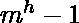
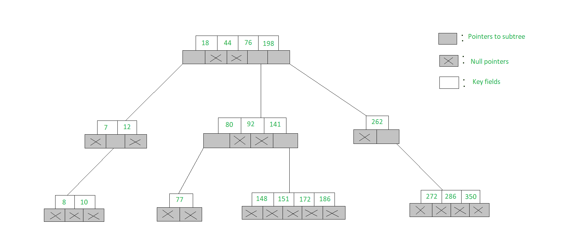

# m-WAY 搜索树|集合-1(搜索)

> 原文:[https://www . geesforgeks . org/m-way-search-trees-set-1-search/](https://www.geeksforgeeks.org/m-way-search-trees-set-1-searching/)

**m 路**搜索树是多路树，是[二叉树](https://www.geeksforgeeks.org/binary-tree-data-structure/)的一般化版本，其中每个节点包含多个元素。在 m-Way 顺序树 **m** 中，每个节点最多包含**m–1**个元素和 m 个子节点。
高度为 h 的 m 路搜索树的目标要求插入/删除/检索操作的访问次数为 O(h)。因此，确保高度 **h** 接近 **log_m(n + 1)** 。
高度为 **h** 的 m-Way 搜索树中的元素数量范围从最小的 **h** 到最大的。
由 n 个元素组成的 m 路搜索树的范围从最小高度 **log_m(n+1)** 到最大高度**n**
5 路搜索树的示例如下图所示。观察每个节点最多有 5 个子节点&因此最多包含 4 个键。



m 路树的节点结构如下:

## C++

```
struct node {
    int count;
    int value[MAX + 1];
    struct node* child[MAX + 1];
};
```