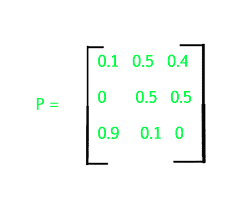

# 马尔可夫矩阵程序

> 原文： [https://www.geeksforgeeks.org/markov-matrix/](https://www.geeksforgeeks.org/markov-matrix/)

给定一个`m x n` 2D 矩阵，请检查它是否为马尔可夫矩阵。

**马尔可夫矩阵**：每行总和等于 1 的矩阵。



马尔可夫矩阵的例子：

**示例**：

```
Input :
1    0   0
0.5  0  0.5
0    0   1
Output : yes

Explanation :
Sum of each row results to 1, 
therefore it is a Markov Matrix.

Input :
1 0 0
0 0 2
1 0 0
Output :
no

```


**方法**：初始化一个 2D 数组，然后使用另一个一维数组存储矩阵的每一行的总和，并检查存储在此 1D 数组中的所有总和是否等于 1，如果是，则它是马尔可夫矩阵，否则不是。

## C++ 

```cpp

// C++ code to check Markov Matrix 
#include <iostream> 
using namespace std; 

#define n 3 

bool checkMarkov(double m[][n]) 
{ 
    // outer loop to access rows 
    // and inner to access columns 
    for (int i = 0; i <n; i++) { 

        // Find sum of current row 
        double sum = 0; 
        for (int j = 0; j < n; j++) 
            sum = sum + m[i][j]; 

        if (sum != 1) 
        return false; 
    } 

    return true; 
} 

// Driver Code 
int main()  
{ 
    // Matrix to check 
    double m[3][3] = { { 0, 0, 1 }, 
                    { 0.5, 0, 0.5 }, 
                    { 1, 0, 0 } }; 

    // calls the function check() 
    if (checkMarkov(m)) 
        cout << " yes "; 
    else
        cout << " no "; 
} 

// This code is contributed by Anant Agarwal. 

```

## Java

```
// Java code to check Markov Matrix 
import java.io.*; 
  
public class markov 
{ 
    static boolean checkMarkov(double m[][]) 
    { 
        // outer loop to access rows 
        // and inner to access columns 
        for (int i = 0; i < m.length; i++) { 
  
            // Find sum of current row 
            double sum = 0; 
            for (int j = 0; j < m[i].length; j++) 
                sum = sum + m[i][j]; 
  
            if (sum != 1) 
               return false; 
        } 
  
        return true; 
    } 
  
    public static void main(String args[]) 
    { 
        // Matrix to check 
        double m[][] = { { 0, 0, 1 }, 
                         { 0.5, 0, 0.5 }, 
                         { 1, 0, 0 } }; 
  
        // calls the function check() 
        if (checkMarkov(m)) 
            System.out.println(" yes "); 
        else
            System.out.println(" no "); 
    } 
}
```

## Python3

```
# Python 3 code to check Markov Matrix 
  
def checkMarkov(m) : 
      
    # Outer loop to access rows 
    # and inner to access columns 
    for i in range(0, len(m)) : 
          
        # Find sum of current row 
        sm = 0
        for j in range(0, len(m[i])) : 
            sm = sm + m[i][j] 
  
        if (sm != 1) : 
            return False
              
    return True
      
# Matrix to check 
m = [ [ 0, 0, 1 ], 
      [ 0.5, 0, 0.5 ], 
      [ 1, 0, 0 ]      ] 
  
# Calls the function check() 
if (checkMarkov(m)) : 
    print(" yes ") 
else : 
    print(" no ") 
      
      
# This code is contributed by Nikita Tiwari.
```

## C#

```
// C# code to check  
// Markov Matrix 
using System; 
  
class GFG 
{ 
static bool checkMarkov(double [,]m) 
{ 
    // outer loop to access  
    // rows and inner to  
    // access columns 
    for (int i = 0; 
             i < m.GetLength(0); i++)  
    { 
  
        // Find sum of  
        // current row 
        double sum = 0; 
        for (int j = 0;  
                 j < m.GetLength(1); j++) 
            sum = sum + m[i, j]; 
  
        if (sum != 1) 
        return false; 
    } 
  
    return true; 
} 
  
// Driver Code 
static void Main() 
{ 
    // Matrix to check 
    double [,]m = new double[,]{{ 0, 0, 1}, 
                                {0.5, 0, 0.5}, 
                                {1, 0, 0}}; 
  
    // calls the  
    // function check() 
    if (checkMarkov(m)) 
        Console.WriteLine(" yes "); 
    else
        Console.WriteLine(" no "); 
} 
} 
  
// This code is contributed by  
// Manish Shaw(manishshaw1)
```

## PHP

```
<?php 
// PHP code to check Markov Matrix 
  
function checkMarkov($m) 
{ 
    $n = 3; 
      
    // outer loop to access rows 
    // and inner to access columns 
    for ($i = 0; $i <$n; $i++)  
    { 
  
        // Find sum of current row 
        $sum = 0; 
        for ($j = 0; $j < $n; $j++) 
            $sum = $sum + $m[$i][$j]; 
  
        if ($sum != 1) 
        return false; 
    } 
  
    return true; 
} 
  
    // Driver Code 
    // Matrix to check 
    $m = array(array(0, 0, 1), 
               array(0.5, 0, 0.5), 
               array(1, 0, 0)); 
  
  
    // calls the function check() 
    if (checkMarkov($m)) 
        echo " yes "; 
    else
        echo " no "; 
  
// This code is contributed by nitin mittal. 
?>
```

输出：

```
yes
```

