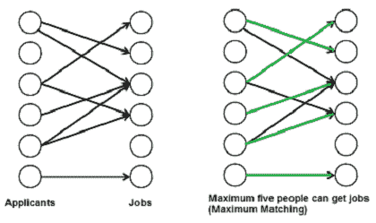
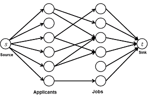

# 最大二分匹配

> 原文： [https://www.geeksforgeeks.org/maximum-bipartite-matching/](https://www.geeksforgeeks.org/maximum-bipartite-matching/)

[二分图](https://www.geeksforgeeks.org/bipartite-graph)中的匹配项是一组边，它们的选择方式是没有两个边共享端点。 最大匹配是最大大小（最大边数）的匹配。 在最大匹配中，如果添加了任何边，则不再是匹配。 一个给定的二部图可能有多个以上的最大匹配项。

**我们为什么在乎？**

有很多现实问题可以作为二分匹配来形成。 例如，考虑以下问题：

*有 M 个求职者和 N 个工作。 每个申请人都有他/她感兴趣的一部分工作。每个职位空缺只能接受一个申请人，并且只能为一个工作指定一个职位申请人。 找到工作分配给申请人，以使尽可能多的申请人获得工作。*



强烈建议您先阅读以下内容。

[用于最大流量问题的 Ford-Fulkerson 算法](https://www.geeksforgeeks.org/ford-fulkerson-algorithm-for-maximum-flow-problem/)

**最大二分匹配和最大流量问题**

`M`轴距`B`ipartite`M`附着（ **MBP** ）问题 可以通过将其转换为流动网络来解决（请参阅[此](http://www.youtube.com/watch?v=NlQqmEXuiC8)视频，以了解我们如何得出此结论）。 以下是步骤。

[ ](https://media.geeksforgeeks.org/wp-content/cdn-uploads/maximum_matching2.png) *** 1）建立流网络*** 

流网络中必须有源和汇。 因此，我们添加了一个来源，并向所有申请人添加了该来源的边。 同样，将所有作业的边添加到接收器。 每个边的容量标记为 1 个单位。

[ ](https://media.geeksforgeeks.org/wp-content/cdn-uploads/maximum_matching21.png) * **

2.  找到最大流量。***

我们使用 [Ford-Fulkerson 算法](https://www.geeksforgeeks.org/ford-fulkerson-algorithm-for-maximum-flow-problem/)在步骤 1 中建立的流量网络中找到最大流量。最大流量实际上是我们正在寻找的 MBP。

**如何实现上述方法？**

首先定义输入和输出形式。 输入采用 [Edmonds 矩阵](http://en.wikipedia.org/wiki/Edmonds_matrix)的形式，该矩阵是 2D 数组“ bpGraph [M] [N]”，其中 M 行（对于 M 个求职者）和 N 列（对于 N 个工作）。 如果第 i 个申请人对第 j 个工作感兴趣，则 bpGraph [i] [j]的值为 1，否则为 0。

输出是可以找到工作的最大人数。

一种简单的实现方法是创建一个矩阵，该矩阵表示具有 M + N + 2 个顶点的有向图的[邻接矩阵表示](https://www.geeksforgeeks.org/graph-and-its-representations/)。 将该矩阵称为 [fordFulkerson（）](https://www.geeksforgeeks.org/ford-fulkerson-algorithm-for-maximum-flow-problem/)。 此实现需要 O（（M + N）*（M + N））额外空间。

使用图是二部图且每个边的容量为 0 或 1 的事实，可以减少额外的空间，并可以简化代码。该想法是使用 DFS 遍历为申请人找到工作（类似于扩展路径）。 福特福克森）。 我们为每个求职者调用 bpm（），bpm（）是基于 DFS 的函数，它尝试所有可能性将工作分配给求职者。

在 bpm（）中，我们一步一步地尝试申请人“ u”感兴趣的所有工作，直到找到工作，或者所有工作都没有运气。 对于我们尝试的每一项工作，我们都会遵循。

如果未将工作分配给任何人，我们只需将其分配给申请人并返回 true。 如果一个工作被分配给其他人说 x，那么我们将递归检查 x 是否可以被分配给其他工作。 为了确保 x 不会再次获得相同的工作，我们在对 x 进行递归调用之前将工作标记为“ v”。 如果 x 可以找到其他工作，我们将求职者“ v”换成真。 我们使用数组 maxR [0..N-1]来存储分配给不同职位的申请人。

如果 bmp（）返回 true，则表示流网络中存在一条扩充路径，并且 maxBPM（）中将 1 个流单位添加到结果中。

## C++

```cpp

// A C++ program to find maximal 
// Bipartite matching. 
#include <iostream> 
#include <string.h> 
using namespace std; 

// M is number of applicants  
// and N is number of jobs 
#define M 6 
#define N 6 

// A DFS based recursive function  
// that returns true if a matching 
// for vertex u is possible 
bool bpm(bool bpGraph[M][N], int u, 
         bool seen[], int matchR[]) 
{ 
    // Try every job one by one 
    for (int v = 0; v < N; v++) 
    { 
        // If applicant u is interested in  
        // job v and v is not visited 
        if (bpGraph[u][v] && !seen[v]) 
        { 
            // Mark v as visited 
            seen[v] = true;  

            // If job 'v' is not assigned to an  
            // applicant OR previously assigned  
            // applicant for job v (which is matchR[v])  
            // has an alternate job available.  
            // Since v is marked as visited in  
            // the above line, matchR[v] in the following  
            // recursive call will not get job 'v' again 
            if (matchR[v] < 0 || bpm(bpGraph, matchR[v], 
                                     seen, matchR)) 
            { 
                matchR[v] = u; 
                return true; 
            } 
        } 
    } 
    return false; 
} 

// Returns maximum number 
// of matching from M to N 
int maxBPM(bool bpGraph[M][N]) 
{ 
    // An array to keep track of the  
    // applicants assigned to jobs.  
    // The value of matchR[i] is the  
    // applicant number assigned to job i, 
    // the value -1 indicates nobody is 
    // assigned. 
    int matchR[N]; 

    // Initially all jobs are available 
    memset(matchR, -1, sizeof(matchR)); 

    // Count of jobs assigned to applicants 
    int result = 0;  
    for (int u = 0; u < M; u++) 
    { 
        // Mark all jobs as not seen  
        // for next applicant. 
        bool seen[N]; 
        memset(seen, 0, sizeof(seen)); 

        // Find if the applicant 'u' can get a job 
        if (bpm(bpGraph, u, seen, matchR)) 
            result++; 
    } 
    return result; 
} 

// Driver Code 
int main() 
{ 
    // Let us create a bpGraph  
    // shown in the above example 
    bool bpGraph[M][N] = {{0, 1, 1, 0, 0, 0}, 
                          {1, 0, 0, 1, 0, 0}, 
                          {0, 0, 1, 0, 0, 0}, 
                          {0, 0, 1, 1, 0, 0}, 
                          {0, 0, 0, 0, 0, 0}, 
                          {0, 0, 0, 0, 0, 1}}; 

    cout << "Maximum number of applicants that can get job is "
         << maxBPM(bpGraph); 

    return 0; 
} 

```

## Java

```java

// A Java program to find maximal 
// Bipartite matching. 
import java.util.*; 
import java.lang.*; 
import java.io.*; 

class GFG 
{ 
    // M is number of applicants 
    // and N is number of jobs 
    static final int M = 6; 
    static final int N = 6; 

    // A DFS based recursive function that  
    // returns true if a matching for  
    // vertex u is possible 
    boolean bpm(boolean bpGraph[][], int u,  
                boolean seen[], int matchR[]) 
    { 
        // Try every job one by one 
        for (int v = 0; v < N; v++) 
        { 
            // If applicant u is interested  
            // in job v and v is not visited 
            if (bpGraph[u][v] && !seen[v]) 
            { 

                // Mark v as visited 
                seen[v] = true;  

                // If job 'v' is not assigned to 
                // an applicant OR previously 
                // assigned applicant for job v (which 
                // is matchR[v]) has an alternate job available. 
                // Since v is marked as visited in the  
                // above line, matchR[v] in the following 
                // recursive call will not get job 'v' again 
                if (matchR[v] < 0 || bpm(bpGraph, matchR[v], 
                                         seen, matchR)) 
                { 
                    matchR[v] = u; 
                    return true; 
                } 
            } 
        } 
        return false; 
    } 

    // Returns maximum number  
    // of matching from M to N 
    int maxBPM(boolean bpGraph[][]) 
    { 
        // An array to keep track of the  
        // applicants assigned to jobs.  
        // The value of matchR[i] is the  
        // applicant number assigned to job i,  
        // the value -1 indicates nobody is assigned. 
        int matchR[] = new int[N]; 

        // Initially all jobs are available 
        for(int i = 0; i < N; ++i) 
            matchR[i] = -1; 

        // Count of jobs assigned to applicants 
        int result = 0;  
        for (int u = 0; u < M; u++) 
        { 
            // Mark all jobs as not seen  
            // for next applicant. 
            boolean seen[] =new boolean[N] ; 
            for(int i = 0; i < N; ++i) 
                seen[i] = false; 

            // Find if the applicant 'u' can get a job 
            if (bpm(bpGraph, u, seen, matchR)) 
                result++; 
        } 
        return result; 
    } 

    // Driver Code 
    public static void main (String[] args)  
                       throws java.lang.Exception 
    { 
        // Let us create a bpGraph shown 
        // in the above example 
        boolean bpGraph[][] = new boolean[][]{ 
                              {false, true, true,  
                               false, false, false}, 
                              {true, false, false,  
                               true, false, false}, 
                              {false, false, true,  
                               false, false, false}, 
                              {false, false, true,  
                               true, false, false}, 
                              {false, false, false,  
                               false, false, false}, 
                              {false, false, false,  
                               false, false, true}}; 
        GFG m = new GFG(); 
        System.out.println( "Maximum number of applicants that can"+ 
                            " get job is "+m.maxBPM(bpGraph)); 
    } 
} 

```

## Python

```py

# Python program to find  
# maximal Bipartite matching. 

class GFG: 
    def __init__(self,graph): 

        # residual graph 
        self.graph = graph  
        self.ppl = len(graph) 
        self.jobs = len(graph[0]) 

    # A DFS based recursive function 
    # that returns true if a matching  
    # for vertex u is possible 
    def bpm(self, u, matchR, seen): 

        # Try every job one by one 
        for v in range(self.jobs): 

            # If applicant u is interested  
            # in job v and v is not seen 
            if self.graph[u][v] and seen[v] == False: 

                # Mark v as visited 
                seen[v] = True 

                '''If job 'v' is not assigned to 
                   an applicant OR previously assigned  
                   applicant for job v (which is matchR[v])  
                   has an alternate job available.  
                   Since v is marked as visited in the  
                   above line, matchR[v]  in the following 
                   recursive call will not get job 'v' again'''
                if matchR[v] == -1 or self.bpm(matchR[v],  
                                               matchR, seen): 
                    matchR[v] = u 
                    return True
        return False

    # Returns maximum number of matching  
    def maxBPM(self): 
        '''An array to keep track of the  
           applicants assigned to jobs.  
           The value of matchR[i] is the  
           applicant number assigned to job i,  
           the value -1 indicates nobody is assigned.'''
        matchR = [-1] * self.jobs 

        # Count of jobs assigned to applicants 
        result = 0 
        for i in range(self.ppl): 

            # Mark all jobs as not seen for next applicant. 
            seen = [False] * self.jobs 

            # Find if the applicant 'u' can get a job 
            if self.bpm(i, matchR, seen): 
                result += 1
        return result 

bpGraph =[[0, 1, 1, 0, 0, 0], 
          [1, 0, 0, 1, 0, 0], 
          [0, 0, 1, 0, 0, 0], 
          [0, 0, 1, 1, 0, 0], 
          [0, 0, 0, 0, 0, 0], 
          [0, 0, 0, 0, 0, 1]] 

g = GFG(bpGraph) 

print ("Maximum number of applicants that can get job is %d " % g.maxBPM()) 

# This code is contributed by Neelam Yadav 

```

## C#

```cs

// A C# program to find maximal 
// Bipartite matching. 
using System; 

class GFG 
{ 
    // M is number of applicants  
    // and N is number of jobs 
    static int M = 6; 
    static int N = 6; 

    // A DFS based recursive function  
    // that returns true if a matching  
    // for vertex u is possible 
    bool bpm(bool [,]bpGraph, int u,  
             bool []seen, int []matchR) 
    { 
        // Try every job one by one 
        for (int v = 0; v < N; v++) 
        { 
            // If applicant u is interested  
            // in job v and v is not visited 
            if (bpGraph[u, v] && !seen[v]) 
            { 
                // Mark v as visited 
                seen[v] = true;  

                // If job 'v' is not assigned to 
                // an applicant OR previously assigned  
                // applicant for job v (which is matchR[v]) 
                // has an alternate job available. 
                // Since v is marked as visited in the above  
                // line, matchR[v] in the following recursive  
                // call will not get job 'v' again 
                if (matchR[v] < 0 || bpm(bpGraph, matchR[v], 
                                         seen, matchR)) 
                { 
                    matchR[v] = u; 
                    return true; 
                } 
            } 
        } 
        return false; 
    } 

    // Returns maximum number of  
    // matching from M to N 
    int maxBPM(bool [,]bpGraph) 
    { 
        // An array to keep track of the  
        // applicants assigned to jobs.  
        // The value of matchR[i] is the  
        // applicant number assigned to job i,  
        // the value -1 indicates nobody is assigned. 
        int []matchR = new int[N]; 

        // Initially all jobs are available 
        for(int i = 0; i < N; ++i) 
            matchR[i] = -1; 

        // Count of jobs assigned to applicants 
        int result = 0;  
        for (int u = 0; u < M; u++) 
        { 
            // Mark all jobs as not 
            // seen for next applicant. 
            bool []seen = new bool[N] ; 
            for(int i = 0; i < N; ++i) 
                seen[i] = false; 

            // Find if the applicant  
            // 'u' can get a job 
            if (bpm(bpGraph, u, seen, matchR)) 
                result++; 
        } 
        return result; 
    } 

    // Driver Code 
    public static void Main ()  
    { 
        // Let us create a bpGraph shown  
        // in the above example 
        bool [,]bpGraph = new bool[,] 
                          {{false, true, true,  
                            false, false, false}, 
                           {true, false, false,  
                            true, false, false}, 
                           {false, false, true,  
                            false, false, false}, 
                           {false, false, true,  
                            true, false, false}, 
                           {false, false, false,  
                            false, false, false}, 
                           {false, false, false,  
                            false, false, true}}; 
        GFG m = new GFG(); 
    Console.Write( "Maximum number of applicants that can"+ 
                            " get job is "+m.maxBPM(bpGraph)); 
    } 
} 

//This code is contributed by nitin mittal. 

```

## PHP

```php

<?php 
// A PHP program to find maximal 
// Bipartite matching. 

// M is number of applicants  
// and N is number of jobs 
$M = 6; 
$N = 6; 

// A DFS based recursive function  
// that returns true if a matching 
// for vertex u is possible 
function bpm($bpGraph, $u, &$seen, &$matchR) 
{ 
    global $N; 

    // Try every job one by one 
    for ($v = 0; $v < $N; $v++) 
    { 
        // If applicant u is interested in  
        // job v and v is not visited 
        if ($bpGraph[$u][$v] && !$seen[$v]) 
        { 
            // Mark v as visited 
            $seen[$v] = true;  

            // If job 'v' is not assigned to an  
            // applicant OR previously assigned  
            // applicant for job v (which is matchR[v])  
            // has an alternate job available.  
            // Since v is marked as visited in  
            // the above line, matchR[v] in the following  
            // recursive call will not get job 'v' again 
            if ($matchR[$v] < 0 || bpm($bpGraph, $matchR[$v], 
                                    $seen, $matchR)) 
            { 
                $matchR[$v] = $u; 
                return true; 
            } 
        } 
    } 
    return false; 
} 

// Returns maximum number 
// of matching from M to N 
function maxBPM($bpGraph) 
{ 
    global $N,$M; 

    // An array to keep track of the  
    // applicants assigned to jobs.  
    // The value of matchR[i] is the  
    // applicant number assigned to job i, 
    // the value -1 indicates nobody is 
    // assigned. 
    $matchR = array_fill(0, $N, -1); 

    // Initially all jobs are available 

    // Count of jobs assigned to applicants 
    $result = 0;  
    for ($u = 0; $u < $M; $u++) 
    { 
        // Mark all jobs as not seen  
        // for next applicant. 
        $seen=array_fill(0, $N, false); 

        // Find if the applicant 'u' can get a job 
        if (bpm($bpGraph, $u, $seen, $matchR)) 
            $result++; 
    } 
    return $result; 
} 

// Driver Code 

// Let us create a bpGraph  
// shown in the above example 
$bpGraph = array(array(0, 1, 1, 0, 0, 0), 
                    array(1, 0, 0, 1, 0, 0), 
                    array(0, 0, 1, 0, 0, 0), 
                    array(0, 0, 1, 1, 0, 0), 
                    array(0, 0, 0, 0, 0, 0), 
                    array(0, 0, 0, 0, 0, 1)); 

echo "Maximum number of applicants that can get job is ".maxBPM($bpGraph); 

// This code is contributed by chadan_jnu 
?> 

```

**Output :**

```
Maximum number of applicants that can get job is 5
```

您可能还希望在下面看到：

[Hopcroft–Karp 最大匹配算法 | 系列 1（简介）](https://www.geeksforgeeks.org/hopcroft-karp-algorithm-for-maximum-matching-set-1-introduction/)

[Hopcroft–Karp 最大匹配算法 | 系列 2（实施）](https://www.geeksforgeeks.org/hopcroft-karp-algorithm-for-maximum-matching-set-2-implementation/)

**参考**：

[http://www.cs.cornell.edu/~wdtseng/icpc/notes/graph_part5.pdf](http://www.cs.cornell.edu/~wdtseng/icpc/notes/graph_part5.pdf)

[http：// www .youtube.com / watch？v = NlQqmEXuiC8](http://www.youtube.com/watch?v=NlQqmEXuiC8)

[http://en.wikipedia.org/wiki/Maximum_matching](http://en.wikipedia.org/wiki/Maximum_matching)

[http://www.stanford.edu /class/cs97si/08-network-flow-problems.pdf](http://www.stanford.edu/class/cs97si/08-network-flow-problems.pdf)

[http://www.cs.princeton.edu/courses/archive/spring13/cos423/lectures/07NetworkFlowII-2×2 .pdf](http://www.cs.princeton.edu/courses/archive/spring13/cos423/lectures/07NetworkFlowII-2x2.pdf)

[http://www.ise.ncsu.edu/fangroup/or766.dir/or766_ch7.pdf](http://www.ise.ncsu.edu/fangroup/or766.dir/or766_ch7.pdf)

如果发现任何不正确的地方，或者想分享有关上述主题的更多信息，请发表评论。

