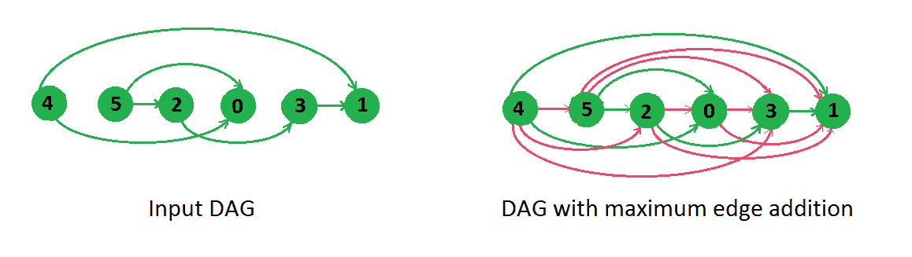

# 可以添加到 DAG 的最大边，因此仍为 DAG

> 原文： [https://www.geeksforgeeks.org/maximum-edges-can-added-dag-remains-dag/](https://www.geeksforgeeks.org/maximum-edges-can-added-dag-remains-dag/)

给我们一个 DAG，我们需要找到可以添加到该 DAG 的最大边数，此后新图仍然是 DAG，这意味着经过重整的图应具有最大边数，即使添加单个边也将创建一个 在图中循环。



```
The Output for above example should be following edges in any order.
4-2, 4-5, 4-3, 5-3, 5-1, 2-0, 2-1, 0-3, 0-1
```

如上例所示，我们在一个方向上添加了所有边，只是为了避免自己陷入循环。 这是解决这个问题的技巧。 我们以[拓扑顺序](https://www.geeksforgeeks.org/topological-sorting/)对所有节点进行排序，并创建从节点到右侧所有节点（如果尚未存在）的边。

怎么说呢，不可能再增加边了？ 原因是我们从左到右添加了所有可能的边，如果要添加更多的边，我们需要从右到左做边，但是从右到左添加边我们肯定会创建一个循环，因为它的对应部分是从左到右 边已经被添加到图形中，创建循环不是我们所需要的。

因此，解决方案如下进行，我们按拓扑顺序考虑节点，如果从左到右没有任何边，我们将创建它。

下面是解决方案，我们打印了可以添加到给定 DAG 中的所有边，而无需进行任何循环。

## C++

```cpp

// C++ program to find maximum edges after adding 
// which graph still remains a DAG
#include <bits/stdc++.h>
using namespace std;

class Graph
{
    int V;    // No. of vertices

    // Pointer to a list containing adjacency list
    list<int> *adj;

    // Vector to store indegree of vertices
    vector<int> indegree;

    // function returns a topological sort
    vector<int> topologicalSort();

public:
    Graph(int V);   // Constructor

    // function to add an edge to graph
    void addEdge(int v, int w);

    // Prints all edges that can be added without making any cycle
    void maximumEdgeAddtion();
};

//  Constructor of graph
Graph::Graph(int V)
{
    this->V = V;
    adj = new list<int>[V];

    // Initialising all indegree with 0
    for (int i = 0; i < V; i++)
        indegree.push_back(0);
}

//  Utility function to add edge
void Graph::addEdge(int v, int w)
{
    adj[v].push_back(w); // Add w to v's list.

    // increasing inner degree of w by 1
    indegree[w]++;
}

//  Main function to print maximum edges that can be added
vector<int> Graph::topologicalSort()
{
    vector<int> topological;
    queue<int> q;

    //  In starting push all node with indegree 0
    for (int i = 0; i < V; i++)
        if (indegree[i] == 0)
            q.push(i);

    while (!q.empty())
    {
        int t = q.front();
        q.pop();

        //  push the node into topological vector
        topological.push_back(t);

        //  reducing indegree of adjacent vertices
        for (list<int>:: iterator j = adj[t].begin();
                               j != adj[t].end(); j++)
        {
            indegree[*j]--;

            //  if indegree becomes 0, just push
            // into queue
            if (indegree[*j] == 0)
                q.push(*j);

        }
    }
    return topological;
}

//  The function prints all edges that can be
//  added without making any cycle
//  It uses recursive topologicalSort()
void Graph::maximumEdgeAddtion()
{
    bool *visited = new bool[V];
    vector<int> topo = topologicalSort();

    //  looping for all nodes
    for (int i = 0; i < topo.size(); i++)
    {
        int t = topo[i];

        //  In below loop we mark the adjacent node of t
        for (list<int>::iterator j = adj[t].begin();
                                 j != adj[t].end(); j++)
            visited[*j] = true;

        //  In below loop unmarked nodes are printed
        for (int j = i + 1; j < topo.size(); j++)
        {
            // if not marked, then we can make an edge
            // between t and j
            if (!visited[topo[j]])
                cout << t << "-" << topo[j] << " ";

            visited[topo[j]] = false;
        }
    }
}

// Driver code to test above methods
int main()
{
    // Create a graph given in the above diagram
    Graph g(6);
    g.addEdge(5, 2);
    g.addEdge(5, 0);
    g.addEdge(4, 0);
    g.addEdge(4, 1);
    g.addEdge(2, 3);
    g.addEdge(3, 1);

    g.maximumEdgeAddtion();
    return 0;
}

```

## Python

```py

# Python3 program to find maximum
# edges after adding which graph 
# still remains a DAG 
class Graph:

    def __init__(self, V):

        # No. of vertices
        self.V = V  

        # Pointer to a list containing 
        # adjacency list
        self.adj = [[] for i in  range(V)]

        # Vector to store indegree of vertices 
        self.indegree = [0 for i in range(V)]

    # Utility function to add edge 
    def addEdge(self, v, w):

         # Add w to v's list. 
        self.adj[v].append(w)

        # Increasing inner degree of w by 1 
        self.indegree[w] += 1

    # Main function to print maximum
    # edges that can be added 
    def topologicalSort(self): 

        topological = []
        q = []

        # In starting append all node
        # with indegree 0 
        for i in range(self.V):
            if (self.indegree[i] == 0):
                q.append(i) 

        while (len(q) != 0): 
            t = q[0] 
            q.pop(0) 

            # Append the node into topological
            # vector 
            topological.append(t)

            # Reducing indegree of adjacent
            # vertices 
            for j in self.adj[t]:
                self.indegree[j] -= 1

                # If indegree becomes 0, just
                # append into queue 
                if (self.indegree[j] == 0):
                    q.append(j)

        return topological

    # The function prints all edges that 
    # can be added without making any cycle 
    # It uses recursive topologicalSort() 
    def maximumEdgeAddtion(self): 

        visited = [False for i in range(self.V)]

        topo = self.topologicalSort()

        # Looping for all nodes 
        for i in range(len(topo)):
            t = topo[i]

            # In below loop we mark the 
            # adjacent node of t 
            for j in self.adj[t]:
                visited[j] = True

            # In below loop unmarked nodes
            # are printed 
            for j in range(i + 1, len(topo)):

                # If not marked, then we can make 
                # an edge between t and j 
                if (not visited[topo[j]]):
                    print(str(t) + '-' +
                          str(topo[j]), end = ' ')

                visited[topo[j]] = False

# Driver code 
if __name__=='__main__':

    # Create a graph given in the
    # above diagram 
    g = Graph(6) 
    g.addEdge(5, 2) 
    g.addEdge(5, 0) 
    g.addEdge(4, 0) 
    g.addEdge(4, 1) 
    g.addEdge(2, 3) 
    g.addEdge(3, 1) 

    g.maximumEdgeAddtion()

# This code is contributed by rutvik_56

```

**输出**：

```
4-5, 4-2, 4-3, 5-3, 5-1, 2-0, 2-1, 0-3, 0-1
```

本文由 [**Utkarsh Trivedi**](https://in.linkedin.com/in/utkarsh-trivedi-253069a7) 提供。 如果您喜欢 GeeksforGeeks 并希望做出贡献，则还可以使用 [tribution.geeksforgeeks.org](http://www.contribute.geeksforgeeks.org) 撰写文章，或将您的文章邮寄至 tribution@geeksforgeeks.org。 查看您的文章出现在 GeeksforGeeks 主页上，并帮助其他 Geeks。

如果发现任何不正确的内容，或者想分享有关上述主题的更多信息，请发表评论。

