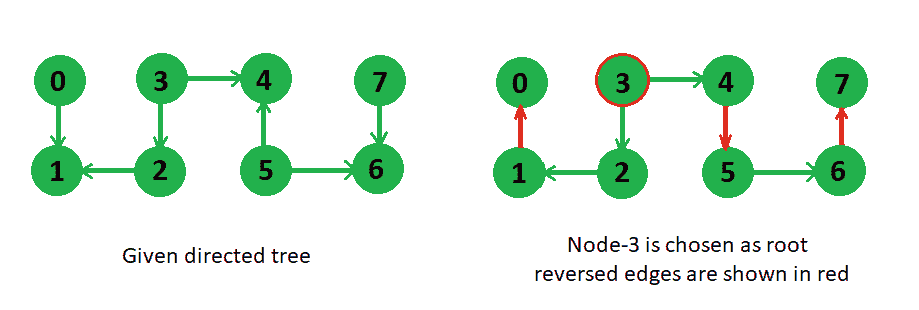

# 最小边反转以生成根

> 原文： [https://www.geeksforgeeks.org/minimum-edge-reversals-to-make-a-root/](https://www.geeksforgeeks.org/minimum-edge-reversals-to-make-a-root/)

给定具有 V 个顶点和 V-1 个边的有向树，我们需要选择这样的根（从我们可以到达的给定节点到每个其他节点），并且具有最少数量的边反转。

**范例**：

```
 
In above tree, if we choose node 3 as our 
root then we need to reverse minimum number
of 3 edges to reach every other node, 
changed tree is shown on the right side.

```

我们可以使用 [DFS](https://www.geeksforgeeks.org/depth-first-traversal-for-a-graph/) 解决此问题。 我们在给定树的任意随机节点处开始 dfs，并在每个节点处假设所有边都是无向的，存储它与起始节点的距离，并且还存储从起始节点到当前节点的路径中需要反转的边数， 这样的边称为后边，因此后边是指向路径中节点的边。 使用此 dfs，我们还可以计算树中的边反转总数。 经过此计算后，在每个节点处，我们可以如下计算“到达每个其他节点的边反转次数”，

假设当某个节点被选为 dfs 的起始节点时，树中的反转总数为 R，则 **如果要从节点 i 到达其他每个节点，则需要将路径 i 的所有后边反转到起始节点，并且还需要将节点 i 以外的所有其他后边反转到起始节点路径。** 第一部分将是（节点 i 与起始节点的距离–节点 i 的后边数）​​，因为我们要反转从节点 i 到起始节点的路径中的边，它将是总边（即距离）减去从 从节点到节点 i 的起始节点（即节点 i 的后边计数）。 第二部分将是（树 R 的总边反转或总后边–节点 i 的后边计数）。 在每个节点上计算了该值之后，我们将选择其中的最小值作为结果。

在下面的代码中，在给定的边方向上添加了权重 0，在相反的方向上添加了权重 1，该权重用于在 dfs 方法中计算反转边。

## C++

```cpp

// C++ program to find min edge reversal to 
// make every node reachable from root 
#include <bits/stdc++.h> 
using namespace std; 

// method to dfs in tree and populates disRev values 
int dfs(vector< pair<int, int> > g[], 
        pair<int, int> disRev[], bool visit[], int u) 
{ 
    // visit current node 
    visit[u] = true; 
    int totalRev = 0; 

    // looping over all neighbors 
    for (int i = 0; i < g[u].size(); i++) 
    { 
        int v = g[u][i].first; 
        if (!visit[v]) 
        { 
            // distance of v will be one more than distance of u 
            disRev[v].first = disRev[u].first + 1; 

            // initialize back edge count same as 
            // parent node's count 
            disRev[v].second = disRev[u].second; 

            // if there is a reverse edge from u to i, 
            // then only update 
            if (g[u][i].second) 
            { 
                disRev[v].second = disRev[u].second + 1; 
                totalRev++; 
            } 
            totalRev += dfs(g, disRev, visit, v); 
        } 
    } 

    // return total reversal in subtree rooted at u 
    return totalRev; 
} 

// method prints root and minimum number of edge reversal 
void printMinEdgeReverseForRootNode(int edges[][2], int e) 
{ 
    // number of nodes are one more than number of edges 
    int V = e + 1; 

    // data structure to store directed tree 
    vector< pair<int, int> > g[V]; 

    // disRev stores two values - distance and back 
    // edge count from root node 
    pair<int, int> disRev[V]; 

    bool visit[V]; 

    int u, v; 
    for (int i = 0; i < e; i++) 
    { 
        u = edges[i][0]; 
        v = edges[i][1]; 

        // add 0 weight in direction of u to v 
        g[u].push_back(make_pair(v, 0)); 

        // add 1 weight in reverse direction 
        g[v].push_back(make_pair(u, 1)); 
    } 

    //    initialize all variables 
    for (int i = 0; i < V; i++) 
    { 
        visit[i] = false; 
        disRev[i].first = disRev[i].second = 0; 
    } 

    int root = 0; 

    // dfs populates disRev data structure and 
    // store total reverse edge counts 
    int totalRev = dfs(g, disRev, visit, root); 

    // UnComment below lines to print each node's 
    // distance and edge reversal count from root node 
    /* 
    for (int i = 0; i < V; i++) 
    { 
        cout << i << " : " << disRev[i].first 
              << " " << disRev[i].second << endl; 
    } 
    */

    int res = INT_MAX; 

    // loop over all nodes to choose minimum edge reversal 
    for (int i = 0; i < V; i++) 
    { 
        // (reversal in path to i) + (reversal 
        // in all other tree parts) 
        int edgesToRev = (totalRev - disRev[i].second) + 
                         (disRev[i].first - disRev[i].second); 

        // choose minimum among all values 
        if (edgesToRev < res) 
        { 
            res = edgesToRev; 
            root = i; 
        } 
    } 

    // print the designated root and total 
    // edge reversal made 
    cout << root << " " << res << endl; 
} 

// Driver code to test above methods 
int main() 
{ 
    int edges[][2] = 
    { 
        {0, 1}, 
        {2, 1}, 
        {3, 2}, 
        {3, 4}, 
        {5, 4}, 
        {5, 6}, 
        {7, 6} 
    }; 
    int e = sizeof(edges) / sizeof(edges[0]); 

    printMinEdgeReverseForRootNode(edges, e); 
    return 0; 
} 

```

## Java

```java

// Java program to find min edge reversal to  
// make every node reachable from root  
import java.util.*; 

class GFG 
{ 
    // pair class 
    static class pair 
    { 
        int first,second; 
        pair(int a ,int b) 
        { 
            first = a; 
            second = b; 
        } 
    } 

// method to dfs in tree and populates disRev values  
static int dfs(Vector<Vector< pair >> g,  
        pair disRev[], boolean visit[], int u)  
{  
    // visit current node  
    visit[u] = true;  
    int totalRev = 0;  

    // looping over all neighbors  
    for (int i = 0; i < g.get(u).size(); i++)  
    {  
        int v = g.get(u).get(i).first;  
        if (!visit[v])  
        {  
            // distance of v will be one more than distance of u  
            disRev[v].first = disRev[u].first + 1;  

            // initialize back edge count same as  
            // parent node's count  
            disRev[v].second = disRev[u].second;  

            // if there is a reverse edge from u to i,  
            // then only update  
            if (g.get(u).get(i).second!=0)  
            {  
                disRev[v].second = disRev[u].second + 1;  
                totalRev++;  
            }  
            totalRev += dfs(g, disRev, visit, v);  
        }  
    }  

    // return total reversal in subtree rooted at u  
    return totalRev;  
}  

// method prints root and minimum number of edge reversal  
static void printMinEdgeReverseForRootNode(int edges[][], int e)  
{  
    // number of nodes are one more than number of edges  
    int V = e + 1;  

    // data structure to store directed tree  
    Vector<Vector< pair >> g=new Vector<Vector< pair >>(); 

    for(int i = 0; i < V + 1; i++) 
    g.add(new Vector<pair>()); 

    // disRev stores two values - distance and back  
    // edge count from root node  
    pair disRev[] = new pair[V];  

    for(int i = 0; i < V; i++) 
    disRev[i] = new pair(0, 0); 

    boolean visit[] = new boolean[V];  

    int u, v;  
    for (int i = 0; i < e; i++)  
    {  
        u = edges[i][0];  
        v = edges[i][1];  

        // add 0 weight in direction of u to v  
        g.get(u).add(new pair(v, 0));  

        // add 1 weight in reverse direction  
        g.get(v).add(new pair(u, 1));  
    }  

    // initialize all variables  
    for (int i = 0; i < V; i++)  
    {  
        visit[i] = false;  
        disRev[i].first = disRev[i].second = 0;  
    }  

    int root = 0;  

    // dfs populates disRev data structure and  
    // store total reverse edge counts  
    int totalRev = dfs(g, disRev, visit, root);  

    // UnComment below lines to print each node's  
    // distance and edge reversal count from root node  
    /*  
    for (int i = 0; i < V; i++)  
    {  
        cout << i << " : " << disRev[i].first  
            << " " << disRev[i].second << endl;  
    }  
    */

    int res = Integer.MAX_VALUE;  

    // loop over all nodes to choose minimum edge reversal  
    for (int i = 0; i < V; i++)  
    {  
        // (reversal in path to i) + (reversal  
        // in all other tree parts)  
        int edgesToRev = (totalRev - disRev[i].second) +  
                        (disRev[i].first - disRev[i].second);  

        // choose minimum among all values  
        if (edgesToRev < res)  
        {  
            res = edgesToRev;  
            root = i;  
        }  
    }  

    // print the designated root and total  
    // edge reversal made  
    System.out.println(root + " " + res );  
}  

// Driver code  
public static void main(String args[]) 
{  
    int edges[][] =  
    {  
        {0, 1},  
        {2, 1},  
        {3, 2},  
        {3, 4},  
        {5, 4},  
        {5, 6},  
        {7, 6}  
    };  
    int e = edges.length;  

    printMinEdgeReverseForRootNode(edges, e);  
} 
}  

// This code is contributed by Arnab Kundu 

```

## C#

```cs

// C# program to find min edge reversal to  
// make every node reachable from root 
using System; 
using System.Collections.Generic; 

class GFG 
{ 
    // pair class 
    public class pair 
    { 
        public int first,second; 
        public pair(int a, int b) 
        { 
            first = a; 
            second = b; 
        } 
    } 

// method to dfs in tree and populates disRev values  
static int dfs(List<List< pair >> g,  
               pair []disRev, Boolean []visit, int u)  
{  
    // visit current node  
    visit[u] = true;  
    int totalRev = 0;  

    // looping over all neighbors  
    for (int i = 0; i < g[u].Count; i++)  
    {  
        int v = g[u][i].first;  
        if (!visit[v])  
        {  
            // distance of v will be one more  
            // than distance of u  
            disRev[v].first = disRev[u].first + 1;  

            // initialize back edge count same as  
            // parent node's count  
            disRev[v].second = disRev[u].second;  

            // if there is a reverse edge from u to i,  
            // then only update  
            if (g[u][i].second != 0)  
            {  
                disRev[v].second = disRev[u].second + 1;  
                totalRev++;  
            }  
            totalRev += dfs(g, disRev, visit, v);  
        }  
    }  

    // return total reversal in subtree rooted at u  
    return totalRev;  
}  

// method prints root and minimum number of edge reversal  
static void printMinEdgeReverseForRootNode(int [,]edges, int e)  
{  
    // number of nodes are one more than number of edges  
    int V = e + 1;  

    // data structure to store directed tree  
    List<List< pair >> g = new List<List< pair >>(); 

    for(int i = 0; i < V + 1; i++) 
    g.Add(new List<pair>()); 

    // disRev stores two values - distance and back  
    // edge count from root node  
    pair []disRev = new pair[V];  

    for(int i = 0; i < V; i++) 
    disRev[i] = new pair(0, 0); 

    Boolean []visit = new Boolean[V];  

    int u, v;  
    for (int i = 0; i < e; i++)  
    {  
        u = edges[i, 0];  
        v = edges[i, 1];  

        // add 0 weight in direction of u to v  
        g[u].Add(new pair(v, 0));  

        // add 1 weight in reverse direction  
        g[v].Add(new pair(u, 1));  
    }  

    // initialize all variables  
    for (int i = 0; i < V; i++)  
    {  
        visit[i] = false;  
        disRev[i].first = disRev[i].second = 0;  
    }  

    int root = 0;  

    // dfs populates disRev data structure and  
    // store total reverse edge counts  
    int totalRev = dfs(g, disRev, visit, root);  

    // UnComment below lines to print each node's  
    // distance and edge reversal count from root node  
    /*  
    for (int i = 0; i < V; i++)  
    {  
        cout << i << " : " << disRev[i].first  
            << " " << disRev[i].second << endl;  
    }  
    */

    int res = int.MaxValue;  

    // loop over all nodes to choose minimum edge reversal  
    for (int i = 0; i < V; i++)  
    {  
        // (reversal in path to i) + (reversal  
        // in all other tree parts)  
        int edgesToRev = (totalRev - disRev[i].second) +  
                         (disRev[i].first - disRev[i].second);  

        // choose minimum among all values  
        if (edgesToRev < res)  
        {  
            res = edgesToRev;  
            root = i;  
        }  
    }  

    // print the designated root and total  
    // edge reversal made  
    Console.WriteLine(root + " " + res);  
}  

// Driver code  
public static void Main(String []args) 
{  
    int [,]edges = {{0, 1}, {2, 1},  
                    {3, 2}, {3, 4},  
                    {5, 4}, {5, 6},  
                    {7, 6}};  
    int e = edges.GetLength(0);  

    printMinEdgeReverseForRootNode(edges, e);  
} 
}  

// This code is contributed by 29AjayKumar 

```

**Output:**

```
3 3

```

本文由 [**Utkarsh Trivedi**](https://in.linkedin.com/in/utkarsh-trivedi-253069a7) 提供。 如果您喜欢 GeeksforGeeks 并希望做出贡献，则还可以使用 [tribution.geeksforgeeks.org](http://contribute.geeksforgeeks.org) 撰写文章，或将您的文章邮寄至 tribution@geeksforgeeks.org。 查看您的文章出现在 GeeksforGeeks 主页上，并帮助其他 Geeks。

如果发现任何不正确的地方，或者想分享有关上述主题的更多信息，请写评论。

